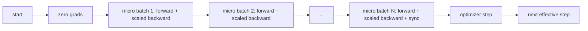
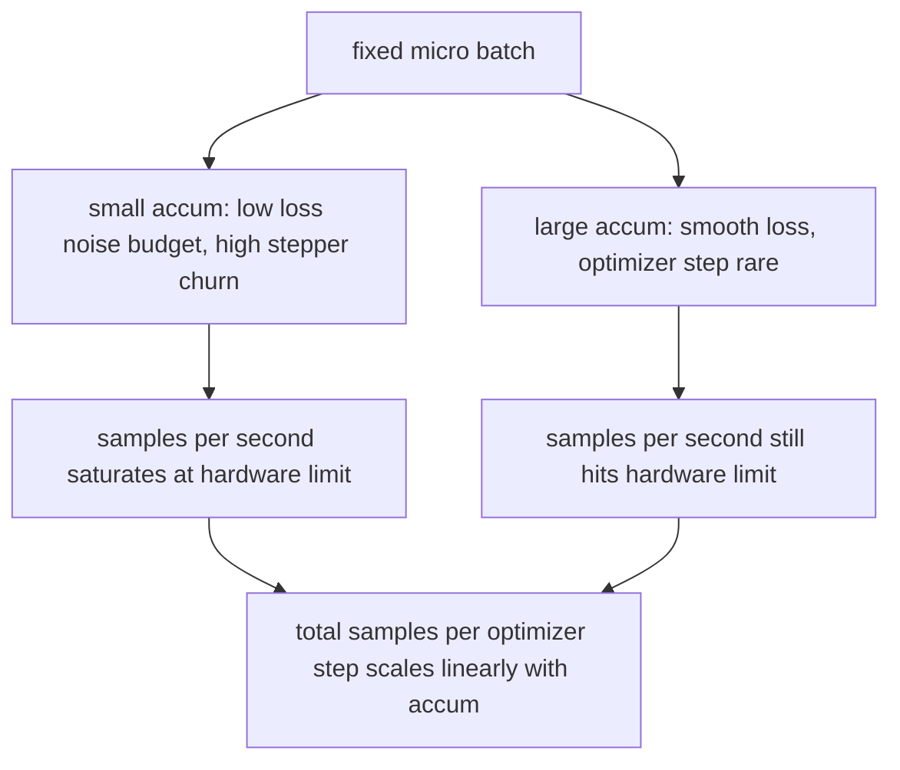

# 梯度累积

> 以你无法承受的批次大小训练，一次一个微批次。缩放损失，延迟优化器步骤，让梯度不断累积。

**类型：** 构建  
**语言：** Python  
**前置条件：** 阶段 19 第 42 至 45 课  
**时长：** ~90 分钟

## 学习目标

- 推导有效批次恒等式：`effective_batch = micro_batch * accum_steps`。
- 实现每微批次损失缩放，使累积梯度与单次全批次反向传播相匹配。
- 跳过直到最后一个微批次才进行优化器同步（最后一步同步）。
- 读取吞吐量与有效批次曲线，并解释收益递减现象。

## 问题

你希望以有效批次 512 进行训练，因为在该规模下损失曲线更平滑、优化器步骤更合理。但手上的加速器在内存耗尽前只能容纳 32 个样本。加倍批次不可行，缩减模型也不可行。业界在 2017 年想到并沿用至今的技巧是：运行 16 次反向传播，让梯度在参数缓冲区中累积，直到计数达到目标时才执行优化器步骤。

风险在于，损失已不再是更大批次下的那个数值。简单求和 16 个微型批次的交叉熵，结果是一个完整批次的 16 倍。不做缩放的话，梯度方向正确但幅度错误，优化器步骤会超出正常大小的 16 倍。解决方法是一次除法，而这个除法也很容易被遗忘。

## 概念


```mermaid
flowchart LR
  start[start] --> zero[zero grads]
  zero --> mb1[micro batch 1: forward + scaled backward]
  mb1 --> mb2[micro batch 2: forward + scaled backward]
  mb2 --> dots[...]
  dots --> mbN[micro batch N: forward + scaled backward + sync]
  mbN --> step[optimizer step]
  step --> next[next effective step]
```

约定很简短：

- 每个微批次的损失在调用 `backward()` 前先除以 `accum_steps`。PyTorch 默认将梯度累加到 `param.grad` 中；除法将运行总和拉回到正确的尺度。
- 优化器步骤每有效批次触发一次，即在最后一个微批次的反向传播之后。在累积过程中执行优化器步骤会扰乱后续所有参数所依赖的状态。
- 优化器的状态（动量缓冲区、Adam 动量）每有效步骤更新一次，而不是每微批次更新一次。否则指数移动平均会以错误的频率进行更新，进而打乱学习率调度。
- 在单设备上这只是簿记工作。在多节点集群上，同样的模式会将非最终微批次包裹在 `no_sync` 上下文中，跳过梯度全规约；最后一个微批次一次性归约完整的累积梯度，而不是花费网络通信成本 N 次。

### 用代码证明等价性

```python
loss = criterion(model(x_full), y_full)
loss.backward()
opt.step()
```

等价于

```python
for x, y in chunks(x_full, y_full, n):
    scaled = criterion(model(x), y) / n
    scaled.backward()
opt.step()
```

仅浮点求和顺序不同。循环结束时累积的梯度缓冲区与单次全批次反向传播生成的张量相同。课程代码在 `equivalence_check` 中断言最大绝对值差异小于 1e-4。

### 代价在哪里

每个微批次消耗一次前向传播和一次反向传播。使用累积，你用时间换取内存。`outputs/accum-curve.json` 中的吞吐量曲线显示了当有效批次在固定微批次下增长时发生的情况：


```mermaid
flowchart TD
  micro[fixed micro batch] --> small[small accum: low loss noise budget, high stepper churn]
  micro --> large[large accum: smooth loss, optimizer step rare]
  small --> sps1[samples per second saturates at hardware limit]
  large --> sps2[samples per second still hits hardware limit]
  sps1 --> note[total samples per optimizer step scales linearly with accum]
  sps2 --> note
```

世上没有免费的午餐。将 `accum_steps` 翻倍会使每个优化器步骤的挂钟时间也翻倍。变化的是梯度估计的方差：在相同的挂钟预算下，你执行的优化器步骤更少了，但每一步平均了更多的样本。文献将大批次和小批次视为不同的优化问题；本章侧重机械性实现，而非统计学问题。

## 构建

`code/main.py` 是可运行的工件。它完成三件事。

### 第 1 步：等价性检查

`equivalence_check()` 使用相同的种子构建两份相同的网络副本。一份使用 16 个样本的批次进行一次前向传播；另一份使用四个 4 样本的块，并将损失除以四。该函数比较优化器步骤前的梯度缓冲区以及步骤后的参数。断言为 `max_abs_diff < 1e-4`。

### 第 2 步：最后一步同步模式

`train_one_optimizer_step` 遍历微批次。除最后一个微批次外，每个微批次都进入 `no_sync_context(model)`。在单进程上，该上下文为空操作；在 DDP 上，此处跳过梯度全规约。簿记逻辑不变。`sync_counter` 记录离开 no_sync 范围的次数；对于 N 个微批次，计数为每有效步骤一次，而不是 N 次。

### 第 3 步：吞吐量曲线

`sweep_effective_batches` 使用固定的微批次和一系列的累积步数运行同一模型。对于每个设置，它记录：

- `samples_per_sec`：总样本数除以挂钟时间
- `median_step_ms`：每有效步骤的 50 百分位时间
- `sync_calls`：执行的集合通信次数
- `avg_loss`：扫描过程中所有优化器步骤的平均损失

输出写入 `outputs/accum-curve.json`，可供笔记本复用。

运行方法：

```bash
python3 code/main.py
```

脚本打印等价性差异、扫描表，然后是 JSON 路径。退出码为零。

## 使用

在生产训练中，梯度累积通过一个参数控制。PyTorch 的模式是 `accumulation_steps = effective_batch // (micro_batch * world_size)`。这里不允许使用的框架封装了相同的循环，但步骤相同：缩放损失、跳过非最终微批次的同步、累积、一步执行。

生产环境中的三种常见模式：

- 微批次大小选择为占满设备内存。更小会浪费加速器周期，更大则会崩溃。
- 有效批次根据学习率调度选择。大批次需要缩放学习率和预热；这是自 2017 年以来讨论的线性缩放规则。
- 累积次数是两者之间的桥梁，也是唯一可以在运行时自由调整而无需重写数据加载器的参数。

## 交付

`outputs/skill-gradient-accumulation.md` 记录了完整方案，方便同伴将其放入新仓库：将损失除以 `accum_steps`，跳过非最终微批次的优化器同步，每有效批次执行一次优化器步骤，以 JSON 格式记录吞吐量与有效批次的关系，使权衡一目了然。

## 练习

1. 使用 `--num-steps 100` 重新运行扫描，绘制每秒样本数相对于有效批次的关系图。曲线在何处趋于平坦？
2. 添加错误的缩放变体（不进行除法），并展示第 1 步后相对于参考版本的参数差异。
3. 将 SGD 替换为 AdamW，确认优化器状态每有效步骤更新一次，而不是每微批次更新一次。
4. 引入真正的 `DistributedDataParallel` 封装，将 `no_sync_context` 路由到其方法。确认 `sync_calls` 每有效批次减少 N-1 次。
5. 修改等价性检查，比较两种不同的微拆分方式（2 个 8 样本块 vs 4 个 4 样本块），并解释需要放宽的容差。

## 关键术语

| 术语 | 人们说的 | 实际含义 |
|------|----------|----------|
| 微批次 | 你前向传播的批次 | 单次前向传播中能放入内存的数据切片 |
| 累积步数 | 每步的反向传播次数 | 一次优化器步骤前累加的反向传播次数 |
| 有效批次 | 批次大小 | 微批次乘以累积步数再乘以数据并行世界大小 |
| 损失缩放 | 除以 N | 每微批次的除法，使求和后的梯度与完整批次匹配 |
| 最后一步同步 | 跳过其余 | 仅在窗口内的最后一次反向传播时执行梯度集合通信 |

## 延伸阅读

- PyTorch 文档中关于 `DistributedDataParallel.no_sync` 的内容，了解最后一步同步的生产版本。
- Goyal 等人 2017 年关于大批次训练线性缩放的论文，这是关注有效批次的经典理由。
- PyTorch 问题跟踪器中关于梯度累积与混合精度反缩放之间交互的内容。
- 阶段 19 第 42 至 45 课涵盖本章所依赖的模型、数据加载器、优化器和训练器框架。
- 阶段 19 第 47 课涵盖检查点与恢复，确保长时间累积运行能在挂钟上限之后继续。
