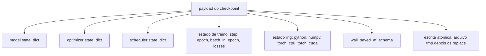
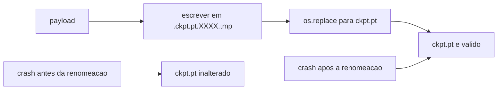
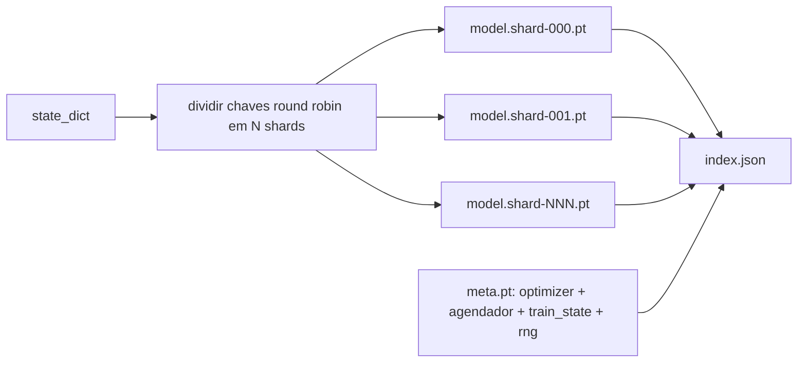

# Aula 47: Checkpoint Save e Resume

> Interrupcoes de treinamento matam execucoes; checkpoints deixam elas continuarem. Salve modelo, optimiser, scheduler, historico de loss, contador de passo, e estado RNG, atomicamente, para que uma interrupcao a qualquer momento deixe um arquivo valido no disco.

**Tipo:** Build
**Linguagens:** Python
**Prerequisitos:** Aulas 42 a 45 da Fase 19
**Tempo:** ~90 minutos

## Objetivos de Aprendizado

- Capturar o estado completo de treinamento em um payload unico que pode ser recarregado em um processo fresco.
- Implementar save atomico com escrita-em-temp-depois-renomear para que um crash nunca deixe um arquivo meio-escrito.
- Restaurar o estado RNG para Python, NumPy, e PyTorch para que a loss apos o resume corresponda a linha de base nao-interrompida.
- Construir um layout de checkpoint em shards para modelos que nao cabem mais em um unico arquivo, com shards verificados por hash e indice JSON.

## O Problema

Voce configurou um trabalho de treinamento para 18 horas. O limite de relogio e 4 horas. O cluster reinicia na hora 11 porque alguem acima da sua hierarquia aprovou uma atualizacao de kernel. Sem checkpoints voce comeca de novo. Sem resume voce tambem perde o estado do optimiser que levou as primeiras 11 horas para aprender, entao mesmo que os pesos do modelo tenham sobrevivido, os momentos do AdamW foram embora e o proxo passo cambaleia em uma direcao que a trajetoria de treinamento ja tinha deixado para tras.

O artefato certo e um arquivo unico que guarda tudo necessario para continuar: parametros do modelo, estado do optimiser, estado do scheduler, o historico de loss para plots, os contadores de passo, epoca e batch-na-epoca, e o estado RNG para toda fonte de aleatoriedade. Sem o estado RNG a curva de loss retomada e uma curva diferente. Mesmo modelo, mesmo dados, embaralhamento diferente, mascara de dropout diferente, numero diferente no dashboard.

Save atomico e a outra metade do contrato. Escrever no nome de arquivo final significa que um crash no meio da escrita deixa um arquivo corrompido; o resume le lixo. Escrever em um arquivo temporario no mesmo diretorio e depois renomear significa que um crash no meio da escrita deixa o arquivo anterior bom intocado. A renomeacao e atomica em sistemas de arquivos POSIX.

## O Conceito



### Os cinco baldes de estado

| Balde | Por que importa |
|-------|-----------------|
| Modelo | Pesos e buffers; o que o modelo e. |
| Optimiser | Momento e momentos adaptativos; sem esses o proxo passo e um problema de otimizacao diferente. |
| Scheduler | Onde a taxa de aprendizado esta em sua curva; agendamentos coseno em particular se importam. |
| Contadores de treino | Passo, epoca, batch-na-epoca, mais o historico de loss que desenha o dashboard. |
| Estado RNG | Determinismo para dropout, embaralhamento de dados, e qualquer amostragem dentro do modelo. |

### Save atomico



Duas regras. Primeiro, o arquivo temporario vive no mesmo diretorio que o alvo para que a renomeacao fique dentro do mesmo sistema de arquivos; renomeacoes entre dispositivos nao sao atomicas. Segundo, o nome temporario e unico por tentativa para que dois writers nao se atropelem.

### Checkpoints em shards

Quando o modelo fica grande o payload de arquivo unico fica grande demais para carregar rapido, grande demais para inespecificaçãoionar, e doloroso demais quando uma rede compartilhada engasga no meio da leitura. A solucao e dividir o estado do parametro em shards e escrever um indice pequeno que os liga.



O indice registra a contagem de shards, o sha256 de cada shard, e o sha256 do arquivo meta. O loader falha ruidosamente quando qualquer hash nao combina. Os shards podem cair em discos fisicos diferentes; o meta e pequeno e lido primeiro.

### Resume continua no meio da epoca

Um resume que pula para o inicio da proxima epoca desperdia de minutos a um dia. A solucao e `(epoch, batch_in_epoch)` mais o estado RNG. Apos o carregamento, o loop de treinamento rapido-avanca o gerador de numeros alem dos batches ja consumidos na epoca atual e continua a partir de `batch_in_epoch`. O codigo da aula faz exatamente isso; a afirmacao e que a trajetoria de loss apos o resume corresponde a linha de base nao-interrompida dentro de 1e-4.

## Construa

`code/main.py` fornece quatro primitivas e um driver de demo.

### Passo 1: capturar e restaurar estado RNG

`capture_rng_state` retorna um dict com `random.getstate` do Python, `np.random.get_state` do NumPy, e os bytes RNG de CPU e CUDA do PyTorch. `restore_rng_state` inverte. O tensor CPU e um buffer de bytes uint8 que o RNG do PyTorch sabe como consumir.

### Passo 2: save atomico

`atomic_save` escreve o payload em um arquivo temporario no diretorio alvo, e depois `os.replace` troca para o nome final. `atomic_write_json` faz o mesmo para o indice em shards.

### Passo 3: ida e volta completa do checkpoint

`save_checkpoint` empacota o modelo, optimiser, scheduler, estado de treino, e RNG em um dict. `load_checkpoint` inverte e retorna um `TrainState`. O campo schema e o hook de upgrade: mudancas futuras no formato bumpam a string de versao e o loader despacha.

### Passo 4: variante em shards

`save_sharded_checkpoint` faz round-robin das chaves de parametro em N shards, escreve cada shard com seu proprio save atomico, escreve um arquivo meta com optimiser e agendador e estado de treino, e escreve o indice JSON com sha256s dos shards. `load_sharded_checkpoint` verifica cada shard antes de mesclar.

### Passo 5: demo de resume

`run_resume_demo` treina um modelo pequeno por `total_steps`, salva um checkpoint em `interrupt_at`, e continua. Um segundo processo restaura o checkpoint e roda os passos restantes. A funcao retorna a diferenca maxima absoluta entre as duas trajetorias de loss apos o ponto de interrupcao. Com RNG restaurado, a diferenca e zero ou ruido de ponto flutuante.

Execute:

```bash
python3 code/main.py
```

Tanto a demo de arquivo unico quanto a de shards afirmam max-diff sob 1e-4. O resumo cai em `outputs/resume-demo.json`.

## Use

Stacks de treino de producao entregam checkpoint como parte do trainer. A forma e a mesma: modelo + optimiser + agendador + contadores + RNG, escritos atomicamente, nomeados por passo para que o mais recente seja facil de encontrar. Layouts em shards fornecem carregamento de modelos grandes com leituras paralelas; o index.json e o que torna isso possivel.

Tres padroes para impor:

- **Schema e uma string no payload.** Migracoes se ramificam nele. Sem isso voce nao pode evoluir o formato sem quebrar execucoes antigas.
- **sha256 em cada shard.** Um download silenciosamente truncado e o pior tipo de bug; o loader falha rapido ou falha tarde.
- **Manter a cadencia de checkpoint honesta.** Salve a cada N passos e a cada minuto de relogio, o que for menor. Caso contrario o passo longo que trava desperdia uma janela inteira de trabalho.

## Entregue

`outputs/skill-checkpoint-save-resume.md` e a receita para qualquer novo script de treino: forma do payload, escrita atomica, captura de RNG, indice em shards. Jogue a skill em um repo, conecte `save_checkpoint` no ponto de save periodico, conecte `load_checkpoint` no startup, e a execucao sobrevive a interrupcoes.

## Exercicios

1. Substituir o sharding round-robin por sharding por grupo de parametro (camadas terminando em `.weight` vs `.bias`). Quando cada layout e preferivel?
2. Estender o loop de save para manter os ultimos K checkpoints e podar os mais antigos. Qual e o K certo quando o disco e pequeno?
3. Adicionar um flag `--ckpt-every-seconds` que aciona um save em intervalo de relogio, nao apenas contagem de passo.
4. Adicionar um caminho de verificacao de checksum que roda ao iniciar, escaneia cada checkpoint no diretorio, e reporta quais estao corrompidos.
5. Implementar uma funcao `migrate_v1_to_v2` que adiciona um novo campo ao payload e bumpa a string de schema. Fazer o load tolerar ambas as versoes.

## Termos Chave

| Termo | O que as pessoas dizem | O que realmente significa |
|-------|------------------------|---------------------------|
| Save atomico | "Escrever e rezar" | Escrever em um arquivo temporario no mesmo diretorio, depois os.replace no nome alvo |
| State dict | "Os pesos" | Parametros e buffers do modelo, indexados por nome do parametro |
| Checkpoint em shards | "Arquivo de modelo grande" | Multiplos arquivos, um por shard, mais um arquivo meta e um indice JSON com sha256s |
| Estado RNG | "Seed aleatoria" | Estado capturado para python random, numpy, torch CPU, torch CUDA; nao e so a seed |
| Resume no meio da epoca | "Reiniciar" | Rapido-avancar o RNG e continuar do proxo batch na mesma epoca |

## Leitura Adicional

- Semantica de `rename` do POSIX para a afericao de atomicidade que `os.replace` depende.
- Documentacao do PyTorch sobre `torch.save` e `torch.load`, incluindo `map_location` para restauracoes entre dispositivos.
- Aula 46 da Fase 19 cobre a acumulacao de gradiente que o payload de checkpoint desta aula sobrevive.
- Aula 48 da Fase 19 cobre os wrappers distribuidos cujo formato de state_dict este esquema acomoda.
- A documentacao de `fsync` do kernel Linux para a garantia de durabilidade por tras da renomeacao atomica.
