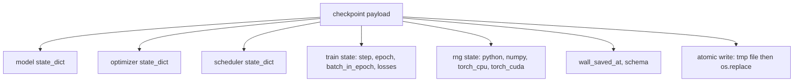
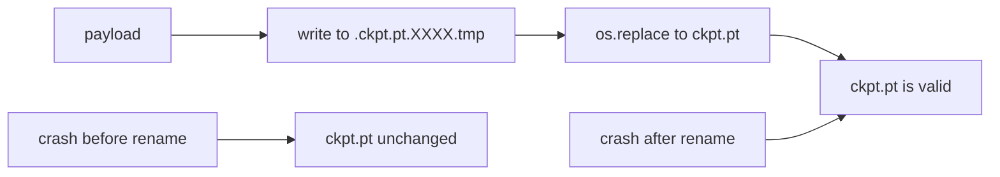
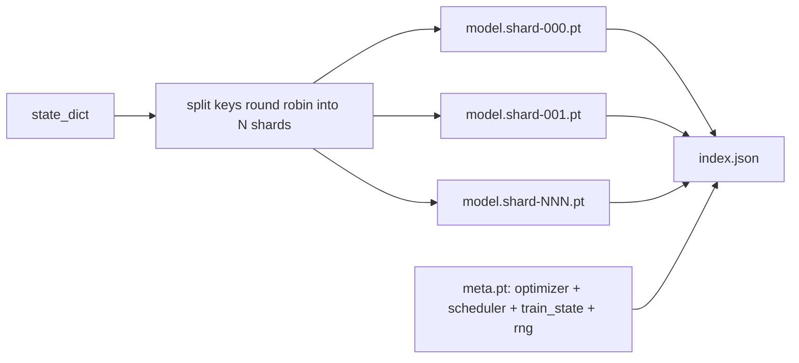

# Denetim Noktası Kaydetme ve Devam Ettirme

> Tren ölüm koşularını kesintiye uğratır; Kontrol noktaları devam etmelerine izin veriyor. Modeli, optimize ediciyi, zamanlayıcıyı, kayıp geçmişini, adım sayacını ve RNG durumunu atomik olarak kaydedin, böylece herhangi bir anda yapılan bir öldürme diskte geçerli bir dosya bırakır.

**Tür:** Yapım
**Diller:** Python
**Önkoşullar:** Aşama 19 dersleri 42 - 45
**Süre:** ~90 dakika

## Öğrenme Hedefleri

- Tam eğitim durumunu, yeni bir sürece yeniden yüklenebilecek tek bir veri yükünde yakalayın.
- Geçici yazma ile atomik kaydetmeyi uygulayın ve ardından yeniden adlandırın, böylece bir kilitlenme hiçbir zaman yarım yazılmış bir dosya bırakmaz.
- Devam sonrası kaybın kesintisiz taban çizgisiyle eşleşmesi için Python, NumPy ve PyTorch için RNG durumunu geri yükleyin.
- Karma doğrulaması doğrulanmış parçalar ve bir JSON dizini ile artık tek bir dosyaya sığmayan modeller için parçalı bir kontrol noktası düzeni oluşturun.

## Sorun

18 saatlik bir eğitim işi belirlediniz. Duvar saati sınırı 4 saattir. Küme saat 11'de yeniden başlatılıyor çünkü sizin maaş seviyenizin üzerinde biri çekirdek yükseltmesini onayladı. Kontrol noktaları olmadan baştan başlarsınız. Devam etme olmadan, öğrenmesi ilk 11 saat süren optimizer durumunu da kaybedersiniz; bu nedenle, model ağırlıkları devam etse bile AdamW anları kaybolur ve bir sonraki adım, eğitim yörüngesinin zaten geçmiş olduğu yöne doğru yalpalar.

Sağdaki artifact, devam etmek için gereken her şeyi içeren tek bir dosyadır: model parametreleri, optimize edici durumu, zamanlayıcı durumu, grafikler için kayıp geçmişi, geçerli adım ve dönem ve dönem içi toplu sayaçlar ve her rastgelelik kaynağı için RNG durumu. RNG durumu olmadan devam eden kayıp eğrisi farklı bir eğri olur. Aynı model, aynı veriler, farklı karıştırma, farklı çıkarma maskesi, kontrol panelinde farklı numara.

Atomik tasarruf sözleşmenin diğer yarısıdır. Son dosya adının yazılması, yazma işleminin ortasında meydana gelen bir çökmenin bozuk bir dosya bırakması anlamına gelir; özgeçmiş çöp okur. Aynı dizindeki geçici bir dosyaya yazmak ve ardından yeniden adlandırmak, yazma işleminin ortasında meydana gelen bir çökmenin önceki iyi dosyaya dokunulmaması anlamına gelir. Yeniden adlandırma POSIX dosya sistemlerinde atomiktir.

## Konsept



### Beş durum grubu

| Kova | Neden önemlidir |
|--------|----------------|
| Modeli | Ağırlıklar ve tamponlar; model nedir? |
| Optimize Edici | Momentum ve uyarlanabilir anlar; bunlar olmadan bir sonraki adım farklı bir optimizasyon problemidir. |
| Zamanlayıcı | Öğrenme oranının eğrisi üzerinde olduğu yer; kosinüs programlarına özellikle dikkat edin. |
| Tren sayaçları | Adım, dönem, dönem içi toplu artı gösterge tablosunu çizen kayıp geçmişi. |
| RNG durumu | Bırakma, veri karıştırma ve model içindeki herhangi bir örnekleme için determinizm. |

### Atomik kaydetme



İki kural. İlk olarak, geçici dosya hedefle aynı dizinde bulunur, böylece yeniden adlandırma aynı dosya sistemi içinde kalır; cihazlar arası yeniden adlandırmalar atomik değildir. İkincisi, geçici ad deneme başına benzersizdir, böylece iki yazar durmaz.

### Parçalı kontrol noktaları

Model büyüdüğünde, tek dosya yükü hızlı yüklenemeyecek kadar büyük, incelenemeyecek kadar büyük olur ve bir ağ paylaşımı okumanın ortasında kesintiye uğradığında çok acı verici hale gelir. Çözüm, parametre durumunu parçalara bölmek ve bunları birbirine bağlayan küçük bir dizin yazmaktır.



Dizin, parça sayısını, her parçanın sha256'sını ve meta dosyasının sha256'sını kaydeder. Herhangi bir karma uyumsuzluğu olduğunda yükleyici yüksek sesle başarısız oluyor. Parçalar farklı fiziksel disklere yerleşebilir; meta küçüktür ve önce okunur.

### Devam çağın ortasında devam ediyor

Bir sonraki çağın başlangıcını gösteren bir özgeçmiş, dakikalardan bir güne kadar her yerde boşa gider. Düzeltme `(epoch, batch_in_epoch)` artı RNG durumudur. Yüklendikten sonra, eğitim döngüsü rastgele sayı üretecini mevcut çağda zaten tüketilmiş olan partilerin ötesine hızlı bir şekilde ileri sarar ve `batch_in_epoch`'den devam eder. Ders kodu tam olarak bunu yapıyor; iddia, devam ettirme sonrasındaki kayıp yörüngesinin 1e-4 içindeki kesintisiz temel çizgiyle eşleştiği yönündedir.

## Build It — Kendin Geliştir

`code/main.py` dört temel öğe ve bir demo sürücüsü sağlar.

### Adım 1: RNG durumunu yakalayın ve geri yükleyin

`capture_rng_state` , Python'un `random.getstate`, NumPy'nin `np.random.get_state` ve PyTorch CPU ve CUDA RNG baytlarını içeren bir dikte döndürür. `restore_rng_state` bunu tersine çevirir. CPU tensörü, PyTorch'un RNG'sinin nasıl tüketileceğini bildiği uint8 baytlık bir arabellektir.

### Adım 2: atomik kaydetme

`atomic_save` , yükü hedef dizindeki geçici dosyaya yazar, ardından `os.replace` onu son isimle değiştirir. `atomic_write_json` , parçalanmış dizin için aynısını yapar.

### Adım 3: tam kontrol noktasına gidiş dönüş

`save_checkpoint` modeli, optimize ediciyi, zamanlayıcıyı, eğitim durumunu ve RNG'yi tek bir deyimde paketler. `load_checkpoint` onu tersine çevirir ve bir `TrainState` döndürür. Şema alanı yükseltme kancasıdır: gelecekteki format değişiklikleri sürüm dizesini etkiler ve yükleyici gönderir.

### Adım 4: parçalanmış değişken

`save_sharded_checkpoint` , N parça boyunca parametre anahtarlarını bir kez birleştirir, her parçayı kendi atomik kaydıyla yazar, optimize edici, zamanlayıcı ve eğitim durumuyla bir meta dosyası yazar ve parça sha256'larla JSON dizinini yazar. `load_sharded_checkpoint` , birleştirmeden önce her parçayı doğrular.

### Adım 5: Demoya devam edin

`run_resume_demo` , `total_steps` için küçük bir modeli eğitir, `interrupt_at`'da bir kontrol noktası kaydeder ve devam eder. İkinci bir işlem, kontrol noktasını geri yükler ve kalan adımları çalıştırır. Fonksiyon, kesinti noktasından sonra iki kayıp yörüngesi arasındaki maksimum mutlak farkı döndürür. RNG geri yüklendiğinde fark sıfırdır veya kayan nokta gürültüsüdür.

Çalıştır:

```bash
python3 code/main.py
```

Tek dosyalı ve parçalı demoların her ikisi de 1e-4'ün altında maksimum fark olduğunu iddia ediyor. Özet `outputs/resume-demo.json`'a ulaşır.

## Use It — Hazır Araçla Uygula

Üretim eğitimi, eğitmenin bir parçası olarak gemi kontrol noktalarını içerir. Şekil aynıdır: model + optimize edici + zamanlayıcı + sayaçlar + RNG, atomik olarak yazılır, en son sürümün bulunması kolay olacak şekilde adım adım adlandırılır. Parçalanmış düzenler, paralel okumalarla büyük model yüklemeyi destekler; index.json bunun işe yaramasını sağlayan şeydir.

Uygulanacak üç model:

- **Şema, veri yükündeki bir dizedir.** Taşıma işlemleri onun üzerinde dallanır. Bu olmadan, eski çalışmaları bozmadan formatı geliştiremezsiniz.
- **Her parça Sha256.** Sessizce kesilen indirme, en kötü hata türüdür; yükleyici hızlı bir şekilde arızalanır veya geç arızalanır.
- **Kontrol noktası ritmini dürüst tutun.** Her N adımı ve her duvar saati dakikasını (hangisi daha kısaysa) kaydedin. Aksi takdirde, çöken uzun adım, tüm çalışma penceresini boşa harcar.

## Ship It — Kullanıma Sun

`outputs/skill-checkpoint-save-resume.md` herhangi bir yeni eğitim komut dosyasının tarifidir: yük şekli, atomik yazma, RNG yakalama, parçalanmış dizin. Beceriyi bir depoya bırakın, periyodik kaydetme sitesine `save_checkpoint` bağlayın, başlangıçta `load_checkpoint` bağlayın ve çalışma, öldürmelerden kurtulur.

## Egzersizler

1. Sıralı parçalamayı, parametre grubuna göre parçalamayla değiştirin ( `.weight` ve `.bias` ile biten katmanlar). Her düzen ne zaman tercih edilir?
2. Son K kontrol noktasını korumak ve eski kontrol noktalarını budamak için kaydetme döngüsünü genişletin. Disk küçük olduğunda doğru K nedir?
3. Yalnızca adım sayısında değil, duvar saati aralığında kaydetmeyi tetikleyen bir `--ckpt-every-seconds` bayrağı ekleyin.
4. Başlangıçta çalışan, dizindeki her kontrol noktasını tarayan ve hangilerinin bozuk olduğunu bildiren bir sağlama toplamı doğrulama yolu ekleyin.
5. Yüke yeni bir alan ekleyen ve şema dizesini artıran bir `migrate_v1_to_v2` işlevini uygulayın. Yükün her iki versiyonu da tolere etmesini sağlayın.

## Anahtar Terimler

| Dönem | İnsanlar ne diyor | Aslında ne anlama geliyor |
|------|-----------------|------------------------|
| Atomik tasarruf | "Yazın ve dua edin" | Aynı dizindeki geçici dosyaya yazın, ardından hedef adına os.replace yazın |
| Devlet sözü | "Ağırlıklar" | Model parametreleri ve arabellekler, parametre adına göre anahtarlanmıştır |
| Parçalanmış kontrol noktası | "Büyük model dosyası" | Parça başına bir tane olmak üzere birden fazla dosya, artı bir meta dosya ve sha256s içeren bir JSON dizini |
| RNG durumu | "Rastgele tohum" | Python rastgele, numpy, torch CPU, torch CUDA için yakalanan durum; sadece tohum değil |
| Orta Çağ özgeçmişi | "Yeniden Başlat" | RNG'yi hızlı ileri sarın ve aynı dönemdeki bir sonraki gruptan devam edin |

## Daha Fazla Okuma

- `os.replace` 'in dayandığı atomiklik iddiası için POSIX `rename` semantiği.
- Cihazlar arası geri yüklemeler için `map_location` dahil olmak üzere `torch.save` ve `torch.load` ile ilgili PyTorch belgeleri.
- Aşama 19 ders 46, bu dersin kontrol noktası yükünün hayatta kaldığı gradient birikimini kapsar.
- Aşama 19 ders 48, bu şemanın uyum sağladığı durum dikte formatına sahip dağıtılmış sarmalayıcıları kapsar.
- Atomik yeniden adlandırmanın ardındaki dayanıklılık garantisi için Linux çekirdeği `fsync` belgeleri.
