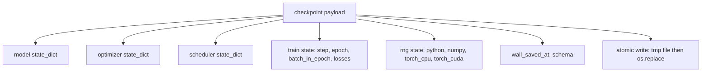
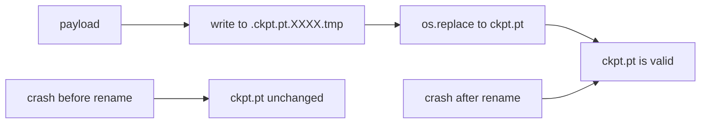
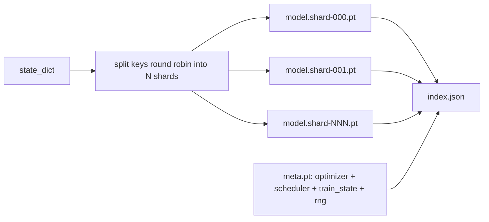

# 47 · 检查点保存与恢复（Checkpoint Save and Resume）

> 训练中断会毁掉运行；检查点让它们得以继续。将模型、优化器、调度器、损失历史、步数计数器和随机数生成器状态以原子方式保存，使得任意时刻的中断都会在磁盘上留下一个有效文件。

**类型：** 构建
**语言：** Python
**前置：** 第 19 阶段第 42 至 45 课
**时长：** 约 90 分钟

## 学习目标

- 将完整训练状态捕获为单一负载（payload），并能重新加载到全新进程中。
- 实现原子保存（Atomic save）：先写入临时文件再重命名，确保崩溃不会留下半写文件。
- 恢复 Python、NumPy 和 PyTorch 的随机数生成器状态（RNG state），使恢复后的损失曲线与不间断基线一致。
- 为无法放入单个文件的大模型构建分片检查点（Sharded checkpoint）布局，包含哈希校验的分片和 JSON 索引。

## 问题

你将一个训练作业设定为 18 小时。但墙上时钟（wallclock）上限是 4 小时。集群在第 11 小时重启，因为某个比你级别高的人批准了内核升级。没有检查点就得从头开始。没有恢复能力，你还会丢失优化器在前 11 小时学到的状态——即使模型权重幸存下来，AdamW 动量也消失了，下一步会朝着训练轨迹早已走完的方向大幅偏离。

正确的产物应该是一个包含继续训练所需全部信息的单一文件：模型参数、优化器状态、调度器状态、用于绘图的损失历史、当前步数和 epoch 以及 epoch 内批次计数器，还有每个随机源的随机数生成器状态。没有随机数生成器状态，恢复后的损失曲线就是另一条曲线。相同的模型、相同的数据，但不同的数据打乱、不同的 dropout 掩码、仪表盘上显示不同的数字。

原子保存是约定的另一半。直接写入最终文件名意味着写入中途崩溃会留下损坏的文件，恢复时会读到垃圾数据。先写入同一目录下的临时文件再重命名，则写入中途崩溃时原来的有效文件仍完好无损。在 POSIX 文件系统上，重命名操作是原子的。

## 概念



### 五种状态桶

| 桶 | 为什么重要 |
|------|----------------|
| 模型（Model） | 权重和缓冲区；模型是什么。 |
| 优化器（Optimizer） | 动量和自适应矩；没有这些，下一步就是一个不同的优化问题。 |
| 调度器（Scheduler） | 学习率在曲线上的位置；余弦调度对此尤其敏感。 |
| 训练计数器（Train counters） | 步数、epoch、epoch 内批次，加上绘制仪表盘所需的损失历史。 |
| 随机数生成器状态（RNG state） | dropout、数据打乱以及模型内部所有采样的确定性；不只是种子。 |

### 原子保存



两条规则。第一，临时文件必须位于目标文件所在目录，这样重命名操作不会跨越文件系统；跨设备重命名不是原子的。第二，每次尝试的临时文件名必须唯一，这样两个写入进程不会互相覆盖。

### 分片检查点

当模型变得很大时，单文件负载会变得加载太慢、难以检查，而且网络共享存储中途出现问题时尤为痛苦。解决办法是将参数状态拆分成多个分片，并写一个小的索引文件将它们关联起来。



索引记录了分片数量、每个分片的 sha256 值以及元数据文件的 sha256 值。任何哈希不匹配时，加载器会明确报错。分片可以放在不同的物理磁盘上；元数据文件很小，会最先读取。

### 训练周期中途恢复

如果恢复后直接跳到下一个 epoch 的开头，会浪费几分钟到一整天的时间。解决办法是 `(epoch, batch_in_epoch)` 加上随机数生成器状态。加载后，训练循环将随机数生成器快进到当前 epoch 中已经消费过的批次之后，从 `batch_in_epoch` 继续。本课代码精确做到了这一点；断言条件是恢复后的损失轨迹与不间断基线之间的差异在 1e-4 以内。

## 构建过程

`code/main.py` 提供了四个原语和一个演示驱动。

### 步骤 1：捕获和恢复随机数生成器状态

`capture_rng_state` 返回一个字典，包含 Python 的 `random.getstate`、NumPy 的 `np.random.get_state`，以及 PyTorch CPU 和 CUDA 的随机数生成器字节。`restore_rng_state` 执行反向操作。CPU 张量是一个 uint8 字节缓冲区，PyTorch 的随机数生成器知道如何消费它。

### 步骤 2：原子保存

`atomic_save` 将负载写入目标目录下的临时文件，然后用 `os.replace` 将其交换为最终文件名。`atomic_write_json` 对分片索引执行同样的操作。

### 步骤 3：完整检查点往返

`save_checkpoint` 将模型、优化器、调度器、训练状态和随机数生成器状态打包为一个字典。`load_checkpoint` 执行反向操作并返回一个 `TrainState`。`schema` 字段是升级钩子：未来的格式变更会提升版本字符串，加载器据此进行分发。

### 步骤 4：分片变体

`save_sharded_checkpoint` 将参数键按轮询（round-robin）方式分配到 N 个分片中，每个分片都通过独立的原子保存写入，同时写入一个包含优化器、调度器和训练状态的元数据文件，以及包含分片 sha256 值的 JSON 索引。`load_sharded_checkpoint` 在合并之前会校验每个分片。

### 步骤 5：恢复演示

`run_resume_demo` 训练一个小模型，步数为 `total_steps`，在 `interrupt_at` 处保存检查点，然后继续训练。第二个进程恢复检查点并运行剩余步数。该函数返回中断点之后两条损失轨迹之间的最大绝对差值。在恢复随机数生成器状态的情况下，差值应为零或浮点噪声级别。

运行它：

```bash
python3 code/main.py
```

单文件和分片两种演示都会断言最大差值小于 1e-4。摘要输出到 `outputs/resume-demo.json`。

## 使用方式

生产级训练框架将检查点功能内置于训练器中。形态是一样的：模型 + 优化器 + 调度器 + 计数器 + 随机数生成器状态，原子写入，按步数命名以便快速找到最新检查点。分片布局通过并行读取支撑大模型加载；`index.json` 正是让这一切运转的关键。

三条必须执行的规范：

- **模式（schema）是负载中的一个字符串。** 迁移逻辑根据它分支。没有它，你就无法在不破坏旧运行的情况下演进格式。
- **每个分片都要计算 sha256。** 静默截断的下载是最糟糕的 bug；加载器要么快速报错，要么在很久之后才暴露问题。
- **保持合理的检查点节奏。** 每 N 步和每若干墙上时钟分钟保存一次，取两者中较短的间隔。否则，崩溃前那个耗时的长步会浪费整整一个时间窗口的工作量。

## 产出

`outputs/skill-checkpoint-save-resume.md` 是任何新训练脚本的配方：负载结构、原子写入、随机数生成器捕获、分片索引。将这个技能放入仓库，在定期保存点接入 `save_checkpoint`，在启动时接入 `load_checkpoint`，训练运行就能在中断后存活下来。

## 练习

1. 将轮询分片替换为按参数组分片（以 `.weight` 结尾的层 vs 以 `.bias` 结尾的层）。每种布局在什么场景下更优？
2. 扩展保存循环，仅保留最近 K 个检查点并清理更早的。当磁盘空间有限时，合适的 K 是多少？
3. 添加一个 `--ckpt-every-seconds` 标志，基于墙上时钟间隔触发保存，而不仅仅是基于步数。
4. 添加一个校验和验证路径，在启动时运行，扫描目录中的每个检查点并报告哪些已损坏。
5. 实现一个 `migrate_v1_to_v2` 函数，向负载添加一个新字段并提升模式字符串。使加载器同时兼容两个版本。

## 关键术语

| 术语 | 人们常说的 | 实际含义 |
|------|-----------------|------------------------|
| 原子保存（Atomic save） | "写了再说" | 先写入同目录下的临时文件，再用 os.replace 换入目标文件名 |
| 状态字典（State dict） | "权重" | 模型参数和缓冲区，按参数名称索引 |
| 分片检查点（Sharded checkpoint） | "大模型文件" | 多个文件，每个分片一个，外加元数据文件和包含 sha256 的 JSON 索引 |
| 随机数生成器状态（RNG state） | "随机种子" | 捕获的 python random、numpy、torch CPU、torch CUDA 状态；不仅仅是种子 |
| 训练周期中途恢复（Mid-epoch resume） | "重启" | 快进随机数生成器，从同一 epoch 的下一个批次继续训练 |

## 扩展阅读

- POSIX `rename` 语义关于 `os.replace` 所依赖的原子性保证。
- PyTorch 文档中关于 `torch.save` 和 `torch.load` 的内容，包括跨设备恢复的 `map_location`。
- 第 19 阶段第 46 课涵盖本课检查点负载能够跨过的梯度累积。
- 第 19 阶段第 48 课涵盖本方案所适应的分布式封装器及其状态字典格式。
- Linux 内核 `fsync` 文档关于原子重命名背后的持久性保证。
