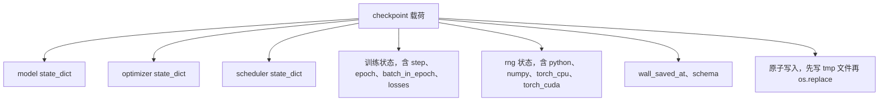
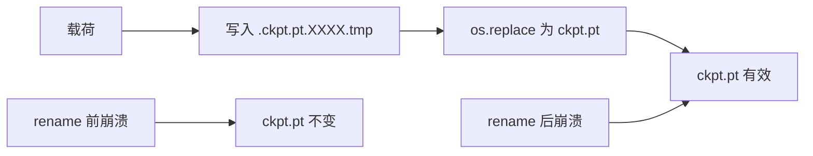
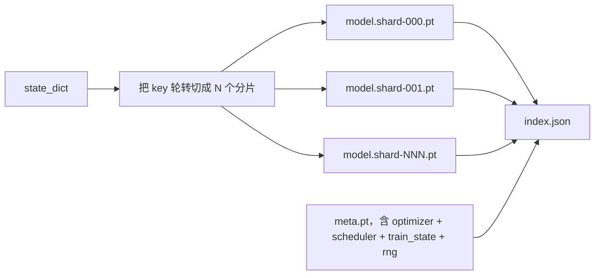

# Checkpoint 保存与恢复

> 译注：本文译自同目录 [`en.md`](./en.md)。术语遵循仓根 [TRANSLATION_GUIDE.md](../../../../TRANSLATION_GUIDE.md)。

> 训练中断会让 run 直接报废；checkpoint 让它能续上。把 model、optimizer、scheduler、loss 历史、step 计数器、RNG 状态原子化地存下来，这样任何时刻被 kill，磁盘上留下的都是一份合法文件。

**Type:** Build
**Languages:** Python
**Prerequisites:** Phase 19 lessons 42 to 45
**Time:** ~90 minutes

## 学习目标（Learning Objectives）

- 把完整的训练状态打成一个 payload，能被一个全新的进程重新加载。
- 用「先写临时文件再 rename」实现原子保存，让任何 crash 都不会留下半成品文件。
- 恢复 Python、NumPy、PyTorch 的 RNG 状态，让 resume 之后的 loss 跟不被打断的 baseline（基线）对得上。
- 为单文件装不下的大模型设计分片（sharded）checkpoint 布局，配上哈希校验的分片和一份 JSON 索引。

## 问题（The Problem）

你设了一个 18 小时的训练任务。集群的 wallclock（墙钟）上限是 4 小时。第 11 小时集群因为某位上司批准了内核升级而重启。没有 checkpoint，你只能从头来。没有 resume，你还会丢掉前 11 小时学出来的 optimizer 状态——就算 model weight（权重）幸存了，AdamW 的 moment（动量项）也没了，下一步就会朝着训练轨迹早已越过的方向猛拐。

正确的产物是一份单文件，里面装着续训需要的一切：model 参数、optimizer 状态、scheduler 状态、用来画图的 loss 历史、当前的 step / epoch / batch_in_epoch 计数器，以及每一种随机性来源的 RNG 状态。没有 RNG 状态，resume 之后的 loss 曲线就是另一条曲线。同样的 model、同样的数据，不同的 shuffle、不同的 dropout mask、dashboard 上不同的数字。

原子保存是契约的另一半。直接写入最终文件名意味着写到一半 crash 会留下损坏文件；resume 读到的是垃圾。先写到同目录下的临时文件再 rename，意味着写到一半 crash 不会动到上一份好文件。在 POSIX 文件系统上，rename 是原子的。

## 概念（The Concept）



### 五个状态桶（The five state buckets）

| Bucket | 为什么重要 |
|--------|----------------|
| Model | 权重和 buffer；定义了 model 是什么。 |
| Optimizer | 动量与自适应 moment；丢了这些，下一步就是另一个优化问题。 |
| Scheduler | 学习率在它的曲线上的位置；cosine schedule 尤其在意。 |
| Train counters | step、epoch、batch_in_epoch，加上画 dashboard 用的 loss 历史。 |
| RNG state | dropout、数据 shuffle 以及 model 内部任何采样的确定性来源。 |

### 原子保存（Atomic save）



两条规则。第一，临时文件必须和目标在同一个目录里，这样 rename 才停留在同一个文件系统内；跨设备的 rename 不是原子的。第二，每次尝试用唯一的临时名，这样两个写者不会互相踩。

### 分片 checkpoint（Sharded checkpoints）

当 model 变大，单文件 payload 就会大到加载慢、检查烦、网络共享读到一半打嗝时痛苦。修法是把参数状态切成若干 shard，再写一份小小的索引把它们串起来。



索引记录 shard 数量、每个 shard 的 sha256，以及 meta 文件的 sha256。任何 hash 不匹配，loader 都要大声失败。shard 可以落在不同的物理盘上；meta 很小，先读它。

### Resume 从 epoch 中间继续（Resume continues mid epoch）

如果 resume 直接跳到下一个 epoch 的开头，可能浪费几分钟到一整天。修法是 `(epoch, batch_in_epoch)` 加上 RNG 状态。加载完之后，训练循环把随机数生成器快进到本 epoch 已经消费过的 batch 之后，再从 `batch_in_epoch` 继续。本课的代码就是这么干的；断言是 resume 之后的 loss 轨迹与不被打断的 baseline 之间的差异在 1e-4 以内。

## 动手实现（Build It）

`code/main.py` 提供四个原语和一个 demo 驱动器。

### Step 1：捕获并恢复 RNG 状态（capture and restore RNG state）

`capture_rng_state` 返回一个 dict，包含 Python 的 `random.getstate`、NumPy 的 `np.random.get_state`，以及 PyTorch CPU 和 CUDA RNG 字节。`restore_rng_state` 反向还原。CPU tensor（张量）是一个 uint8 字节缓冲，PyTorch 的 RNG 知道怎么消费它。

### Step 2：原子保存（atomic save）

`atomic_save` 把 payload 写到目标目录下的临时文件，然后用 `os.replace` 把它换成最终名字。`atomic_write_json` 给分片索引做同样的事。

### Step 3：完整 checkpoint 往返（full checkpoint round trip）

`save_checkpoint` 把 model、optimizer、scheduler、train state、RNG 打成一个 dict。`load_checkpoint` 反向解开并返回一个 `TrainState`。schema 字段是升级钩子：未来的格式变更升一下 version 字符串，loader 据此分发。

### Step 4：分片版本（sharded variant）

`save_sharded_checkpoint` 把参数 key 轮转分到 N 个 shard，每个 shard 独立做原子保存，写一个含 optimizer / scheduler / train state 的 meta 文件，再写带 shard sha256 的 JSON 索引。`load_sharded_checkpoint` 在合并前校验每一个 shard。

### Step 5：resume demo

`run_resume_demo` 用一个小 model 训练 `total_steps` 步，在 `interrupt_at` 处保存 checkpoint，然后继续。第二个进程恢复 checkpoint 并跑完剩下的 step。函数返回中断点之后两条 loss 轨迹之间的最大绝对差。RNG 恢复之后，差值是零或浮点噪声。

跑起来：

```bash
python3 code/main.py
```

单文件和分片两个 demo 都断言 max-diff 在 1e-4 以下。摘要落到 `outputs/resume-demo.json`。

## 用起来（Use It）

生产级训练栈把 checkpoint 作为 trainer 的一部分发货。形状一致：model + optimizer + scheduler + counter + RNG，原子写入，按 step 命名，方便找到最新的那份。分片布局靠并行读支撑大模型加载；index.json 就是让这件事跑得起来的关键。

三个要强制执行的 pattern：

- **Schema 是 payload 里的字符串。** 迁移按它分支。没有它，就无法在不破坏旧 run 的前提下演进格式。
- **每个 shard 都 sha256。** 静默截断的下载是最糟糕的 bug；loader 要么早失败，要么晚失败。
- **保持 checkpoint 频率诚实。** 每 N 步存一次，每 N 个 wallclock 分钟存一次，取较短者。否则一个长 step crash 掉，会浪费整整一个窗口的工作量。

## 上线部署（Ship It）

`outputs/skill-checkpoint-save-resume.md` 是任何新训练脚本的 recipe（配方）：payload 形状、原子写、RNG 捕获、分片索引。把这个 skill 丢进仓库，在周期性保存点接上 `save_checkpoint`，在启动处接上 `load_checkpoint`，run 就能挺过 kill。

## 练习（Exercises）

1. 把轮转分片换成按参数组分片（以 `.weight` 结尾的层 vs `.bias`）。哪种布局在什么时候更合适？
2. 扩展保存循环，保留最近 K 份 checkpoint 并裁掉更旧的。磁盘小的时候 K 取多少合适？
3. 加一个 `--ckpt-every-seconds` 参数，按 wallclock 间隔触发保存，而不仅仅是按 step 数。
4. 加一条校验和验证路径，在启动时扫描目录里的每一份 checkpoint，报告哪些已损坏。
5. 实现一个 `migrate_v1_to_v2` 函数，给 payload 加一个新字段并升 schema 字符串。让 load 同时兼容两个版本。

## 关键术语（Key Terms）

| 术语 | 大家嘴上说的 | 实际意思 |
|------|-----------------|------------------------|
| Atomic save | 「写完祈祷」 | 写到同目录的临时文件，再 os.replace 换成目标名 |
| State dict | 「权重」 | model 的参数和 buffer，按参数名做 key |
| Sharded checkpoint | 「大 model 文件」 | 多个文件，每个 shard 一个，加一份 meta 文件，加一份带 sha256 的 JSON 索引 |
| RNG state | 「随机种子」 | 捕获了 python random、numpy、torch CPU、torch CUDA 的状态；不只是 seed |
| Mid-epoch resume | 「重启」 | 把 RNG 快进，从同一个 epoch 的下一个 batch 继续 |

## 延伸阅读（Further Reading）

- POSIX `rename` 语义——`os.replace` 所依赖的原子性主张。
- PyTorch 关于 `torch.save` 和 `torch.load` 的文档，包括跨设备恢复用的 `map_location`。
- Phase 19 lesson 46 涵盖梯度累积，本课的 checkpoint payload 能跨它存活。
- Phase 19 lesson 48 涵盖分布式 wrapper，本方案兼容它们的 state dict 格式。
- Linux 内核 `fsync` 文档——原子 rename 背后的持久性保证。
