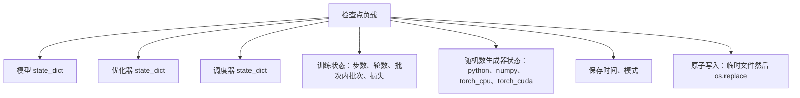
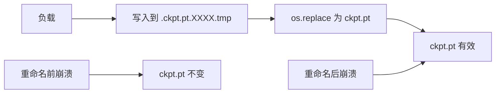
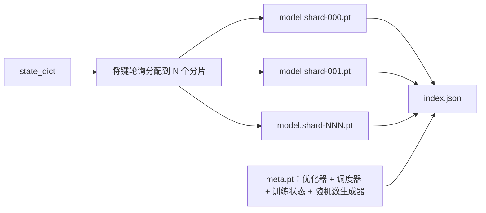

# 检查点保存与恢复

> 训练中断会杀死运行；检查点让它们得以继续。原子性地保存模型、优化器、调度器、损失历史、步计数器和随机数生成器状态，使得在任何时刻发生中断都会在磁盘上留下一个有效的文件。

**类型：** 构建
**语言：** Python
**前置条件：** 阶段 19 第 42 至 45 课
**时间：** ~90 分钟

## 学习目标

- 将完整的训练状态捕获到单个负载中，使其能被重新加载到新的进程中。
- 实现原子保存——先写入临时文件再重命名，这样崩溃永远不会留下半写的文件。
- 恢复 Python、NumPy 和 PyTorch 的随机数生成器状态，使恢复后的损失与未中断的基线一致。
- 为不再适合单个文件的模型构建分片检查点布局，包含哈希验证的分片和一个 JSON 索引。

## 问题所在

你设置了一个需要运行 18 小时的训练任务。墙上时钟上限是 4 小时。集群在第 11 小时重启，因为比你级别更高的人批准了内核升级。没有检查点，你就得从头开始。没有恢复功能，你还会丢失前 11 个小时学习到的优化器状态，所以即使模型权重幸存下来，AdamW 的动量也丢失了，下一步会朝着训练轨迹早已越过的方向猛冲。

正确的产物是一个保存了继续训练所需一切内容的单一文件：模型参数、优化器状态、调度器状态、用于绘制图表的损失历史、当前步数、轮数和批次内批次计数器，以及每个随机源的随机数生成器状态。没有随机数生成器的状态，恢复后的损失曲线就是一条不同的曲线。相同的模型、相同的数据、不同的洗牌、不同的丢弃掩码、仪表盘上不同的数字。

原子保存是合同的另一半。直接写入最终文件名意味着在写入中途崩溃会留下损坏的文件；恢复时会读到垃圾数据。先写入同一目录下的临时文件再重命名，意味着写入中途崩溃时，之前的好文件不受影响。在 POSIX 文件系统上，重命名是原子操作。

## 概念


```mermaid
flowchart TD
  ckpt[检查点负载] --> m[模型 state_dict]
  ckpt --> o[优化器 state_dict]
  ckpt --> s[调度器 state_dict]
  ckpt --> tr[训练状态：步数、轮数、批次内批次、损失]
  ckpt --> rng[随机数生成器状态：python、numpy、torch_cpu、torch_cuda]
  ckpt --> meta[保存时间、模式]
  ckpt --> write[原子写入：临时文件然后 os.replace]
```

### 五个状态桶

| 桶 | 为什么重要 |
|--------|----------------|
| 模型 | 权重和缓冲区；模型是什么。 |
| 优化器 | 动量和自适应动量；没有它们，下一步就是不同的优化问题。 |
| 调度器 | 学习率在其曲线上的位置；余弦调度尤其在意。 |
| 训练计数器 | 步数、轮数、批次内批次，以及绘制仪表盘的损失历史。 |
| 随机数生成器状态 | 丢弃、数据洗牌和模型内部任何采样的确定性。 |

### 原子保存


```mermaid
flowchart LR
  payload[负载] --> tmpf[写入到 .ckpt.pt.XXXX.tmp]
  tmpf --> rename[os.replace 为 ckpt.pt]
  rename --> done[ckpt.pt 有效]
  crash1[重命名前崩溃] --> orig[ckpt.pt 不变]
  crash2[重命名后崩溃] --> done
```

两条规则。第一，临时文件与目标文件位于同一目录，这样重命名保持在同一个文件系统内；跨设备的重命名不是原子操作。第二，每次尝试的临时文件名都是唯一的，这样两个写入者不会互相覆盖。

### 分片检查点

当模型变大时，单文件负载变得加载太慢、无法检查、并且在网络共享中途卡住时非常痛苦。解决办法是将参数状态拆分为多个分片，并编写一个将它们联系在一起的轻量索引。


```mermaid
flowchart LR
  state[state_dict] --> split[将键轮询分配到 N 个分片]
  split --> s0[model.shard-000.pt]
  split --> s1[model.shard-001.pt]
  split --> sN[model.shard-NNN.pt]
  s0 --> idx[index.json]
  s1 --> idx
  sN --> idx
  meta[meta.pt：优化器 + 调度器 + 训练状态 + 随机数生成器] --> idx
```

索引记录了分片数量、每个分片的 sha256 以及元文件的 sha256。当任何哈希不匹配时，加载器会大声报错。分片可以放在不同的物理磁盘上；元数据很小且优先读取。

### 恢复从中断的轮次继续

一个跳到下一轮次开头的恢复会浪费几分钟到一天的时间。解决办法是 `(epoch, batch_in_epoch)` 加上随机数生成器状态。加载后，训练循环将随机数生成器快进到当前轮次中已消耗的批次之后，并从 `batch_in_epoch` 继续。课程代码精确地做到了这一点；断言是恢复后的损失轨迹与未中断基线的差异在 1e-4 以内。

## 构建

`code/main.py` 提供了四个原语和一个演示驱动程序。

### 第 1 步：捕获和恢复随机数生成器状态

`capture_rng_state` 返回一个字典，包含 Python 的 `random.getstate`、NumPy 的 `np.random.get_state` 以及 PyTorch CPU 和 CUDA 的 RNG 字节。`restore_rng_state` 逆转这个过程。CPU 张量是一个 uint8 字节缓冲区，PyTorch 的 RNG 知道如何消费它。

### 第 2 步：原子保存

`atomic_save` 将负载写入目标目录下的临时文件，然后 `os.replace` 将其交换为最终名称。`atomic_write_json` 对分片索引执行相同操作。

### 第 3 步：完整检查点往返

`save_checkpoint` 将模型、优化器、调度器、训练状态和随机数生成器打包成一个字典。`load_checkpoint` 逆转这个过程并返回一个 `TrainState`。`schema` 字段是升级钩子：未来的格式变化会更新版本字符串，加载器据此分发处理。

### 第 4 步：分片变体

`save_sharded_checkpoint` 将参数键轮询分配到 N 个分片，用各自的原子保存写入每个分片，写入包含优化器、调度器和训练状态的元文件，并写入包含分片 sha256 的 JSON 索引。`load_sharded_checkpoint` 在合并前验证每个分片。

### 第 5 步：恢复演示

`run_resume_demo` 为 `total_steps` 步训练一个小模型，在 `interrupt_at` 处保存检查点，然后继续。第二个进程恢复检查点并运行剩余步骤。该函数返回中断点后两条损失轨迹之间的最大绝对差。随机数生成器恢复后，差异为零或浮点数噪声。

运行它：

```bash
python3 code/main.py
```

单文件和分片演示都断言最大差异小于 1e-4。摘要输出到 `outputs/resume-demo.json`。

## 使用

生产训练栈将检查点功能作为训练器的一部分。形式是一样的：模型 + 优化器 + 调度器 + 计数器 + 随机数生成器，原子写入，按步数命名以便轻松找到最新的。分片布局以并行读取支持大型模型加载；index.json 是实现这一点的关键。

三个要执行的模式：

- **模式是负载中的一个字符串。** 迁移根据它分支。没有它，你无法在不破坏旧运行的情况下演化格式。
- **对每个分片进行 Sha256。** 静默截断的下载是最糟糕的错误类型；加载器要么快速失败，要么晚失败。
- **保持检查点节奏合理。** 每 N 步和每墙上时钟分钟保存一次，取较短者。否则，长时间的那一步崩溃会浪费整整一个窗口的工作。

## 交付

`outputs/skill-checkpoint-save-resume.md` 是任何新训练脚本的配方：负载形状、原子写入、随机数生成器捕获、分片索引。将技能放入仓库，在定期保存点接入 `save_checkpoint`，在启动时接入 `load_checkpoint`，运行就能抵御中断。

## 练习

1. 将轮询分片替换为按参数组分片（以 `.weight` 结尾的层 vs `.bias` 结尾的层）。每种布局分别在何时更优？
2. 扩展保存循环以保留最后 K 个检查点并清除旧的。当磁盘很小时，合适的 K 是多少？
3. 添加一个 `--ckpt-every-seconds` 标志，按照墙上时钟间隔（而非仅步数）触发保存。
4. 添加一个校验和验证路径，在启动时运行，扫描目录中的每个检查点，并报告哪些已损坏。
5. 实现一个 `migrate_v1_to_v2` 函数，为负载添加一个新字段并更新模式字符串。使加载器同时容忍两个版本。

## 关键术语

| 术语 | 人们怎么说 | 实际含义 |
|------|-----------|---------|
| 原子保存 | "写完祈祷" | 写入同一目录下的临时文件，然后 os.replace 到目标名称 |
| 状态字典 | "权重" | 模型参数和缓冲区，按键名索引 |
| 分片检查点 | "大模型文件" | 多个文件，每个分片一个，加上一个元文件和一个含 sha256 的 JSON 索引 |
| 随机数生成器状态 | "随机种子" | 捕获的 python random、numpy、torch CPU、torch CUDA 的状态；不仅仅是种子 |
| 轮次中恢复 | "重启" | 快进随机数生成器并从同一轮次中的下一个批次继续 |

## 延伸阅读

- POSIX `rename` 语义，了解 `os.replace` 所依赖的原子性保证。
- PyTorch 关于 `torch.save` 和 `torch.load` 的文档，包括跨设备恢复的 `map_location`。
- 阶段 19 第 46 课涵盖了梯度累积，本课的检查点负载能够在其间存活。
- 阶段 19 第 48 课涵盖了分布式包装器，本方案适应了其状态字典格式。
- Linux 内核 `fsync` 文档，了解原子重命名背后的持久性保证。
