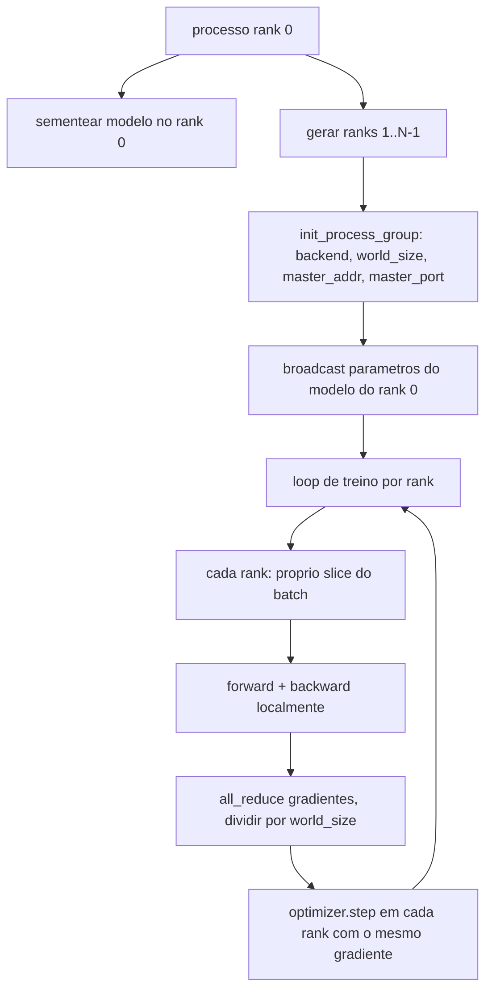
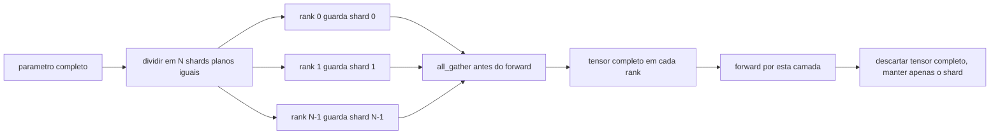

# Aula 48: Distributed Data Parallel e FSDP do Zero

> Treinamento multi-rank e dois coletivos e uma regra. Transmita os parametros na inicializacao, media os gradientes apos o backward, nunca deixe os ranks discordarem de qual passo estao.

**Tipo:** Build
**Linguagens:** Python
**Prerequisitos:** Aulas 42 a 45 da Fase 19
**Tempo:** ~90 minutos

## Objetivos de Aprendizado

- Subir um grupo de processos entre N ranks com o backend `gloo`, sem hardware eespecificaçãoial.
- Implementar um wrapper DDP minimo que transmita parametros na construcao e faça all-reduce de gradientes apos o backward.
- Provar que o all-reduce de gradientes por rank corresponde a um gradiente de processo unico na entrada concatenada.
- Esboçar o sharding de parametros FSDP: cada rank guarda um slice, o tensor completo e coletado para o forward pass e descartado depois.

## O Problema

O modelo cabe em um dispositivo. O dataset nao. O orcamento de otimizacao diz que voce quer ver N vezes os exemplos por segundo de parede. O primeiro alavanca e paralelismo de dados: cada rank roda o mesmo modelo em um slice diferente do batch, depois media gradientes antes do passo do optimiser. O segundo alavanca e FSDP: o modelo tambao nao cabe em um dispositivo, entao cada rank guarda uma fracao de cada parametro e reconstrói os tensores completos camada por camada durante o forward pass.

A dor e a burocracia. Se os parametros divergirem entre ranks a execucao esta silenciosamente corrompida. Se voce media gradientes mas nao a loss o dashboard mente. Se o backend coletivo nao consegue concordar em uma topologia a execucao trava pra sempre. A solucao e escrever os coletivos na mao uma vez e nunca confiar em um wrapper que voce nao consegue reproduzir.

Esta aula roda em CPU. CUDA nao e assumido. O backend `gloo` vem com toda build do PyTorch e aceita workers de `torch.multiprocessing`; o mesmo codigo muda para `nccl` em um no multi-GPU sem mudar a estrutura.

## O Conceito



### Os dois coletivos que importam

| Coletivo | O que faz | Quando |
|----------|-----------|--------|
| `broadcast` | Copia um tensor de um rank para todos os outros | Inicializacao de parametro, estado do scheduler, qualquer sync um-para-todos |
| `all_reduce` | Soma (ou media, ou max) um tensor em todos os ranks, cada rank recebe o resultado | Media de gradiente apos backward |
| `all_gather` | Cada rank contribui um tensor, cada rank recebe a concatenacao | Coleta de logits, descompactacao de parametros FSDP |

O contrato DDP e `broadcast` na construcao e `all_reduce` apos o backward. O esboço FSDP adiciona `all_gather` antes do forward pass de cada camada.

### Media de gradiente corresponde a gradiente de processo unico

Um modelo treinado em um batch de B exemplos em N ranks deve produzir o mesmo gradiente que um processo unico treinando em um batch de N*B. O truque e que somar gradientes por rank e dividir por N da a media do gradiente de loss, que e o que cross-entropy com reducao por media produziria no batch completo. O codigo da aula afirma isso com `max-abs-diff < 1e-3` entre o gradiente de all-reduce manual e o gradiente de referencia de processo unico.

### Esboço FSDP



A vitoria de memoria e exata: a memoria por rank para parametros cai para 1/N. O custo e o gather, que e pago a cada forward pass. FSDP em producao sobrepoe o gather com o calculo da camada anterior para que o custo de parede seja muito menor do que a aritmetica simples preve. A aula faz a ida e volta em cada parametro e afirma que a reconstrucao e bit-igual ao original.

### CPU e o backend gloo

CUDA e o alvo de producao, mas os mesmos caminhos de codigo existem em CPU. `gloo` e o backend coletivo de CPU. E mais lento que `nccl` em GPUs por ordens de grandeza, mas a superficie da API e identica. O grupo de processos da aula e inicializado com `backend="gloo"` e os ranks sao gerados com `torch.multiprocessing` em vez de `torchrun`; ambos chegam nas mesmas chamadas `torch.distributed`. Em um no multi-GPU, as unicas mudancas sao `backend="nccl"`, tensores de dispositivo, e `torchrun` para lancar.

## Construa

`code/main.py` e o artefato executavel.

### Passo 1: subir o grupo de processos

```python
os.environ["MASTER_ADDR"] = "127.0.0.1"
os.environ["MASTER_PORT"] = str(port)
dist.init_process_group(backend="gloo", rank=rank, world_size=world_size)
```

`MASTER_ADDR` e `MASTER_PORT` sao o rendezvous: cada rank disca a mesma porta no mesmo host. A aula escolhe uma porta livre via um truque de bind-and-close para evitar colisoes quando varias execucoes compartilham uma maquina.

### Passo 2: transmitir na construcao

`MinimalDDP.__init__` caminha cada parametro e buffer e chama `dist.broadcast(tensor, src=0)`. Os valores do Rank 0 se tornam a inicializacao canonica. Sem isso, cada rank inicializa com sua propria seed e os ranks divergem desde o passo um.

### Passo 3: all-reduce de gradientes apos o backward

```python
def all_reduce_grads_(module, world_size):
    for p in module.parameters():
        if p.grad is None:
            p.grad = torch.zeros_like(p.data)
        dist.all_reduce(p.grad.data, op=dist.ReduceOp.SUM)
        p.grad.data.div_(world_size)
```

Cada rank termina com o mesmo gradiente media. O passo do optimiser agora e uma funcao da mesma entrada em cada rank, que e por que os parametros ficam sincronizados durante a execucao.

### Passo 4: provar a equivalencia

`manual_all_reduce_matches_single_process` constroi o mesmo modelo no rank 0 e compara o gradiente apos all-reduce com o gradiente que um processo unico computaria na entrada concatenada. O max-abs-diff e por volta de 1e-8.

### Passo 5: ida e volta FSDP

`fsdp_round_trip_sketch` achata cada parametro, faz pad para um multiplo de `world_size`, fatia, all-gather, e remove o pad. A reconstrucao de cada rank e igual ao original. Esse e o passo de descompactacao; o inverso (re-shard apos o forward) e um slice off do tensor coletado.

Execute:

```bash
python3 code/main.py
```

O world_size padrao e 2. Dois processos de CPU sao gerados, se comunicam entre si por `gloo`, e saem zero. O output `outputs/ddp-demo.json` captura somas de parametro por rank, a norma de gradiente apos all-reduce, o resultado da ida e volta FSDP, e a diferenca manual-vs-referencia do gradiente.

## Use

Stacks de treino de producao chamam as mesmas primitivas. O `DistributedDataParallel` do PyTorch adiciona: hooks de gradiente apos-backward que sobrepoe all-reduce com backward, all-reduce em balde que combina varios gradientes pequenos em um coletivo, e o contexto `no_sync` que a aula 46 usou.

O FSDP do PyTorch adiciona: uma visao de parametro plano por camada para que cada rank guarde um buffer contiguo, sobreposicao do descompactamento da proxima camada com o calculo da camada atual, e descarga opcional para CPU dos shards.

A forma continua a mesma: transmitir na inicializacao, reduzir apos backward, compartilhar parametros quando nao cabem mais.

## Entregue

`outputs/skill-distributed-fsdp-ddp.md` carrega a receita para um novo script de treino: subir o grupo de processos com `gloo` para CPU e `nccl` para GPU, envolver o modelo em um shell DDP que transmite na construcao e reduz apos backward, opcionalmente compartilhar parametros com o padrao all_gather do esboço FSDP.

## Exercicios

1. Rodar com `--world-size 4` e confirmar que o spread de param permanece sob 1e-3 durante a execucao.
2. Substituir a media manual por `dist.all_reduce(op=dist.ReduceOp.AVG)` e cronometrar a diferenca.
3. Adicionar um hook apos-backward no wrapper DDP para que o all-reduce sobreponha com o resto do backward; medir a melhoria em tempo de parede.
4. Implementar o passo de re-shard FSDP: apos o forward pass, substituir o tensor completo pelo shard local novamente. Confirmar que a memoria por rank cai.
5. Trocar o backend para `nccl` em uma caixa CUDA. Anotar quais variaveis de ambiente mudam e quais permanecem iguais.

## Termos Chave

| Termo | O que as pessoas dizem | O que realmente significa |
|-------|------------------------|---------------------------|
| Backend | "gloo ou nccl" | A biblioteca que implementa operacoes coletivas; gloo e CPU, nccl e GPU |
| World size | "Total de ranks" | Numero de processos no grupo; o grupo e a unidade que coletivos operam |
| Rank | "Id do worker" | Identificador do processo dentro do grupo, indexado em zero |
| All-reduce | "Somar os grads" | Somar um tensor em todos os ranks, cada rank termina com o mesmo resultado |
| Unshard | "Recolher os params" | Reconstruir o tensor completo a partir de slices por rank via all_gather |

## Leitura Adicional

- Documentacao de `torch.distributed` do PyTorch para a semantica coletiva que esta aula depende.
- A lista de coletivos da biblioteca `gloo`, identica em forma as primitivas `nccl` respaldadas por CUDA.
- Aula 46 da Fase 19 para o padrao de acumulacao de gradiente que envolve o all-reduce DDP em `no_sync`.
- Aula 47 da Fase 19 para o layout de checkpoint que sobrevive a execucoes DDP e FSDP.
- Documentacao do FSDP do PyTorch para a implementacao em producao do sharding de parametro esboçado aqui.
