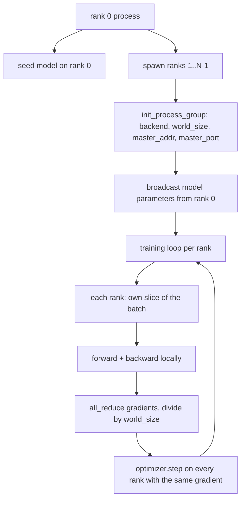
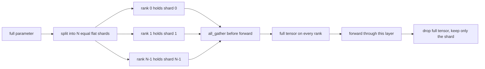

# Sıfırdan Dağıtılmış Veri Paralel ve FSDP

> Çok aşamalı eğitim iki kolektif ve bir kuraldır. Başlangıçta parametreleri yayınlayın, geriden sonra gradient'ların ortalamasını alın, sıralamaların hangi adımda oldukları konusunda anlaşmazlığa düşmesine asla izin vermeyin.

**Tür:** Yapım
**Diller:** Python
**Önkoşullar:** Aşama 19 dersleri 42 - 45
**Süre:** ~90 dakika

## Öğrenme Hedefleri

- `gloo` arka ucuyla, özel bir donanıma ihtiyaç duymadan, N düzeyinde bir süreç grubu oluşturun.
- Oluşturma sırasında parametreleri yayınlayan ve geriye doğru gradient'ları tamamen azaltan minimal bir DDP sarmalayıcı uygulayın.
- Sıra başına gradient'ların tamamen azaltılmasının, birleştirilmiş girdideki tek işlemli gradient ile eşleştiğini kanıtlayın.
- Taslak FSDP parametre parçalaması: her sıra bir dilim tutar, tam tensör ileri geçiş için toplanır ve sonrasında bırakılır.

## Sorun

Model tek bir cihaza uyar. dataset bunu yapmaz. Optimizasyon bütçesi, örnekleri duvar saati başına N kez görmek istediğinizi söylüyor. İlk kaldıraç veri paraleldir: her sıralama aynı modeli toplu işin farklı bir diliminde çalıştırır, ardından optimize edici adımdan önce gradient'lerin ortalamasını alır. İkinci kaldıraç ise FSDP'dir: model tek bir cihaza da sığmaz, dolayısıyla her sıra her parametrenin bir kısmını tutar ve ileri geçiş sırasında tam tensörleri katman katman yeniden oluşturur.

Acı muhasebedir. Parametreler sıralar arasında kayarsa çalışma sessizce bozulur. gradient'lerin ortalamasını alırsanız ancak kontrol panelindeki kaybı almazsanız. Eğer kolektif arka uç bir topoloji üzerinde anlaşamazsa çalışma sonsuza kadar askıda kalır. Çözüm, kolektifleri bir kez elle yazmak ve çoğaltamayacağınız bir paketleyiciye asla güvenmemektir.

Bu ders CPU üzerinde çalışır. CUDA varsayılmaz. `gloo` arka ucu her PyTorch yapısıyla birlikte gönderilir ve `torch.multiprocessing` işçiyi kabul eder; aynı kod, çoklu GPU düğümünde yapıyı değiştirmeden `nccl` 'ye geçer.

## Konsept



### Önemli olan iki kolektif

| Toplu | Ne işe yarar | Ne zaman |
|------------|--------------|------|
| `broadcast` | Bir tensörü bir seviyeden diğerlerine kopyalayın | Parametre başlatma, zamanlayıcı durumu, herhangi birinden hepsine senkronizasyon |
| `all_reduce` | Tüm sıralarda bir tensörün toplamı (veya ortalaması veya maksimumu), her sıra sonucu alır | Geriye doğru ortalama Gradient |
| `all_gather` | Her sıralama bir tensöre katkıda bulunur, her sıralama birleştirmeyi alır | Logits koleksiyonu, FSDP parametresinin parçalanması |

DDP sözleşmesi yapım aşamasında `broadcast` ve geriye doğru sonrasında `all_reduce` şeklindedir. FSDP taslağı, her katmanın ileri geçişinden önce `all_gather` ekler.

### Gradient ortalaması, tek işlemli gradient ile eşleşir

N sıradaki bir grup B örneği üzerinde eğitilen bir model, bir N*B grubu üzerindeki tek bir süreç eğitimi ile aynı gradient değerini üretmelidir. İşin püf noktası, sıra başına gradient'ların toplanması ve N'ye bölünmesinin ortalama kaybı gradient vermesidir; bu, ortalama indirgeme ile çapraz entropinin tam partide üreteceği şeydir. Ders kodu bunu, manuel tamamen azaltma gradient ile referans tek işlem gradient arasındaki `max-abs-diff < 1e-3` ile ileri sürer.

### FSDP taslağı



Bellek kazanımı kesindir: parametreler için sıra başına bellek 1/N'ye düşer. Maliyet, her ileri geçişte ödenen toplamadır. Üretim FSDP'si, önceki katmanın hesaplamasıyla toplamayı örtüştürür, böylece duvar saati maliyeti, basit muhasebe tahminlerinden çok daha küçüktür. Ders, her parametre üzerinde gidiş-dönüş yapar ve yeniden yapılanmanın orijinaline eşit olduğunu ileri sürer.

### CPU ve kasvetli arka uç

CUDA üretim hedefidir ancak aynı kod yolları CPU'da da mevcuttur. `gloo` , CPU toplu arka ucudur. GPU'larda büyüklük sırasına göre `nccl` 'den daha yavaştır ancak API yüzeyi aynıdır. Dersin süreç grubu `backend="gloo"` ile başlatılır ve sıralar `torchrun` yerine `torch.multiprocessing` ile oluşturulur; ikisi de aynı `torch.distributed` çağrıyla sonuçlanıyor. Çoklu GPU düğümünde yalnızca `backend="nccl"`, cihaz tensörleri ve başlatılacak `torchrun` değişiklikleri vardır.

## Build It — Kendin Geliştir

`code/main.py` çalıştırılabilir artifact'dır.

### Adım 1: süreç grubunu açın

```python
os.environ["MASTER_ADDR"] = "127.0.0.1"
os.environ["MASTER_PORT"] = str(port)
dist.init_process_group(backend="gloo", rank=rank, world_size=world_size)
```

`MASTER_ADDR` ve `MASTER_PORT` buluşma noktasıdır: her kademe aynı ana bilgisayardaki aynı bağlantı noktasını çevirir. Ders, birkaç çalıştırmanın bir makineyi paylaştığı durumlarda çarpışmaları önlemek için bağla ve kapat yöntemiyle boş bir bağlantı noktası seçer.

### Adım 2: inşaatta yayın

`MinimalDDP.__init__` her parametreyi ve arabelleği yürütür ve `dist.broadcast(tensor, src=0)`'ı çağırır. Sıra 0'ın değerleri kanonik başlangıç ​​değeri olur. Bu olmadan, her sıralama kendi tohumuyla başlatılır ve sıralamalar birinci adımdan ayrılır.

### Adım 3: geriden sonra gradients'nin tamamını azaltın

```python
def all_reduce_grads_(module, world_size):
    for p in module.parameters():
        if p.grad is None:
            p.grad = torch.zeros_like(p.data)
        dist.all_reduce(p.grad.data, op=dist.ReduceOp.SUM)
        p.grad.data.div_(world_size)
```

Her sıralama aynı ortalama gradient ile sonuçlanır. Optimize edici adım artık her kademede aynı girişin bir fonksiyonudur; bu nedenle parametreler çalışma boyunca senkronize kalır.

### Adım 4: denkliği kanıtlayın

`manual_all_reduce_matches_single_process` aynı modeli rütbe 0'da oluşturur ve tümünü azaltma sonrası gradient değerini tek bir işlemin birleştirilmiş girdi üzerinde hesaplayacağı gradient ile karşılaştırır. Maksimum abs farkı 1e-8 civarındadır.

### Adım 5: FSDP gidiş dönüş

`fsdp_round_trip_sketch` her parametreyi düzleştirir, `world_size`'nin katlarına dolgu yapar, dilimler, tümünü toplar ve pad'leri kaldırır. Her rütbenin yeniden inşası orijinaline eşittir. Bu parçalanmamış adımdır; tersi (ileriden sonra yeniden parçalama) toplanan tensörden bir dilim uzaktadır.

Çalıştır:

```bash
python3 code/main.py
```

Varsayılan dünya boyutu 2'dir. İki CPU işlemi ortaya çıkar, birbirleriyle `gloo` aracılığıyla konuşur ve sıfırdan çıkar. `outputs/ddp-demo.json` çıkışı, sıralama başına parametre toplamlarını, tümünü azaltma sonrasındaki gradient normunu, FSDP gidiş-dönüş sonucunu ve manuel-referans gradient farkını yakalar.

## Use It — Hazır Araçla Uygula

Üretim eğitimi yığınları aynı ilkelleri çağırır. PyTorch'un `DistributedDataParallel` şunu ekler: birkaç küçük gradient'yi tek bir kolektifte birleştiren, gruplanmış all-reduce ile tümü-azaltma ile örtüşen geri-sonrası gradient kancaları ve kullanılan `no_sync` bağlam dersi 46.

PyTorch'un FSDP'si şunu ekler: katman başına düz bir parametre görünümü, böylece her sıra bir bitişik arabellek tutar, bir sonraki katmanın parçalanmamış öğesinin geçerli katmanın hesaplamasıyla örtüşmesi ve parçalar için isteğe bağlı CPU boşaltması.

Şekil aynı kalır: başlangıçta yayınlayın, geriye doğru gittikten sonra azaltın, artık uymadıklarında parça parametrelerini kullanın.

## Ship It — Kullanıma Sun

`outputs/skill-distributed-fsdp-ddp.md` , yeni bir eğitim komut dosyasının tarifini taşır: CPU için `gloo` ve GPU için `nccl` ile süreç grubunu döndürün, modeli, yapım sırasında yayın yapan ve geriden sonra azaltan bir DDP kabuğuna sarın, isteğe bağlı olarak FSDP taslağından all_gather modeliyle parametreleri parçalayın.

## Egzersizler

1. `--world-size 4` ile çalıştırın ve parametre yayılımının çalıştırma boyunca 1e-3'ün altında kaldığını doğrulayın.
2. Manüel ortalamayı `dist.all_reduce(op=dist.ReduceOp.AVG)` ile değiştirin ve farkı zamanlayın.
3. DDP ambalajına bir geri-sonrası kancası ekleyin, böylece tüm azaltımlar geriye kalan kısımlarla örtüşür; duvar saati gelişimini ölçün.
4. FSDP yeniden parçalama adımını uygulayın: ileri geçişten sonra, tam tensörü tekrar yerel parçayla değiştirin. Derece başına bellek düşüşlerini onaylayın.
5. Bir CUDA kutusunda arka ucu `nccl` olarak değiştirin. Hangi ortam değişkenlerinin değiştiğini ve hangilerinin aynı kaldığını unutmayın.

## Anahtar Terimler

| Dönem | İnsanlar ne diyor | Aslında ne anlama geliyor |
|------|-----------------|------------------------|
| Arka uç | "gloo veya nccl" | Toplu operasyonları uygulayan kütüphane; gloo CPU'dur, nccl GPU'dur |
| Dünya boyutu | "Toplam sıralama" | Gruptaki süreçlerin sayısı; grup kolektiflerin faaliyet gösterdiği birimdir |
| Sıra | "İşçi kimliği" | Grup içindeki süreç tanımlayıcı, sıfır indeksli |
| Tamamen azalt | "Mezunları topla" | Tüm sıralarda bir tensör toplayın, her sıra aynı sonuçla biter |
| Parçayı Kaldır | "Parametreleri toplayın" | All_gather |

## Daha Fazla Okuma

- Bu dersin dayandığı kolektif anlambilim için PyTorch `torch.distributed` belgeleri.
- `gloo` kütüphanesinin toplu listesi, şekil olarak CUDA destekli `nccl` temel öğeleriyle aynı.
- `no_sync`'da DDP'nin tamamen azaltılmasını saran gradient birikim modeli için Aşama 19 ders 46.
- DDP ve FSDP çalıştırmalarından sağ çıkan kontrol noktası düzeni için Aşama 19 ders 47.
- Burada çizilen parametre parçalamanın üretim uygulamasına yönelik PyTorch FSDP belgeleri.
