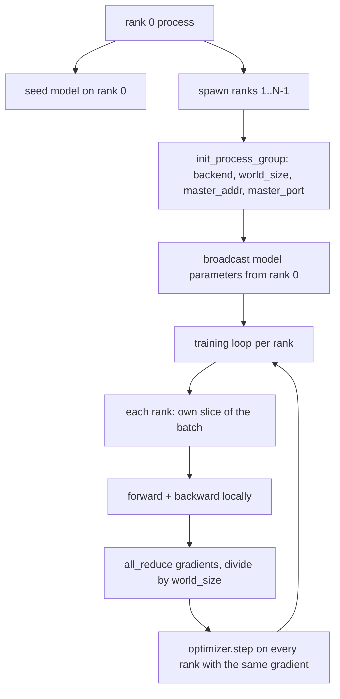
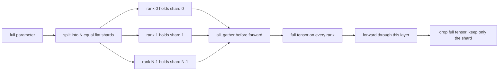

# 48 · 从零实现分布式数据并行与 FSDP

> 多 rank 训练就是两个集合通信操作加一条规则：启动时广播参数，反向传播后对梯度求平均，永远不要让各个 rank 对当前所处步骤产生分歧。

**类型：** 构建
**语言：** Python
**前置：** 第 19 阶段第 42 至 45 课
**时长：** 约 90 分钟

## 学习目标

- 使用 `gloo` 后端拉起一个跨 N 个 rank 的进程组，无需特殊硬件。
- 实现一个最小化的 DDP（Distributed Data Parallel，分布式数据并行）包装器，在构造时广播参数，在反向传播后对梯度执行全归约。
- 证明各 rank 梯度的全归约结果与拼接输入上的单进程梯度一致。
- 勾勒 FSDP（Fully Sharded Data Parallel，全分片数据并行）的参数分片方案：每个 rank 持有一个切片，前向传播时通过 all_gather 拼接出完整张量，用完即释放。

## 问题所在

模型可以装进单个设备。但数据集装不进。从优化预算的角度看，你希望每墙上时钟秒能处理 N 倍的样本。第一根杠杆是数据并行（data parallel）：每个 rank 在不同的批次切片上运行同一份模型，然后在优化器步进之前对梯度求平均。第二根杠杆是 FSDP：模型连单个设备也装不下，因此每个 rank 持有每个参数的 1/N，在前向传播过程中逐层重建完整张量。

痛点在于状态同步（bookkeeping）。如果各 rank 的参数发生漂移，整个运行会静默损坏。如果你对梯度求了平均但没有对损失求平均，监控面板就会撒谎。如果集合通信后端无法就拓扑达成一致，运行会永久挂起。解决方案是亲手写一遍集合通信操作，再也不要相信任何一个你无法复现的封装。

本课在 CPU 上运行。不依赖 CUDA。`gloo` 后端随每个 PyTorch 构建一起发布，支持 `torch.multiprocessing` worker；在 GPU 多卡节点上将后端切换为 `nccl` 时，代码结构无需任何改动。

## 核心概念



### 两个关键的集合通信操作

| 集合通信操作 | 作用 | 调用时机 |
|------------|------|------|
| `broadcast` | 将一个张量从某个 rank 复制到所有其他 rank | 参数初始化、调度器状态，以及任何一对多同步场景 |
| `all_reduce` | 跨所有 rank 对张量求和（或取均值、最大值），每个 rank 得到相同结果 | 反向传播后的梯度平均 |
| `all_gather` | 每个 rank 贡献一个张量，所有 rank 得到拼接后的完整结果 | 收集 logits、FSDP 参数反分片（unshard） |

DDP 的契约是：构造时 `broadcast`，反向传播后 `all_reduce`。FSDP 则在此基础上，在每一层前向传播之前加上 `all_gather`。

### 梯度平均与单进程梯度等价

一个模型在 N 个 rank 上训练总共 B 个样本的批次，其产生的梯度必须与单进程在 N*B 的批次上训练完全一致。诀窍在于：将各 rank 的梯度求和后除以 N，得到的是平均损失梯度，而这正是交叉熵损失在 `mean` 规约模式下对完整批次计算出的结果。本课代码通过断言手动全归约梯度与参考单进程梯度之间的最大绝对值差小于 1e-3 来验证这一点。

### FSDP 概要



内存收益是精确的：每个 rank 用于存储参数的内存降至 1/N。代价是 all_gather 的开销，每次前向传播都要支付。生产环境中的 FSDP 会将 all_gather 与上一层的计算重叠，因此实际墙上时钟开销远小于朴素估算。本课对每个参数做一次完整的往返（分片 → 重组），并断言重建结果与原始参数逐位相等。

### CPU 与 gloo 后端

CUDA 是生产目标，但同样的代码路径在 CPU 上也存在。`gloo` 是 CPU 上的集合通信后端。它在 GPU 上比 `nccl` 慢几个数量级，但 API 层面完全一致。本课的进程组使用 `backend="gloo"` 初始化，rank 通过 `torch.multiprocessing` 而非 `torchrun` 来启动；两者最终调用的都是相同的 `torch.distributed` 接口。在多 GPU 节点上，唯一的改动是 `backend="nccl"`、将张量放到设备上，以及用 `torchrun` 启动。

## 动手构建

`code/main.py` 是可运行的工件。

### 步骤 1：拉起进程组

```python
os.environ["MASTER_ADDR"] = "127.0.0.1"
os.environ["MASTER_PORT"] = str(port)
dist.init_process_group(backend="gloo", rank=rank, world_size=world_size)
```

`MASTER_ADDR` 和 `MASTER_PORT` 是集合点（rendezvous）：每个 rank 向同一台主机的同一端口发起连接。本课通过"先绑定再关闭"的取巧方法获取一个空闲端口，避免多轮运行在同一台机器上发生端口冲突。

### 步骤 2：构造时广播

`MinimalDDP.__init__` 遍历每个参数和 buffer，调用 `dist.broadcast(tensor, src=0)`。rank 0 的值成为权威初始值。如果不做这一步，每个 rank 会用各自的随机种子初始化，导致各 rank 从第一步起就产生分歧。

### 步骤 3：反向传播后对梯度执行全归约

```python
def all_reduce_grads_(module, world_size):
    for p in module.parameters():
        if p.grad is None:
            p.grad = torch.zeros_like(p.data)
        dist.all_reduce(p.grad.data, op=dist.ReduceOp.SUM)
        p.grad.data.div_(world_size)
```

每个 rank 最终得到相同的平均梯度。优化器步进在每一步都基于相同的输入，这就是参数在整个运行过程中保持同步的原因。

### 步骤 4：证明等价性

`manual_all_reduce_matches_single_process` 在 rank 0 上构建相同模型，对比全归约之后的梯度与单进程在拼接输入上计算出的梯度。最大绝对值差约为 1e-8。

### 步骤 5：FSDP 往返测试

`fsdp_round_trip_sketch` 将每个参数展平，填充到 `world_size` 的倍数，切片，all_gather，再去除填充。每个 rank 上的重建结果与原始参数完全一致。这是反分片步骤；其逆操作（前向传播后重新分片）只需从 all_gather 出的完整张量中取回自己的切片即可。

运行方式：

```bash
python3 code/main.py
```

默认 world_size 为 2。两个 CPU 进程启动后通过 `gloo` 通信，正常退出。输出文件 `outputs/ddp-demo.json` 记录每个 rank 的参数和、全归约后的梯度范数、FSDP 往返结果以及手动全归约与参考梯度的差值。

## 实际应用

生产环境中的训练栈调用的是同样的原语。PyTorch 的 `DistributedDataParallel` 额外提供了：在反向传播过程中通过梯度 hook 将 all-reduce 与剩余反向计算重叠；将多个小梯度合并为一次集合通信调用的桶式（bucketed）all-reduce；以及第 46 课中使用的 `no_sync` 上下文管理器。

PyTorch 的 FSDP 额外提供了：按层组织的平坦参数视图，使每个 rank 持有连续的缓冲区；下一层反分片与当前层计算的重叠；以及可选的 CPU 卸载（offload）功能。

形状始终不变：启动时广播，反向传播后规约，参数装不下时就分片。

## 交付产物

`outputs/skill-distributed-fsdp-ddp.md` 为新的训练脚本提供了配方：用 `gloo`（CPU）或 `nccl`（GPU）拉起进程组；将模型封装到 DDP 外壳中，构造时广播、反向传播后规约；按需通过 FSDP 概要中的 all_gather 模式对参数进行分片。

## 练习

1. 使用 `--world-size 4` 运行，确认整个运行过程中参数漂移保持在 1e-3 以内。
2. 将手动平均替换为 `dist.all_reduce(op=dist.ReduceOp.AVG)`，并计时对比。
3. 为 DDP 包装器添加反向传播后 hook，使 all-reduce 与剩余反向计算重叠；测量墙上时钟的改善。
4. 实现 FSDP 的重新分片步骤：前向传播后，将完整张量替换回本地分片。确认每个 rank 的内存用量下降。
5. 在 CUDA 机器上将后端切换为 `nccl`。注意哪些环境变量需要改变，哪些保持不变。

## 关键术语

| 术语 | 人们怎么说 | 实际含义 |
|------|-----------|---------|
| Backend | "gloo 还是 nccl" | 实现集合通信操作的底层库；gloo 面向 CPU，nccl 面向 GPU |
| World size | "总 rank 数" | 进程组中的进程数；进程组是集合通信操作的作用单元 |
| Rank | "Worker ID" | 进程在组内的标识符，从零开始编号 |
| All-reduce | "把梯度加起来" | 跨所有 rank 对张量求和，每个 rank 最终得到相同结果 |
| Unshard | "把参数拼回来" | 通过 all_gather 将各 rank 持有的分片重新组合为完整张量 |

## 扩展阅读

- PyTorch `torch.distributed` 文档，了解本课所依赖的集合通信语义。
- `gloo` 库的集合通信操作清单，与 CUDA 后端 `nccl` 的原语在形态上完全一致。
- 第 19 阶段第 46 课，了解将 DDP 的 all-reduce 嵌套在 `no_sync` 中的梯度累积模式。
- 第 19 阶段第 47 课，了解兼容 DDP 和 FSDP 运行的检查点布局。
- PyTorch FSDP 文档，了解本课勾勒的参数分片方案在生产环境中的实现。
