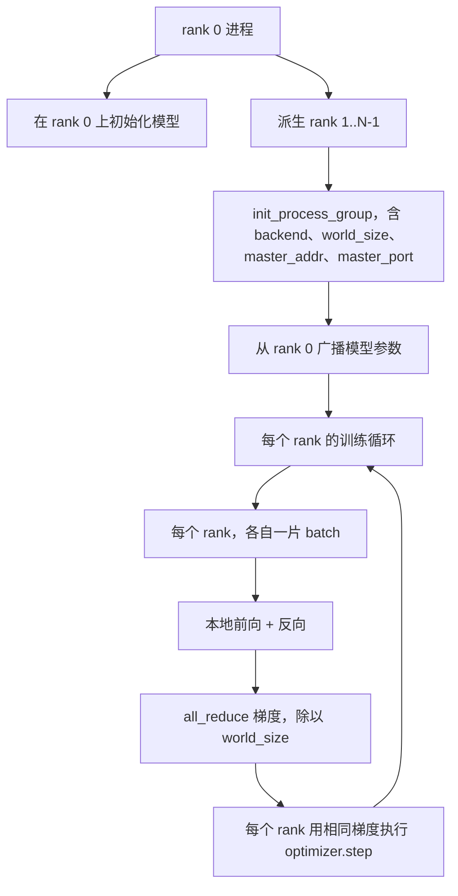
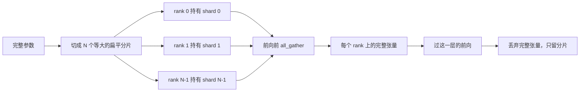

# 从零实现分布式数据并行与 FSDP

> 译注：本文译自同目录 [`en.md`](./en.md)。术语遵循仓根 [TRANSLATION_GUIDE.md](../../../../TRANSLATION_GUIDE.md)。

> 多 rank 训练就是两个集合通信加一条铁律：启动时 broadcast 参数，backward 之后 all-reduce 梯度平均，永远不允许 rank 之间对当前是哪一步产生分歧。

**Type:** Build
**Languages:** Python
**Prerequisites:** Phase 19 lessons 42 to 45
**Time:** ~90 minutes

## 学习目标（Learning Objectives）

- 用 `gloo` 后端在 N 个 rank 上拉起一个 process group，无需任何特殊硬件。
- 实现一个最小的 DDP wrapper：构造时 broadcast 参数，backward 之后 all-reduce 梯度。
- 证明逐 rank 梯度做 all-reduce 的结果，等同于把输入拼起来在单进程里算出来的梯度。
- 勾勒 FSDP 的参数 sharding（分片）：每个 rank 只持有一个切片，前向时把完整张量 gather 起来，用完即丢。

## 问题（The Problem）

模型在单设备上放得下，数据集放不下。优化预算要求你每个墙钟秒看到 N 倍的样本。第一个杠杆是数据并行：每个 rank 在 batch 的不同切片上跑相同的模型，optimizer step 之前先把梯度平均。第二个杠杆是 FSDP：模型在单设备上也放不下了，于是每个 rank 只持有每个参数的一部分，前向时一层层地把完整张量重建出来。

痛点在 bookkeeping。如果各 rank 之间参数飘了，整个 run 就会无声地损坏。如果你只平均了梯度但没平均 loss，仪表盘会撒谎。如果集合通信后端在拓扑上达不成共识，run 会永远 hang 住。解决办法是亲手把这些集合通信写一遍，绝不信任你自己复现不出来的 wrapper。

本课在 CPU 上跑。不假设你有 CUDA。`gloo` 后端随每个 PyTorch 构建发布，并且能接 `torch.multiprocessing` worker；同一份代码在多 GPU 节点上换成 `nccl` 即可，结构不变。

## 概念（The Concept）



### 真正重要的两个集合通信（The two collectives that matter）

| Collective | 作用 | 何时使用 |
|------------|------|----------|
| `broadcast` | 把一个 rank 的张量复制到所有其他 rank | 参数初始化、scheduler 状态、任何一对多同步 |
| `all_reduce` | 跨所有 rank 求和（或均值、或最大值），每个 rank 都拿到结果 | backward 之后做梯度平均 |
| `all_gather` | 每个 rank 贡献一个张量，每个 rank 都拿到拼接结果 | 收集 logits、FSDP 参数 unshard |

DDP 的契约是：构造时 `broadcast`，backward 之后 `all_reduce`。FSDP 草图在每层前向之前再加上一个 `all_gather`。

### 梯度平均等价于单进程梯度（Gradient averaging matches single-process gradient）

在 N 个 rank 上各用 B 个样本的 batch 训练出来的模型，应当与单进程在 N\*B 的 batch 上训练得到相同的梯度。窍门在于：把逐 rank 的梯度求和后除以 N，得到的就是平均 loss 的梯度，而这正是 cross entropy 用 mean reduction 在整 batch 上会算出来的东西。课程代码用 `max-abs-diff < 1e-3` 把手写 all-reduce 梯度与参考的单进程梯度做对比来断言这一点。

### FSDP 草图（FSDP sketch）



显存收益是精确的：每 rank 的参数显存降到 1/N。代价是 gather，每次前向都要付。生产级 FSDP 会把 gather 与上一层的计算 overlap 起来，因此墙钟成本远比朴素账本预测的小。本课对每个参数做完整的来回往返，并断言重建结果与原始张量按 bit 相等。

### CPU 与 gloo 后端（CPU and the gloo backend）

CUDA 是生产目标，但同一套代码路径在 CPU 上同样存在。`gloo` 是 CPU 的集合通信后端。它在 GPU 上比 `nccl` 慢几个数量级，但 API 表面是一致的。本课的 process group 用 `backend="gloo"` 初始化，rank 用 `torch.multiprocessing` 而不是 `torchrun` spawn 出来；两者最终都落在同一组 `torch.distributed` 调用上。在多 GPU 节点上，唯一要改的是 `backend="nccl"`、设备张量，以及用 `torchrun` 启动。

## 动手实现（Build It）

`code/main.py` 是可运行的产物。

### Step 1：拉起 process group（bring up the process group）

```python
os.environ["MASTER_ADDR"] = "127.0.0.1"
os.environ["MASTER_PORT"] = str(port)
dist.init_process_group(backend="gloo", rank=rank, world_size=world_size)
```

`MASTER_ADDR` 和 `MASTER_PORT` 就是 rendezvous（汇合点）：每个 rank 都拨同一台主机上的同一个端口。课程通过一个 bind-and-close 小技巧挑一个空闲端口，避免几次 run 共用一台机器时撞端口。

### Step 2：构造时 broadcast（broadcast at construction）

`MinimalDDP.__init__` 遍历每个参数和 buffer，调用 `dist.broadcast(tensor, src=0)`。rank 0 的值成为正典（canonical）初值。没有这一步，每个 rank 用自己的种子初始化，从第一步开始就会发散。

### Step 3：backward 之后 all-reduce 梯度（all-reduce gradients after backward）

```python
def all_reduce_grads_(module, world_size):
    for p in module.parameters():
        if p.grad is None:
            p.grad = torch.zeros_like(p.data)
        dist.all_reduce(p.grad.data, op=dist.ReduceOp.SUM)
        p.grad.data.div_(world_size)
```

每个 rank 最终拿到相同的平均梯度。optimizer step 在每个 rank 上现在都是相同输入的函数，这正是为什么参数能在整个 run 中保持同步。

### Step 4：证明等价性（prove the equivalence）

`manual_all_reduce_matches_single_process` 在 rank 0 上构建相同的模型，把 all-reduce 之后的梯度与单进程在拼接输入上算出来的梯度作对比。max-abs-diff 大约在 1e-8 量级。

### Step 5：FSDP 来回往返（FSDP round trip）

`fsdp_round_trip_sketch` 把每个参数 flatten，padding 到 `world_size` 的整数倍，切片，all-gather，再去 padding。每个 rank 的重建结果都等于原始张量。这就是 unshard 步骤；逆操作（前向之后 re-shard）就是从 gather 后的张量上取一个切片。

跑起来：

```bash
python3 code/main.py
```

默认 world size 是 2。两个 CPU 进程被 spawn 出来，通过 `gloo` 互相通信，然后 exit 0。输出文件 `outputs/ddp-demo.json` 记录了每个 rank 的参数和、all-reduce 之后的梯度范数、FSDP 来回往返的结果，以及手写梯度对参考梯度的差。

## 用起来（Use It）

生产级训练栈调用的就是同一组原语。PyTorch 的 `DistributedDataParallel` 额外加了：backward 后的梯度 hook 把 all-reduce 与 backward 重叠起来；bucketed all-reduce 把若干小梯度合并成一次集合通信；以及 lesson 46 用过的 `no_sync` 上下文。

PyTorch 的 FSDP 额外加了：每层一个扁平参数视图，让每个 rank 只持有一段连续 buffer；下一层的 unshard 与当前层的计算 overlap；以及对 shard 可选的 CPU offload。

形状是相同的：启动时 broadcast，backward 之后 reduce，参数装不下时 shard。

## 上线部署（Ship It）

`outputs/skill-distributed-fsdp-ddp.md` 给出一份新训练脚本的 recipe（配方）：CPU 用 `gloo`、GPU 用 `nccl` 拉起 process group；把模型包进一个 DDP 壳，构造时 broadcast、backward 之后 reduce；可选地用 FSDP 草图里的 all_gather 模式来 shard 参数。

## 练习（Exercises）

1. 用 `--world-size 4` 跑一遍，确认整个 run 中参数差异保持在 1e-3 以下。
2. 把手写平均替换为 `dist.all_reduce(op=dist.ReduceOp.AVG)`，对比一下耗时差异。
3. 给 DDP wrapper 加一个 backward 之后的 hook，让 all-reduce 与剩下的 backward overlap 起来；测墙钟提升。
4. 实现 FSDP 的 re-shard 步骤：前向之后再把完整张量替换回本地 shard。确认每 rank 显存下降。
5. 在一台 CUDA 机器上把后端切到 `nccl`。记下哪些环境变量变了、哪些没变。

## 关键术语（Key Terms）

| 术语 | 大家口头怎么说 | 它实际是什么 |
|------|----------------|--------------|
| Backend | "gloo 或 nccl" | 实现集合通信操作的库；gloo 用于 CPU，nccl 用于 GPU |
| World size | "rank 总数" | group 中的进程数；group 是集合通信操作的作用单位 |
| Rank | "worker id" | group 内的进程标识，从 0 开始编号 |
| All-reduce | "把梯度求和" | 跨所有 rank 求和，每个 rank 最终都拿到相同结果 |
| Unshard | "把参数 gather 回来" | 通过 all_gather 从逐 rank 切片重建出完整张量 |

## 延伸阅读（Further Reading）

- PyTorch `torch.distributed` 文档，本课依赖的集合通信语义都在这里。
- `gloo` 库的集合通信清单，形状上与 CUDA 背景的 `nccl` 原语完全一致。
- Phase 19 lesson 46，把 DDP 的 all-reduce 包进 `no_sync` 的梯度累积模式。
- Phase 19 lesson 47，在 DDP 与 FSDP run 中都能存活下来的 checkpoint 布局。
- PyTorch FSDP 文档，本课草图所对应的参数 sharding 的生产级实现。
