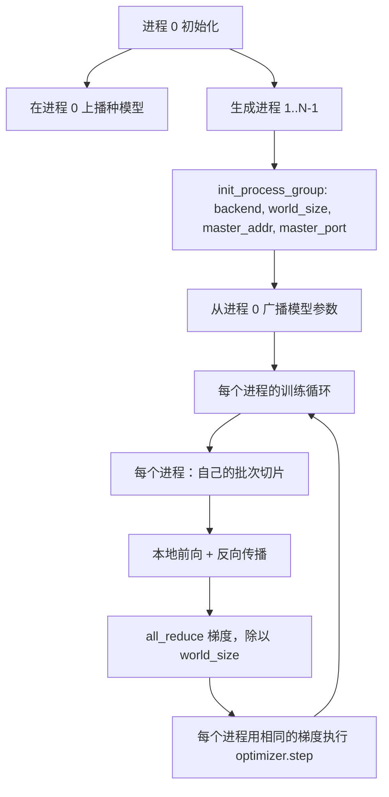
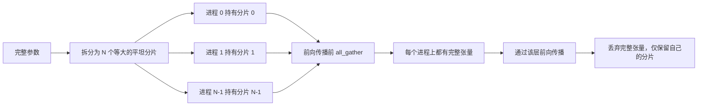

# 从零实现分布式数据并行与 FSDP

> 多进程训练的本质是两个集合通信操作和一条规则：启动时广播参数，反向传播后对梯度求平均，绝不允许各进程在所处步骤上产生分歧。

**类型：** 构建
**语言：** Python
**前置要求：** 阶段 19 第 42–45 课
**时长：** ~90 分钟

## 学习目标

- 使用 `gloo` 后端在 N 个进程中拉起一个进程组，无需特殊硬件。
- 实现一个极简 DDP 封装器：构造时广播参数，反向传播后对梯度执行 all-reduce。
- 证明各进程梯度的 all-reduce 结果与单进程在拼接后的输入上计算的梯度一致。
- 勾勒 FSDP 参数分片方案：每个进程持有一个切片，前向传播时收集完整张量，之后丢弃。

## 问题

模型可以放在单台设备上，但数据集放不下。优化预算要求每个墙钟秒看到 N 倍的样本。第一个杠杆是数据并行：每个进程在批次的不同切片上运行同一个模型，然后在优化器步骤之前对梯度求平均。第二个杠杆是 FSDP：模型也无法放在单台设备上，因此每个进程持有每个参数的一部分，在前向传播中逐层重建完整的张量。

痛点在于簿记。如果参数在不同进程间漂移，运行结果会悄然损坏。如果只对梯度求平均而不对损失求平均，仪表盘就会撒谎。如果集合通信后端无法协商拓扑，运行会永远挂起。解决方案是亲手实现一次集合通信，绝不信任任何你无法复现的封装器。

本课在 CPU 上运行，不假设 CUDA。`gloo` 后端随每个 PyTorch 构建一同提供，并支持 `torch.multiprocessing` 工作进程；同一份代码切换到多 GPU 节点上的 `nccl` 时，无需改变结构。

## 概念


```mermaid
flowchart TB
  init[进程 0 初始化] --> seed[在进程 0 上播种模型]
  init --> spawn[生成进程 1..N-1]
  spawn --> pg[init_process_group: backend, world_size, master_addr, master_port]
  pg --> bcast[从进程 0 广播模型参数]
  bcast --> loop[每个进程的训练循环]
  loop --> shard[每个进程：自己的批次切片]
  shard --> fwd[本地前向 + 反向传播]
  fwd --> ar[all_reduce 梯度，除以 world_size]
  ar --> step[每个进程用相同的梯度执行 optimizer.step]
  step --> loop
```

### 两个重要的集合通信操作

| 集合操作 | 作用 | 时机 |
|----------|------|------|
| `broadcast` | 将一个张量从一个进程复制到所有其他进程 | 参数初始化、调度器状态、任何一对多的同步 |
| `all_reduce` | 对所有进程的张量求和（或求均值、最大值），每个进程都获得结果 | 反向传播后的梯度平均 |
| `all_gather` | 每个进程贡献一个张量，每个进程获得拼接后的结果 | 逻辑收集、FSDP 参数去分片 |

DDP 的约定是在构造时执行 `broadcast`，在反向传播后执行 `all_reduce`。FSDP 草图在每个层的前向传播之前增加了 `all_gather`。

### 梯度平均与单进程梯度一致

在 N 个进程上对 B 个样本的批次进行训练的模型，必须产生与单进程在 N*B 规模批次上训练相同的梯度。关键在于，将各个进程的梯度求和并除以 N，得到的是平均损失梯度，这与使用均值归约的交叉熵在整个批次上产生的结果相同。本课代码通过 `max-abs-diff < 1e-3` 来断言手动 all-reduce 梯度与参考的单进程梯度之间的差异。

### FSDP 草图


```mermaid
flowchart LR
  param[完整参数] --> split[拆分为 N 个等大的平坦分片]
  split --> r0[进程 0 持有分片 0]
  split --> r1[进程 1 持有分片 1]
  split --> rN[进程 N-1 持有分片 N-1]
  r0 --> gather[前向传播前 all_gather]
  r1 --> gather
  rN --> gather
  gather --> full[每个进程上都有完整张量]
  full --> fwd[通过该层前向传播]
  fwd --> drop[丢弃完整张量，仅保留自己的分片]
```

内存收益是精确的：每个进程的参数内存降至 1/N。代价是每次前向传播都要执行 gather。生产环境中的 FSDP 会将 gather 与上一层的计算重叠，因此墙钟成本远小于朴素估算。本课对每个参数执行一次往返，并断言重建结果与原参数逐位相等。

### CPU 与 gloo 后端

CUDA 是生产环境的目标，但同样的代码路径在 CPU 上也存在。`gloo` 是 CPU 集合通信后端，比 GPU 上的 `nccl` 慢数个数量级，但 API 接口完全相同。本课的进程组使用 `backend="gloo"` 初始化，进程通过 `torch.multiprocessing` 而非 `torchrun` 生成；两者最终都调用相同的 `torch.distributed` 接口。在多 GPU 节点上，只需将 `backend` 改为 `"nccl"`、使用设备张量、并改用 `torchrun` 启动即可。

## 构建

`code/main.py` 是可运行的产物。

### 步骤 1：拉起进程组

```python
os.environ["MASTER_ADDR"] = "127.0.0.1"
os.environ["MASTER_PORT"] = str(port)
dist.init_process_group(backend="gloo", rank=rank, world_size=world_size)
```

`MASTER_ADDR` 和 `MASTER_PORT` 是汇合点：每个进程都拨入同一台主机上的同一个端口。本课通过绑定再释放的技巧选取一个空闲端口，以避免多个运行实例在同一台机器上产生冲突。

### 步骤 2：构造时广播

`MinimalDDP.__init__` 遍历每个参数和缓冲区，并调用 `dist.broadcast(tensor, src=0)`。进程 0 上的值成为标准初始值。没有这一步，每个进程会用自己的种子初始化，从而导致各进程从第一步就开始发散。

### 步骤 3：反向传播后 all-reduce 梯度

```python
def all_reduce_grads_(module, world_size):
    for p in module.parameters():
        if p.grad is None:
            p.grad = torch.zeros_like(p.data)
        dist.all_reduce(p.grad.data, op=dist.ReduceOp.SUM)
        p.grad.data.div_(world_size)
```

每个进程最终获得相同的平均梯度。现在优化器步骤在每个进程上都是基于相同的输入进行，这也是参数在整个运行过程中保持同步的原因。

### 步骤 4：证明等价性

`manual_all_reduce_matches_single_process` 在进程 0 上构建同样的模型，并将 all-reduce 后的梯度与单进程在拼接后的输入上计算的梯度进行比较。最大绝对差值约为 1e-8。

### 步骤 5：FSDP 往返

`fsdp_round_trip_sketch` 将每个参数展平，填充到 `world_size` 的整数倍，切片，执行 all_gather，然后去除填充。每个进程的重建结果都与原始参数一致。这是去分片步骤；其逆操作（前向传播后重新分片）就是从收集到的张量中切出一个切片。

运行：

```bash
python3 code/main.py
```

默认 world_size 为 2。两个 CPU 进程生成，通过 `gloo` 相互通信，并正常退出。输出文件 `outputs/ddp-demo.json` 记录了每个进程的参数和、all-reduce 后的梯度范数、FSDP 往返结果以及手动梯度与参考梯度的差异。

## 使用

生产环境中的训练栈调用的是相同的原语。PyTorch 的 `DistributedDataParallel` 额外提供了：将 all-reduce 与反向传播重叠的反向传播后梯度钩子、将多个小梯度合并为一个集合通信操作的桶式 all-reduce，以及第 46 课用过的 `no_sync` 上下文。

PyTorch 的 FSDP 额外提供了：每层的平坦参数视图（每个进程持有一个连续的缓冲区）、下一层去分片与当前层计算的交叠，以及可选的分片 CPU 卸载。

基本模式保持不变：启动时广播，反向传播后归约，参数放不下时分片。

## 交付

`outputs/skill-distributed-fsdp-ddp.md` 包含了新训练脚本的配方：使用 `gloo`（CPU）或 `nccl`（GPU）拉起进程组，将模型封装在构造时广播、反向传播后归约的 DDP 外壳中，并可选地使用 FSDP 草图中的 all_gather 模式对参数进行分片。

## 练习

1. 使用 `--world-size 4` 运行，确认参数分散度在整个运行过程中保持在 1e-3 以下。
2. 将手动平均替换为 `dist.all_reduce(op=dist.ReduceOp.AVG)`，并计时比较差异。
3. 在 DDP 封装器中添加一个反向传播后钩子，使 all-reduce 与反向传播的其余部分重叠；测量墙钟时间改进。
4. 实现 FSDP 重新分片步骤：前向传播后，将完整张量替换回本地分片。确认每个进程的内存占用下降。
5. 在 CUDA 机器上将后端切换为 `nccl`。注意哪些环境变量发生变化，哪些保持不变。

## 关键术语

| 术语 | 人们常说的 | 实际含义 |
|------|-----------|---------|
| 后端 | "gloo 或 nccl" | 实现集合操作的库；gloo 用于 CPU，nccl 用于 GPU |
| World size | "总进程数" | 组内的进程数量；组是集合操作的作用单位 |
| Rank | "工作进程 ID" | 组内的进程标识符，从 0 开始编号 |
| All-reduce | "对梯度求和" | 对所有进程的张量求和，每个进程最终得到相同的结果 |
| 去分片 | "收集参数" | 通过 all_gather 从各进程的分片重建完整张量 |

## 延伸阅读

- PyTorch `torch.distributed` 文档，了解本课所依赖的集合通信语义。
- `gloo` 库的集合操作列表，其形式与基于 CUDA 的 `nccl` 原语完全相同。
- 阶段 19 第 46 课，了解将 DDP all-reduce 包裹在 `no_sync` 中的梯度累积模式。
- 阶段 19 第 47 课，了解能兼容 DDP 和 FSDP 运行的检查点布局。
- PyTorch FSDP 文档，了解本课所勾勒的参数分片方案的生产实现。
