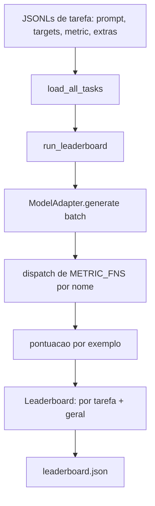
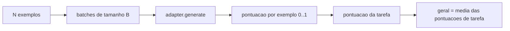

# Aula 49: Harness de Avaliacao de Modelos de Linguagem

> Um modelo que vai bem em uma tarefa que voce nao consegue definir e um modelo que vai bem por acidente. O harness e a definicao da tarefa, a metrica, o executor, e o leaderboard, em uma forma curta e trocavel.

**Tipo:** Build
**Linguagens:** Python
**Prerequisitos:** Aulas 42 a 45 da Fase 19
**Tempo:** ~90 minutos

## Objetivos de Aprendizado

- Definir uma tarefa como um arquivo JSONL com `prompt`, `targets`, `metric`, e `extras` opcionais por exemplo.
- Implementar cinco metricas: exact match, rouge-l F1, verificacao executavel, multipla escolha, e substring contains.
- Construir um executor que agrupa exemplos por tarefa e despacha para um adaptador de modelo trocavel.
- Emitir um ranking JSON com pontuacoes por tarefa, latencia, e uma media geral reproduzivel.

## O Problema

Um novo modelo de linguagem aparece toda semana. O pitch de marketing e que ele vai bem. A questao honesta e: bem em que? A resposta honesta e o ranking que voce mesmo escreveu, porque o ranking do vendedor e o que ele sintonizou.

Sem um harness no seu repo voce compara dois modelos por feeling. Com um harness voce compara eles por pontuacao em um conjunto fixo de tarefas com uma metrica fixa, em um output JSON que voce pode diffar. O harness e o contrato entre a execucao de ontem e a de hoje. Sem ele, regressoes sao publicadas.

A armadilha e sobreajustar o harness a um unico modelo. A solucao e a mesma armadilha ao inverso: o harness e pequeno o suficiente para ler em quinze minutos, as tarefas sao pequenas o suficiente para mandar no repo, as metricas sao escritas do zero para que um colega possa audita-las, e o adaptador e o unico lugar onde codigo eespecificaçãoifico de modelo vive. Troque o adaptador, o ranking muda; troque as tarefas, o ranking muda. Nada mais deve mudar.

## O Conceito



### Eespecificaçãoificacao da tarefa

Cada exemplo e uma linha JSONL:

```json
{"id": "arith-00", "prompt": "compute: 2 + 2", "targets": ["4"], "metric": "exact_match"}
```

Para metricas que precisam de auxiliares de pontuacao, `extras` carrega o payload lateral:

```json
{
  "id": "code-00",
  "prompt": "python: write a function f that doubles its input",
  "targets": ["ok"],
  "metric": "code_exec",
  "extras": {"io_pairs": [[1, 2], [3, 6]]}
}
```

Uma tarefa e um arquivo `.jsonl` sob `outputs/tasks/`. O nome do arquivo e o nome da tarefa. Todos os exemplos em um arquivo compartilham uma metrica.

### As cinco tarefas fixture

| Tarefa | Metrica | O que testa |
|--------|---------|-------------|
| arithmetic | exact_match | Corretores a nivel de token em uma resposta deterministica |
| summary | rouge_l | F1 de subcomum sequencia mais longa contra um resumo de referencia de uma linha |
| code-exec | code_exec | Teste executavel: a funcao predita deve satisfazer um par de entrada-saida |
| multiple-choice | multiple_choice | A primeira letra da predicao deve bater com uma letra permitida |
| generation | substring_contains | Texto de forma livre deve conter pelo menos uma substring alvo |

### O contrato da metrica

Cada metrica e uma funcao `(prediction, targets, extras) -> float em [0.0, 1.0]`. O harness media as pontuacoes por exemplo para obter uma pontuacao de tarefa, e depois media as pontuacoes de tarefa para obter a geral. As funcoes de metrica sao minusculas:

- `exact_match`: lowercase, colapsar espacos, igualdade.
- `substring_contains`: mesma normalizacao, teste de substring.
- `multiple_choice`: primeiro caractere em maiuscula.
- `rouge_l`: comprimento de LCS dividido por comprimentos de predicao e referencia, F1 de precisao e recall.
- `code_exec`: executar a predicao em um namespace restrito, chamar `f(x)` em cada par entrada-saida, contar correspondencias.

A metrica code_exec roda a predicao em um namespace de builtins estripos. O teste da aula afirma que `import os` explode porque `os` nao esta no namespace; voce nao consegue acessar o sistema de arquivos a partir de uma predicao de codigo.

### O adaptador de modelo

```python
class ModelAdapter(Protocol):
    def generate(self, prompts: Sequence[str]) -> List[str]: ...
    @property
    def name(self) -> str: ...
```

O adaptador e a junta. A aula entrega `ToyAdapter`, um combinador de padroes deterministico que retorna a resposta certa para cada prompt nas cinco tarefas fixture. Um adaptador real chama o modelo e retorna seu output. O harness nao se importa com qual.

### O executor

`run_task` agrupa `batch_size` prompts por vez e despacha para a funcao de metrica. `run_leaderboard` caminha cada tarefa e media. `write_leaderboard` emite JSON com uma string de schema para que mudancas futuras de formato nao quebrem dashboards silenciosamente.



## Construa

`code/main.py` e o artefato executavel.

### Passo 1: sementear tarefas fixture

`seed_fixture_tasks(target_dir)` escreve os cinco arquivos `.jsonl`. A primeira execucao de `main.py` os sementeia quando o diretorio esta vazio.

### Passo 2: carregar tarefas

`load_all_tasks(task_dir)` le cada `.jsonl` e retorna um dict de nome da tarefa para uma lista de registros `Example`. Linhas de comentario comecando com `#` e linhas vazias sao puladas para que colaboradores possam anotar os arquivos.

### Passo 3: implementar metricas

Cada metrica e uma funcao pequena com um teste unitario. A suíte de testes da aula inclui 13 casos cobrindo normalizacao, sobreposicao parcial, execucao de codigo, e rejeicao de codigo inseguro.

### Passo 4: escrever o executor

`run_task` itera batches e produz um `TaskResult` com pontuacao, contagem de acertos, contagem total, e latencia. `run_leaderboard` caminha todas as tarefas e produz um `Leaderboard` com a media geral.

### Passo 5: emitir JSON

`write_leaderboard` serializa o board. O flag `--include-per-example` despeja os registros por exemplo para que voce possa diffar predicoes com a execucao anterior quando as pontuacoes mudam.

Execute:

```bash
python3 code/main.py
```

O script sementeia os fixtures na primeira execucao, pontua com o adaptador de brinquedo (que acerta todos os fixtures), e escreve `outputs/leaderboard.json`. Pontuacao geral e 1.0 com o adaptador de brinquedo; o teste do adaptador stub em `test_main.py` mostra que o mesmo harness produz 0.0 quando o adaptador nao consegue responder.

## Use

Para conectar um modelo real, escreva um adaptador. A forma:

```python
class HttpAdapter:
    name = "vendor.v1"

    def __init__(self, endpoint, api_key):
        self.endpoint = endpoint
        self.api_key = api_key

    def generate(self, prompts):
        out = []
        for prompt in prompts:
            response = http_post(self.endpoint, prompt, self.api_key)
            out.append(response["text"])
        return out
```

Troque `ToyAdapter` por `HttpAdapter` no topo de `main()`. O harness, as tarefas, as metricas, e o ranking ficam iguais.

Tres padroes para impor ao entregar o harness em um projeto real:

- **Fixar os arquivos de tarefa.** O leaderboard.json carrega conteudo de tarefa fixado por hash ou carrega os JSONLs ao lado; caso contrario a pontuacao muda quando o arquivo de tarefa muda, e voce nao consegue dizer qual.
- **Difar predicoes, nao apenas pontuacoes.** O flag `--include-per-example` deixa voce ver o que o modelo disse no dia que a pontuacao caiu.
- **Limitar o tamanho do batch.** Adaptadores reais tem limites de taxa. Um batch pequeno mantem o harness compativel entre vendedores.

## Entregue

`outputs/skill-lm-eval-harness.md` carrega a receita: eespecificaçãoificacao de tarefa JSONL, cinco metricas, adaptador trocavel, executor em batches, ranking JSON com string de schema. Os arquivos de tarefa em `outputs/tasks/` sao os fixtures; copie-os para um projeto real como iniciadores.

## Exercicios

1. Adicionar uma sexta tarefa com uma metrica customizada que voce escreve do zero (overlap tipo BLEU, pontuacao de referencia tipo BLEURT, qualquer coisa com um contrato claro).
2. Estender `code_exec` para capturar stdout e aceitar uma lista de stdouts esperados como targets.
3. Adicionar um comando de diff de leaderboard: dadas duas versoes `leaderboard.json`, imprimir quais tarefas mudaram e em quanto.
4. Limitar a latencia por exemplo. Envolver a chamada do adaptador em um timeout; mostrar uma coluna separada `timeouts` no leaderboard.
5. Fixar o conteudo das tarefas com um sha256 no ranking para que um leitor futuro possa verificar que pontuaram as mesmas tarefas.

## Termos Chave

| Termo | O que as pessoas dizem | O que realmente significa |
|-------|------------------------|---------------------------|
| Eespecificaçãoificacao de tarefa | "O formato de eval" | Arquivo JSONL com prompt, targets, metric, extras opcionais por exemplo |
| Metrica | "Como voce pontua" | Funcao de (prediction, targets, extras) para um float em [0, 1] |
| Adaptador | "O cliente do modelo" | Objeto com um metodo generate(prompts) -> list[str]; o unico codigo eespecificaçãoifico de modelo |
| Leaderboard | "O placar" | JSON com pontuacoes por tarefa, contagens totais, latencia, e uma media geral |
| Metrica code exec | "Rodar e checar" | Executar a predicao em um namespace restrito, comparar contra pares entrada-saida |

## Leitura Adicional

- O lm-eval-harness original para a referencia em producao, muito maior mas a mesma forma.
- lighteval da HuggingFace para uma implementacao alternativa do mesmo contrato.
- Aula 46 da Fase 19 cobre os padroes de acumulacao de gradiente usados na stack de treinamento que o harness pontua.
- Aula 47 da Fase 19 cobre o formato de checkpoint que voce pontua; fixe o hash do checkpoint no leaderboard.
- Aula 48 da Fase 19 cobre a stack de treinamento distribuido que produziu o modelo em teste.
