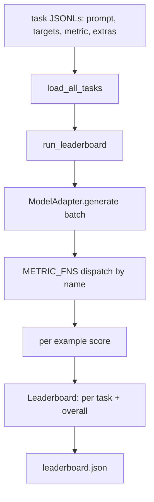
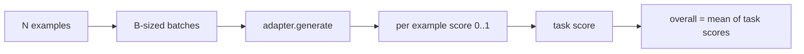

# Dil Modeli Değerlendirme Takımı

> Tanımlayamadığınız bir görevde başarılı olan bir model, tesadüfen başarılı olan bir modeldir. Koşum takımı, kısa, değiştirilebilir tek bir biçimde görev tanımı, ölçü, koşucu ve skor tablosudur.

**Tür:** Yapım
**Diller:** Python
**Önkoşullar:** Aşama 19 dersleri 42 - 45
**Süre:** ~90 dakika

## Öğrenme Hedefleri

- Bir görevi örnek olarak `prompt`, `targets`, `metric` ve isteğe bağlı `extras` ile JSONL dosyası olarak tanımlayın.
- Beş ölçüm uygulayın: tam eşleşme, rouge-l F1, çalıştırılabilir kontrol, çoktan seçmeli ve alt dize içerir.
- Örnekleri görev başına gruplayan ve değiştirilebilir bir model bağdaştırıcısına gönderen bir çalıştırıcı oluşturun.
- Görev başına puanları, gecikmeyi ve tekrarlanabilir genel ortalamayı içeren bir lider tablosu JSON yayınlayın.

## Sorun

Her hafta yeni bir dil modeli çıkıyor. Pazarlama iddiası iyi sonuç verdiği yönünde. Dürüst soru şu: peki ne? Dürüst cevap, kendi yazdığınız liderlik tablosudur, çünkü satıcının liderlik tablosu onların ayarladığı liderlik tablosudur.

Deponuzda bir koşum takımı olmadan, iki modeli titreşimlere göre karşılaştırırsınız. Bir koşum takımıyla bunları sabit bir ölçümle sabit bir görev setindeki puana göre karşılaştırırsınız, bir JSON çıkışında farkı belirleyebilirsiniz. Koşum takımı, dünkü koşu ile bugünkü koşu arasındaki sözleşmedir. Bu olmadan gerilemeler devam eder.

Tuzak, emniyet kemerini tek bir modele gereğinden fazla takıyor. Düzeltme aynı tuzağın tersidir: koşum takımı on beş dakikada okunabilecek kadar küçüktür, görevler depoya gönderilecek kadar küçüktür, ölçümler bir meslektaşın onları denetleyebilmesi için sıfırdan yazılır ve bağdaştırıcı modele özgü kodun yaşadığı tek yerdir. Adaptörü değiştirin, skor tablosu hareket eder; görevleri değiştirin, liderlik tablosu hareket eder. Başka hiçbir şey hareket etmemeli.

## Konsept



### Görev spesifikasyonu

Her örnek bir JSONL satırıdır:

```json
{"id": "arith-00", "prompt": "compute: 2 + 2", "targets": ["4"], "metric": "exact_match"}
```

Puanlama yardımcılarına ihtiyaç duyan metrikler için yan yükü `extras` taşır:

```json
{
  "id": "code-00",
  "prompt": "python: write a function f that doubles its input",
  "targets": ["ok"],
  "metric": "code_exec",
  "extras": {"io_pairs": [[1, 2], [3, 6]]}
}
```

Görev, `outputs/tasks/` altındaki bir `.jsonl` dosyasıdır. Dosya adı görev adıdır. Bir dosyadaki tüm örnekler bir metriği paylaşır.

### Beş fikstür görevi

| Görev | Metrik | Neyi test ediyor |
|------|--------|---------------|
| aritmetik | tam_eşleşme | Deterministik bir yanıtta Token düzeyindeki doğruluk |
| özet | allık_l | Tek satırlık referans özetine karşı en uzun ortak alt dizi F1 |
| kod yürütme | code_exec | Yürütülebilir test: tahmin edilen işlev, giriş-çıkış çiftlerinin bir listesini karşılamalıdır |
| çoktan seçmeli | çoktan seçmeli | Tahminin ilk harfi izin verilen bir harfle eşleşmelidir |
| nesil | substring_contains | Serbest biçimli metin en az bir hedef alt dize içermelidir |

### Metrik sözleşme

Her metrik `(prediction, targets, extras) -> float in [0.0, 1.0]`'dan bir fonksiyondur. Koşum, bir görev puanı elde etmek için örnek başına puanların ortalamasını alır, ardından genel puanı elde etmek için görev puanlarının ortalamasını alır. Metrik fonksiyonlar küçüktür:

- `exact_match`: küçük harf, boşlukları daralt, eşitlik.
- `substring_contains`: aynı normalleştirme, alt dize testi.
- `multiple_choice`: ilk karakter büyük harfle yazılmıştır.
- `rouge_l`: LCS uzunluğunun tahmin ve referans uzunluklarına bölümü, F1 hassasiyet ve geri çağırma.
- `code_exec`: tahmini sınırlı bir ad alanında yürütün, her giriş-çıkış çiftinde `f(x)` 'yi çağırın, eşleşmeleri sayın.

Code_exec metriği, öngörüyü çıkarılmış bir yerleşik ad alanında çalıştırır. Dersin testi, `import os` 'nin patladığını çünkü `os` 'nin ad alanında olmadığını öne sürüyor; dosya sistemine kod tahmininden ulaşamazsınız.

### Model adaptörü

```python
class ModelAdapter(Protocol):
    def generate(self, prompts: Sequence[str]) -> List[str]: ...
    @property
    def name(self) -> str: ...
```

Adaptör dikiştir. Ders, beş fikstür görevindeki her prompt için doğru cevabı döndüren deterministik bir model eşleştirici olan `ToyAdapter`'yi gönderir. Gerçek bir bağdaştırıcı modeli çağırır ve çıktısını döndürür. Koşumun hangisi olduğu umurunda değil.

### Koşucu

`run_task` , bir seferde `batch_size` prompt'lari toplu olarak toplar ve metrik işlevine gönderir. `run_leaderboard` her görevi yürütür ve ortalamaları alır. `write_leaderboard` bir şema dizesi ile JSON yayınlar, böylece gelecekteki biçim değişiklikleri kontrol panellerini sessizce bozmaz.



```figure
eval-harness-matrix
```

## Build It — Kendin Geliştir

`code/main.py` çalıştırılabilir artifact'dır.

### Adım 1: başlangıç ​​fikstürü görevleri

`seed_fixture_tasks(target_dir)` beş `.jsonl` dosyasını yazar. `main.py` 'nin ilk çalıştırması, dizin boş olduğunda onları tohumlar.

### 2. Adım: görevleri yükleyin

`load_all_tasks(task_dir)` her `.jsonl` 'yi okur ve görev adından bir `Example` kayıt listesine bir dikte döndürür. Katkıda bulunanların dosyalara açıklama ekleyebilmesi için `#` ile başlayan yorum satırları ve boş satırlar atlanır.

### 3. Adım: metrikleri uygulayın

Her metrik, birim testi olan küçük bir fonksiyondur. Dersin test paketi normalleştirme, kısmi örtüşme, kod yürütme ve güvenli olmayan kod reddini kapsayan 13 vakayı içermektedir.

### Adım 4: koşucuyu yazın

`run_task` , grupları yineler ve puan, doğru sayım, toplam sayım ve gecikme süresiyle birlikte bir `TaskResult` üretir. `run_leaderboard` tüm görevleri yürütür ve genel ortalamayla bir `Leaderboard` üretir.

### Adım 5: JSON'u yayınlayın

`write_leaderboard` kartı serileştirir. `--include-per-example` bayrağı örnek başına kayıtları döker, böylece puanlar hareket ettiğinde tahminleri önceki çalıştırmaya göre farklılaştırabilirsiniz.

Çalıştır:

```bash
python3 code/main.py
```

Komut dosyası, fikstürleri ilk çalıştırmada tohumlar, oyuncak adaptörüyle puanlar (bu, her fikstürü doğru yapar) ve `outputs/leaderboard.json` yazar. Oyuncak adaptörüyle genel puan 1,0; `test_main.py` 'deki saplama adaptör testi, adaptör yanıt veremediğinde aynı kablo demetinin 0,0 ürettiğini gösteriyor.

## Use It — Hazır Araçla Uygula

Gerçek bir modeli takmak için bir adaptör yazın. Şekil:

```python
class HttpAdapter:
    name = "vendor.v1"

    def __init__(self, endpoint, api_key):
        self.endpoint = endpoint
        self.api_key = api_key

    def generate(self, prompts):
        out = []
        for prompt in prompts:
            response = http_post(self.endpoint, prompt, self.api_key)
            out.append(response["text"])
        return out
```

`ToyAdapter` 'yi `main()`'nin üst kısmındaki `HttpAdapter` ile değiştirin. Koşum takımı, görevler, ölçümler ve liderlik tablosu aynı kalıyor.

Gerçek bir projede emniyet kemerini naklederken uygulanması gereken üç model:

- **Görev dosyalarını sabitleyin.** leaderboard.json karma sabitlenmiş görev içeriğini taşır veya JSONL'leri yanında taşır; aksi halde puan, görev dosyası hareket ettiğinde hareket eder ve hangisi olduğunu bilemezsiniz.
- **Sadece puanlar değil, fark tahminleri.** `--include-per-example` bayrağı, puanın düştüğü gün modelin ne söylediğini görmenizi sağlar.
- **Toplu iş boyutunu sınırlayın.** Gerçek adaptörlerin hız sınırları vardır. Küçük parti boyutu, koşumun satıcılar arasında uyumlu olmasını sağlar.

## Ship It — Kullanıma Sun

`outputs/skill-lm-eval-harness.md` şu tarifi taşır: JSONL görev spesifikasyonu, beş ölçüm, değiştirilebilir adaptör, toplu çalıştırıcı, şema dizesi ile lider tablosu JSON. `outputs/tasks/` 'deki görev dosyaları demirbaşlardır; bunları başlangıç ​​olarak gerçek bir projeye kopyalayın.

## Egzersizler

1. Sıfırdan yazdığınız özel bir ölçümle altıncı bir görev ekleyin (BLEU benzeri örtüşme, BLEURT benzeri referans puanlaması, açık bir sözleşmeye sahip herhangi bir şey).
2. Stdout'u yakalamak ve beklenen stdout'ların listesini hedef olarak kabul etmek için `code_exec` 'yi genişletin.
3. Skor tablosu diff komutu ekleyin: iki `leaderboard.json` dosyası verildiğinde, hangi görevlerin ne kadar taşındığını yazdırın.
4. Örnek başına gecikme süresini sınırlayın. Bağdaştırıcı çağrısını zaman aşımına uğratın; skor tablosunda ayrı bir `timeouts` sütunu gösterin.
5. Gelecekteki bir okuyucunun aynı görevleri puanladığını doğrulayabilmesi için görev içeriğini liderlik tablosuna sha256 ile sabitleyin.

## Anahtar Terimler

| Dönem | İnsanlar ne diyor | Aslında ne anlama geliyor |
|------|-----------------|------------------------|
| Görev spesifikasyonu | "Değerlendirme biçimi" | prompt, hedefler, metrik, örnek başına isteğe bağlı ekstralar içeren JSONL dosyası |
| Metrik | "Nasıl puan alırsınız" | (Tahmin, hedefler, ekstralar)'dan [0, 1]'deki kayan noktaya kadar işlev |
| Adaptör | "Model istemcisi" | created(prompts) -> list[str] yöntemine sahip nesne; modele özel tek kod |
| Skor Tablosu | "Skor tablosu" | Görev başına puanlar, toplam sayımlar, gecikme süresi ve genel ortalamayla birlikte JSON |
| Kod yürütme ölçüsü | "Çalıştırın ve kontrol edin" | Tahmini kısıtlı bir ad alanında yürütün, giriş-çıkış çiftleriyle karşılaştırın |

## Daha Fazla Okuma

- Üretim referansı için orijinal lm-değerlendirme koşum takımı, çok daha büyük ama aynı şekilde.
- Aynı sözleşmenin alternatif bir uygulaması için HuggingFace'in hafifletilmesi.
- Aşama 19 ders 46, koşum takımı puanlarının eğitim yığınında kullanılan gradient birikim modellerini kapsar.
- Aşama 19 ders 47, puanladığınız kontrol noktası formatını kapsar; Kontrol noktası karmasını skor tablosuna sabitleyin.
- Aşama 19 ders 48, test edilen modeli üreten dağıtılmış eğitim yığınını kapsar.
