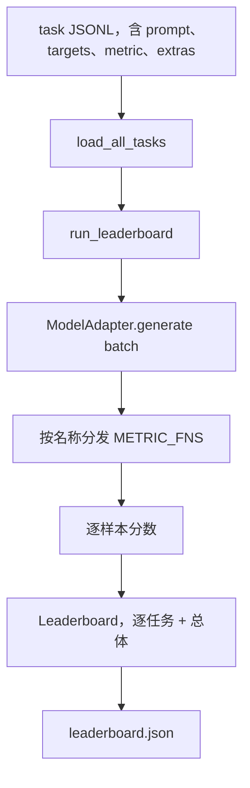
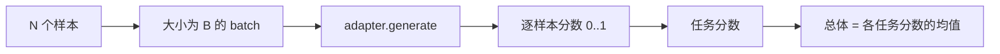

# 语言模型评测框架（Language Model Evaluation Harness）

> 译注：本文译自同目录 [`en.md`](./en.md)。术语遵循仓根 [TRANSLATION_GUIDE.md](../../../../TRANSLATION_GUIDE.md)。

> 一个在你都没法定义的任务上表现好的模型，只是碰巧表现好而已。这套 harness（评测框架）把任务定义、指标、运行器、排行榜揉成一个简短、可替换的形状。

**Type:** Build
**Languages:** Python
**Prerequisites:** Phase 19 lessons 42 to 45
**Time:** ~90 minutes

## 学习目标（Learning Objectives）

- 把一个任务定义成一份 JSONL 文件，每条样本包含 `prompt`、`targets`、`metric`，以及可选的 `extras`。
- 实现五种 metric（指标）：exact match、rouge-l F1、可执行检查、多选题（multiple choice）、子串包含（substring contains）。
- 写一个 runner（运行器），按任务分 batch 执行样本，并 dispatch 到一个可替换的模型 adapter。
- 输出一份 leaderboard（排行榜）JSON：包含每个任务的分数、延迟，以及一个可复现的整体平均分。

## 问题（The Problem）

每周都有新的语言模型发布。它们的市场宣传都说自己表现优秀。但诚实的问题是：在什么任务上表现好？诚实的回答是你自己写的那张排行榜——因为厂商的排行榜是他们针对自己调过的。

如果你的仓库里没有 harness，比较两个模型只能凭感觉。有了 harness，你就可以在固定的任务集上、用固定的 metric、生成可 diff 的 JSON 输出来对比。Harness 是昨天的运行结果和今天的运行结果之间的契约。没有它，回归就会被发布出去。

陷阱在于把 harness 过拟合到某一个模型。解法是反过来的同一个陷阱：harness 小到 15 分钟就能读完，任务小到能直接放进仓库，metric 都是从零写出来的方便同事审计，model 相关的代码只活在 adapter 一处。换 adapter，排行榜会变；换任务，排行榜也会变。除此之外，什么都不该变。

## 概念（The Concept）



### 任务格式（Task spec）

每条样本就是一行 JSONL：

```json
{"id": "arith-00", "prompt": "compute: 2 + 2", "targets": ["4"], "metric": "exact_match"}
```

对那些需要打分辅助信息的 metric，`extras` 字段用来携带附带 payload：

```json
{
  "id": "code-00",
  "prompt": "python: write a function f that doubles its input",
  "targets": ["ok"],
  "metric": "code_exec",
  "extras": {"io_pairs": [[1, 2], [3, 6]]}
}
```

一个任务就是 `outputs/tasks/` 下的一个 `.jsonl` 文件。文件名就是任务名。同一个文件里所有样本共用一个 metric。

### 五个 fixture 任务

| 任务 | Metric | 测试什么 |
|------|--------|---------------|
| arithmetic | exact_match | 在确定性答案上的 token 级别正确性 |
| summary | rouge_l | 与一行参考摘要之间的最长公共子序列 F1 |
| code-exec | code_exec | 可执行测试：预测出的函数必须满足一组输入-输出对 |
| multiple-choice | multiple_choice | 预测的首字母必须匹配某个允许的字母 |
| generation | substring_contains | 自由文本必须至少包含一个目标子串 |

### Metric 契约

每个 metric 都是一个 `(prediction, targets, extras) -> float in [0.0, 1.0]` 的函数。Harness 把每条样本的分数平均起来得到任务分数，再把任务分数平均起来得到整体分数。Metric 函数都很小：

- `exact_match`：转小写、压缩空白、判等。
- `substring_contains`：同样的归一化，做子串测试。
- `multiple_choice`：首字符转大写。
- `rouge_l`：LCS 长度分别除以预测长度和参考长度，再算 precision 和 recall 的 F1。
- `code_exec`：在受限命名空间里执行预测代码，对每个输入-输出对调用 `f(x)`，统计匹配数。

code_exec 这个 metric 在一个剥光了 builtins 的命名空间里执行预测代码。本节的测试断言 `import os` 会炸掉，因为命名空间里根本没有 `os`；从一段代码预测里你够不到文件系统。

### 模型 adapter

```python
class ModelAdapter(Protocol):
    def generate(self, prompts: Sequence[str]) -> List[str]: ...
    @property
    def name(self) -> str: ...
```

Adapter 是这套架构的接缝。本节自带 `ToyAdapter`——一个确定性的模式匹配器，对五个 fixture 任务里的每个 prompt 都返回正确答案。一个真实的 adapter 会去调用模型并返回它的输出。Harness 不关心你用哪种。

### 运行器（runner）

`run_task` 一次取 `batch_size` 条 prompt 做 batch，然后 dispatch 到对应 metric 函数。`run_leaderboard` 遍历所有任务并取平均。`write_leaderboard` 输出带 schema 字符串的 JSON，这样未来格式改动不会悄无声息地把 dashboard 弄坏。



## 动手实现（Build It）

`code/main.py` 是可以直接跑的成品。

### 第 1 步：种入 fixture 任务

`seed_fixture_tasks(target_dir)` 写出五个 `.jsonl` 文件。第一次运行 `main.py` 时如果目录是空的，就会种入这些文件。

### 第 2 步：加载任务

`load_all_tasks(task_dir)` 读取每个 `.jsonl`，返回一个从任务名映射到 `Example` 记录列表的字典。以 `#` 开头的注释行和空行会被跳过，方便贡献者在文件里写注解。

### 第 3 步：实现 metric

每个 metric 都是一个带单元测试的小函数。本节的测试套件包含 13 个用例，覆盖归一化、部分重叠、代码执行、以及对不安全代码的拒绝。

### 第 4 步：写 runner

`run_task` 按 batch 迭代，产出一个 `TaskResult`，包含分数、正确数、总数、延迟。`run_leaderboard` 遍历所有任务，产出一个带整体平均分的 `Leaderboard`。

### 第 5 步：输出 JSON

`write_leaderboard` 把排行榜序列化出来。`--include-per-example` 标志会把每条样本的记录也 dump 出来，这样当分数变动时你可以把预测结果和上一次运行的进行 diff。

跑一下：

```bash
python3 code/main.py
```

脚本会在第一次运行时种入 fixture，用 toy adapter（每个 fixture 都答得对）给它们打分，并写出 `outputs/leaderboard.json`。用 toy adapter 的话整体得分是 1.0；`test_main.py` 里的 stub adapter 测试展示了：当 adapter 答不出来时，同一套 harness 会得到 0.0。

## 用起来（Use It）

要接入一个真实模型，写一个 adapter。形状如下：

```python
class HttpAdapter:
    name = "vendor.v1"

    def __init__(self, endpoint, api_key):
        self.endpoint = endpoint
        self.api_key = api_key

    def generate(self, prompts):
        out = []
        for prompt in prompts:
            response = http_post(self.endpoint, prompt, self.api_key)
            out.append(response["text"])
        return out
```

在 `main()` 顶部把 `ToyAdapter` 换成 `HttpAdapter` 即可。Harness、任务、metric、排行榜都不变。

在真实项目里部署 harness 时，要强制执行三条模式：

- **把任务文件钉死。** leaderboard.json 要么带上对任务内容的 hash 钉死，要么把 JSONL 放在旁边一起带；否则任务文件一变分数就跟着变，而你分不清是谁动的。
- **diff 预测结果，不只是 diff 分数。** `--include-per-example` 标志能让你在分数掉下来的那一天看到模型到底说了什么。
- **限制 batch size。** 真实 adapter 都有限流。小一点的 batch size 能让 harness 跨厂商兼容。

## 上线部署（Ship It）

`outputs/skill-lm-eval-harness.md` 里写着这份 recipe（配方）：JSONL 任务格式、五个 metric、可替换的 adapter、按 batch 跑的 runner、带 schema 字符串的 leaderboard JSON。`outputs/tasks/` 下的任务文件就是 fixture；把它们拷到真实项目里当起步模板用。

## 练习（Exercises）

1. 加一个第六个任务，配一个你自己从零写的 metric（类 BLEU 的重叠、类 BLEURT 的参考打分，任何契约清晰的都行）。
2. 扩展 `code_exec`，让它能捕获 stdout，并接受一组期望 stdout 作为 targets。
3. 加一个 leaderboard diff 命令：给两份 `leaderboard.json`，打印出哪些任务变动了、变了多少。
4. 限制每条样本的延迟。把 adapter 调用包在超时里；在排行榜里单独开一列 `timeouts`。
5. 把任务内容用 sha256 钉到 leaderboard 里，这样未来读到的人可以验证他们打分的任务和你是同一份。

## 关键术语（Key Terms）

| 术语 | 大家怎么说 | 实际意思 |
|------|-----------------|------------------------|
| Task spec | "评测格式" | JSONL 文件，每条样本包含 prompt、targets、metric，和可选的 extras |
| Metric | "怎么打分" | 一个 (prediction, targets, extras) -> [0, 1] 浮点数的函数 |
| Adapter | "模型客户端" | 带一个 generate(prompts) -> list[str] 方法的对象；唯一的模型相关代码就在这里 |
| Leaderboard | "积分榜" | 一份 JSON，包含每个任务的分数、总数、延迟，以及整体平均 |
| Code exec metric | "跑一遍看对不对" | 在受限命名空间里执行预测代码，与输入-输出对比对 |

## 延伸阅读（Further Reading）

- 原版 lm-evaluation-harness：生产级参考实现，体量大很多，但形状是一样的。
- HuggingFace 的 lighteval：同一个契约的另一种实现。
- Phase 19 lesson 46：覆盖 harness 所打分的训练栈中用到的梯度累积模式。
- Phase 19 lesson 47：覆盖你打分所针对的 checkpoint 格式；把 checkpoint 的 hash 钉到 leaderboard 里。
- Phase 19 lesson 48：覆盖产出待测模型的分布式训练栈。
