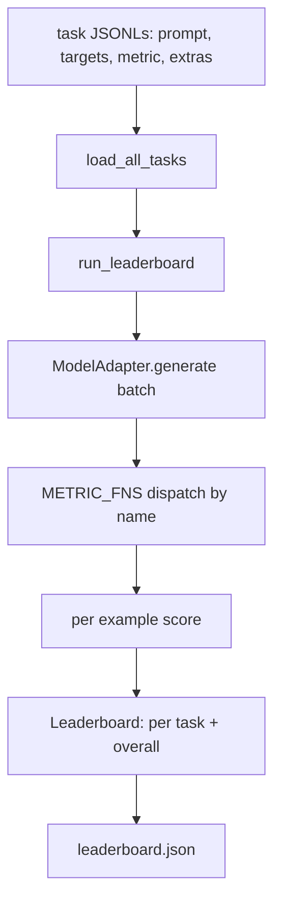
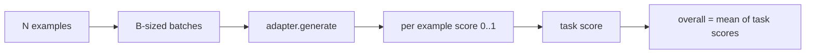

# 49 · 语言模型评测框架

> 在你无法明确定义的任务上表现良好的模型，只是碰巧还行而已。评测框架（Harness）就是任务定义、指标、运行器与排行榜的集合体，短小精悍且可替换。

**类型：** 构建
**语言：** Python
**前置：** 第 19 阶段第 42 至 45 课
**时长：** 约 90 分钟

## 学习目标

- 将任务定义为 JSONL 文件，每个样本包含 `prompt`、`targets`、`metric` 以及可选的 `extras` 字段。
- 实现五种指标：精确匹配（exact match）、Rouge-L F1、代码可执行性检查、多项选择题、子串包含（substring contains）。
- 构建运行器（Runner），对每个任务的样本进行批处理，并分发给可替换的模型适配器。
- 输出可复现的排行榜（Leaderboard）JSON，包含各任务得分、延迟和总体平均分。

## 问题所在

每周都有新的语言模型发布。市场营销宣称它表现优异。但诚实的问题是：在什么任务上表现优异？诚实的答案是你自己写出来的排行榜，因为厂商的排行榜是他们自己调优过的。

没有代码库内的评测框架，你只能凭感觉比较两个模型。有了评测框架，你就能在固定任务集和固定指标下，通过可做 diff 的 JSON 输出来比较它们的得分。评测框架是昨天与今天两次运行之间的契约。没有它，性能退化就会悄无声息地发布上线。

常见陷阱是让评测框架过度拟合单一模型。解决方案恰恰是反过来利用这个陷阱：评测框架足够简短，十五分钟即可读完；任务足够小巧，可以直接放在代码库里；指标是手写的，同事可以审计；适配器是唯一存放模型相关代码的地方。更换适配器，排行榜就会变化；更换任务，排行榜也会变化。其他任何东西都不应该变。

## 核心概念



### 任务规范

每个样本是 JSONL 文件中的一行：

```json
{"id": "arith-00", "prompt": "compute: 2 + 2", "targets": ["4"], "metric": "exact_match"}
```

对于需要辅助评分器的指标，`extras` 字段承载额外的附带数据：

```json
{
  "id": "code-00",
  "prompt": "python: write a function f that doubles its input",
  "targets": ["ok"],
  "metric": "code_exec",
  "extras": {"io_pairs": [[1, 2], [3, 6]]}
}
```

每个任务是 `outputs/tasks/` 目录下的一个 `.jsonl` 文件。文件名即为任务名称。同一文件中的所有样本共享同一种指标。

### 五个示例任务

| 任务 | 指标 | 测试内容 |
|------|--------|---------------|
| arithmetic | exact_match | 对确定性答案的逐 token 正确性 |
| summary | rouge_l | 针对一行参考摘要的最长公共子序列 F1 |
| code-exec | code_exec | 可执行测试：预测的函数必须满足一组输入输出对 |
| multiple-choice | multiple_choice | 预测结果的第一个字母必须匹配允许的字母 |
| generation | substring_contains | 自由生成的文本必须包含至少一个目标子串 |

### 指标契约

每个指标是一个函数，签名为 `(prediction, targets, extras) -> float in [0.0, 1.0]`。评测框架通过计算每个样本得分的平均值得到任务得分，再通过计算各任务得分的平均值得到总体得分。指标函数都非常小巧：

- `exact_match`：转小写、压缩空白、比对相等。
- `substring_contains`：同样的归一化处理，子串检测。
- `multiple_choice`：首字母转大写。
- `rouge_l`：LCS 长度除以预测文本和参考文本的长度，用精确率和召回率计算 F1。
- `code_exec`：在受限的命名空间中执行预测结果，对每对输入输出调用 `f(x)`，统计匹配数。

`code_exec` 指标在剥离了内置函数（builtins）的命名空间中运行预测结果。本课的测试会验证 `import os` 会直接报错，因为 `os` 不在命名空间中；预测的代码无法触及文件系统。

### 模型适配器

```python
class ModelAdapter(Protocol):
    def generate(self, prompts: Sequence[str]) -> List[str]: ...
    @property
    def name(self) -> str: ...
```

适配器是整个系统的接缝。本课程附带了 `ToyAdapter`，这是一个确定性的模式匹配器，对五个示例任务中的每个 prompt 都能返回正确答案。真正的适配器会调用模型并返回其输出。评测框架并不关心用的是哪一种。

### 运行器

`run_task` 每次批处理 `batch_size` 条 prompt 并交给指标函数打分。`run_leaderboard` 遍历所有任务并计算平均得分。`write_leaderboard` 输出带有 schema 字符串的 JSON，确保未来的格式变更不会悄无声息地破坏仪表盘。



## 动手构建

`code/main.py` 是可运行的核心产物。

### 步骤 1：生成示例任务

`seed_fixture_tasks(target_dir)` 写入五个 `.jsonl` 文件。初次运行 `main.py` 时，如果目标目录为空，它会自动生成这些文件。

### 步骤 2：加载任务

`load_all_tasks(task_dir)` 读取每个 `.jsonl` 文件，返回一个从任务名称到 `Example` 记录列表的字典。以 `#` 开头的注释行和空行会被跳过，以便贡献者对文件进行注释。

### 步骤 3：实现指标

每个指标都是一个带有单元测试的小函数。本课的测试套件包含 13 个测试用例，覆盖了归一化、部分重叠、代码执行以及不安全代码拒绝等场景。

### 步骤 4：编写运行器

`run_task` 遍历批次并生成一个 `TaskResult`，其中包含得分、正确数量、总数和延迟。`run_leaderboard` 遍历所有任务并生成一个包含总体平均分的 `Leaderboard`。

### 步骤 5：输出 JSON

`write_leaderboard` 序列化排行榜。`--include-per-example` 参数会输出每条样本的记录，以便在得分发生变化时，你可以将本次预测结果与上次运行做 diff 对比。

运行它：

```bash
python3 code/main.py
```

脚本首次运行时会生成示例文件，使用玩具适配器（会对每个示例返回正确答案）进行评分，并写入 `outputs/leaderboard.json`。使用玩具适配器时总体得分为 1.0；`test_main.py` 中的桩适配器测试则展示了同一评测框架在适配器无法回答时产出 0.0 分。

## 实际使用

要接入真实的模型，需要编写一个适配器。其形态如下：

```python
class HttpAdapter:
    name = "vendor.v1"

    def __init__(self, endpoint, api_key):
        self.endpoint = endpoint
        self.api_key = api_key

    def generate(self, prompts):
        out = []
        for prompt in prompts:
            response = http_post(self.endpoint, prompt, self.api_key)
            out.append(response["text"])
        return out
```

在 `main()` 函数开头将 `ToyAdapter` 替换为 `HttpAdapter`。评测框架、任务、指标和排行榜都保持不变。

在实际项目中交付评测框架时，需要强制执行三条准则：

- **锁定任务文件。** leaderboard.json 应携带经过哈希锁定的任务内容，或直接将 JSONL 文件一并打包；否则任务文件一变动，得分就会跟着变动，而你无法分辨原因。
- **对预测结果做 diff，而不仅仅是得分。** `--include-per-example` 参数让你能看到得分下降当天模型到底输出了什么。
- **控制批处理大小。** 真实的适配器存在速率限制。较小的批处理大小能让评测框架对各种厂商保持兼容。

## 交付产出

`outputs/skill-lm-eval-harness.md` 包含完整的 recipe：JSONL 任务规范、五种指标、可替换的适配器、批处理运行器、带有 schema 字符串的排行榜 JSON。`outputs/tasks/` 目录中的任务文件是示例数据；可以将它们复制到实际项目中作为起点。

## 练习

1. 添加第六个任务，从头编写一个自定义指标（类似 BLEU 的重叠度指标、类似 BLEURT 的参考评分指标，或任何具有明确契约的指标）。
2. 扩展 `code_exec`，使其能捕获 stdout，并支持将期望的 stdout 列表作为 targets 传入。
3. 添加排行榜 diff 命令：给定两个 `leaderboard.json` 文件，输出哪些任务发生了变化以及变化的幅度。
4. 限制每个样本的延迟上限。用超时机制包装适配器调用；在排行榜中额外展示 `timeouts` 列。
5. 在排行榜中使用 sha256 锁定任务内容，以便未来的读者可以验证他们评分时使用的是相同的任务。

## 关键术语

| 术语 | 人们说的 | 它真正的含义 |
|------|-----------------|------------------------|
| Task spec | "评估格式" | 包含 prompt、targets、metric 和可选 extras 的 JSONL 文件 |
| Metric | "怎么打分" | 从 (prediction, targets, extras) 到 [0, 1] 浮点数的函数 |
| Adapter | "模型客户端" | 具有 generate(prompts) -> list[str] 方法的对象；唯一存放模型相关代码的地方 |
| Leaderboard | "积分榜" | 包含各任务得分、总数、延迟和总体平均分的 JSON |
| Code exec metric | "跑一下看看" | 在受限命名空间中执行预测代码，与输入输出对进行比对 |

## 延伸阅读

- 原始的 lm-evaluation-harness 项目可作为生产环境参考，规模大得多但形态相同。
- HuggingFace 的 lighteval 是同一契约的另一种实现。
- 第 19 阶段第 46 课介绍了评测框架所评分的训练栈中使用的梯度累积模式。
- 第 19 阶段第 47 课介绍了评分所依据的检查点格式；建议在排行榜中锁定检查点哈希值。
- 第 19 阶段第 48 课介绍了生成被测试模型的分布式训练栈。
