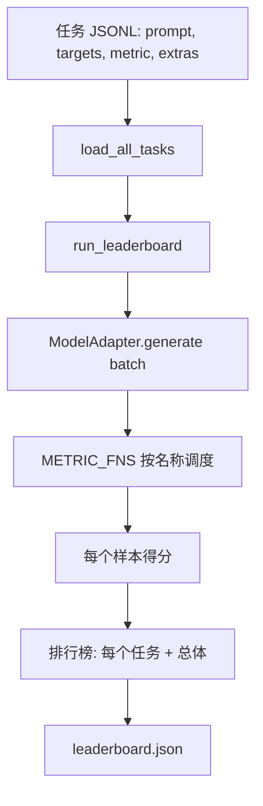
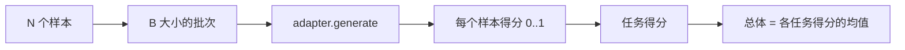

# 语言模型评估框架

> 一个在你无法定义的任务上表现良好的模型，只是一个偶然表现良好的模型。这个评估框架集任务定义、指标、运行器和排行榜于一身，以一个简洁、可替换的形态呈现。

**类型：** 构建
**语言：** Python
**前置条件：** 第 19 阶段第 42 至 45 课
**时长：** 约 90 分钟

## 学习目标

- 将任务定义为 JSONL 文件，每个样本包含 `prompt`、`targets`、`metric` 及可选的 `extras`。
- 实现五种指标：精确匹配、rouge-l F1、可执行性检查、多项选择及子串包含。
- 构建一个运行器，按任务批次处理样本，并分派给可替换的模型适配器。
- 输出排行榜 JSON，包含每个任务的得分、延迟及可复现的总体平均分。

## 问题

每周都有新语言模型问世。营销声称它们表现优异。诚实的问题是：在什么任务上表现优异？诚实的答案是——你自己编写的排行榜，因为供应商的排行榜是他们为其调优过的。

如果你的代码库中没有评估框架，你只能靠感觉比较两个模型。有了评估框架，你就可以通过固定任务集和固定指标上的得分来比较它们，输出可对比的 JSON。这个评估框架是昨日运行与今日运行之间的契约。没有它，回归问题就会悄然上线。

陷阱是让评估框架过度适配单一模型。解决方案是同一个陷阱的逆向运用：框架要小到能在十五分钟内读完，任务要小到能纳入代码库，指标从头编写以便同事审计，而适配器是唯一存放模型特定代码的地方。更换适配器，排行榜随之变化；更换任务，排行榜也随之变化。其他一切都不应变动。

## 概念


```mermaid
flowchart TD
  tasks[任务 JSONL: prompt, targets, metric, extras] --> loader[load_all_tasks]
  loader --> runner[run_leaderboard]
  runner --> adapter[ModelAdapter.generate batch]
  adapter --> metrics[METRIC_FNS 按名称调度]
  metrics --> scores[每个样本得分]
  scores --> board[排行榜: 每个任务 + 总体]
  board --> out[leaderboard.json]
```

### 任务规范

每个样本是一条 JSONL 行：

```json
{"id": "arith-00", "prompt": "compute: 2 + 2", "targets": ["4"], "metric": "exact_match"}
```

对于需要评分辅助的指标，`extras` 承载附加数据：

```json
{
  "id": "code-00",
  "prompt": "python: write a function f that doubles its input",
  "targets": ["ok"],
  "metric": "code_exec",
  "extras": {"io_pairs": [[1, 2], [3, 6]]}
}
```

任务是一个位于 `outputs/tasks/` 下的 `.jsonl` 文件。文件名即任务名。同一文件内的所有样本共享同一个指标。

### 五个固定任务

| 任务 | 指标 | 测试内容 |
|------|--------|----------|
| arithmetic | exact_match | 确定性答案上的词元级正确性 |
| summary | rouge_l | 针对单行参考摘要的最长公共子序列 F1 |
| code-exec | code_exec | 可执行测试：预测的函数必须满足一组输入-输出对 |
| multiple-choice | multiple_choice | 预测的首字母必须匹配允许的字母 |
| generation | substring_contains | 自由形式文本必须包含至少一个目标子串 |

### 指标契约

每个指标都是一个函数，形式为 `(prediction, targets, extras) -> float in [0.0, 1.0]`。评估框架对每个样本的得分取平均值得到任务得分，再对任务得分取平均值得到总体得分。各指标函数非常精简：

- `exact_match`：转小写、合并空白、判等。
- `substring_contains`：相同规范化处理，子串测试。
- `multiple_choice`：首字母大写。
- `rouge_l`：LCS 长度除以预测和参考的长度，计算精确率与召回率的 F1。
- `code_exec`：在受限命名空间中执行预测，对每个输入-输出对调用 `f(x)`，统计匹配数。

`code_exec` 指标在剥离了内置函数的命名空间中执行预测。课程测试断言 `import os` 会报错，因为命名空间中不存在 `os`；你无法从代码预测中访问文件系统。

### 模型适配器

```python
class ModelAdapter(Protocol):
    def generate(self, prompts: Sequence[str]) -> List[str]: ...
    @property
    def name(self) -> str: ...
```

适配器是接缝处。课程提供了 `ToyAdapter`，一个确定性模式匹配器，能为五个固定任务中的每个提示返回正确答案。真正的适配器会调用模型并返回其输出。评估框架并不关心使用的是哪一种。

### 运行器

`run_task` 按 `batch_size` 批量处理提示，然后分派给指标函数。`run_leaderboard` 遍历每个任务并计算平均值。`write_leaderboard` 输出带有模式字符串的 JSON，以便将来格式变更不会静默破坏仪表板。


```mermaid
flowchart LR
  examples[N 个样本] --> batches[B 大小的批次]
  batches --> adapter[adapter.generate]
  adapter --> per[每个样本得分 0..1]
  per --> avg[任务得分]
  avg --> over[总体 = 各任务得分的均值]
```

```figure
eval-harness-matrix
```

## 构建

`code/main.py` 是可运行的成品。

### 第 1 步：生成固定任务

`seed_fixture_tasks(target_dir)` 写入五个 `.jsonl` 文件。首次运行 `main.py` 时，若目录为空则自动生成这些文件。

### 第 2 步：加载任务

`load_all_tasks(task_dir)` 读取每个 `.jsonl` 文件，返回从任务名到 `Example` 记录列表的字典。以 `#` 开头的注释行和空行会被跳过，以便贡献者可以注释文件。

### 第 3 步：实现指标

每个指标都是一个附带单元测试的小函数。课程测试套件包含 13 个用例，涵盖规范化、部分重叠、代码执行及不安全代码拒绝。

### 第 4 步：编写运行器

`run_task` 迭代批次并生成包含得分、正确数、总数和延迟的 `TaskResult`。`run_leaderboard` 遍历所有任务并生成包含总体平均分的 `Leaderboard`。

### 第 5 步：输出 JSON

`write_leaderboard` 序列化排行榜。`--include-per-example` 标志会输出每个样本的记录，以便在得分变化时将预测结果与上次运行进行对比。

运行它：

```bash
python3 code/main.py
```

脚本在首次运行时生成固定数据，使用玩具适配器（能正确回答所有固定任务）对其评分，并写入 `outputs/leaderboard.json`。使用玩具适配器时总体得分为 1.0；`test_main.py` 中的桩适配器测试表明，当适配器无法回答时，同样的评估框架会输出 0.0。

## 使用

要接入真实模型，编写一个适配器。其形式如下：

```python
class HttpAdapter:
    name = "vendor.v1"

    def __init__(self, endpoint, api_key):
        self.endpoint = endpoint
        self.api_key = api_key

    def generate(self, prompts):
        out = []
        for prompt in prompts:
            response = http_post(self.endpoint, prompt, self.api_key)
            out.append(response["text"])
        return out
```

在 `main()` 顶部将 `ToyAdapter` 替换为 `HttpAdapter`。评估框架、任务、指标和排行榜都保持不变。

在真实项目中交付评估框架时，需要遵守三个模式：

- **锁定任务文件。** learderboard.json 要么携带哈希锁定的任务内容，要么将 JSONL 文件一同打包；否则任务文件变化时得分也随之变化，你无从得知原因。
- **对比预测结果，而不仅仅是得分。** `--include-per-example` 标志让你能查看得分下降当天模型输出了什么。
- **限制批次大小。** 真实适配器有速率限制。较小的批次大小能让评估框架跨供应商兼容。

## 交付

`outputs/skill-lm-eval-harness.md` 包含配方：JSONL 任务规范、五种指标、可替换适配器、分批运行器、带模式字符串的排行榜 JSON。`outputs/tasks/` 下的任务文件是固定示例；可将其复制到真实项目中作为起点。

## 练习

1. 添加第六个任务及其自定义指标，从头编写（类 BLEU 重叠、类 BLEURT 参考评分，任何具有清晰契约的指标均可）。
2. 扩展 `code_exec` 以捕获标准输出，并接受预期的标准输出列表作为 targets。
3. 添加排行榜差异比较命令：给定两个 `learderboard.json` 文件，打印哪些任务发生了变化及其变化幅度。
4. 限制每个样本的延迟。为适配器调用添加超时；在排行榜中增加单独的 `timeouts` 列。
5. 在排行榜中使用 sha256 锁定任务内容，以便未来的读者能验证他们评分的是相同的任务。

## 关键术语

| 术语 | 人们说的 | 实际含义 |
|------|----------|----------|
| 任务规范 | "评估格式" | JSONL 文件，每个样本包含 prompt、targets、metric 及可选的 extras |
| 指标 | "评分方式" | 从 (prediction, targets, extras) 到 [0, 1] 区间浮点数的函数 |
| 适配器 | "模型客户端" | 具有 generate(prompts) -> list[str] 方法的对象；唯一存放模型特定代码的地方 |
| 排行榜 | "计分板" | 包含每个任务得分、总数、延迟及总体平均分的 JSON |
| 代码执行指标 | "运行并检查" | 在受限命名空间中执行预测，与输入-输出对进行比较 |

## 延伸阅读

- 原始的 lm-evaluation-harness 作为生产参考，规模大得多但结构相同。
- HuggingFace 的 lighteval 作为同一契约的另一种实现。
- 第 19 阶段第 46 课涵盖评估框架评分的训练栈中使用的梯度累积模式。
- 第 19 阶段第 47 课涵盖你评分的检查点格式；在排行榜中锁定检查点哈希。
- 第 19 阶段第 48 课涵盖生成被测试模型的分布式训练栈。
