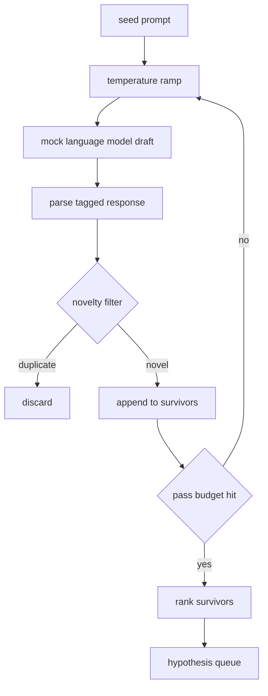

# 仮説ジェネレーター

> 同じ問いを二度たずねる研究エージェントはトークンを無駄にしています。重要なのは、各ドラフトを前回とは違う場所に着地させることです。

**種別:** Build
**言語:** Python
**前提:** Phase 19 Track A lessons 20-29
**時間:** 約90分

## 学習目標
- シードプロンプトから sampler を動かし、出力を型付きの `Hypothesis` レコードへ変換する。
- 各パスで temperature を上げ、次のドラフトを前回からさらに離れやすくする。
- 小さな embedding モデルと cosine distance のしきい値で近重複を除外する。
- novelty、specificity、testability を混ぜたスコア関数で候補を順位付けする。
- 同じ seed なら常に同じ queue になるよう、全ステップを決定的に保つ。

## なぜ生成してからフィルタするのか

プランナーがモデルを一度だけ呼ぶと仮説は一つだけです。例としては十分ですが、研究ループには浅すぎます。最初の仮説が失敗したとき、追加のサンプリングを待たずに次を実行できる、深さのある順位付き queue が必要です。

この queue は二つの考え方で作ります。一つ目は temperature ramping です。sampler の各パスで temperature を少しずつ上げ、後半のドラフトほど探索的にします。二つ目は novelty filtering です。各ドラフトの embedding を、すでに採用した候補すべてと比較し、近すぎるものを落とします。

このレッスンには固定プロンプトに対してスクリプト済みの token sequence を返す mock language model が含まれます。これだけで、seed prompt 入力、temperature ramp 適用、候補 parse、novelty filter、ranked queue 出力までの全経路をテストできます。

## Hypothesis の形

```text
Hypothesis
  id             : int           (run 内で単調増加)
  text           : str           (主張)
  variables      : list[str]     (条件間で変えるもの)
  metric         : str           (runner が測定するもの)
  baseline_ref   : str | None    (比較対象の論文または run)
  draft_pass     : int           (どの sampler pass で生成されたか)
  temperature    : float         (生成時の sampler 設定)
  novelty_score  : float         (既存採用候補からの距離、0..1)
  rank_score     : float         (並べ替えに使う重み付き合計)
```

`variables` と `metric` は自由文ではありません。parser はタグ付き応答からこれらを抜き出します。lesson 52 の runner は実験設定を作るときにこのフィールドを直接読みます。

`baseline_ref` は任意ですが推奨です。lesson 53 の evaluator は比較用 baseline を必要とします。仮説に含まれない場合は、同じ metric の前回 run にフォールバックします。

## アーキテクチャ



ループ自体は単純です。重要なのは、各箱が明確な contract を持つことです。

## Temperature ramp

`t_min` から始めて `t_max` で終わり、step は `(t_max - t_min) / (n_passes - 1)` です。各パスは現在の temperature で sampler を呼び、`GeneratorConfig.schedule()` から等間隔の `n_passes` 個の値を生成します。mock model は `(prompt, temp_bucket)` をキーにした応答を返すことで temperature を反映します。本番では実モデルに `temperature=t` を渡します。

デフォルトは `0.2` から `1.2` までの6パスです。`0.2` 未満では seed をそのまま繰り返しがちで、`1.2` を超えると話題から外れて parser に失敗しやすくなります。

## Novelty filter

各ドラフトを parse したあと、generator は text を embed し、すべての採用済み仮説と比較します。embedding は単語 token の hashed bag で、unit length に正規化されます。二つの unit vector の cosine distance は `1 - dot(a, b)` です。既存候補への最小距離が `novelty_threshold` を超える場合だけ採用します。デフォルトは `0.25` です。

この hashed embedding は高度ではありませんが、決定的で依存関係がなく、名詞の大半を共有する重複ドラフトを捕まえるには十分です。本番では小さな sentence model に差し替えられます。interface は変わりません。

## Rank score

```text
rank_score = w_novelty * novelty_score
           + w_specificity * specificity_score
           + w_testability * testability_score
```

`novelty_score` は既存採用候補からの最小 embedding distance です。`specificity_score` は仮説内の具体的 variable 数を目標数で割ったものです。`testability_score` は metric と baseline の両方があれば1、metric だけなら0.5、それ以外は0です。

デフォルト重みは `0.4`, `0.3`, `0.3` です。重みは generator config にあるため、後続レッスンはコードを fork せず調整できます。

## Mock language model

```python
class MockLLM:
    def sample(self, prompt: str, temperature: float, seed: int) -> str:
        ...
```

sampler は `(prompt, temperature, seed)` の組に対して決定的です。mock は `(prompt_signature, temperature_bucket)` をキーにした応答表を持ちます。キーが存在しない場合は parser に失敗する fallback を返します。この経路もテストで扱います。

seed は応答選択に混ぜ込まれるため、同じ `(prompt, temperature)` でも seed が違えば別のドラフトになります。テストでは再現性のため seed を固定します。本番では system clock や counter から seed を得ます。

## Output queue

出力は `rank_score` 降順に並んだ `Hypothesis` レコードの list です。lesson 52 の runner は先頭を pop して実験し、lesson 53 の evaluator は verdict を書き戻します。仮説が誤りなら runner は次を pop します。

queue は有限です。空になったら orchestrator は seed prompt を広げて generator を再実行するか、budget exhausted として停止します。

## コードの読み方

`code/main.py` は `Hypothesis`, `MockLLM`, `HypothesisGenerator`, 決定的 demo を定義します。generator は `run(seed_prompt)` だけを公開し、pass 数は `GeneratorConfig.n_passes` から読みます。embedding は token の hashed bag、novelty filter と rank score はそれぞれ単一関数です。`numpy` には依存しません。

`code/tests/test_generator.py` は通常経路、重複拒否、parser failure、temperature ramp の境界、rank ordering を確認します。

## 位置づけ

lesson 50 は queue を生成します。lesson 51 は queue の先頭に対して literature search を実行し、既存研究が確認または反証していないかを見ます。lesson 52 は同じ先頭で実験を走らせます。lesson 53 は両方の出力を読んで verdict を書きます。四つのレッスンが、人間を挟まない研究ループとして合成されます。
