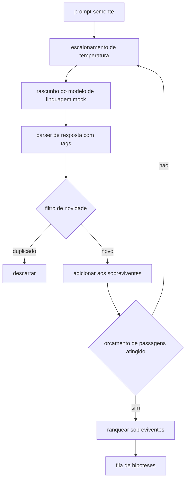

# Aula 50: Gerador de Hipoteses

> Um agente de pesquisa que faz a mesma pergunta duas vezes esta desperdicando tokens. O truque e forcar cada rascunho a pousar em algum lugar novo.

**Tipo:** Build
**Linguagens:** Python
**Prerequisitos:** Aulas 20-29 da Fase 19, Track A
**Tempo:** ~90 minutos

## Objetivos de Aprendizado
- Dirigir um sampler a partir de um prompt semente e transformar seus outputs em registros tipados de hipotese.
- Aumentar a temperatura do sampler a cada passagem para que o proxo rascunho se afaste mais do anterior.
- Filtrar quase-duplicados com um pequeno modelo de embedding e um limiar de distancia coseno.
- Ranquear os sobreviventes com uma funcao de pontuacao que combina novidade, eespecificaçãoificidade, e testabilidade.
- Manter todos os passos deterministicos para que a mesma semente sempre produza a mesma fila.

## Por que gerar, depois filtrar

Um planejador que pergunta para um modelo uma vez recebe uma hipotese. Isso serve para um exemplo resolvido. Para um loop de pesquisa e a forma errada. O loop quer uma fila ranqueada com profundidade, para que quando a primeira hipotese falhe o executor tenha a proxo pronta sem pagar por outra passagem completa de amostragem.

Duas ideias combinam para produzir essa fila. A primeira e escalonamento de temperatura: cada passagem pelo sampler aumenta a temperatura um nivel, para que rascunhos posteriores sejam encorajados a divagar. A segunda e filtragem de novidade: apos cada rascunho, o gerador mede a distancia do embedding de todos os sobreviventes anteriores e rejeita qualquer coisa dentro do cluster.

A aula entrega um modelo de linguagem mock que retorna sequencias de tokens programadas para prompts fixos. O mock e suficiente para exercitar o caminho completo: prompt semente entrada, escalonamento de temperatura aplicado, candidatos parseados, filtro de novidade rodado, fila ranqueada saida.

## A forma da Hipotese

```text
Hypotese
  id             : int           (monotonico dentro de uma execucao)
  text           : str           (a alegacao)
  variables      : list[str]     (o que muda entre condicoes)
  metric         : str           (o que o executor vai medir)
  baseline_ref   : str | None    (qual paper ou execucao a comparacao cita)
  draft_pass     : int           (qual passagem do sampler produziu isso)
  temperature    : float         (a configuracao do sampler no momento do rascunho)
  novelty_score  : float         (distancia dos sobreviventes anteriores, 0..1)
  rank_score     : float         (soma ponderada usada para ordenacao)
```

`variables` e `metric` nao sao texto livre. O parser os puxa de uma resposta com tags. O executor na aula 52 le esses campos diretamente quando constroi a config do experimento.

`baseline_ref` e opcional mas recomendado. O avaliador na aula 53 precisa de uma linha de base para comparar. Se a hipotese omitir uma, o avaliador recorre a execucao anterior na mesma metrica.

## Arquitetura



O loop e direto. A parte interessante e que cada caixa tem um contrato duro.

## Escalonamento de temperatura

Comeca em `t_min`, termina em `t_max`, passo `(t_max - t_min) / (n_passes - 1)`. Cada passagem chama o sampler na temperatura atual, produzindo `n_passes` valores uniformemente espaçados de `GeneratorConfig.schedule()`. O modelo mock honra a temperatura alternando entre um conjunto pequeno de respostas programadas indexadas por `(prompt, temp_bucket)`. Os buckets sao intervalos abertos para que uma pequena mudanca na temperatura escolha um bucket diferente e produza um rascunho diferente. Em producao o sampler seria um modelo real com `temperature=t` passado.

O agendamento padrao e seis passagens de `0.2` a `1.2`. Seis sao suficientes para encher a fila sem pagar por amostras que o filtro de novidade rejeitaria de qualquer forma. Abaixo de `0.2` o modelo repete a semente. Acima de `1.2` as respostas tendem a divagar do topico e falhar no parser.

## Filtro de novidade

Apos cada rascunho ser parseado, o geraador embute o texto e compara com cada hipotese aceita. O embedding e uma sacola de tokens com hash, normalizada para comprimento unitario. A distancia coseno entre dois vetores unitarios e `1 - dot(a, b)`. Um rascunho passa se sua distancia minima para qualquer sobrevivente anterior estiver acima de `novelty_threshold`. Padrao e `0.25`.

O embedding com hash nao e sofisticado. E deterministico, tem zero dependencias, e suficiente para pegar o caso obvio: dois rascunhos que compartilham a maioria de seus substantivos. Um implantação de producao trocaria por um pequeno modelo de frase. A interface continua a mesma.

## Pontuacao de ranqueamento

```text
rank_score = w_novelty * novelty_score
           + w_especificaçãoificity * especificaçãoificity_score
           + w_testability * testability_score
```

Tres sub-pontuacoes. `novelty_score` e a distancia minima de embedding dos sobreviventes anteriores. `especificaçãoificity_score` e a contagem de variaveis concretas na hipotese dividida por uma contagem alvo. `testability_score` e um se a hipotese eespecificaçãoifica tanto uma metrica quanto uma baseline, metade se tem apenas uma metrica, zero caso contrario.

Pesos padrao sao `0.4`, `0.3`, `0.3`. Os pesos vivem na config do gerador para que uma aula downstream possa muda-los sem bifurcar o codigo.

## Modelo de linguagem mock

```python
class MockLLM:
    def sample(self, prompt: str, temperature: float, seed: int) -> str:
        ...
```

O sampler e deterministico dada uma triplet `(prompt, temperature, seed)`. O mock mantem uma tabela de respostas programadas indexada por `(prompt_signature, temperature_bucket)`. Se a tabela nao tem entrada para uma chave, o sampler retorna um reserva que falha no parser. O caminho de reserva e exercitado por um dos testes.

A seed e misturada na resposta para que o mesmo par `(prompt, temperature)` com seeds diferentes produza rascunhos diferentes. Nos testes fixamos a seed para manter resultados reproduziveis. Em um implantação real a seed viria de um relogio de sistema ou um contador.

## Fila de saida

A saida e uma lista de registros `Hypothesis` ordenada por `rank_score` decrescente. O executor na aula 52 popa a cabeca, roda o experimento, e o avaliador na aula 53 escreve um veredicto de volta. Se o veredicto diz que a hipotese estava errada, o executor popa a proxo.

A fila e finita. Quando estiver vazia o orchestrator pode alargar o prompt semente e rodar o gerador novamente ou parar e reportar o orcamento esgotado.

## Como ler o codigo

`code/main.py` define `Hypothesis`, `MockLLM`, `HypothesisGenerator`, e um demo deterministico. O gerador expoe um unico metodo `run(seed_prompt)` que retorna uma fila ordenada; a contagem de passagens e lida de `GeneratorConfig.n_passes` em vez de ser passada como argumento. O embedding e uma sacola de tokens com hash. O filtro de novidade e uma unica funcao. A pontuacao de ranqueamento e uma unica funcao. Nada depende de `numpy`; a matematica do embedding e stdlib puro para que a aula permaneca portavel.

`code/tests/test_generator.py` cobre o caminho linear, o caminho de rejeicao de duplicado, o caminho de falha do parser, os limites de escalonamento de temperatura, e a ordenacao de ranqueamento.

## Onde isso encaixa

A aula 50 produz a fila. A aula 51 pega a cabeca da fila e roda uma busca na literatura para confirmar ou refuta-la. A aula 52 pega a mesma cabeca e roda um experimento real. A aula 53 le ambos os outputs e escreve um veredicto. As quatro aulas compoem um loop de pesquisa sem humano; um humano pode intervir em qualquer limite.
