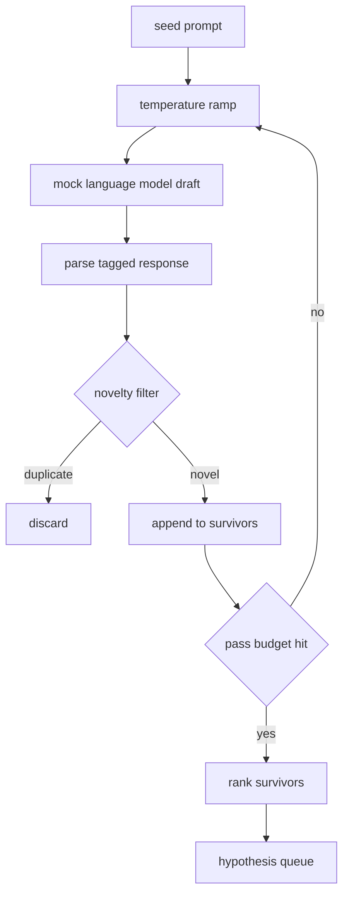

# Hipotez Oluşturucu

> Aynı soruyu iki kez soran bir araştırma agent, token'ları boşa harcamaktadır. İşin püf noktası her taslağı yeni bir yere inmeye zorlamaktır.

**Tür:** Yapım
**Diller:** Python
**Önkoşullar:** Aşama 19 Bölüm A dersleri 20-29
**Süre:** ~90 dakika

## Öğrenme Hedefleri
- prompt tohumundan bir örnekleyici sürün ve çıktılarını yazılı hipotez kayıtlarına dönüştürün.
- Her geçişte örnekleyici sıcaklığını artırın, böylece bir sonraki taslak öncekinden daha da uzaklaşır.
- Küçük bir embedding modeli ve bir kosinüs mesafesi eşiğiyle yakın kopyaları filtreleyin.
- Yeniliği, özgüllüğü ve test edilebilirliği harmanlayan bir puanlama fonksiyonuyla hayatta kalanları sıralayın.
- Her adımı deterministik tutun, böylece aynı tohum her zaman aynı kuyruğu üretsin.

## Neden oluşturup sonra filtreleyin

Bir kez bir model soran bir planlamacı, bir hipotez elde eder. Çalışılmış bir örnek için bu gayet iyi. Bir araştırma döngüsü için yanlış şekildir. Döngü, derinliği olan sıralı bir kuyruk ister, böylece ilk hipotez başarısız olduğunda koşucu, başka bir tam örnekleme geçişi için ödeme yapmadan bir sonrakini hazır hale getirir.

Bu kuyruğu oluşturmak için iki fikir birleşiyor. Birincisi sıcaklığın artmasıdır: Örnekleyiciden her geçiş sıcaklığı bir kademe yükseltir, böylece daha sonraki cereyanların dolaşması teşvik edilir. İkincisi, yenilik filtrelemedir: her taslaktan sonra, jeneratör önceki hayatta kalanlardan embedding mesafeyi ölçer ve küme içindeki her şeyi reddeder.

Ders, sabit prompt'lar için kodlanmış token dizilerini döndüren sahte bir dil modeli sunar. Taklit, tam yolu uygulamak için yeterlidir: tohum prompt içeri girer, sıcaklık rampası uygulanır, adaylar ayrıştırılır, yenilik filtresi çalıştırılır, sıralamalı kuyruktan çıkar.

## Hipotez şekli

```text
Hypothesis
  id             : int           (monotonic within a run)
  text           : str           (the claim)
  variables      : list[str]     (what changes between conditions)
  metric         : str           (what the runner will measure)
  baseline_ref   : str | None    (which paper or run the comparison cites)
  draft_pass     : int           (which sampler pass produced this)
  temperature    : float         (the sampler setting at draft time)
  novelty_score  : float         (distance from prior survivors, 0..1)
  rank_score     : float         (weighted sum used for ordering)
```

`variables` ve `metric` serbest metin değildir. Ayrıştırıcı bunları etiketli bir yanıttan çeker. Elli ikinci dersteki koşucu, deneme yapılandırmasını oluştururken bu alanları doğrudan okur.

`baseline_ref` isteğe bağlıdır ancak önerilir. Elli üçüncü dersteki değerlendiricinin karşılaştırma yapabileceği bir temel çizgiye ihtiyacı var. Hipotez bunlardan birini atlarsa, değerlendirici aynı ölçüme göre önceki çalışmaya geri döner.

## Mimarlık



Döngü düz ileridir. İşin ilginç yanı, her kutunun zorlu bir sözleşmesi var.

## Sıcaklık rampası

`t_min` ile başlayın, `t_max` ile bitirin, `(t_max - t_min) / (n_passes - 1)`. adım. Her geçiş örnekleyiciyi mevcut sıcaklıkta çağırır ve `GeneratorConfig.schedule()`'tan eşit aralıklı `n_passes` değer üretir. Sahte model, `(prompt, temp_bucket)` ile anahtarlanan küçük bir dizi komut dosyası yanıtları arasında geçiş yaparak sıcaklığı onurlandırır. Kovalar açık aralıklarla olduğundan sıcaklıktaki küçük bir değişiklik farklı bir kova seçer ve farklı bir çekiş üretir. Üretimde örnekleyici, içinden `temperature=t` geçen gerçek bir model olacaktır.

Varsayılan program `0.2` 'dan `1.2`'ya altı geçiştir. Yenilik filtresinin zaten reddedeceği numuneler için ödeme yapmadan kuyruğu doldurmak için altı adet yeterlidir. `0.2` 'nin altında model, tohumu tekrar papağan gibi tekrarlıyor. `1.2` 'nin üzerinde yanıtlar konudan sapma ve ayrıştırıcıda başarısız olma eğilimindedir.

## Yenilik filtresi

Her taslak ayrıştırıldıktan sonra oluşturucu metni yerleştirir ve kabul edilen her hipotezle karşılaştırır. embedding, birim uzunluğa göre normalleştirilmiş, tokens kelimelerinden oluşan küçük bir karma torbadır. İki birim vektör arasındaki kosinüs uzaklığı `1 - dot(a, b)`'dır. Bir taslak, önceki hayatta kalanlardan herhangi birine olan minimum mesafesinin `novelty_threshold` değerinin üzerinde olması durumunda geçer. Varsayılan `0.25`'dir.

Karma embedding süslü değil. Deterministiktir, sıfır bağımlılığı vardır ve bariz durumu yakalamak için yeterlidir: isimlerinin çoğunu paylaşan iki taslak. Bir deployment üretimi, küçük bir cümle modelinde yer değiştirir. Arayüz aynı kalır.

## Sıra puanı

```text
rank_score = w_novelty * novelty_score
           + w_specificity * specificity_score
           + w_testability * testability_score
```

Üç alt puan. `novelty_score` , önceki hayatta kalanlardan minimum embedding mesafedir. `specificity_score` , hipotezdeki somut değişkenlerin sayısının hedef sayıya bölümüdür. `testability_score` , eğer hipotez hem bir metriği hem de bir temel çizgiyi belirtiyorsa birdir, yalnızca bir metriğe sahipse yarısıdır, aksi takdirde sıfırdır.

Varsayılan ağırlıklar: `0.4`, `0.3`, `0.3`. Ağırlıklar jeneratör yapılandırmasında bulunur, böylece aşağı yöndeki bir ders kodu çatallamadan bunları değiştirebilir.

## Sahte dil modeli

```python
class MockLLM:
    def sample(self, prompt: str, temperature: float, seed: int) -> str:
        ...
```

Örnekleyici, `(prompt, temperature, seed)` üçlüsü verildiğinde deterministiktir. Sahte, kodlanmış bir yanıt tablosunu `(prompt_signature, temperature_bucket)` ile anahtarlanmış halde tutar. Tabloda bir anahtar için giriş yoksa örnekleyici, ayrıştırıcıyı başarısızlığa uğratan bir geri dönüş döndürür. Geri dönüş yolu testlerden biri tarafından uygulanır.

Tohum yanıta karıştırılır, böylece farklı tohumlara sahip aynı `(prompt, temperature)` çifti farklı taslaklar üretir. Testlerde sonuçların tekrarlanabilir olmasını sağlamak için tohumu sabitliyoruz. Gerçek bir deployment'da tohum bir sistem saatinden veya bir sayaçtan gelecektir.

## Çıkış kuyruğu

Çıktı, `rank_score` azalan şekilde sıralanmış `Hypothesis` kayıtların bir listesidir. Elli ikinci dersteki koşucu kafasını fırlatır, deneyi yürütür ve elli üçüncü dersteki değerlendirici bir karar yazar. Eğer karar hipotezin yanlış olduğunu söylerse, koşucu bir sonrakini atar.

Sıra sınırlıdır. Boşaldığında orkestratör ya prompt çekirdeğini genişletip jeneratörü tekrar çalıştırabilir ya da durup bütçenin tükendiğini bildirebilir.

## Kod nasıl okunur

`code/main.py` , `Hypothesis`, `MockLLM`, `HypothesisGenerator` ve deterministik bir demoyu tanımlar. Oluşturucu, sıralanmış bir kuyruk döndüren tek bir `run(seed_prompt)` yöntemini kullanıma sunar; geçiş sayısı bağımsız değişken olarak iletilmek yerine `GeneratorConfig.n_passes` öğesinden okunur. embedding, token'lardan oluşan karma bir çantadır. Yenilik filtresi tek bir işlevdir. Sıra puanı tek bir fonksiyondur. Hiçbir şey `numpy`'ya bağlı değildir; embedding matematiği saf stdlib olduğundan ders taşınabilir kalır.

`code/tests/test_generator.py` doğrusal yolu, kopya reddetme yolunu, ayrıştırıcı arıza yolunu, sıcaklık rampası sınırlarını ve sıra sıralamasını kapsar.

## Bunun yeri neresi

Elli ders kuyruğu oluşturur. Elli birinci ders sıranın başına geçer ve bunu doğrulamak ya da çürütmek için bir literatür taraması yapar. Elli ikinci ders de aynı konuyu ele alıyor ve gerçek bir deney yürütüyor. Elli üçüncü ders her iki çıktıyı da okur ve bir karar yazar. Dört ders, içinde insanın olmadığı bir araştırma döngüsünden oluşuyor; bir insan herhangi bir sınıra adım atabilir.
