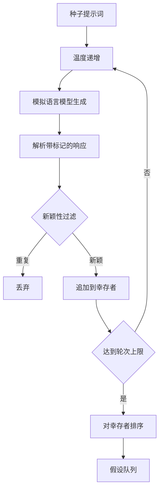

# 50 · 假设生成器

> 一个研究智能体两次问同样的问题就是在浪费 token。诀窍是迫使每次生成都落在一个新的地方。

**类型：** 构建
**语言：** Python
**前置：** 第 19 阶段 A 路线第 20-29 课
**时长：** 约 90 分钟

## 学习目标
- 从种子提示词（seed prompt）驱动采样器（sampler），并将其输出转换为类型化的假设（hypothesis）记录。
- 在每次采样时递增采样器温度（temperature），使下一次生成比上一次偏离更远。
- 使用小型嵌入（embedding）模型和余弦距离（cosine distance）阈值过滤近似重复。
- 使用融合新颖性（novelty）、具体性（specificity）和可测试性（testability）的评分函数对幸存者进行排序。
- 保持每一步确定性，使相同的种子始终产生相同的队列。

## 为什么先生成、再过滤

一个规划器向一个模型提一次问题，得到一个假设。对于示例演示来说这没问题。但对于研究循环而言，这是错误的形态。循环需要一个有深度的排序队列，这样当第一个假设失败时，运行器（runner）可以立即取出下一个，而不必再为一次完整的采样过程付费。

两个想法结合在一起产生了这个队列。第一是温度递增（temperature ramping）：每次采样时温度提高一档，鼓励后续生成更加发散。第二是新颖性过滤（novelty filtering）：每次生成后，生成器测量其与所有已接受假设之间的嵌入距离，并拒绝任何落在已有聚类范围内的内容。

本课提供一个模拟语言模型（mock language model），它对固定的提示词返回预设的 token 序列。这个模拟足以演练完整流程：种子提示词输入，应用温度递增，解析候选假设，运行新颖性过滤，输出排序队列。

## 假设的数据结构

```text
Hypothesis
  id             : int           (在单次运行内单调递增)
  text           : str           (论断本身)
  variables      : list[str]     (条件之间发生变化的内容)
  metric         : str           (运行器将要测量的指标)
  baseline_ref   : str | None    (比较所引用的论文或运行编号)
  draft_pass     : int           (本次生成来自第几轮采样)
  temperature    : float         (生成时的采样器温度设置)
  novelty_score  : float         (与先前幸存者的距离，0..1)
  rank_score     : float         (用于排序的加权求和)
```

`variables` 和 `metric` 不是自由文本。解析器从带标记的响应中提取它们。第五十二课的运行器在构建实验配置时直接读取这些字段。

`baseline_ref` 可选但建议填写。第五十三课的评估器需要一个基线（baseline）来进行比较。如果假设省略了基线，评估器将回退到同一指标的上一次运行结果。

## 架构



循环本身是直接的。有趣之处在于每一个方框都有严格的合约。

## 温度递增

从 `t_min` 开始，到 `t_max` 结束，步长为 `(t_max - t_min) / (n_passes - 1)`。每次轮次以当前温度调用采样器，通过 `GeneratorConfig.schedule()` 生成 `n_passes` 个均匀分布的温度值。模拟模型通过在一小组预设响应之间切换来响应温度变化，这些响应以 `(prompt, temp_bucket)` 为键。桶是开区间，因此温度的微小变化会选中不同的桶，产生不同的生成结果。在生产环境中，采样器将是一个真实模型，传入 `temperature=t`。

默认安排是六轮，从 `0.2` 到 `1.2`。六轮足以填满队列，而不会为那些迟早会被新颖性过滤拒绝的样本付出代价。低于 `0.2`，模型只会逐字复述种子。高于 `1.2`，响应往往会偏离主题，通不过解析器。

## 新颖性过滤

每轮生成被解析后，生成器将其文本嵌入（embed），并与所有已接受的假设进行比较。嵌入是一个小型的哈希词袋，归一化到单位长度。两个单位向量之间的余弦距离为 `1 - dot(a, b)`。如果某次生成与任何先前幸存者的最小距离高于 `novelty_threshold`，则通过。默认值为 `0.25`。

哈希嵌入并不花哨。它是确定性的，零外部依赖，足以捕捉明显的情况：两轮生成共享了大部分名词。生产部署可以换成一个小型句子模型，接口保持不变。

## 排序评分

```text
rank_score = w_novelty * novelty_score
           + w_specificity * specificity_score
           + w_testability * testability_score
```

三个子评分。`novelty_score` 是与先前幸存者的最小嵌入距离。`specificity_score` 是假设中具体变量的数量除以目标数量。`testability_score` 在假设同时指定了指标和基线时为一，仅有指标时为一半，否则为零。

默认权重为 `0.4`、`0.3`、`0.3`。权重存放在生成器配置中，以便下游课程可以在不 fork 代码的情况下调整它们。

## 模拟语言模型

```python
class MockLLM:
    def sample(self, prompt: str, temperature: float, seed: int) -> str:
        ...
```

采样器在给定 `(prompt, temperature, seed)` 三元组时是确定性的。模拟模型维护一个以 `(prompt_signature, temperature_bucket)` 为键的预设响应表。如果表中没有对应条目，采样器返回一个会通不过解析器的回退响应。回退路径由其中一项测试覆盖。

种子被混入响应中，因此相同的 `(prompt, temperature)` 对配合不同的种子会产生不同的生成结果。在测试中我们固定种子以保持结果可复现。在实际部署中，种子来自系统时钟或计数器。

## 输出队列

输出是一个按 `rank_score` 降序排列的 `Hypothesis` 记录列表。第五十二课的运行器取出队首，运行实验，第五十三课的评估器写回一个裁决。如果裁决表明假设不成立，运行器取出下一个。

队列是有限的。当队列耗尽时，编排器（orchestrator）可以扩大种子提示词的范围并重新运行生成器，或者停止并报告预算已耗尽。

## 如何阅读代码

`code/main.py` 定义了 `Hypothesis`、`MockLLM`、`HypothesisGenerator` 以及一个确定性演示。生成器暴露一个 `run(seed_prompt)` 方法，返回排序后的队列；轮次数量从 `GeneratorConfig.n_passes` 读取，而不是作为参数传入。嵌入是一个哈希词袋。新颖性过滤是一个单独的函数。排序评分是一个单独的函数。没有任何代码依赖 `numpy`；嵌入的数学运算使用纯标准库，因此本课保持可移植性。

`code/tests/test_generator.py` 覆盖了线性路径、重复拒绝路径、解析失败路径、温度递增边界以及排序顺序。

## 本课在整体中的位置

第五十课产出队列。第五十一课取出队首并运行文献搜索以确认或反驳它。第五十二课取出同一个队首并运行实际实验。第五十三课读取两者的输出并写下裁决。这四课组合成一个无需人类参与的研究循环；人类可以在任意边界介入。
