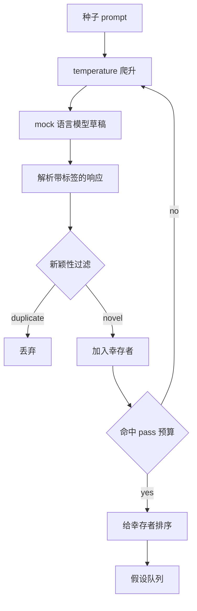

# 假设生成器（Hypothesis Generator）

> 译注：本文译自同目录 [`en.md`](./en.md)。术语遵循仓根 [TRANSLATION_GUIDE.md](../../../../TRANSLATION_GUIDE.md)。

> 一个把同一个问题问两遍的研究 agent 就是在浪费 token。诀窍是逼着每一稿都落到新的地方去。

**Type:** Build
**Languages:** Python
**Prerequisites:** Phase 19 Track A lessons 20-29
**Time:** ~90 minutes

## 学习目标（Learning Objectives）
- 用一个种子 prompt 驱动采样器，把它的输出转成带类型的假设记录。
- 每一轮都把采样器的 temperature 调高一档，让下一稿离上一稿更远。
- 用一个小型 embedding 模型加上 cosine 距离阈值过滤掉近似重复。
- 用一个综合 novelty（新颖度）、specificity（具体度）、testability（可测性）的打分函数给幸存者排序。
- 让每一步都保持确定性，这样同一个种子永远产生同一个队列。

## 为什么要先生成、再过滤（Why generate, then filter）

一个 planner 只问一个模型一次，得到一个假设。这对教学示例没问题，但对一个研究循环来说形状不对。循环要的是一个有深度、已经排好序的队列：第一个假设失败时，runner 手里立刻就有下一个，不用再付一次完整采样的代价。

要产出这种队列，靠两个想法的组合。第一个是 temperature ramp（温度爬升）：每一轮采样把 temperature 上调一档，鼓励后面的草稿往外飘。第二个是 novelty filter（新颖度过滤）：每出一稿，生成器就量一下它与所有先前幸存者的 embedding 距离，落在簇内的就拒掉。

本课配套一个 mock 语言模型，对固定的 prompt 返回脚本化的 token 序列。这个 mock 已经够把整条路径跑一遍：种子 prompt 进来、temperature ramp 应用、候选解析、novelty filter 跑一遍、排好序的队列出来。

## Hypothesis 的形状（The Hypothesis shape）

```text
Hypothesis
  id             : int           (monotonic within a run)
  text           : str           (the claim)
  variables      : list[str]     (what changes between conditions)
  metric         : str           (what the runner will measure)
  baseline_ref   : str | None    (which paper or run the comparison cites)
  draft_pass     : int           (which sampler pass produced this)
  temperature    : float         (the sampler setting at draft time)
  novelty_score  : float         (distance from prior survivors, 0..1)
  rank_score     : float         (weighted sum used for ordering)
```

`variables` 和 `metric` 不是自由文本。解析器从一个带标签的响应里把它们抽出来。第五十二课的 runner 在搭实验配置时会直接读这两个字段。

`baseline_ref` 可选，但建议填。第五十三课的 evaluator 需要一个 baseline（基线）来对照。如果假设里没填，evaluator 就退回到同一指标上的上一次运行。

## 架构（Architecture）



循环本身平铺直叙，有意思的地方是每个框都有一份硬约束。

## 温度爬升（Temperature ramp）

从 `t_min` 起步，到 `t_max` 收尾，步长 `(t_max - t_min) / (n_passes - 1)`。每一轮以当前 temperature 调用采样器，从 `GeneratorConfig.schedule()` 拿到 `n_passes` 个均匀分布的值。mock 模型靠在一组以 `(prompt, temp_bucket)` 为 key 的脚本化响应之间切换来体现 temperature 的作用。这些 bucket 是开区间，因此 temperature 的小改动会落到不同的 bucket，得到不同的草稿。在生产环境里，采样器就是个真的模型，把 `temperature=t` 透传进去即可。

默认的 schedule 是六轮，从 `0.2` 到 `1.2`。六轮足以把队列填满，又不至于多花钱在 novelty filter 反正会拒掉的样本上。低于 `0.2`，模型会把种子原样鹦鹉学舌；高于 `1.2`，响应容易跑题，过不了解析器。

## 新颖度过滤（Novelty filter）

每一稿被解析完，生成器就把文本 embed 一下，再与每个被接受的假设比较。embedding 是一个小型的 hashed bag of word tokens（哈希词袋），归一化到单位长度。两个单位向量之间的 cosine 距离就是 `1 - dot(a, b)`。一稿过关的条件是：它到任意先前幸存者的最小距离高于 `novelty_threshold`。默认值是 `0.25`。

这个 hashed embedding 不是什么花哨货色。它是确定性的、零依赖，而且足够抓住最明显的情况：两稿大部分名词重合。生产部署里换成一个小型 sentence 模型即可，接口保持不变。

## 排序得分（Rank score）

```text
rank_score = w_novelty * novelty_score
           + w_specificity * specificity_score
           + w_testability * testability_score
```

三个子分。`novelty_score` 是它与先前幸存者的最小 embedding 距离。`specificity_score` 是假设里具体变量数量除以目标数量。`testability_score`：同时给出 metric 和 baseline 时为 1，只有 metric 时为 0.5，都没有则为 0。

默认权重是 `0.4`、`0.3`、`0.3`。权重住在 generator 的 config 里，下游课程要调权重不需要 fork 代码。

## Mock 语言模型（Mock language model）

```python
class MockLLM:
    def sample(self, prompt: str, temperature: float, seed: int) -> str:
        ...
```

给定 `(prompt, temperature, seed)` 三元组，采样器是确定性的。mock 维护一张以 `(prompt_signature, temperature_bucket)` 为 key 的脚本化响应表。如果表里没有对应 key 的条目，采样器返回一个会让解析器失败的兜底值。其中一条测试就专门走这条 fallback 路径。

seed 会被混进响应里，因此同样的 `(prompt, temperature)` 配上不同 seed 会出不同的草稿。测试里我们把 seed 钉死以保证可复现。真实部署里，seed 会来自系统时钟或一个计数器。

## 输出队列（Output queue）

输出是一个 `Hypothesis` 记录列表，按 `rank_score` 降序排序。第五十二课的 runner 弹出队首、跑实验，第五十三课的 evaluator 把 verdict（裁决）写回去。如果 verdict 说这个假设错了，runner 就弹下一个。

队列是有限的。空了之后，orchestrator 要么把种子 prompt 放宽再跑一遍生成器，要么停下来上报「预算已耗尽」。

## 怎么读这份代码（How to read the code）

`code/main.py` 定义了 `Hypothesis`、`MockLLM`、`HypothesisGenerator` 以及一个确定性 demo。生成器对外只暴露一个 `run(seed_prompt)` 方法，返回一个排好序的队列；轮数从 `GeneratorConfig.n_passes` 读取，而不是作为参数传入。embedding 是一个 hashed bag of tokens。novelty filter 是一个函数。rank score 也是一个函数。整份代码不依赖 `numpy`；embedding 的数学全用标准库写成，本课程因此保持可移植。

`code/tests/test_generator.py` 覆盖了线性路径、重复拒绝路径、解析器失败路径、temperature ramp 的边界，以及排序顺序。

## 这一课嵌在哪里（Where this slots in）

第五十课产出队列。第五十一课取队首，跑一次文献检索来验证或反驳它。第五十二课同样取那个队首，跑一次真正的实验。第五十三课读这两份输出，写出 verdict。这四课组合成一个没有人参与的研究循环；任何边界上人都可以介入。
