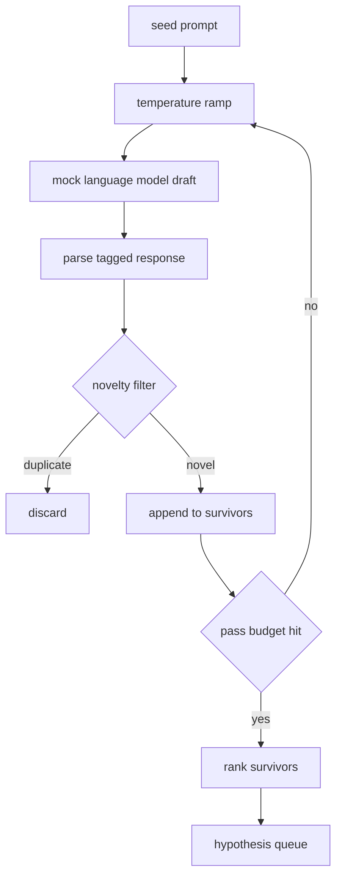

# 假设生成器

> 一个研究代理如果两次问同一个问题就是在浪费 token。诀窍在于迫使每一次生成的草稿都落在新的地方。

**类型：** 构建
**语言：** Python
**前置要求：** 阶段 19 Track A 第 20-29 课
**时长：** 约 90 分钟

## 学习目标

- 从一个种子提示驱动采样器，并将其输出转换为类型化的假设记录。
- 在每次传递中提高采样器的温度，使下一份草稿比上一份更远。
- 使用小型嵌入模型和余弦距离阈值过滤近似重复项。
- 使用结合了新颖性、具体性和可测试性的评分函数对幸存者进行排序。
- 保持每一步都是确定性的，使得相同的种子始终产生相同的队列。

## 为什么先生成再过滤

一个规划器调用一个模型一次，只能得到一个假设。这对于一个示例来说没问题，但对于研究循环来说，这种形态是错误的。循环需要一个有深度的排序队列，这样当第一个假设失败时，执行者可以立即使用下一个假设，而无需支付另一次完整采样传递的代价。

两个想法结合起来产生这个队列。第一个是温度递增：每次通过采样器时温度升高一档，促使后续草稿进行更多探索。第二个是新颖性过滤：每次生成草稿后，生成器测量它与之前每个幸存者的嵌入距离，并拒绝任何落在聚类内的草稿。

本课程附带了一个模拟语言模型，该模型为固定提示返回脚本化的 token 序列。这个模拟足以演练完整路径：输入种子提示、应用温度递增、解析候选假设、运行新颖性过滤、输出排序队列。

## 假设结构

```text
Hypothesis
  id             : int           （单次运行内单调递增）
  text           : str           （主张/断言）
  variables      : list[str]     （不同条件之间变化的内容）
  metric         : str           （执行者将要测量的指标）
  baseline_ref   : str | None    （比较所引用的论文或运行）
  draft_pass     : int           （由哪次采样传递产生）
  temperature    : float         （草稿生成时的采样器设置）
  novelty_score  : float         （与之前幸存者的距离，0..1）
  rank_score     : float         （用于排序的加权和）
```

`variables` 和 `metric` 不是自由文本。解析器从带标签的响应中提取它们。第五十二课的执行者在构建实验配置时直接读取这些字段。

`baseline_ref` 是可选的，但推荐提供。第五十三课的评估器需要一个基线来进行比较。如果假设省略了基线，评估器将回退到同一指标上的前一次运行。

## 架构


```mermaid
flowchart TD
    A[seed prompt] --> B[temperature ramp]
    B --> C[mock language model draft]
    C --> D[parse tagged response]
    D --> E{novelty filter}
    E -- duplicate --> F[discard]
    E -- novel --> G[append to survivors]
    G --> H{pass budget hit}
    H -- no --> B
    H -- yes --> I[rank survivors]
    I --> J[hypothesis queue]
```

这个循环很直接。有趣的是每个盒子都有一个严格的契约。

## 温度递增

从 `t_min` 开始，到 `t_max` 结束，步长为 `(t_max - t_min) / (n_passes - 1)`。每次传递以当前温度调用采样器，产生 `n_passes` 个来自 `GeneratorConfig.schedule()` 的均匀间隔值。模拟模型通过在一小组以 `(prompt, temp_bucket)` 为键的脚本化响应之间切换来响应温度。这些桶是开区间，因此温度的微小变化会选择不同的桶并产生不同的草稿。在生产环境中，采样器将是一个真实模型，并传入 `temperature=t`。

默认调度是六次传递，从 `0.2` 到 `1.2`。六次足以填满队列，而无需为新颖性过滤器最终会拒绝的样本付费。低于 `0.2` 时，模型会重复种子提示的内容。高于 `1.2` 时，响应往往会偏离主题并导致解析失败。

## 新颖性过滤

每次草稿被解析后，生成器对文本进行嵌入，并与每个已接受的假设进行比较。嵌入是一个小型哈希词袋表示，归一化为单位长度。两个单位向量之间的余弦距离为 `1 - dot(a, b)`。如果一份草稿与任何先前幸存者的最小距离高于 `novelty_threshold`，则通过过滤。默认值为 `0.25`。

哈希嵌入并不花哨。它是确定性的，零依赖，并且足以捕获明显的重复情况：两份草稿共享了大部分名词。生产部署可以替换为一个小型句子模型。接口保持不变。

## 排名评分

```text
rank_score = w_novelty * novelty_score
           + w_specificity * specificity_score
           + w_testability * testability_score
```

三个子分数。`novelty_score` 是与先前幸存者的最小嵌入距离。`specificity_score` 是假设中具体变量的数量除以目标数量。`testability_score`：如果假设同时指定了指标和基线则为 1，如果只有指标则为 0.5，否则为 0。

默认权重为 `0.4`、`0.3`、`0.3`。权重位于生成器配置中，以便后续课程可以在不分支代码的情况下调整它们。

## 模拟语言模型

```python
class MockLLM:
    def sample(self, prompt: str, temperature: float, seed: int) -> str:
        ...
```

采样器在给定 `(prompt, temperature, seed)` 三元组时是确定性的。模拟模型维护一个以 `(prompt_signature, temperature_bucket)` 为键的脚本化响应表。如果表中没有对应键的条目，采样器返回一个会导致解析失败的兜底响应。其中一项测试会覆盖这个兜底路径。

种子被混入响应中，因此相同的 `(prompt, temperature)` 对使用不同种子会产生不同的草稿。在测试中，我们会固定种子以保持结果可重现。在实际部署中，种子将来自系统时钟或计数器。

## 输出队列

输出是一个按 `rank_score` 降序排列的 `Hypothesis` 记录列表。第五十二课的执行者弹出队首，运行实验，第五十三课的评估器写回判定结果。如果判定结果说明该假设是错误的，执行者就弹出下一个假设。

队列是有限的。当队列为空时，编排器可以扩大种子提示并重新运行生成器，或者停止并报告预算已耗尽。

## 如何阅读代码

`code/main.py` 定义了 `Hypothesis`、`MockLLM`、`HypothesisGenerator` 以及一个确定性演示。生成器暴露了一个单一的 `run(seed_prompt)` 方法，该方法返回一个排序后的队列；传递次数从 `GeneratorConfig.n_passes` 读取，而不是作为参数传入。嵌入是哈希词袋表示。新颖性过滤是一个独立的函数。排名评分也是一个独立的函数。不依赖 `numpy`；嵌入计算完全使用标准库，以保证课程的可移植性。

`code/tests/test_generator.py` 覆盖了线性路径、重复拒绝路径、解析失败路径、温度递增边界以及排名排序。

## 在整个课程中的位置

第五十课生成队列。第五十一课取出队首并运行文献搜索来确认或反驳它。第五十二课取出同一个队首并运行实际的实验。第五十三课读取两者的输出并写回判定结果。这四节课组合成一个没有人工介入的研究循环；人类可以在任何边界介入。
