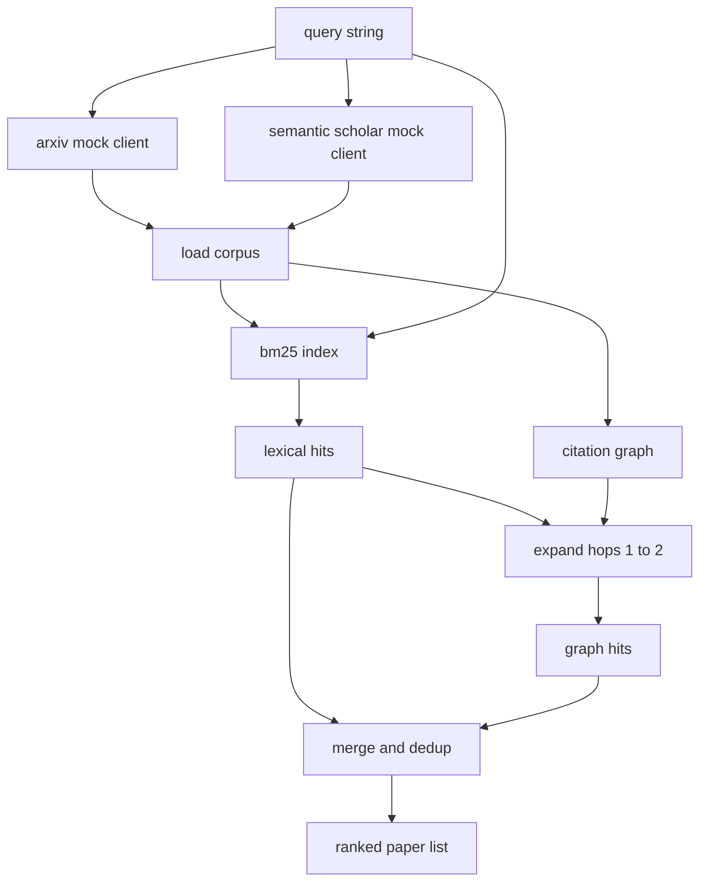

# 文献検索

> 仮説を作るのは安いです。誰かがすでに証明していないかを知る部分が高くつきます。runner が sandbox を起動する前に、その問いへ答える retrieval layer を作ります。

**種別:** Build
**言語:** Python
**前提:** Phase 19 Track A lessons 20-29
**時間:** 約90分

## 学習目標
- 後続ループが読む field を持つ小さな `Paper` レコードを model 化する。
- stdlib の data structure だけで abstract 上の BM25 index を作る。
- citation graph をたどり、lexical search が見落とした paper を浮かび上がらせる。
- lexical pass と graph pass の hit を stable paper id で deduplicate する。
- 二つの mock external API を一つの client の背後に包み、実 endpoint に替えても upstream call site を変えない。

## なぜ retrieval pass が二つ必要か

abstract の keyword search は query と語彙を共有する paper を返します。多くの場合は十分ですが、二つのケースを落とします。一つは、基礎的な paper が別の語彙を使う場合です。例えば `"sparse attention"` という query は `"block selection in transformer routing"` という title を落とすかもしれません。もう一つは、既知の anchor を引用する follow-up paper です。abstract pool を総当たりするより、anchor から前後に graph を歩くほうが効率的です。

このレッスンでは両方を実装します。abstract 上の BM25 が lexical hit を拾い、citation graph traversal が seed set を前後1から2 hop に広げます。和集合を paper id で deduplicate し、小さな combined score で順位付けします。

## Paper の形

```text
Paper
  id          : str           (stable identifier, mock corpus では "p001")
  title       : str
  abstract    : str
  year        : int
  authors     : list[str]
  references  : list[str]     (この paper が引用する paper id)
  citations   : list[str]     (この paper を引用する paper id)
  source      : str           (どの mock api が供給したか、"arxiv" or "s2")
```

`references` と `citations` が有向 citation graph を構成します。二つの mock API は重なりつつも異なる field を返すため、corpus loader は `id` で union します。

## アーキテクチャ



retrieval client は二つの pass と merge を所有します。caller は query を渡し、各 entry に `bm25_score`, `graph_distance`, `recency_score`, `final_score` を持つ ranked list を受け取ります。

## BM25 from scratch

実装は標準的な Okapi BM25 で、default parameter は `k1=1.5`, `b=0.75` です。index は `term -> doc_frequency` と `term -> list of (doc_id, term_count)` の二つの辞書で構成します。document length は abstract の token 数、average document length は index build 時に一度だけ計算します。query の score は query term ごとの `idf * tf_norm` の合計です。

tokeniser は `lower` して non alphanumeric で split します。stemming はしません。本番では小さな stemmer に差し替えられますが、interface は同じです。

```text
idf(t)      = log((N - df + 0.5) / (df + 0.5) + 1.0)
tf_norm(t)  = (f * (k1 + 1)) / (f + k1 * (1 - b + b * dl / avgdl))
score(d, q) = sum over t in q of idf(t) * tf_norm(t)
```

## Citation graph traversal

graph は corpus から一度だけ作ります。forward edge は paper から references へ、backward edge は paper から citations へ向かいます。traversal は top BM25 hits を seed にした breadth first search で、最大2 hop です。

2 hop は意図的な上限です。1 hop は浅すぎ、3 hop は connected graph 上で result size が膨らみ、話題から逸れがちです。hop limit は config knob として公開され、後続 loop が締められます。

## Dedup と ranking

二つの pass は重なる集合を返します。merge は paper id で行います。final score は重み付き blend です。

```text
final_score = w_bm25 * bm25_score_norm
            + w_graph * graph_score
            + w_recency * recency_score
```

`bm25_score_norm` は merged set 内の最大 BM25 score で割った値です。`graph_score` は direct lexical hit で1、1 hop で `0.6`、2 hop で `0.3`、それ以外は0です。`recency_score` は corpus の最小年を0、最大年を1にした linear ramp です。

## Mock corpus

corpus は `build_corpus()` が作る100本の paper です。topic は attention sparsity、retrieval augmentation、low rank adapters、dataset distillation、evaluation harnesses の五つです。各 topic は connected sub graph になり、少数の cross-topic edge を持ちます。

`ArxivMockClient` は title, abstract, year, authors を返します。`SemanticScholarMockClient` は references と citations も返します。retrieval client は id で union します。

## lessons 52 と 53 が読むもの

lesson 52 の runner は `paper.id`, `paper.title`, abstract の上位三文を実験 context として読みます。lesson 53 の evaluator は `paper.year` と `paper.references` を読み、baseline を特定の paper に帰属させます。

`RetrievalResult` は ranked list と query metrics を返します。metrics は hit count、average score、top score、total wall time です。

## コードの読み方

`code/main.py` は `Paper`, mock clients, `BM25Index`, `CitationGraph`, `RetrievalClient`, 決定的 demo を定義します。mock clients と corpus は同じファイルにあり、lesson は portable です。BM25 は一つの class、graph traversal は一つの method です。

`code/tests/test_retrieval.py` は lexical path、graph path、merge、dedup、empty query を確認します。

## 位置づけ

lesson 50 が仮説を作ります。lesson 51 は、その仮説が文献上ですでに決着しているかを調べます。決着していなければ lesson 52 が実験を実行し、lesson 53 が retrieval result と experiment metrics を読んで verdict を書きます。retrieval client は四段階の中で最も安いので、orchestrator では最初に走ります。
