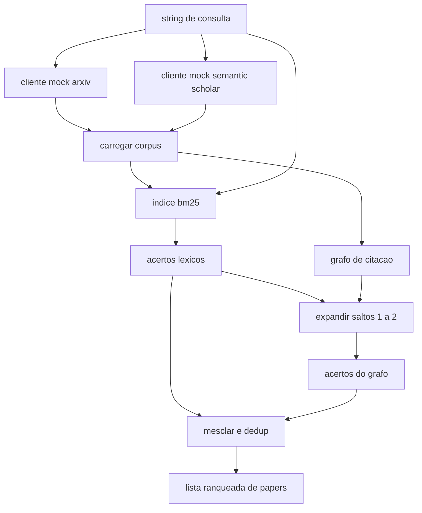

# Aula 51: Recuperacao de Literatura

> Uma hipotese e barata. Saber se alguem ja provou isso e a parte cara. Construa a camada de recuperacao que responde essa pergunta antes que o executor inicie um sandbox.

**Tipo:** Build
**Linguagens:** Python
**Prerequisitos:** Aulas 20-29 da Fase 19, Track A
**Tempo:** ~90 minutos

## Objetivos de Aprendizado
- Modelar um registro pequeno de paper com os campos que o loop vai ler downstream.
- Construir um indice BM25 sobre resumos apenas com estruturas de dados da biblioteca padrao.
- Caminhar um grafo de citacao para mostrar papers que a busca lexica perdeu.
- Deduplicar resultados entre as passagens lexica e de grafo por id estavel de paper.
- Envolver duas APIs externas mocks atras de um unico cliente para que o local de chamada upstream permaneca o mesmo quando endpoints reais chegarem.

## Por que duas passagens de recuperacao

Uma busca por palavras-chave sobre resumos retorna papers que compartilham vocabulario com a consulta. Isso cobre a maioria da superficie. Ela perde dois casos. O primeiro e quando o paper fundamental usa vocabulario diferente; por exemplo uma consulta por "sparse attention" perde um paper intitulado "block selection in transformer routing". O segundo e quando o paper relevante e um follow-up que cita uma ancora conhecida; e mais eficiente encontrar a ancora e caminhar para frente do que forca bruta no pool de resumos.

A aula constroi ambas as passagens. BM25 sobre resumos pega os acertos lexicos. Uma travessia do grafo de citacao expande um conjunto semente para frente e para tras por um ou dois saltos. A uniao e deduplicada por id de paper e ranqueada por uma pontuacao combinada pequena.

## A forma do Paper

```text
Paper
  id          : str           (identificador estavel, "p001" para o corpus mock)
  title       : str
  abstract    : str
  year        : int
  authors     : list[str]
  references  : list[str]     (ids de papers que este paper cita)
  citations   : list[str]     (ids de papers que citam este paper)
  source      : str           (qual mock api o forneceu, "arxiv" ou "s2")
```

Os campos references e citations formam o grafo de citacao direcionado. As duas APIs mocks retornam campos sobrepostos mas nao identicos, entao o carregador do corpus os unifica em `id`.

## Arquitetura



O cliente de recuperacao owns ambas as passagens e a mesclagem. O chamador entrega uma consulta e recebe de volta uma lista ranqueada onde cada entrada carrega campos de pontuacao por paper (`bm25_score`, `graph_distance`, `recency_score`, `final_score`) que explicam o ranqueamento.

## BM25 do zero

A implementacao e o Okapi BM25 padrao com parametros padrao `k1=1.5`, `b=0.75`. O indice e dois dicionarios: `termo -> frequencia_de_documento` e `termo -> lista de (doc_id, contagem_de_termo)`. O comprimento do documento e a contagem de tokens do resumo. O comprimento medio do documento e computado uma vez na construcao do indice. Pontuar uma consulta e uma soma sobre termos da consulta de `idf * tf_norm` onde `tf_norm` e a frequencia de termo normalizada por comprimento padrao BM25.

O tokenizador e `lower` depois split em nao-alfanumerico. Nao e stemmatizado. Um sistema de producao trocaria por um stemmer pequeno. A interface continua a mesma.

```text
idf(t)      = log((N - df + 0.5) / (df + 0.5) + 1.0)
tf_norm(t)  = (f * (k1 + 1)) / (f + k1 * (1 - b + b * dl / avgdl))
score(d, q) = soma sobre t em q de idf(t) * tf_norm(t)
```

## Travessia do grafo de citacao

O grafo e construido uma vez a partir do corpus. Arestas para frente vao de um paper para suas references. Arestas para tras vao de um paper para suas citations. A travessia e uma busca em largura (BFS) semeada pelos top acertos BM25, limitada a dois saltos.

Dois saltos sao um limite deliberado. Um salto e raso demais; o agente frequentemente quer o ancestral ou descendente imediato. Tres saltos explodem o tamanho do resultado em um grafo conectado e tendem a divagar do topico. A aula expoe o limite de saltos como um botao de config para que um loop downstream possa aperta-lo.

## Dedup e ranqueamento

As duas passagens retornam conjuntos sobrepostos. A mesclagem usa paper id como chave. Para cada paper a pontuacao final e uma mistura ponderada.

```text
final_score = w_bm25 * bm25_score_norm
            + w_graph * graph_score
            + w_recency * recency_score
```

`bm25_score_norm` e a pontuacao BM25 dividida pela pontuacao BM25 maxima no conjunto mesclado (para que o campo fique de zero a um). `graph_score` e um para acertos lexicos diretos, depois `0.6` para um salto, `0.3` para dois saltos, zero caso contrario. `recency_score` e uma rampa linear de zero no ano minimo do corpus a um no maximo.

Pesos padrao sao `0.5`, `0.3`, `0.2`. Os pesos sao config; um topico obsoleto pode ajustar recency para baixo enquanto um topico que se move rapido o aumenta.

## Corpus mock

O corpus e cem papers, gerado por `build_corpus()`. Cada paper tem titulo e resumo escritos a mao em um de cinco topicos: esparsidade de attention, augmentacao por recuperacao, adaptadores de baixo rank, destilacao de dataset, e harnesses de avaliacao. References e citations sao conectados para que cada topico forme um sub-grafo conectado com algumas arestas entre topicos.

Os dois clientes de API mock (`ArxivMockClient`, `SemanticScholarMockClient`) leem do mesmo corpus mas expoem campos diferentes. Arxiv retorna titulo, resumo, ano, autores. Semantic Scholar adiciona references e citations. O cliente de recuperacao unifica em id; o tratamento de divergencias de campo entre clientes e adiado para uma aula posterior.

## O que as aulas 52 e 53 leem

O executor na aula 52 le `paper.id`, `paper.title`, e as tres primeiras frases do resumo como contexto para o experimento. O avaliador na aula 53 le `paper.year` e `paper.references` para atribuir uma baseline a um paper eespecificaçãoifico.

O cliente de recuperacao retorna um `RetrievalResult` com tanto a lista ranqueada quanto as metricas por consulta: contagem de acertos, media de pontuacao, pontuacao maxima, tempo de parede total. O executor loga essas para que uma passagem de observabilidade downstream possa plotar qualidade ao longo do tempo.

## Como ler o codigo

`code/main.py` define `Paper`, `ArxivMockClient`, `SemanticScholarMockClient`, `BM25Index`, `CitationGraph`, `RetrievalClient`, e um demo deterministico. Os clientes mock e o corpus estao no mesmo arquivo para que a aula permaneca portavel. A implementacao BM25 e uma classe, sessenta linhas. A travessia do grafo e um metodo.

`code/tests/test_retrieval.py` cobre o caminho lexico, o caminho do grafo, a mesclagem, o dedup, e a consulta vazia.

## Onde isso encaixa

A aula 50 produz uma hipotese. A aula 51 busca na literatura para ver se aquela hipotese ja foi resolvida. A aula 52 roda o experimento se nao foi. A aula 53 le tanto o resultado da recuperacao quanto as metricas do experimento para escrever o veredicto. O cliente de recuperacao e o mais barato dos quatro estagios e roda primeiro no orchestrator.
