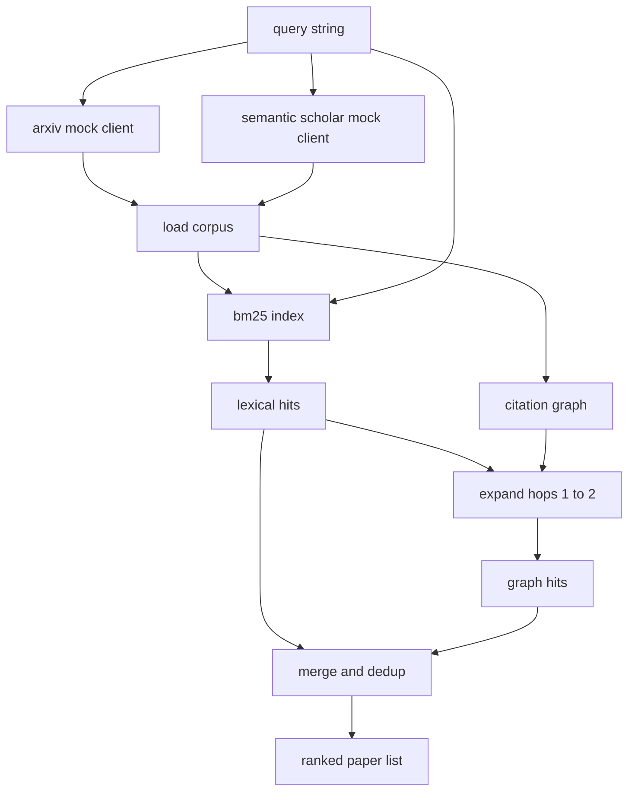

# Literatür Erişimi

> Bir hipotez ucuzdur. Birinin bunu zaten kanıtlayıp kanıtlamadığını bilmek işin pahalı kısmıdır. Koşucu sandbox'ı açmadan önce bu soruyu yanıtlayan geri alma katmanını oluşturun.

**Tür:** Yapım
**Diller:** Python
**Önkoşullar:** Aşama 19 Bölüm A dersleri 20-29
**Süre:** ~90 dakika

## Öğrenme Hedefleri
- Döngünün aşağı yönde okuyacağı alanlarla küçük bir kağıt kaydı modelleyin.
- Yalnızca stdlib veri yapılarına sahip özetler üzerinden bir BM25 dizini oluşturun.
- Sözcüksel aramanın kaçırdığı makaleleri yüzeye çıkarmak için bir alıntı grafiğini yürütün.
- Sabit kağıt kimliğiyle sözcüksel ve grafik geçişlerindeki tekilleştirme isabetleri.
- İki sahte harici API'yi tek bir istemcinin arkasına sarın, böylece gerçek uç noktalar geldiğinde yukarı akış çağrı sitesi aynı kalır.

## Neden iki geri alma geçişi

Özetler üzerinde yapılan anahtar kelime araması, sorguyla aynı kelime dağarcığını paylaşan makaleleri döndürür. Bu yüzeyin çoğunu kapsıyor. İki vakayı kaçırıyor. Bunlardan ilki, temel makalenin farklı sözcükler kullanmasıdır; örneğin, "az dikkat" sorgusu "transformer yönlendirmede blok seçimi" başlıklı makaleyi kaçırıyor. İkincisi, ilgili makalenin bilinen bir haber kaynağına atıfta bulunan bir devam yazısı olması; Soyut havuza kaba kuvvet uygulamak yerine çapayı bulup ileri yürümek daha verimlidir.

Ders her iki geçişi de oluşturur. BM25 özetler üzerinden sözcüksel isabetleri yakalar. Bir alıntı grafiği geçişi, bir tohum kümesini bir veya iki atlama kadar ileri ve geri genişletir. Birlik, kağıt kimliğine göre tekilleştirilir ve küçük bir birleşik puana göre sıralanır.

## Kağıt şekli

```text
Paper
  id          : str           (stable identifier, "p001" for the mock corpus)
  title       : str
  abstract    : str
  year        : int
  authors     : list[str]
  references  : list[str]     (paper ids this paper cites)
  citations   : list[str]     (paper ids that cite this paper)
  source      : str           (which mock api supplied it, "arxiv" or "s2")
```

Referanslar ve alıntılar alanları yönlendirilmiş alıntı grafiğini oluşturur. İki sahte API, çakışan ancak aynı olmayan alanları döndürür, dolayısıyla derlem yükleyicisi bunları `id` üzerinde birleştirir.

## Mimarlık



Alma istemcisi hem geçişlerin hem de birleştirmenin sahibidir. Arayan kişi ona bir sorgu verir ve her girişin, sıralamayı açıklayan kağıt puanı başına alanları (`bm25_score`, `graph_distance`, `recency_score`, `final_score`) taşıdığı sıralanmış bir liste alır.

## BM25 sıfırdan

Uygulama, varsayılan parametreler `k1=1.5`, `b=0.75` olan standart Okapi BM25'tir. Dizin iki sözlükten oluşur: `term -> doc_frequency` ve `term -> list of (doc_id, term_count)`. Belge uzunluğu özetin token sayısıdır. Ortalama belge uzunluğu, dizin oluşturma sırasında bir kez hesaplanır. Bir sorgunun puanlanması, `idf * tf_norm` sorgu terimlerinin toplamıdır; burada `tf_norm` , standart BM25 uzunluğu normalleştirilmiş terim frekansıdır.

tokeniser `lower` olur ve alfasayısal olmayan bir şekilde bölünür. Köklü değildir. Bir üretim sistemi küçük bir saplayıcıyla değiştirilir. Arayüz aynı kalır.

```text
idf(t)      = log((N - df + 0.5) / (df + 0.5) + 1.0)
tf_norm(t)  = (f * (k1 + 1)) / (f + k1 * (1 - b + b * dl / avgdl))
score(d, q) = sum over t in q of idf(t) * tf_norm(t)
```

## Alıntı grafiği geçişi

Grafik, derlemden bir kez oluşturulur. İleri kenarlar bir kağıttan referanslarına gider. Geriye doğru kenarlar bir makaleden alıntılara kadar uzanır. Geçiş, iki atlamayla sınırlanan, en iyi BM25 isabetlerinin tohumladığı geniş kapsamlı bir ilk aramadır.

İki atlama kasıtlı bir tavandır. Bir atlama çok sığdır; agent genellikle yakın atayı veya soyunu ister. Üç atlama, bağlantılı bir grafikte sonuç boyutunu büyütür ve konunun dışına çıkma eğilimi gösterir. Ders, aşağı akış döngüsünün onu sıkılaştırabilmesi için atlama sınırını bir yapılandırma düğmesi olarak ortaya koyuyor.

## Tekilleştirme ve sıralama

İki geçiş, örtüşen kümeleri döndürür. Kağıt kimliğindeki birleştirme tuşları. Her makale için nihai puan ağırlıklı bir karışımdır.

```text
final_score = w_bm25 * bm25_score_norm
            + w_graph * graph_score
            + w_recency * recency_score
```

`bm25_score_norm` , BM25 puanının birleştirilmiş kümedeki maksimum BM25 puanına bölünmesiyle elde edilir (böylece alan sıfıra birde yaşar). `graph_score` doğrudan sözcüksel isabetler için birdir, ardından bir atlama için `0.6` , iki atlama için `0.3` , aksi halde sıfırdır. `recency_score` , külliyat minimum yılında sıfırdan maksimum yılda bire doğru doğrusal bir rampadır.

Varsayılan ağırlıklar: `0.5`, `0.3`, `0.2`. Ağırlıklar yapılandırılmıştır; Eski bir konu güncelliği azaltabilir, hızlı hareket eden bir konu ise güncelliği artırabilir.

## Sahte külliyat

Derlem, `build_corpus()` tarafından oluşturulan yüz makaleden oluşmaktadır. Her makalenin beş konudan biri hakkında elle yazılmış bir başlığı ve özeti vardır: dikkat seyrekliği, geri getirme artırma, düşük dereceli bağdaştırıcılar, dataset damıtma ve değerlendirme koşum takımı. Referanslar ve alıntılar birbirine bağlanmıştır, böylece her konu birkaç çapraz konu kenarıyla bağlantılı bir alt grafik oluşturur.

İki sahte API istemcisi (`ArxivMockClient`, `SemanticScholarMockClient`) aynı derlemden okur ancak farklı alanları açığa çıkarır. Arxiv başlığı, özeti, yılı ve yazarları döndürür. Semantic Scholar, referanslar ve alıntılar ekler. Kimlikteki alma müşteri birlikleri; Müşteriler arası saha anlaşmazlıklarının ele alınması bir takip dersine ertelenir.

## 52 ve 53. derslerde okunanlar

Elli ikinci dersteki koşucu deneyin bağlamı olarak `paper.id`, `paper.title` ve özetin ilk üç cümlesini okur. Elli üçüncü dersteki değerlendirici, bir temel çizgiyi belirli bir makaleye atfetmek için `paper.year` ve `paper.references` okur.

Alma istemcisi hem sıralı listeyi hem de sorgu başına metrikleri içeren bir `RetrievalResult` döndürür: isabet sayısı, ortalama puan, en yüksek puan, toplam duvar süresi. Koşucu bunları günlüğe kaydeder, böylece aşağı yönlü bir observability geçişi zaman içindeki kaliteyi çizebilir.

## Kod nasıl okunur

`code/main.py` , `Paper`, `ArxivMockClient`, `SemanticScholarMockClient`, `BM25Index`, `CitationGraph`, `RetrievalClient` ve deterministik bir demoyu tanımlar. Sahte istemciler ve derlem aynı dosyada olduğundan ders taşınabilir kalır. BM25 uygulaması tek sınıf, altmış satırdır. Grafik geçişi bir yöntemdir.

`code/tests/test_retrieval.py` sözcüksel yolu, grafik yolunu, birleştirmeyi, tekilleştirmeyi ve boş sorguyu kapsar.

## Bunun yeri neresi

Elli ders bir hipotez üretiyor. Elli birinci ders, bu hipotezin halihazırda yerleşmiş olup olmadığını görmek için literatürü araştırıyor. Eğer öyle değilse, elli ikinci ders deneyi yürütür. Elli üçüncü ders, kararı yazmak için hem alma sonucunu hem de deney ölçümlerini okur. Alma istemcisi dört aşamadan en ucuz olanıdır ve orkestratörde ilk önce çalıştırılır.
