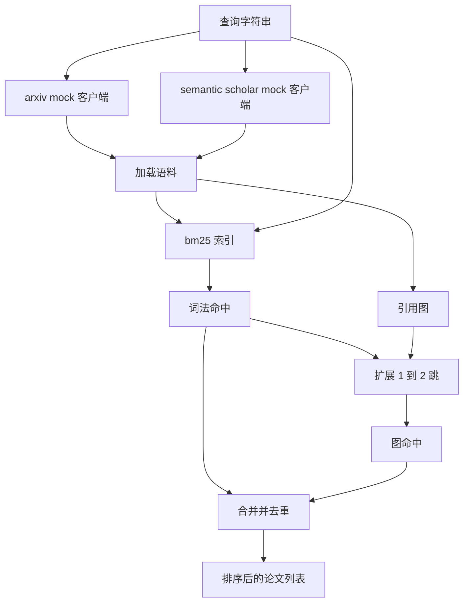

# 文献检索（Literature Retrieval）

> 译注：本文译自同目录 [`en.md`](./en.md)。术语遵循仓根 [TRANSLATION_GUIDE.md](../../../../TRANSLATION_GUIDE.md)。

> 提出一个假设很便宜，搞清楚是不是已经有人证过才是贵的部分。在 runner 启动 sandbox 之前，先把回答这个问题的检索层搭起来。

**Type:** Build
**Languages:** Python
**Prerequisites:** Phase 19 Track A lessons 20-29
**Time:** ~90 minutes

## 学习目标（Learning Objectives）
- 设计一个小型的论文记录结构，字段要刚好够下游 loop 读取。
- 仅用标准库的数据结构，在 abstract（摘要）上构建一个 BM25 索引。
- 遍历引用图，把词法检索漏掉的论文捞出来。
- 用稳定的 paper id 在词法和图两路命中结果之间去重。
- 把两个 mock 外部 API 包在同一个 client 之后，这样真实 endpoint 上线时上游调用点不需要动。

## 为什么要两路检索（Why two retrieval passes）

在 abstract 上做关键词检索能返回与查询共享词汇的论文，覆盖了大部分情况。但漏掉两类。第一类是奠基性论文使用了不同的词汇，比如查询「sparse attention」会漏掉一篇标题为「block selection in transformer routing」的论文。第二类是相关论文是某个已知锚点论文的后续工作并引用了它；这种情况下找到锚点再往前走比在 abstract 池里暴力搜要高效得多。

本课把两路都搭起来。abstract 上的 BM25 抓词法命中。引用图遍历从一组种子出发，沿前后方向扩展一到两 hop（hop 计数器）。两路求并集后按 paper id 去重，再用一个小的组合分数排序。

## Paper 的形状（The Paper shape）

```text
Paper
  id          : str           (stable identifier, "p001" for the mock corpus)
  title       : str
  abstract    : str
  year        : int
  authors     : list[str]
  references  : list[str]     (paper ids this paper cites)
  citations   : list[str]     (paper ids that cite this paper)
  source      : str           (which mock api supplied it, "arxiv" or "s2")
```

`references` 和 `citations` 字段构成有向引用图。两个 mock API 返回的字段有重叠但不完全相同，所以语料加载器在 `id` 上对它们求并集。

## 架构（Architecture）



检索 client 同时拥有两路检索和合并逻辑。调用方把 query 交给它，拿回一个排好序的列表，每一项都带着按论文计算的分数字段（`bm25_score`、`graph_distance`、`recency_score`、`final_score`），用来解释排名。

## 从零实现 BM25（BM25 from scratch）

实现就是标准的 Okapi BM25，默认参数 `k1=1.5`、`b=0.75`。索引是两个字典：`term -> doc_frequency` 和 `term -> list of (doc_id, term_count)`。文档长度是 abstract 的 token 数。平均文档长度在索引构建时算一次。给一个 query 打分，就是对 query 中所有 term 求 `idf * tf_norm` 之和，其中 `tf_norm` 是标准的 BM25 文档长度归一化 term 频。

tokenizer 的实现是先 `lower` 再按非字母数字字符切分。不做词干化（stemming）。生产系统会换一个小的 stemmer，但接口保持不变。

```text
idf(t)      = log((N - df + 0.5) / (df + 0.5) + 1.0)
tf_norm(t)  = (f * (k1 + 1)) / (f + k1 * (1 - b + b * dl / avgdl))
score(d, q) = sum over t in q of idf(t) * tf_norm(t)
```

## 引用图遍历（Citation graph traversal）

图从语料里一次性构建好。前向边是从一篇论文指向它的 references；反向边是从一篇论文指向它的 citations。遍历是以 BM25 top 命中为种子的 BFS（广度优先搜索），最多走两 hop。

两 hop 是刻意设的上限。一 hop 太浅，agent 经常想要的就是直接的祖先或后代。三 hop 在连通图上结果会爆炸，而且容易跑题。本课把 hop 上限做成配置项，下游 loop 可以自己收紧。

## 去重和排序（Dedup and ranking）

两路返回的集合会有重叠。合并以 paper id 为键。每篇论文的最终分数是一个加权混合。

```text
final_score = w_bm25 * bm25_score_norm
            + w_graph * graph_score
            + w_recency * recency_score
```

`bm25_score_norm` 是 BM25 分数除以合并集合中的最大 BM25 分数（这样这个字段落在 0 到 1 之间）。`graph_score` 对直接的词法命中是 1，一 hop 是 `0.6`，二 hop 是 `0.3`，否则为 0。`recency_score` 是一条线性斜坡，从语料最小年份的 0 升到最大年份的 1。

默认权重是 `0.5`、`0.3`、`0.2`。这些权重是配置项；过时的话题可以把 recency 调低，快速演化的话题则调高。

## Mock 语料（Mock corpus）

语料是 100 篇论文，由 `build_corpus()` 生成。每篇都有手写的标题和 abstract，覆盖五个主题：attention sparsity、retrieval augmentation、low rank adapters、dataset distillation 和 evaluation harnesses。references 和 citations 的接线让每个主题构成一个连通子图，并带一些跨主题的边。

两个 mock API client（`ArxivMockClient`、`SemanticScholarMockClient`）从同一份语料里读，但暴露的字段不同。Arxiv 返回 title、abstract、year、authors。Semantic Scholar 额外加上 references 和 citations。检索 client 在 id 上求并集；跨 client 的字段冲突处理留到后续 lesson。

## Lesson 52 和 53 会读什么（What lessons 52 and 53 read）

lesson 52 里的 runner 读 `paper.id`、`paper.title`，以及 abstract 的前 3 句作为实验的上下文。lesson 53 里的 evaluator 读 `paper.year` 和 `paper.references`，把 baseline（基线）归属到具体的论文。

检索 client 返回一个 `RetrievalResult`，里面同时包含排好序的列表和每次查询的指标：命中数、平均分、最高分、总 wall time。runner 把这些指标记下来，下游可观测性环节就可以画出质量随时间变化的图。

## 怎么读代码（How to read the code）

`code/main.py` 定义了 `Paper`、`ArxivMockClient`、`SemanticScholarMockClient`、`BM25Index`、`CitationGraph`、`RetrievalClient`，以及一个确定性 demo。mock client 和语料放在同一个文件里，让本课保持可移植。BM25 的实现是一个类、60 行。图遍历是一个方法。

`code/tests/test_retrieval.py` 覆盖了词法路径、图路径、合并、去重和空 query。

## 这一课嵌在哪里（Where this slots in）

lesson 50 产出一个假设。lesson 51 检索文献，看这个假设是否已经被定论。lesson 52 在没有定论时跑实验。lesson 53 同时读检索结果和实验指标，写 verdict（裁决）。检索 client 是这四个阶段里最便宜的一个，在 orchestrator 中跑在最前面。
