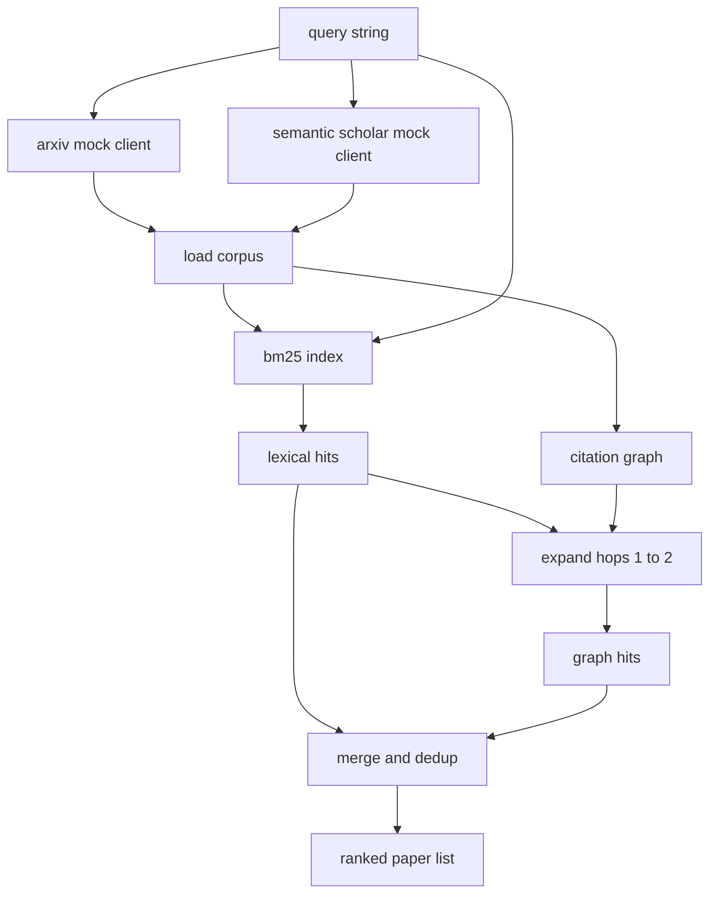

# 51 · 文献检索

> 提出一个假设并不贵。贵的是搞清楚是否已经有人证明过它。构建一个检索层，在 Runner 启动沙箱之前回答这个问题。

**类型：** 构建
**语言：** Python
**前置：** 第 19 阶段 A 赛道第 20–29 课
**时长：** 约 90 分钟

## 学习目标
- 用下游循环会读取的字段，建模一个小型论文（Paper）记录结构。
- 仅使用标准库数据结构在摘要上构建一个 BM25 索引。
- 遍历引用图（Citation Graph），找出词汇搜索（Lexical Search）遗漏的论文。
- 按稳定的论文 ID 对词汇检索结果与图遍历结果进行去重。
- 将两个模拟 API（Mock API）包装在同一个客户端后面，使上游调用点在真实接口上线时保持不变。

## 为什么需要两次检索

对摘要做关键词搜索，返回的是与查询共享词汇的论文，这能覆盖绝大多数情况，但会漏掉两类场景。第一类是奠基性论文使用了不同的术语：比如查询「sparse attention」会漏掉标题为「block selection in transformer routing」的论文。第二类是相关论文是某篇已知锚点论文的后继工作——先找到锚点再向前遍历，比暴力扫描所有摘要效率更高。

本课同时构建两次检索。论文摘要上的 BM25 负责命中词汇匹配的论文。引用图遍历以初始结果集为种子，向前向后扩展一到两跳。对并集按论文 ID 去重，再按一个简单的综合得分排序。

## Paper 数据结构

```text
Paper
  id          : str           （稳定标识符，模拟语料库中使用 "p001"）
  title       : str
  abstract    : str
  year        : int
  authors     : list[str]
  references  : list[str]     （本文引用的论文 id）
  citations   : list[str]     （引用本文的论文 id）
  source      : str           （由哪个模拟 API 提供，"arxiv" 或 "s2"）
```

references 和 citations 字段共同构成有向引用图。两个模拟 API 返回的字段有交集但不完全相同，因此语料库加载器会按 `id` 对这些字段做并集合并。

## 架构



检索客户端同时掌管两次检索和合并逻辑。调用方传入查询字符串，得到一个排序后的论文列表，每条记录都携带解释其排序的逐项得分字段（`bm25_score`、`graph_distance`、`recency_score`、`final_score`）。

## 从零实现 BM25

实现采用标准 Okapi BM25，默认参数为 `k1=1.5`、`b=0.75`。索引由两个字典构成：`term -> doc_frequency` 以及 `term -> list of (doc_id, term_count)`。文档长度取摘要的 token 数量。平均文档长度在索引构建时一次性计算得出。对查询打分即对所有查询词项的 `idf * tf_norm` 求和，其中 `tf_norm` 是标准的 BM25 长度归一化词频。

分词器方案：先 `lower` 再按非字母数字字符拆分，不做词干提取。生产系统中可以换成一个轻量级词干提取器，接口保持不变。

```text
idf(t)      = log((N - df + 0.5) / (df + 0.5) + 1.0)
tf_norm(t)  = (f * (k1 + 1)) / (f + k1 * (1 - b + b * dl / avgdl))
score(d, q) = sum over t in q of idf(t) * tf_norm(t)
```

## 引用图遍历

图在语料库加载时一次性构建。前向边从一篇论文指向其参考文献，后向边从一篇论文指向引用它的论文。遍历是以 BM25 的 top 命中结果为种子的广度优先搜索（BFS），上限为两跳。

两跳是刻意设定的上限。一跳太浅，Agent 通常需要的是直接的祖先或后代。三跳会在连通图上导致结果量爆炸，且容易偏离主题。本课把跳数上限暴露为可配置参数，下游循环可以根据需要收紧。

## 去重与排序

两次检索会返回重叠的结果集。合并时按论文 ID 去重。每篇论文的最终得分是加权组合。

```text
final_score = w_bm25 * bm25_score_norm
            + w_graph * graph_score
            + w_recency * recency_score
```

`bm25_score_norm` 是 BM25 得分除以合并集中最大 BM25 得分（使该字段归一化到零到一之间）。`graph_score` 对直接命中取 1，一跳取 `0.6`，两跳取 `0.3`，其余情况取零。`recency_score` 是一个线性斜坡，从语料库最小年份的零线性上升到最大年份的一。

默认权重为 `0.5`、`0.3`、`0.2`。权重可配：对于停滞不前的主题可以把 recency 调低，对于快速演变的主题则适当调高。

## 模拟语料库

语料库包含 100 篇论文，由 `build_corpus()` 生成。每篇论文都有围绕五个主题之一的手写标题和摘要：注意力稀疏性（Attention Sparsity）、检索增强（Retrieval Augmentation）、低秩适配器（Low-Rank Adapters）、数据集蒸馏（Dataset Distillation）和评估框架（Evaluation Harnesses）。references 与 citations 的连接方式使每个主题形成一个连通的子图，中间穿插少量跨主题的边。

两个模拟 API 客户端（`ArxivMockClient`、`SemanticScholarMockClient`）从同一语料库中读取，但暴露不同的字段。Arxiv 返回 title、abstract、year、authors。Semantic Scholar 在此基础上补充 references 和 citations。检索客户端按 id 做并集合并；跨客户端的字段冲突处理留到后续课程解决。

## 第 52 课和第 53 课会读取什么

第 52 课的 Runner 读取 `paper.id`、`paper.title` 以及摘要的前三句，用作实验的上下文。第 53 课的 Evaluator 读取 `paper.year` 和 `paper.references`，以便将一条基线归因到具体论文。

检索客户端返回一个 `RetrievalResult`，其中同时包含排序后的论文列表以及每次查询的指标：命中数、平均得分、最高得分和总耗时。Runner 会记录这些指标，使下游的可观测性模块能够绘制质量随时间变化的曲线。

## 如何阅读代码

`code/main.py` 定义了 `Paper`、`ArxivMockClient`、`SemanticScholarMockClient`、`BM25Index`、`CitationGraph`、`RetrievalClient` 以及一个确定性的 demo。模拟客户端和语料库放在同一个文件中以保持课程的可移植性。BM25 的实现是一个类，约六十行。图遍历是一个方法。

`code/tests/test_retrieval.py` 覆盖了词汇检索路径、图遍历路径、合并、去重以及空查询情况。

## 本课在流水线中的位置

第 50 课产出一条假设。第 51 课检索文献，判断该假设是否已有定论。如果尚待验证，第 52 课运行实验。第 53 课读取检索结果和实验指标并写出裁决。检索客户端是四个阶段中成本最低的，在编排器中最先运行。
