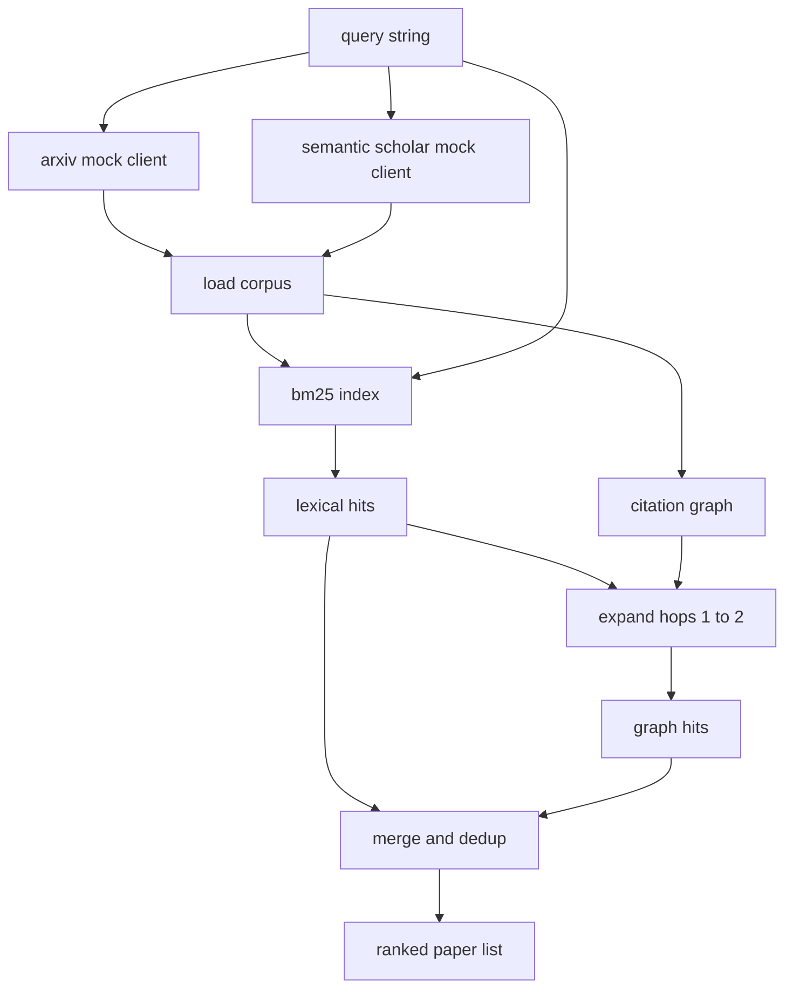

# 文献检索

> 提出一个假设很容易。知道是否有人已经证明过它，才是成本高昂的部分。构建一个检索层，在 runner 启动沙箱之前回答这个问题。

**类型：** 构建
**语言：** Python
**前置要求：** 第 19 阶段 Track A 第 20–29 课
**时长：** ~90 分钟

## 学习目标

- 建模一个小型论文记录结构，其字段能被下游循环读取。
- 仅使用标准库数据结构，基于摘要构建 BM25 索引。
- 遍历引文图，挖掘词法搜索遗漏的论文。
- 通过稳定的论文 ID 对词法检索和引文图检索的结果进行去重。
- 将两个模拟外部 API 封装到单一客户端中，使得上游调用方在真实接口上线时无需改动代码。

## 为什么需要两次检索

对摘要进行关键词搜索，能够召回与查询共享词汇的论文。这覆盖了大部分表面情况，但遗漏了两种场景。第一种情况是奠基性论文使用了不同的词汇；例如，查询"稀疏注意力"可能会漏掉一篇题为"Transformer 路由中的块选择"的论文。第二种情况是相关论文是对某个已知锚点论文的后续研究；此时，找到锚点论文并向前遍历比暴力搜索整个摘要池更高效。

本节课将构建两种检索方式。基于摘要的 BM25 捕捉词法匹配。引文图遍历以初始命中集合为种子，向前和向后扩展一到两跳。两者取并集后，按论文 ID 去重，并由一个综合得分排序。

## Paper 的字段结构

```text
Paper
  id          : str           （稳定标识符，模拟语料中为 "p001"）
  title       : str
  abstract    : str
  year        : int
  authors     : list[str]
  references  : list[str]     （该论文引用的论文 ID）
  citations   : list[str]     （引用该论文的论文 ID）
  source      : str           （由哪个模拟 API 提供，"arxiv" 或 "s2"）
```

`references` 和 `citations` 字段构成了有向引文图。两个模拟 API 返回的字段有重叠但不完全一致，因此语料加载器以 `id` 为键进行合并。

## 架构


```mermaid
flowchart TD
    Q[query string] --> A[arxiv mock client]
    Q --> S[semantic scholar mock client]
    A --> L[load corpus]
    S --> L
    L --> B[bm25 index]
    L --> G[citation graph]
    Q --> B
    B --> R1[lexical hits]
    R1 --> H[expand hops 1 to 2]
    G --> H
    H --> R2[graph hits]
    R1 --> M[merge and dedup]
    R2 --> M
    M --> O[ranked paper list]
```

检索客户端同时拥有两次检索和合并逻辑。调用方传入查询字符串，得到一个排序列表，其中每个条目携带每篇论文的得分字段（`bm25_score`、`graph_distance`、`recency_score`、`final_score`），用于解释排序依据。

## 从头实现 BM25

实现采用标准的 Okapi BM25，默认参数为 `k1=1.5`、`b=0.75`。索引包含两个字典：`term -> doc_frequency` 和 `term -> list of (doc_id, term_count)`。文档长度为摘要的词数。平均文档长度在构建索引时一次性计算。对查询评分是查询中各词项的 `idf * tf_norm` 之和，其中 `tf_norm` 是标准的 BM25 长度归一化词频。

分词器采用先转为小写，再按非字母数字字符分割。不进行词干提取。生产系统可以替换为一个小型词干提取器，接口保持不变。

```text
idf(t)      = log((N - df + 0.5) / (df + 0.5) + 1.0)
tf_norm(t)  = (f * (k1 + 1)) / (f + k1 * (1 - b + b * dl / avgdl))
score(d, q) = sum over t in q of idf(t) * tf_norm(t)
```

## 引文图遍历

图从语料中一次性构建。前向边从一篇论文指向其引用的论文。后向边从一篇论文指向引用它的论文。遍历采用广度优先搜索，以 BM25 得分最高的命中集合为种子，最多扩展两跳。

两跳是刻意设定的上限。一跳太浅；智能体通常需要直接前驱或后继。三跳在连通图上会导致结果规模膨胀，且容易偏离主题。本节课将跳数上限作为一个可配置参数暴露出来，以便下游循环可以根据需要收紧。

## 去重与排序

两次检索会返回重叠的集合。合并时以论文 ID 为键。对每篇论文，最终得分是加权融合的结果。

```text
final_score = w_bm25 * bm25_score_norm
            + w_graph * graph_score
            + w_recency * recency_score
```

`bm25_score_norm` 是 BM25 得分除以合并集合中的最大 BM25 得分（因此该字段的取值在 0 到 1 之间）。`graph_score` 对于直接词法命中为 1，一跳为 0.6，两跳为 0.3，其余情况为 0。`recency_score` 是一个线性映射，从语料最小年份的 0 到最大年份的 1。

默认权重为 `0.5`、`0.3`、`0.2`。权重是可配置的；冷门话题可能调低时效性权重，而快速演变的话题则可以提高它。

## 模拟语料

语料包含一百篇论文，由 `build_corpus()` 生成。每篇论文均有手写的标题和摘要，涵盖五个主题：注意力稀疏性、检索增强、低秩适配器、数据集蒸馏和评估框架。引用关系被设计为每个主题形成一个连通的子图，并带有少量跨主题的边。

两个模拟 API 客户端（`ArxivMockClient`、`SemanticScholarMockClient`）读取同一语料，但暴露不同的字段。Arxiv 返回标题、摘要、年份、作者。Semantic Scholar 额外返回引用和被引信息。检索客户端以 ID 为键进行合并；跨客户端字段不一致的处理推迟到后续课程。

## 第 52 课和第 53 课会读取什么

第 52 课的 runner 读取 `paper.id`、`paper.title` 以及摘要的前三句话，作为实验的上下文。第 53 课的评估器读取 `paper.year` 和 `paper.references`，以将基线归因到具体的论文。

检索客户端返回一个 `RetrievalResult` 对象，包含排序列表以及每次查询的指标：命中数量、平均得分、最高得分、总耗时。runner 会记录这些信息，以便下游的可观测性模块能够绘制质量随时间的变化曲线。

## 如何阅读代码

`code/main.py` 定义了 `Paper`、`ArxivMockClient`、`SemanticScholarMockClient`、`BM25Index`、`CitationGraph`、`RetrievalClient`，以及一个确定性的演示示例。模拟客户端和语料位于同一文件中，以保证本课程的便携性。BM25 实现是一个类，约六十行代码。图遍历是一个方法。

`code/tests/test_retrieval.py` 覆盖了词法路径、图路径、合并、去重以及空查询的情况。

## 本课程在整个环节中的位置

第 50 课产生一个假设。第 51 课检索文献，以确定该假设是否已有定论。如果尚未有定论，第 52 课运行实验。第 53 课同时读取检索结果和实验指标，撰写最终结论。检索客户端是四个阶段中成本最低的，在编排器中首先运行。
