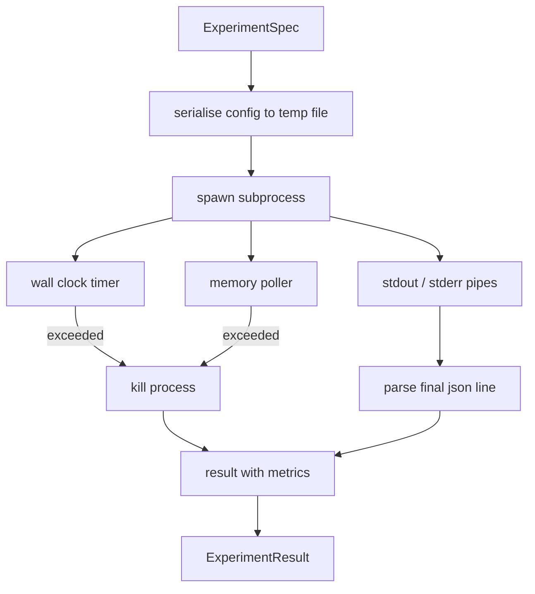

# 実験ランナー

> 研究ループの誠実さは測定の誠実さで決まります。spec を受け取り、sandboxed subprocess で実行し、evaluator が信頼できる JSON metrics blob を出力する runner を作ります。

**種別:** Build
**言語:** Python
**前提:** Phase 19 Track A lessons 20-29
**時間:** 約90分

## 学習目標
- 実験を subprocess に serialise できる型付き spec として encode する。
- hard wall clock timeout と soft memory cap 付きで subprocess を起動し、どちらも terminal condition として表す。
- stdout、stderr、structured metrics blob を一つの result record に捕捉する。
- 固定 base spec に対して一つの configuration knob だけを sweep する ablation table を作る。
- seed が同じなら evaluator が毎回同じ数値を見るよう、すべての result を決定的にする。

## なぜ subprocess なのか

研究ループは信頼できない code を走らせます。仮説は sampler から来て、実験 script も同じ経路から来ます。in-process で安全だとみなすと、crash が orchestrator 全体を落とします。subprocess は Python が標準で持つ最小の isolation です。別 process、独立した address space、親側の signal handle が得られます。

この runner は完全な sandbox ではありません。cgroup、seccomp filter、namespace remapping はありません。あるのは wall clock timeout、memory growth の polling loop、どちらかの limit で process を止める kill path です。より高度な sandbox もこの runtime contract を拡張します。

## ExperimentSpec の形

```text
ExperimentSpec
  spec_id        : str            (stable id, "exp_001")
  hypothesis_id  : int            (lesson 50 の queue への link)
  script_path    : str            (実行する python script の path)
  config         : dict           (script に JSON arg として渡す)
  seed           : int            (実験用 deterministic seed)
  wall_timeout_s : float          (hard timeout、超過で kill)
  memory_cap_mb  : int            (soft cap、polling して超過で kill)
  metric_keys    : list[str]      (evaluator が読む field)
```

script は disk 上にあり、runner は config を temp file に書き、その path を script が読みます。script は stdout に単一の JSON line を出すことを期待されます。その key は `metric_keys` の superset です。stdout の他の内容は捕捉されますが metrics parser では無視されます。

## アーキテクチャ



runner は一つの main method を持つ class です。poller は一定間隔で起き、可能なら proc filesystem か `ps` から subprocess RSS を読みます。platform が情報を出さない場合は no-op に fallback します。

## Soft memory cap

hard memory cap には `resource.setrlimit` が必要で、POSIX でしか機能しません。この lesson は portable な方法として resident set size を polling し、cap を超えたら subprocess を kill します。polling には非ゼロ interval があるため、cap は soft です。process は poll の間に一時的に cap を超えて戻ることがあります。runner は最大観測 RSS を記録します。

process inspection が使えない環境では、poller は一度だけ warning を出して無効化されます。wall clock timeout は引き続き有効です。

## stdout と stderr の捕捉

runner は完了時に両方の pipe を drain します。stdout は行ごとに scan され、`metric_keys` をすべて含む最後の JSON line が final metrics blob です。より前の JSON line は `intermediate_metrics` として result に残され、evaluator は learning curve に使えます。

stderr はそのまま result に入ります。runner は non-zero exit code で例外を投げません。代わりに result に code を記録します。non-zero exit は、metrics が出ていても `"crash"` と label されます。

## Ablation table

```python
def ablate(base: ExperimentSpec, knob: str, values: list[Any]) -> list[ExperimentSpec]:
    ...
```

base spec と knob 名から、各 value で `config[knob]` を上書きした spec を一つずつ返します。各 spec は `f"{base.spec_id}_{knob}_{value}"` という派生 `spec_id` を持ちます。`AblationRunner` はそれらを順に走らせ、knob value を key にした `AblationTable` を返します。

一度に一つの knob だけを動かす理由は interpretability です。full factorial sweep は指数的に膨らみ、evaluator が解釈しにくい result を作ります。単一 knob なら plot できるきれいな軸が得られます。

## Determinism

すべての spec は seed を持ちます。runner は config dict に `config["__seed"] = spec.seed` を追加して script に渡します。`code/experiments/` の mock experiment scripts は seed を尊重し、同じ metrics を返します。lesson 53 の evaluator はこれに依存します。

## Mock experiment script

`code/experiments/sparsity_experiment.py` は config file を読み、小さな training run 風の数値計算をシミュレートして JSON metrics blob を出す実 script です。`sleep_s` は timeout test、`allocate_mb` は memory poller test に使います。

この simulation は実際の training ではありません。loss curve、final perplexity、wall time の形だけを模倣します。この lesson の焦点は runner です。

## Result の形

```text
ExperimentResult
  spec_id              : str
  hypothesis_id        : int
  exit_code            : int
  terminal             : "ok" | "timeout" | "oom" | "crash"
  wall_time_s          : float
  peak_rss_mb          : float | None
  metrics              : dict
  intermediate_metrics : list[dict]
  stdout_tail          : str
  stderr_tail          : str
```

evaluator は最初に `metrics` と `terminal` を読みます。`terminal` が `"ok"` 以外なら failed run として扱われます。そうでなければ metrics は significance test に渡されます。

## コードの読み方

`code/main.py` は `ExperimentSpec`, `ExperimentResult`, `ExperimentRunner`, `AblationRunner`, 決定的 demo を定義します。subprocess 管理は一つの class、memory poller は小さな thread、ablation helper は単一関数です。

`code/experiments/sparsity_experiment.py` は tests で使う mock experiment です。argv から config file path を読み、完了時に JSON metrics line を出します。

`code/tests/test_runner.py` は success、timeout、crash、ablation table、二回の run 間の determinism を確認します。

## 位置づけ

lesson 50 が仮説を生成し、lesson 51 が既存文献で決着済みのものを除外します。lesson 52 は残った仮説の実験を走らせます。lesson 53 は result を読み、significance test を実行して orchestrator が hypothesis id に保存する verdict を書きます。
