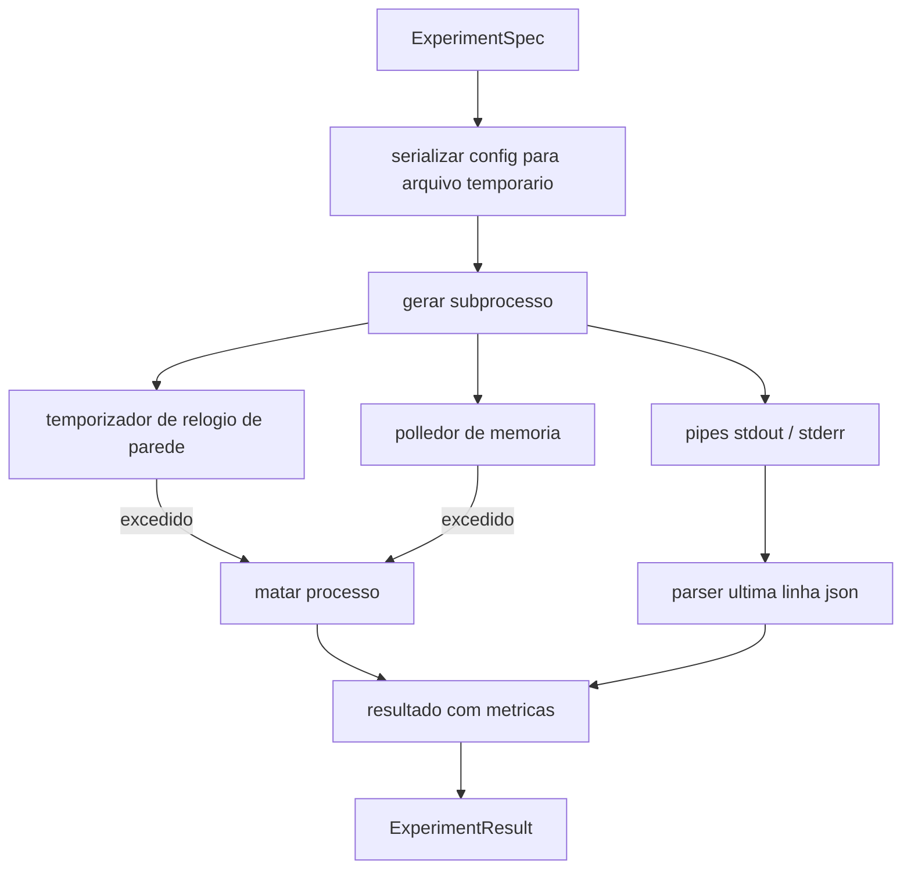

# Aula 52: Executor de Experimentos

> O loop e tao honesto quanto suas medicoes. Construa o executor que pega uma eespecificaçãoificacao, a executa em um subprocesso isolado, e emite um blob de metricas JSON que o avaliador pode confiar.

**Tipo:** Build
**Linguagens:** Python
**Prerequisitos:** Aulas 20-29 da Fase 19, Track A
**Tempo:** ~90 minutos

## Objetivos de Aprendizado
- Codificar um experimento como uma eespecificaçãoificacao tipada que o executor possa serializar para um subprocesso.
- Lancar um subprocesso com um timeout duro de relogio de parede e um limite de memoria suave, e mostrar ambos como condicoes de terminacao.
- Capturar stdout, stderr, e o blob estruturado de metricas em um unico registro de resultado.
- Construir uma tabela de ablativa que varre um botao de configuracao por vez sobre uma eespecificaçãoificacao base fixa.
- Manter todo resultado deterministico dada uma seed para que o avaliador veja os mesmos numeros entre execucoes.

## Por que um subprocesso

Um loop de pesquisa roda codigo nao confiavel. A hipotese veio de um sampler, o script do experimento veio do mesmo caminho; tratar qualquer um deles como seguro em-processo e pedir um crash que derrube o orchestrator. Subprocessos sao a forma mais simples de isolamento que a linguagem oferece: um processo separado, um espaco de endereco independente, um manipulador de sinal no lado do pai.

O executor aqui nao implementa sandboxing completo. Nao tem cgroup, nao tem filtro seccomp, nao tem remapeamento de namespace. O que tem e um timeout de relogio de parede, um loop de polling para crescimento de memoria, e um caminho de kill que termina o processo em qualquer limite. Esse e o contrato de runtime que qualquer sandbox mais elaborada estende. A aula mantem o contrato pequeno o suficiente para ler de uma vez.

## A forma ExperimentSpec

```text
ExperimentSpec
  especificação_id        : str            (id estavel, "exp_001")
  hypothesis_id  : int            (ligacao de volta com a fila da aula 50)
  script_path    : str            (caminho para o script python a rodar)
  config         : dict           (passado ao script como um argumento json)
  seed           : int            (seed deterministica para o experimento)
  wall_timeout_s : float          (timeout duro, morto ao exceder)
  memory_cap_mb  : int            (limite suave, em polling; morto ao exceder)
  metric_keys    : list[str]      (quais campos o avaliador vai ler)
```

O script vive em disco; o executor escreve a config em um caminho de arquivo temporario que o script le. Espera-se que o script imprima uma unica linha json no stdout cujas chaves sao um superconjunto de `metric_keys`. Qualquer outra coisa no stdout e capturada mas ignorada pelo parser de metricas.

## Arquitetura



O executor e uma classe com um metodo principal. O polledor e uma thread pequena que acorda a cada intervalo de polling e le o equivalente `psutil` do subprocesso do filesystem de proc quando disponivel, caindo em no-op quando a plataforma nao o expoe.

## Por que um limite de memoria suave

Limites de memoria duros precisam de `resource.setrlimit` e so funcionam em POSIX. A abordagem portavel da aula: fazer polling do resident set size da plataforma e matar o subprocesso se exceder o limite. O limite e suave porque o polling tem um intervalo nao-zero; um processo pode disparar acima do limite entre polls e depois cair de volta. O executor registra o RSS maximo observado para que o avaliador veja quao proximo a execucao chegou do limite.

Em sistemas sem suporte a inespecificaçãoao de processos, o polledor loga um aviso uma vez e se desabilita. O timeout de relogio de parede continua valendo. Os testes da aula cobrem ambos os caminhos.

## Capturando stdout e stderr

O executor le ambos os pipes quando esgotados. Stdout e escaneado linha por linha; a ultima linha que parseia como json com todas as `metric_keys` obrigatorias e tomada como o blob de metricas. Linhas json anteriores sao mantidas no resultado como `intermediate_metrics`; o avaliador pode usar essas para curvas de aprendizado.

Stderr e capturado literalmente no resultado. O executor nunca levanta excecao em um codigo de saida nao-zero; em vez disso registra o codigo no resultado. Qualquer saida nao-zero e rotulada `"crash"` mesmo quando o script imprimiu metricas, para que o avaliador trate execucoes parciais como falhas por padrao.

## Tabela ablativa

```python
def ablate(base: ExperimentSpec, knob: str, values: list[Any]) -> list[ExperimentSpec]:
    ...
```

Dada uma eespecificaçãoificacao base e um nome de botao, o auxiliar retorna uma eespecificaçãoificacao por valor com `config[knob]` sobrescrito. Cada eespecificaçãoificacao recebe um `especificação_id` derivado (`f"{base.especificação_id}_{knob}_{value}"`). O executor entrega um `AblationRunner` que os roda em ordem e retorna uma `AblationTable` indexada por valor do botao.

Por que um botao por vez. Varreduras fatoriais completas explodem exponencialmente e produzem resultados que o avaliador nao consegue interpretar. Um botao por vez produz um eixo limpo que o avaliador pode plotar. A aula suporta varreduras multi-botao apenas como ablativas de botao unico repetidas, compostas pelo chamador.

## Determinismo

Cada eespecificaçãoificacao carrega uma seed. O executor encaminha a seed para o script via o dict de config (`config["__seed"] = especificação.seed`). Os scripts de experimento mock em `code/experiments/` honram a seed e produzem metricas identicas entre execucoes. O avaliador na aula 53 depende disso; sem determinismo uma "regressao" pode ser uma inicializacao aleatoria diferente.

## O script de experimento mock

A aula entrega um script de experimento: `code/experiments/sparsity_experiment.py`. E um script real que le seu arquivo de config, simula uma pequena execucao de treino com uma passagem aleatoria numpy, e imprime um blob json de metricas. O script honra um botao `sleep_s` para testar timeouts e um botao `allocate_mb` para testar o polledor de memoria.

A simulacao nao treina nada real. E um calculo numerico que imita a forma de um loop de treino: uma curva de loss, uma perplexidade final, um tempo de parede. O ponto da aula e o executor, nao a simulacao. Um script de experimento real importaria um modelo.

## Forma do resultado

```text
ExperimentResult
  especificação_id              : str
  hypothesis_id        : int
  exit_code            : int
  terminal             : "ok" | "timeout" | "oom" | "crash"
  wall_time_s          : float
  peak_rss_mb          : float | None
  metrics              : dict
  intermediate_metrics : list[dict]
  stdout_tail          : str
  stderr_tail          : str
```

O avaliador le `metrics` e `terminal` primeiro. Se terminal for qualquer coisa diferente de `"ok"` o experimento conta como uma execucao falha e o veredicto do avaliador e automatico. Caso contrario as metricas passam pelo teste de significancia.

## Como ler o codigo

`code/main.py` define `ExperimentSpec`, `ExperimentResult`, `ExperimentRunner`, `AblationRunner`, e um demo deterministico. O gerenciamento de subprocesso e uma classe. O polledor de memoria e uma thread pequena. O auxiliar ablativo e uma unica funcao.

`code/experiments/sparsity_experiment.py` e o experimento mock usado nos testes. Ele le o caminho do arquivo de config do argv e escreve uma unica linha json de metricas ao completar.

`code/tests/test_runner.py` cobre o caminho de sucesso, o caminho de timeout, o caminho de crash, a tabela ablativa, e a verificacao de determinismo entre duas execucoes.

## Onde isso encaixa

A aula 50 gera a hipotese. A aula 51 filtra qualquer coisa que a literatura ja resolveu. A aula 52 roda o experimento para o que sobrou. A aula 53 le o resultado, roda o teste de significancia, e escreve o veredicto que o orchestrator armazena contra o id da hipotese.
