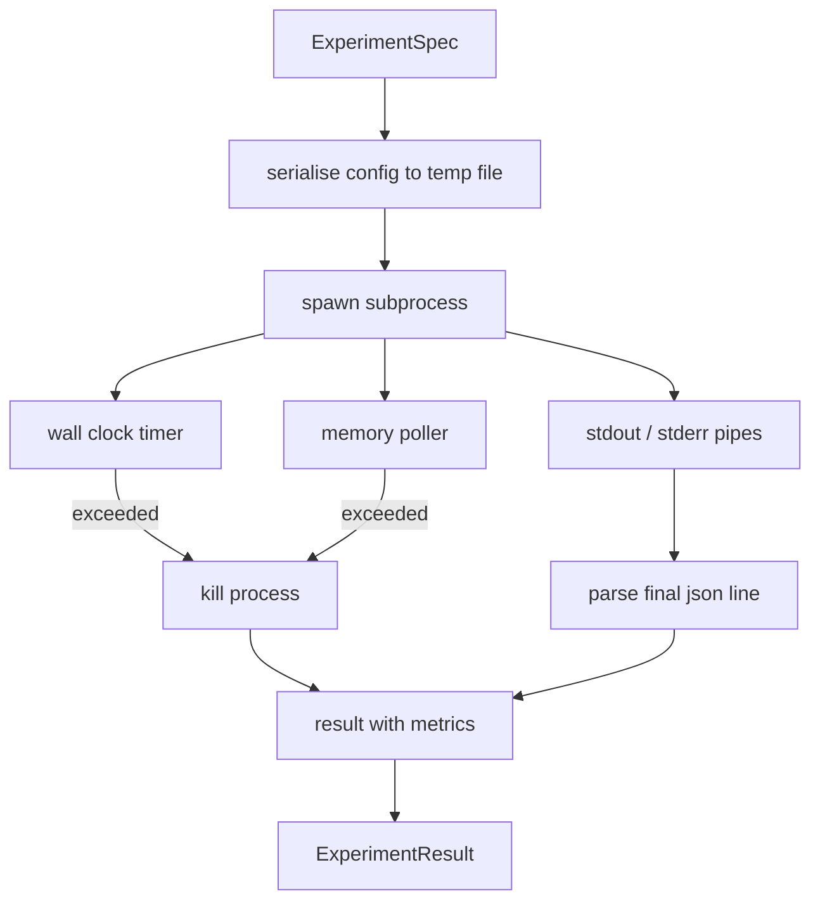

# Deney Çalıştırıcısı

> Döngü ancak ölçümleri kadar dürüsttür. Bir spesifikasyonu alan, onu korumalı alana alınmış bir alt süreçte yürüten ve değerlendiricinin güvenebileceği bir json metrikleri blobu yayan çalıştırıcıyı oluşturun.

**Tür:** Yapım
**Diller:** Python
**Önkoşullar:** Aşama 19 Bölüm A dersleri 20-29
**Süre:** ~90 dakika

## Öğrenme Hedefleri
- Bir denemeyi, çalıştırıcının bir alt işleme serileştirebileceği yazılı bir spesifikasyon olarak kodlayın.
- Sert duvar saati zaman aşımı ve yumuşak bellek kapağıyla bir alt işlem başlatın ve her ikisini de terminal koşulları olarak yüzeye çıkarın.
- Stdout, stderr ve yapılandırılmış ölçüm blobunu tek bir sonuç kaydında yakalayın.
- Sabit bir temel spesifikasyon üzerinde her seferinde bir konfigürasyon düğmesini tarayan bir ablasyon tablosu oluşturun.
- Bir tohum verildiğinde her sonucun deterministik olmasını sağlayın, böylece değerlendirici tüm çalışmalar boyunca aynı sayıları görür.

## Neden bir alt süreç

Bir araştırma döngüsü güvenilmeyen kodu çalıştırır. Hipotez bir örnekleyiciden geldi, deney senaryosu da aynı yoldan geldi; Her ikisini de süreç içinde güvenli olarak ele almak, orkestratörün devre dışı kalmasına neden olacak bir çökmeyi istemek anlamına gelir. Alt süreçler dilin sağladığı en basit izolasyondur: ayrı bir süreç, bağımsız bir adres alanı, ana tarafta bir sinyal tanıtıcısı.

Buradaki koşucu tam korumalı alan uygulamamaktadır. Cgroup yok, seccomp filtresi yok, ad alanının yeniden eşlenmesi yok. Sahip olduğu şey, bir duvar saati zaman aşımı, bellek büyümesi için bir yoklama döngüsü ve işlemi her iki sınırda da sonlandıran bir öldürme yoludur. Bu, her daha ayrıntılı sanal alanın genişlettiği çalışma zamanı sözleşmesidir. Ders, sözleşmeyi bir oturuşta okunabilecek kadar küçük tutar.

## ExperimentSpec şekli

```text
ExperimentSpec
  spec_id        : str            (stable id, "exp_001")
  hypothesis_id  : int            (link back to the queue from lesson 50)
  script_path    : str            (path to the python script to run)
  config         : dict           (passed to the script as one json arg)
  seed           : int            (deterministic seed for the experiment)
  wall_timeout_s : float          (hard timeout, killed on exceed)
  memory_cap_mb  : int            (soft cap, polled; killed on exceed)
  metric_keys    : list[str]      (which fields the evaluator will read)
```

Betik diskte yaşar; koşucu, yapılandırmayı betiğin okuduğu geçici dosya yoluna yazar. Komut dosyasının, anahtarları `metric_keys`'nin üst kümesi olan stdout'ta tek bir json satırı yazdırması bekleniyor. Stdout'taki diğer her şey yakalanır ancak metrik ayrıştırıcı tarafından göz ardı edilir.

## Mimarlık



Koşucu, bir ana yönteme sahip bir sınıftır. Yoklayıcı, her yoklama aralığında bir kez uyanan ve mümkün olduğunda proc dosya sisteminden `psutil` eşdeğer alt işlemi okuyan, platform bunu göstermediğinde no op durumuna geri dönen küçük bir iş parçacığıdır.

## Neden yumuşak bir hafıza sınırı

Sabit bellek sınırlarının `resource.setrlimit` olması gerekir ve yalnızca POSIX'te çalışır. Ders taşınabilir bir yaklaşım getiriyor: Yerleşik küme boyutunu platformdan yoklayın ve sınırı aşarsa alt süreci sonlandırın. Başlık yumuşaktır çünkü yoklayıcı sıfır olmayan bir aralığa sahiptir; bir süreç anketler arasında tavanın üzerine çıkıp daha sonra geri düşebilir. Koşucu gözlemlenen maksimum RSS'yi kaydeder, böylece değerlendirici koşunun sınıra ne kadar yaklaştığını görebilir.

Proses denetimi desteği olmayan sistemlerde yoklayıcı tek seferlik bir uyarı kaydeder ve kendisini devre dışı bırakır. Duvar saati zaman aşımı hâlâ geçerlidir. Ders testleri her iki yolu da kapsar.

## Stdout ve stderr'i yakalamak

Koşucu, tamamlandığında her iki borunun da boşaltıldığını okur. Stdout satır satır taranır; gerekli tüm `metric_keys` ile json olarak ayrıştırılan son satır, metrik blobu olarak alınır. Önceki json satırları sonuçta `intermediate_metrics` olarak tutulur; değerlendirici bunları öğrenme eğrileri için kullanabilir.

Stderr kelimesi kelimesine sonuca yansıtılır. Koşucu asla sıfır olmayan bir çıkış koduyla yükselmez; bunun yerine sonuçtaki kodu kaydeder. Sıfır olmayan herhangi bir çıkış, komut dosyası metrikleri yazdırdığında bile `"crash"` olarak etiketlenir, bu nedenle değerlendirici, kısmi çalıştırmaları varsayılan olarak başarısızlık olarak değerlendirir.

## Ablasyon tablosu

```python
def ablate(base: ExperimentSpec, knob: str, values: list[Any]) -> list[ExperimentSpec]:
    ...
```

Bir temel özellik ve bir düğme adı verildiğinde yardımcı, `config[knob]` geçersiz kılınmış olarak değer başına bir özellik döndürür. Her spesifikasyon türetilmiş bir `spec_id` (`f"{base.spec_id}_{knob}_{value}"`) alır. Koşucu, bunları sırayla çalıştıran bir `AblationRunner` gönderir ve düğme değeriyle anahtarlanan bir `AblationTable` döndürür.

Neden her seferinde bir düğme. Tam faktöriyel taramalar katlanarak artar ve değerlendiricinin yorumlayamayacağı sonuçlar üretir. Her seferinde bir düğme, değerlendiricinin çizebileceği temiz bir eksen oluşturur. Ders, çoklu düğmeli taramaları yalnızca arayan kişi tarafından oluşturulan tekrarlanan tek düğmeli ablasyonlar olarak destekler.

## Determinizm

Her özellik bir tohum taşır. Koşucu, config dict (`config["__seed"] = spec.seed`) aracılığıyla tohumu betiğe iletir. `code/experiments/` 'deki örnek deney komut dosyaları, tohumu dikkate alır ve çalıştırmalar arasında aynı metrikleri üretir. Elli üçüncü dersteki değerlendirici şuna bağlıdır; determinizm olmadan bir "gerileme" farklı bir rastgele başlatma olabilir.

## Sahte deney komut dosyası

Ders bir deneme komut dosyası gönderir: `code/experiments/sparsity_experiment.py`. Bu, yapılandırma dosyasını okuyan, numpy rastgele geçişle küçük bir eğitim çalıştırmasını simüle eden ve bir json metrik blobu yazdıran gerçek bir komut dosyasıdır. Betik, zaman aşımlarını test etmek için bir `sleep_s` düğmesini ve bellek yoklayıcıyı test etmek için bir `allocate_mb` düğmesini onurlandırır.

Simülasyon gerçek hiçbir şeyi eğitmiyor. Bu, bir eğitim döngüsünün şeklini taklit eden sayısal bir hesaplamadır: bir kayıp eğrisi, bir son şaşkınlık, bir duvar süresi. Dersin amacı simülasyon değil koşucudur. Gerçek bir deney komut dosyası bir modeli içe aktarır.

## Sonuç şekli

```text
ExperimentResult
  spec_id              : str
  hypothesis_id        : int
  exit_code            : int
  terminal             : "ok" | "timeout" | "oom" | "crash"
  wall_time_s          : float
  peak_rss_mb          : float | None
  metrics              : dict
  intermediate_metrics : list[dict]
  stdout_tail          : str
  stderr_tail          : str
```

Değerlendirici önce `metrics` ve `terminal` 'yi okur. Terminal, `"ok"` dışında bir şeyse, deney başarısız bir çalışma olarak sayılır ve değerlendiricinin kararı otomatiktir. Aksi takdirde metrikler anlamlılık testinden geçirilir.

## Kod nasıl okunur

`code/main.py` , `ExperimentSpec`, `ExperimentResult`, `ExperimentRunner`, `AblationRunner` ve deterministik bir demoyu tanımlar. Alt süreç yönetimi bir sınıftır. Bellek yoklayıcı küçük bir iş parçacığıdır. Ablasyon yardımcısı tek bir fonksiyondur.

`code/experiments/sparsity_experiment.py` testlerde kullanılan sahte deneydir. Yapılandırma dosyası yolunu argv'den okur ve tamamlandığında tek bir json ölçüm satırı yazar.

`code/tests/test_runner.py` başarı yolunu, zaman aşımı yolunu, kilitlenme yolunu, ablasyon tablosunu ve iki çalıştırmadaki determinizm kontrolünü kapsar.

## Bunun yeri neresi

Elli ders hipotezi oluşturur. Elli birinci ders, literatürde halihazırda kararlaştırılan her şeyi filtreliyor. Elli ikinci ders, geriye kalanlar için deneyi yürütür. Elli üçüncü ders sonucu okur, önem testini yürütür ve orkestratörün hipotez kimliğine karşı kaydettiği kararı yazar.
