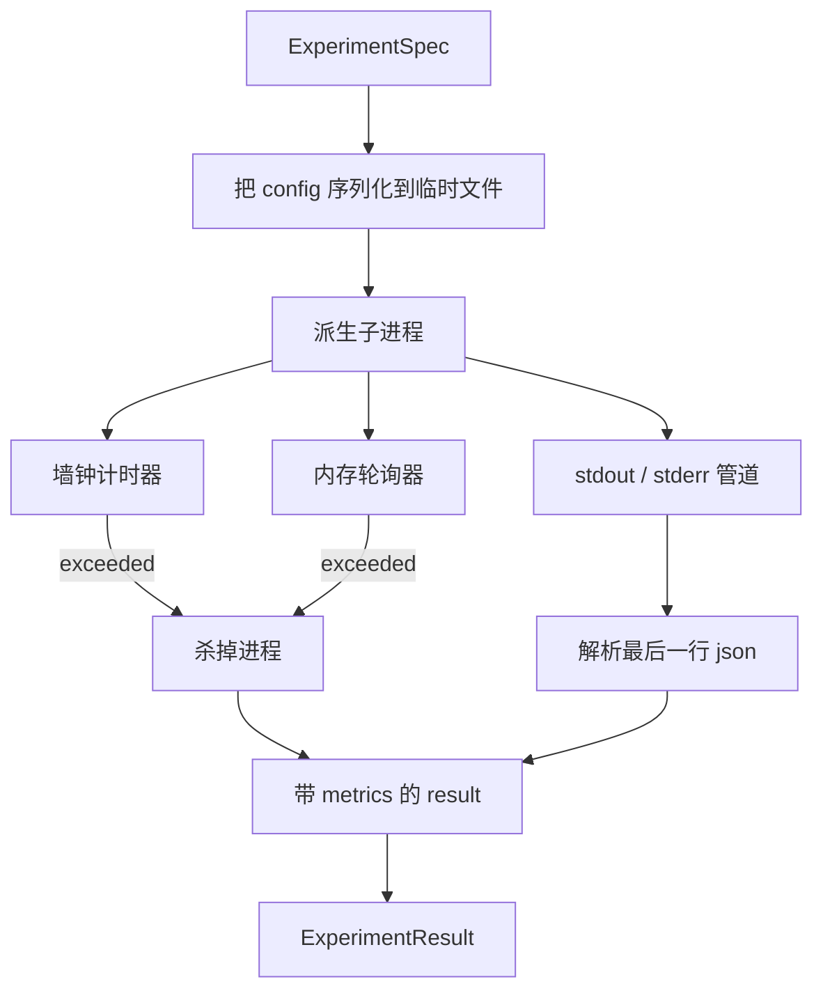

# 实验执行器（Experiment Runner）

> 译注：本文译自同目录 [`en.md`](./en.md)。术语遵循仓根 [TRANSLATION_GUIDE.md](../../../../TRANSLATION_GUIDE.md)。

> 一个 loop 的诚实程度，取决于它的测量是否可靠。本课要造的就是这样一个 runner：接收一份 spec，在沙盒化的子进程里执行它，并产出一份 evaluator 可以信任的 JSON 指标 blob。

**Type:** Build
**Languages:** Python
**Prerequisites:** Phase 19 Track A lessons 20-29
**Time:** ~90 minutes

## 学习目标（Learning Objectives）
- 把一次实验编码成一份带类型的 spec，让 runner 能把它序列化交给子进程。
- 启动子进程时同时设置硬性的 wall clock 超时和软性的内存上限，并把两者作为终止条件暴露出来。
- 把 stdout、stderr 以及结构化的指标 blob 一起捕获到同一份结果记录里。
- 构建一张消融实验（ablation）表：在固定的 base spec 上一次扫一个配置旋钮。
- 给定 seed 后，每次结果都要确定性可复现，让 evaluator 跨多次运行看到一致的数字。

## 为什么用子进程（Why a subprocess）

研究 loop 跑的是不可信代码。hypothesis（假设）是采样器吐出来的，实验脚本走的是同一条路径；如果你把任何一边当作进程内安全代码，那就是在等着一次崩溃把 orchestrator 一起拖下水。子进程是这门语言自带的最简单的隔离手段：独立进程、独立地址空间、父进程一侧拿着信号句柄。

这里的 runner 并没有实现完整的沙盒。没有 cgroup、没有 seccomp filter、没有 namespace 重映射。它真正具备的是一个 wall clock 超时、一个轮询内存增长的循环，以及一条在任一上限被触碰时杀进程的路径。这就是任何更复杂的沙盒所要扩展的运行时契约。本课把这份契约保持得足够小，一坐下来就能读完。

## ExperimentSpec 的形状（The ExperimentSpec shape）

```text
ExperimentSpec
  spec_id        : str            (stable id, "exp_001")
  hypothesis_id  : int            (link back to the queue from lesson 50)
  script_path    : str            (path to the python script to run)
  config         : dict           (passed to the script as one json arg)
  seed           : int            (deterministic seed for the experiment)
  wall_timeout_s : float          (hard timeout, killed on exceed)
  memory_cap_mb  : int            (soft cap, polled; killed on exceed)
  metric_keys    : list[str]      (which fields the evaluator will read)
```

脚本本体放在磁盘上；runner 把 config 写到一个临时文件路径里，脚本去读它。脚本被要求在 stdout 上打印一行 JSON，其 key 集合是 `metric_keys` 的超集。stdout 上的其他内容会被捕获，但指标解析器会忽略掉。

## 架构（Architecture）



runner 就是一个类、一个主方法。轮询器是一个小线程，每隔一个 poll interval 醒一次，在平台支持时从 proc 文件系统读出子进程的 `psutil` 等价信息；如果平台不暴露这些信息，则降级成 no op。

## 为什么是软性内存上限（Why a soft memory cap）

硬性内存上限需要 `resource.setrlimit`，且只在 POSIX 下能用。本课走的是一条可移植路线：从平台读出 resident set size 进行轮询，超过上限就杀掉子进程。这个上限是「软」的，因为轮询器的间隔不为零；进程可能在两次轮询之间冲到上限之上、再回落。runner 会记录观察到的 RSS 最大值，让 evaluator 能看到本次运行离上限有多近。

在不支持进程探查的系统上，轮询器会打一条一次性的 warning 并自我禁用。wall clock 超时仍然生效。本课的测试覆盖了两条路径。

## 捕获 stdout 和 stderr（Capturing stdout and stderr）

runner 在子进程结束时把两条管道都读干净。stdout 按行扫描；最后一行能解析为 JSON 且包含全部所需 `metric_keys` 的，被当作 metrics blob。更早出现的 JSON 行会被保留在结果里，记为 `intermediate_metrics`；evaluator 可以拿它们画学习曲线。

stderr 原样捕获进结果。runner 在非零 exit code 时不会抛异常；它只是把 code 记到结果里。任何非零退出都会被打上 `"crash"` 标签，即便脚本已经打印了 metrics 也一样——这样 evaluator 默认会把部分完成的运行视作失败。

## 消融实验表（Ablation table）

```python
def ablate(base: ExperimentSpec, knob: str, values: list[Any]) -> list[ExperimentSpec]:
    ...
```

给定一份 base spec 和一个旋钮名，这个 helper 会为每个取值返回一份 spec，其中 `config[knob]` 被覆盖掉。每份 spec 拿到一个派生的 `spec_id`（`f"{base.spec_id}_{knob}_{value}"`）。本课附带的 `AblationRunner` 会按顺序跑完它们，并返回一张以旋钮取值为 key 的 `AblationTable`。

为什么一次只扫一个旋钮？全因子（full factorial）扫描会指数爆炸，产出的结果 evaluator 也读不懂。一次只扫一个旋钮，得到的是一条干净的轴，evaluator 能直接画图。本课只把多旋钮扫描当成「重复多次单旋钮消融实验」来支持，组合方式交给调用方。

## 确定性（Determinism）

每份 spec 都带一个 seed。runner 通过 config dict 把 seed 转给脚本（`config["__seed"] = spec.seed`）。`code/experiments/` 下的 mock 实验脚本会尊重这个 seed，在多次运行间产出完全相同的 metrics。第 53 课的 evaluator 就指望这件事；没有确定性，一次「regression（回归）」可能只是一次不同的随机初始化而已。

## mock 实验脚本（The mock experiment script）

本课附带一个实验脚本：`code/experiments/sparsity_experiment.py`。这是一个真实的脚本，它读取自己的 config 文件，用一次 numpy 的随机过程模拟一个小型训练运行，并打印一个 JSON metrics blob。脚本支持一个 `sleep_s` 旋钮用于测试超时，以及一个 `allocate_mb` 旋钮用于测试内存轮询器。

这个 simulation 没有真在训练什么。它只是一段在形状上模仿训练 loop 的数值计算：一条 loss 曲线、一个最终 perplexity、一个 wall time。本课的重点是 runner 而不是 simulation。一个真实的实验脚本会去 import 一个模型。

## 结果的形状（Result shape）

```text
ExperimentResult
  spec_id              : str
  hypothesis_id        : int
  exit_code            : int
  terminal             : "ok" | "timeout" | "oom" | "crash"
  wall_time_s          : float
  peak_rss_mb          : float | None
  metrics              : dict
  intermediate_metrics : list[dict]
  stdout_tail          : str
  stderr_tail          : str
```

evaluator 先读 `metrics` 和 `terminal`。只要 terminal 不是 `"ok"`，本次实验就算失败运行，evaluator 的 verdict（裁决）是自动得出的。否则 metrics 会被送进显著性检验。

## 怎么读这份代码（How to read the code）

`code/main.py` 定义了 `ExperimentSpec`、`ExperimentResult`、`ExperimentRunner`、`AblationRunner`，外加一个确定性 demo。子进程管理就一个类。内存轮询器是一个小线程。消融实验 helper 是一个函数。

`code/experiments/sparsity_experiment.py` 是测试里用的 mock 实验。它从 argv 读自己的 config 文件路径，并在结束时写一行 JSON metrics。

`code/tests/test_runner.py` 覆盖了成功路径、超时路径、崩溃路径、消融实验表，以及跨两次运行的确定性检查。

## 这一课卡在哪里（Where this slots in）

第 50 课生成 hypothesis。第 51 课把文献里已经定论的过滤掉。第 52 课为剩下的跑实验。第 53 课读取结果、跑显著性检验、写下 verdict，由 orchestrator 按 hypothesis id 存起来。
