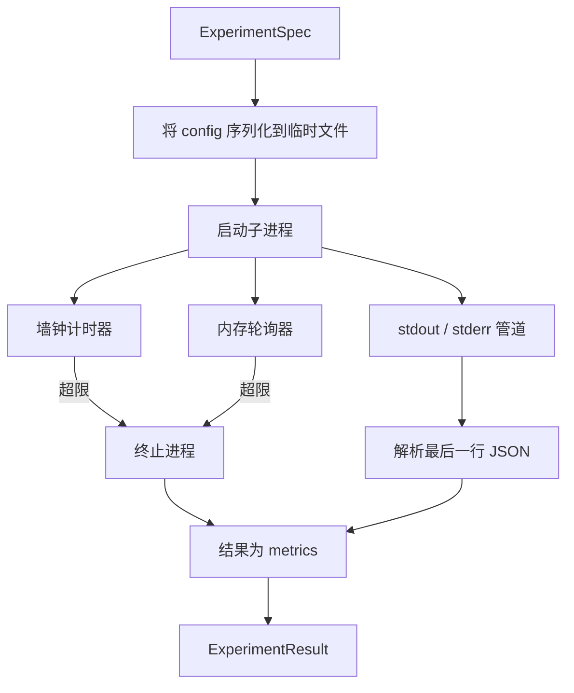

# 52 · 实验运行器

> 循环的诚实程度仅取决于其测量手段。构建一个运行器，接收一份规格，在沙箱子进程中执行它，并输出评估器可以信赖的 JSON 指标数据块。

**类型：** 构建
**语言：** Python
**前置：** 阶段 19 路线 A 第 20-29 课
**时长：** 约 90 分钟

## 学习目标
- 将实验编码为一个带类型的规格（ExperimentSpec），运行器可将其序列化传递给子进程。
- 以硬性墙钟超时和软性内存上限启动子进程，并将二者都作为终止条件上报。
- 将标准输出、标准错误和结构化指标数据块捕获到单个结果记录中。
- 构建一张消融表，每次在固定基础规格上扫过一个配置旋钮。
- 给定种子（seed）后，每次运行结果都是确定性的，确保评估器在多次运行中看到的数字相同。

## 为什么用子进程

研究循环运行的是不受信任的代码。假设来自采样器（sampler），实验脚本也来自同一路径；把两者视为进程内安全无异于自找崩溃，可能连带拖垮编排器（orchestrator）。子进程是语言自带的、最简单的隔离方式：独立进程、独立地址空间、父端有信号处理能力。

本课的运行器不实现完整沙箱化——没有 cgroup、没有 seccomp 过滤器、没有命名空间重映射。它具备的是墙钟超时、对内存增长进行轮询的循环，以及在任一限制触发时终止进程的 kill 路径。这就是所有更复杂的沙箱所扩展的运行时约定。本课将约定控制在一次阅读即可理解的范围内。

## ExperimentSpec 结构

```text
ExperimentSpec
  spec_id        : str            (稳定标识符，如 "exp_001")
  hypothesis_id  : int            (关联回第 50 课的假设队列)
  script_path    : str            (要运行的 Python 脚本路径)
  config         : dict           (作为单个 JSON 参数传给脚本)
  seed           : int            (实验的确定性种子)
  wall_timeout_s : float          (硬性超时，超时则终止)
  memory_cap_mb  : int            (软性上限，轮询监控；超限则终止)
  metric_keys    : list[str]      (评估器将要读取的字段列表)
```

脚本存在于磁盘上；运行器将 config 写入一个临时文件路径，脚本再读取该文件。脚本应在 stdout 打印一行 JSON，其键为 `metric_keys` 的超集。stdout 上的任何其他内容都会被捕获，但指标解析器会忽略它们。

## 架构



运行器是一个类，含一个主方法。轮询器是一个小线程，每隔一个轮询间隔唤醒一次，在平台支持时从 proc 文件系统读取子进程的 `psutil` 等效信息，在平台不支持时退化为空操作。

## 为什么用软性内存上限

硬性内存上限需要 `resource.setrlimit`，且仅在 POSIX 上有效。本课采用一种可移植方案：从平台轮询常驻内存大小（RSS），若超过上限则终止子进程。之所以是"软性"，是因为轮询间隔非零——进程可能在两次轮询之间短暂超过上限然后回落。运行器会记录观察到的最大 RSS，以便评估器了解运行距离限制有多近。

在不支持进程检查的系统上，轮询器会记录一条一次性警告并禁用自身。墙钟超时仍然适用。本课的测试覆盖了两种情况。

## 捕获 stdout 和 stderr

运行器在进程完成后读取两个管道。对 stdout 逐行扫描：最后一行能够解析为 JSON 且包含全部 `metric_keys` 的行，将被作为指标数据块。更早的 JSON 行则以 `intermediate_metrics` 保留在结果中；评估器可利用这些数据绘制学习曲线。

stderr 按原文捕获到结果中。运行器绝不会因为非零退出码而抛出异常；相反，它会在结果中记录该退出码。任何非零退出都会被标记为 `"crash"`，即使脚本已经打印了指标也是如此，因此评估器默认会将部分执行视为失败。

## 消融表

```python
def ablate(base: ExperimentSpec, knob: str, values: list[Any]) -> list[ExperimentSpec]:
    ...
```

给定一个基础规格和一个旋钮名称，该辅助函数为每个取值返回一个规格，其中 `config[knob]` 被覆盖。每个规格会获得一个派生出的 `spec_id`（`f"{base.spec_id}_{knob}_{value}"`）。运行器附带一个 `AblationRunner`，按顺序运行这些规格并返回一张以旋钮取值为键的 `AblationTable`。

为什么每次只扫一个旋钮。全因子扫描会指数级膨胀，产生评估器无法解释的结果。一次一个旋钮则产生一条干净的坐标轴，评估器可以据此绘图。本课只支持将多旋钮扫描作为重复的单旋钮消融，由调用方组合实现。

## 确定性

每个规格都携带一个种子。运行器通过 config 字典将种子传递给脚本（`config["__seed"] = spec.seed`）。`code/experiments/` 中的模拟实验脚本遵从该种子，并在多次运行中产生相同的指标。第 53 课的评估器依赖这一点——没有确定性，"回归"可能仅仅是不同随机初始化带来的差异。

## 模拟实验脚本

本课附带一个实验脚本：`code/experiments/sparsity_experiment.py`。这是一个真实的脚本，它读取自己的配置文件，用 numpy 随机过程模拟一次小型训练运行，并打印一行 JSON 指标数据块。该脚本支持 `sleep_s` 旋钮来测试超时，以及 `allocate_mb` 旋钮来测试内存轮询器。

此模拟并不真正训练任何模型。它是一个数值计算，模仿训练循环的形态：损失曲线、最终困惑度、墙钟时间。本课的重点是运行器，而非模拟本身。真实的实验脚本会导入一个模型。

## 结果结构

```text
ExperimentResult
  spec_id              : str
  hypothesis_id        : int
  exit_code            : int
  terminal             : "ok" | "timeout" | "oom" | "crash"
  wall_time_s          : float
  peak_rss_mb          : float | None
  metrics              : dict
  intermediate_metrics : list[dict]
  stdout_tail          : str
  stderr_tail          : str
```

评估器首先读取 `metrics` 和 `terminal`。如果 terminal 不是 `"ok"`，则该实验算作一次失败运行，评估器的裁决为自动判定。否则，指标会被送入显著性检验。

## 如何阅读代码

`code/main.py` 定义了 `ExperimentSpec`、`ExperimentResult`、`ExperimentRunner`、`AblationRunner`，以及一个确定性演示。子进程管理是一个类，内存轮询器是一个小线程，消融辅助函数是一个独立函数。

`code/experiments/sparsity_experiment.py` 是测试中使用的模拟实验。它从 argv 读取其配置文件路径，并在完成时写入一行 JSON 指标。

`code/tests/test_runner.py` 覆盖了成功路径、超时路径、崩溃路径、消融表，以及两次运行间的确定性检查。

## 本课在整体中的位置

第 50 课生成假设。第 51 课过滤掉文献已有定论的部分。第 52 课为剩余部分运行实验。第 53 课读取结果、运行显著性检验，并写下编排器根据假设 ID 存储的裁决。
