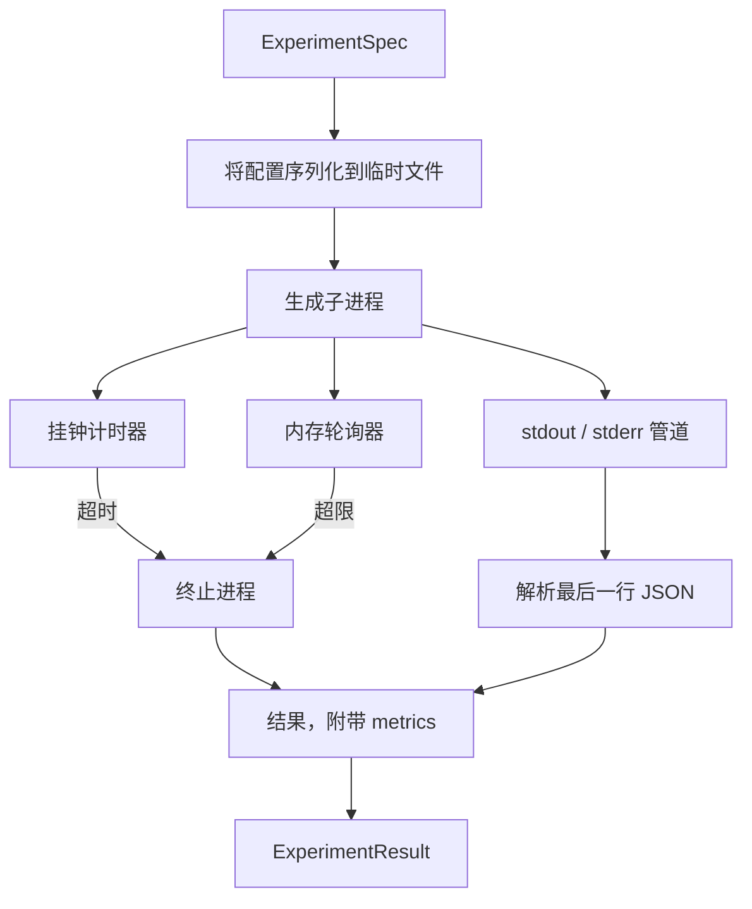

# 实验运行器

> 循环的诚实程度取决于其测量手段。构建一个运行器，它能接收规范说明，在沙箱子进程中执行，并输出评估器可以信赖的 JSON 指标数据块。

**类型：** 构建
**语言：** Python
**前置条件：** 第 19 阶段 Track A 第 20–29 课
**时长：** ~90 分钟

## 学习目标
- 将实验编码为类型化的规范说明，运行器可将其序列化到子进程中。
- 启动子进程，并设置严格的挂钟超时和软内存上限，将两者都作为终止条件呈现。
- 将 stdout、stderr 和结构化的指标数据块捕获到单一结果记录中。
- 构建消融表格，在固定基础规范上每次扫描一个配置旋钮。
- 给定种子后保持每个结果的确定性，使评估器在不同运行中看到相同的数值。

## 为何使用子进程

研究循环会运行不受信任的代码。假设来自采样器，实验脚本来自同一路径；将其中任何一个视为安全的进程内代码，无异于招致崩溃，使编排器一同宕掉。子进程是语言提供的最简单的隔离方式：独立的进程、独立的地址空间、父方可操作的信号句柄。

此处的运行器并未实现完整的沙箱化。没有 cgroup、没有 seccomp 过滤器、没有命名空间重映射。它所拥有的是挂钟超时、轮询内存增长情况的循环，以及在任一限制被超出时终止进程的 kill 路径。这是每一个更复杂的沙箱所扩展的运行时契约。本课将契约控制在足够小的规模，一读便懂。

## ExperimentSpec 结构

```text
ExperimentSpec
  spec_id        : str            （稳定 ID，如 "exp_001"）
  hypothesis_id  : int            （链接回第 50 课的队列）
  script_path    : str            （要运行的 Python 脚本路径）
  config         : dict           （作为 JSON 参数传递给脚本）
  seed           : int            （实验的确定性种子）
  wall_timeout_s : float          （硬超时，超过则终止）
  memory_cap_mb  : int            （软上限，轮询检测；超过则终止）
  metric_keys    : list[str]      （评估器将读取的字段）
```

脚本保存在磁盘上；运行器将配置写入一个脚本可读取的临时文件路径。脚本应在 stdout 上打印一行 JSON，其键是 `metric_keys` 的超集。stdout 上的其他内容会被捕获，但指标解析器会忽略它们。

## 架构


```mermaid
flowchart TD
    A[ExperimentSpec] --> B[将配置序列化到临时文件]
    B --> C[生成子进程]
    C --> D[stdout / stderr 管道]
    C --> E[挂钟计时器]
    C --> F[内存轮询器]
    E -- 超时 --> K[终止进程]
    F -- 超限 --> K
    D --> P[解析最后一行 JSON]
    K --> R[结果，terminal=timeout 或 oom]
    P --> R[结果，附带 metrics]
    R --> O[ExperimentResult]
```

运行器是一个类，包含一个主方法。轮询器是一个小型线程，每隔一个轮询间隔唤醒一次，当可用时从 proc 文件系统读取子进程的 `psutil` 等效信息，在平台不支持时回退为空操作。

## 为何使用软内存上限

硬内存上限需要使用 `resource.setrlimit`，且仅在 POSIX 上有效。本课提供了一种可移植的方法：从平台轮询常驻集大小，如果子进程超过上限则将其终止。该上限是软的，因为轮询器的间隔非零；进程可能在两次轮询之间短暂飙升到上限以上，然后又回落。运行器会记录观察到的最大 RSS，以便评估器了解运行距离上限有多近。

在不支持进程检查的系统上，轮询器会记录一次一次性警告并自行禁用。挂钟超时仍然生效。本课的测试覆盖了这两种路径。

## 捕获 stdout 和 stderr

运行器在完成时排空地读取两个管道。Stdout 逐行扫描；其中能解析为 JSON 且包含所有必需 `metric_keys` 的最后一行，被当作指标数据块。之前的 JSON 行保留在结果的 `intermediate_metrics` 中；评估器可用它们来绘制学习曲线。

Stderr 被逐字捕获到结果中。运行器不会因非零退出码而抛出异常；而是将退出码记录在结果中。任何非零退出都被标记为 `"crash"`，即使脚本打印了指标也是如此，这样评估器默认会将部分运行视为失败。

## 消融表

```python
def ablate(base: ExperimentSpec, knob: str, values: list[Any]) -> list[ExperimentSpec]:
    ...
```

给定一个基础规范和一个旋钮名称，该辅助函数为每个值返回一个规范，其中 `config[knob]` 被覆盖。每个规范获得一个派生的 `spec_id`（`f"{base.spec_id}_{knob}_{value}"`）。运行器附带一个 `AblationRunner`，它按顺序运行这些规范，并返回一个以旋钮值为键的 `AblationTable`。

为什么一次只处理一个旋钮。全因子组合以指数级增长，产生评估器无法解释的结果。一次只处理一个旋钮，能产生评估器可以绘图的清晰轴线。本课仅在调用方组合多次单旋钮消融时，才支持多旋钮扫描。

## 确定性

每个规范都带有一个种子。运行器通过配置字典将种子传递给脚本（`config["__seed"] = spec.seed`）。`code/experiments/` 中的模拟实验脚本遵循种子，并在多次运行中产生相同的指标。第 53 课的评估器依赖于此；没有确定性，所谓的"回归"可能仅仅是一次不同的随机初始化。

## 模拟实验脚本

本课附带一个实验脚本：`code/experiments/sparsity_experiment.py`。它是一个真实的脚本，读取其配置文件，使用 numpy 随机过程模拟一次小型训练运行，并打印 JSON 指标数据块。该脚本支持一个 `sleep_s` 旋钮用于测试超时，以及一个 `allocate_mb` 旋钮用于测试内存轮询器。

该模拟并非真正的训练。它是一个数值计算，模仿训练循环的形态：损失曲线、最终困惑度、运行耗时。本课的重点是运行器，而非模拟。真实的实验脚本会导入一个模型。

## 结果结构

```text
ExperimentResult
  spec_id              : str
  hypothesis_id        : int
  exit_code            : int
  terminal             : "ok" | "timeout" | "oom" | "crash"
  wall_time_s          : float
  peak_rss_mb          : float | None
  metrics              : dict
  intermediate_metrics : list[dict]
  stdout_tail          : str
  stderr_tail          : str
```

评估器首先读取 `metrics` 和 `terminal`。如果 terminal 不是 `"ok"`，则实验计为运行失败，评估器的判定为自动失败。否则，指标会通过显著性检验。

## 如何阅读代码

`code/main.py` 定义了 `ExperimentSpec`、`ExperimentResult`、`ExperimentRunner`、`AblationRunner` 和一个确定性演示。子进程管理是一个类。内存轮询器是一个小型线程。消融辅助函数是一个独立函数。

`code/experiments/sparsity_experiment.py` 是测试中使用的模拟实验。它从 argv 读取配置文件路径，并在完成时写入一行 JSON 指标。

`code/tests/test_runner.py` 覆盖了成功路径、超时路径、崩溃路径、消融表以及两次运行间的确定性检查。

## 在课程中的位置

第 50 课生成假设。第 51 课过滤掉文献中已有定论的内容。第 52 课对剩余的内容运行实验。第 53 课读取结果，运行显著性检验，并编写编排器针对假设 ID 存储的判定。
