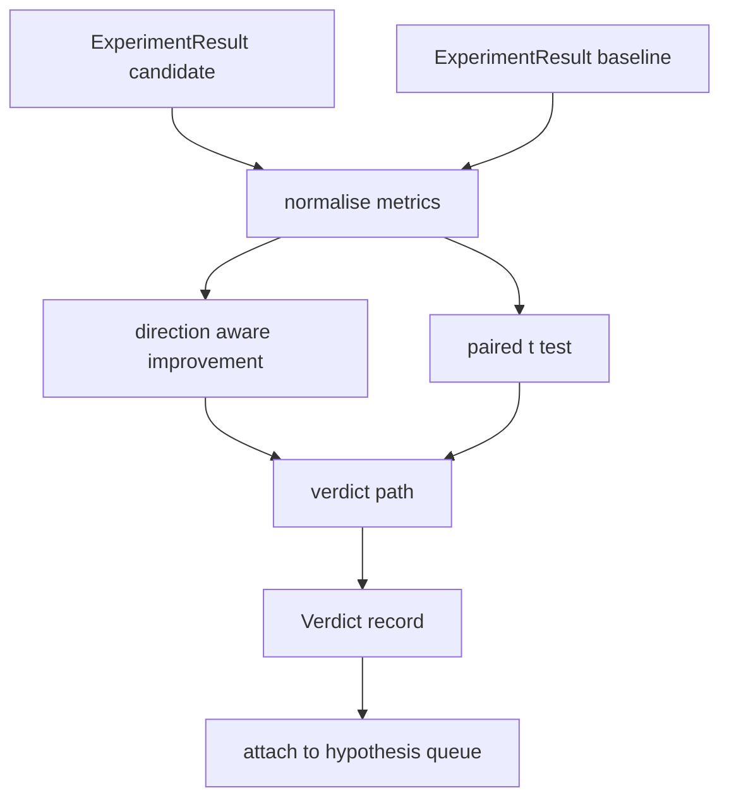

# 結果評価器

> runner は数値を出しました。evaluator は、その数値が改善なのか、劣化なのか、ノイズなのかを判定します。metrics を一行の結論へ変える verdict path を作ります。

**種別:** Build
**言語:** Python
**前提:** Phase 19 Track A lessons 20-29
**時間:** 約90分

## 学習目標
- direction aware improvement と固定 threshold で candidate run を baseline と比較する。
- seed ごとの metrics に対して paired t test を scratch で実装し、p value を読む。
- log scaled metric を正規化し、後続 report が linear metric と混ぜられるようにする。
- orchestrator が lesson 50 の queue に付与できる hypothesis ごとの verdict を出力する。
- 同じ input なら常に同じ verdict になるよう、各ステップを pure に保つ。

## なぜ paired test か

runner から出る一つの数値だけでは、変化が本物か分かりません。同じ configuration でも seed が違えば perplexity は変わります。適切な比較は paired です。同じ seed と同じ data で candidate と baseline を一度ずつ走らせ、seed ごとの差分を集めます。差分の平均が effect、差分の standard error が noise floor です。

```text
diffs    = [a_i - b_i for i in seeds]
mean     = sum(diffs) / n
variance = sum((d - mean) ** 2 for d in diffs) / (n - 1)
t_stat   = mean / sqrt(variance / n)
df       = n - 1
p_value  = two_sided_p(t_stat, df)
```

two sided p value は regularised incomplete beta function で計算します。この lesson には Lentz continued fraction を使う小さな stdlib 実装が含まれます。

## Direction aware improvement

accuracy や throughput のように上がるほど良い metric もあれば、loss、perplexity、wall time のように下がるほど良い metric もあります。evaluator は各 metric に `direction` を持たせます。

```text
if direction == "higher_is_better":
    improvement = (candidate - baseline) / abs(baseline)
elif direction == "lower_is_better":
    improvement = (baseline - candidate) / abs(baseline)
```

improvement は符号付きです。higher is better metric で負の improvement は candidate が悪いことを意味します。verdict path は符号と大きさの両方を読みます。

`improvement_threshold=0.02`、つまり2%の flat threshold が、呼ぶ価値のある変化かを決めます。これ未満は p value に関わらず `"noise"` です。

## アーキテクチャ



evaluator は三つの独立した計算を実行し、verdict path で結合します。各計算は shared state を持たない pure function です。

## Log normalisation

perplexity は loss に対して exponential です。loss の 0.1 低下は perplexity では大きな低下です。二つの configuration 間で perplexity を直接比較するのは問題ありませんが、linear metric と一つの report で混ぜるには正規化が必要です。

この lesson は `scale` field が `"log"` の metric を natural log に変換してから improvement を計算します。threshold も log space で適用します。

```text
if scale == "log":
    a = log(candidate)
    b = log(baseline)
else:
    a = candidate
    b = baseline
```

`scale="linear"` の metric は変換を skip します。

## Per seed paired test

lesson 52 の runner は run ごとに final metrics blob を一つ出します。paired test には candidate の各 seed の result と baseline の各 seed の result が必要です。orchestrator は両 configuration を同じ seed list で走らせ、evaluator に二つの `ExperimentResult` list を渡します。

evaluator は `result.metrics["seed"]` で pair を作ります。seed が一致しなければ `PairingError` を raise します。orchestrator は再実行すべきです。

## Verdict の形

```text
Verdict
  hypothesis_id          : int
  metric                 : str
  direction              : "higher_is_better" | "lower_is_better"
  scale                  : "linear" | "log"
  candidate_mean         : float
  baseline_mean          : float
  improvement            : float       (signed, fraction)
  p_value                : float | None  (n < 2 なら None)
  significance_threshold : float
  improvement_threshold  : float
  verdict                : "improved" | "regressed" | "noise" | "failed"
  rationale              : str
```

decision table は小さく固定されています。

```text
1. If any candidate result has terminal != "ok": verdict = "failed"
2. else if |improvement| < improvement_threshold:  verdict = "noise"
3. else if p_value is None or p_value > significance: verdict = "noise"
4. else if improvement > 0:                          verdict = "improved"
5. else:                                             verdict = "regressed"
```

`rationale` は orchestrator が hypothesis id に紐づけて log できる一行の説明です。

## コードの読み方

`code/main.py` は `MetricSpec`, `Verdict`, `Evaluator`, t statistic と incomplete beta helper、決定的 demo を定義します。t test は pure stdlib math で、`numpy` は metrics list の読み取りと平均・分散計算にだけ使います。

`code/tests/test_evaluator.py` は improved、regressed、small improvement の noise、low n の noise、failed terminal、log normalised path、既知 reference value に対する t test、pairing error を確認します。

## 位置づけ

lesson 50 は hypothesis queue を作り、lesson 51 は文献で決着済みのものを除外し、lesson 52 は candidate と baseline configuration を seed 群で走らせます。lesson 53 はそれらの run を読んで verdict を書きます。四つの dataclass があるだけで orchestrator に合成できます。
