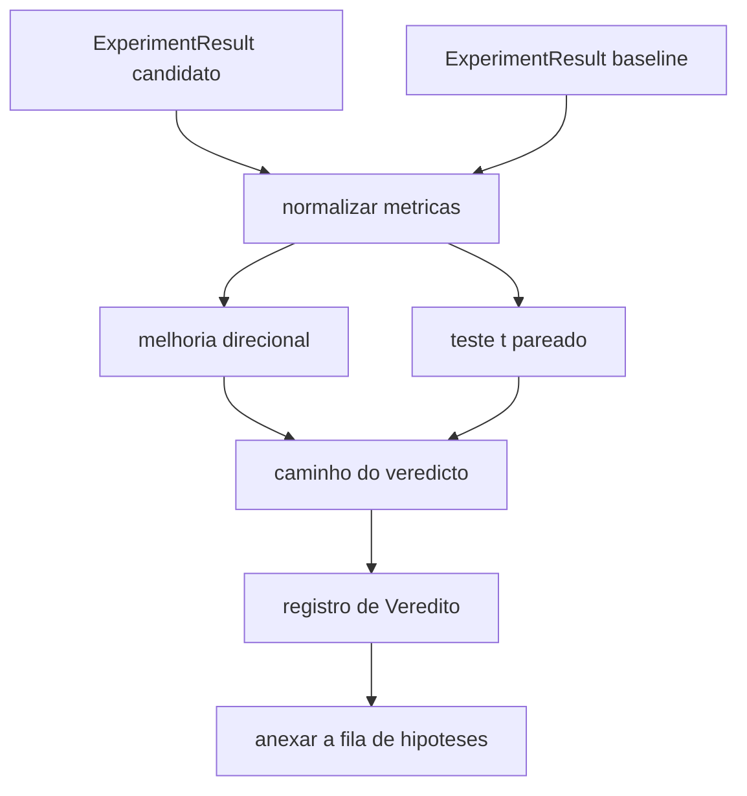

# Aula 53: Avaliador de Resultados

> O executor produziu numeros. O avaliador decide se esses numeros sao uma melhoria, uma regressao, ou ruido. Construa o caminho do veredicto que transforma metricas em uma conclusao de uma linha.

**Tipo:** Build
**Linguagens:** Python
**Prerequisitos:** Aulas 20-29 da Fase 19, Track A
**Tempo:** ~90 minutos

## Objetivos de Aprendizado
- Comparar uma execucao candidata contra uma baseline usando melhoria direcional e um limiar fixo.
- Rodar um teste t pareado do zero sobre metricas por seed e ler o valor p resultante.
- Normalizar metricas em escala log para que um relatorio downstream possa mistura-las com metricas lineares.
- Emitir um veredicto por hipotese que o orchestrator pode anexar a fila da aula 50.
- Manter todos os passos puros para que as mesmas entradas sempre produzam o mesmo veredicto.

## Por que um teste pareado

Um numero unico do executor nao diz se a mudanca e real. A mesma configuracao com uma seed diferente da uma perplexidade diferente. A mudanca pode ser ruido. A comparacao certa e pareada: as mesmas seeds com os mesmos dados, uma vez com o candidato e uma vez com a baseline. Cada seed contribui uma diferenca. A media dessas diferencas e o efeito. O erro padrao dessas diferencas e o chao de ruido.

A aula implementa o teste do zero. Nao ha `scipy.stats`. A matematica e pequena o suficiente para ler em uma tela.

```text
diffs    = [a_i - b_i for i in seeds]
media    = sum(diffs) / n
variancia = sum((d - media) ** 2 for d in diffs) / (n - 1)
t_stat   = media / sqrt(variancia / n)
df       = n - 1
p_value  = two_sided_p(t_stat, df)
```

O valor p bimodal usa uma funcao beta incompleta regularizada. A aula entrega uma implementacao pequena que usa a fracao continuada de Lentz. Tudo sao sessenta linhas de matematica da biblioteca padrao.

## Melhoria direcional

Algumas metricas melhoram quando sobem (acuracia, throughput). Outras melhoram quando caem (loss, perplexidade, tempo de parede). O avaliador carrega um campo `direction` em cada metrica.

```text
if direction == "higher_is_better":
    improvement = (candidato - baseline) / abs(baseline)
elif direction == "lower_is_better":
    improvement = (baseline - candidato) / abs(baseline)
```

Melhoria e com sinal. Uma melhoria negativa em uma metrica onde mais e melhor significa que o candidato e pior. O caminho do veredicto le o sinal e a magnitude juntos.

Um limiar flat (`improvement_threshold=0.02`, dois por cento) decide se a mudanca e grande o suficiente para chamar. Abaixo disso o veredicto e "ruido" independente do valor p; o loop nao se interessa por mudancas que o usuario nao conseguiria medir.

## Arquitetura



O avaliador roda tres computacoes independentes e as junta no caminho do veredicto. Cada computacao e uma funcao pura sem estado compartilhado.

## Normalizacao log

Perplexidade e exponencial em loss. Uma queda de 0.1 na loss e uma queda muito maior na perplexidade. Comparar perplexidade diretamente entre duas configuracoes e valido, mas mistura-la com metricas lineares em um relatorio unico requer normalizacao.

A aula normaliza qualquer metrica cujo campo `scale` e `"log"` pegando o log natural antes de calcular a melhoria. O limiar entao e aplicado em espaco log. Uma queda de perplexidade de 32 para 28 e `log(28) - log(32) = -0.133` em uma metrica onde mais e melhor, que esta bem acima do limiar de dois por cento.

```text
if scale == "log":
    a = log(candidato)
    b = log(baseline)
else:
    a = candidato
    b = baseline
```

Metricas com `scale="linear"` (padrao) pulam a transformacao. O mesmo caminho de codigo lida com ambas.

## Teste t pareado por seed

O executor da aula 52 emite um blob final de metricas por execucao. Para o teste pareado o avaliador precisa de um blob por seed para o candidato e um por seed para a baseline. O orchestrator roda o mesmo experimento sob ambas as configuracoes em uma lista de seeds e entrega ao avaliador duas listas de registros `ExperimentResult`.

O avaliador os pareia por seed (a seed vive em `result.metrics["seed"]`) e caminha a metrica solicitada. Se as seeds nao combinarem entre as duas listas, o avaliador levanta um `PairingError`. O orchestrator deve reexecutar.

## A forma do Veredito

```text
Veredito
  hypothesis_id          : int
  metric                 : str
  direction              : "higher_is_better" | "lower_is_better"
  scale                  : "linear" | "log"
  candidate_mean         : float
  baseline_mean          : float
  improvement            : float       (com sinal, fracao; ver regras de direcao)
  p_value                : float | None  (None se n < 2)
  significance_threshold : float
  improvement_threshold  : float
  verdict                : "improved" | "regressed" | "noise" | "failed"
  rationale              : str
```

O caminho do veredito e uma pequena tabela de decisao:

```text
1. Se qualquer resultado candidato tem terminal != "ok": veredito = "failed"
2. senao se |improvement| < improvement_threshold:  veredito = "noise"
3. senao se p_value e None ou p_value > significance: veredito = "noise"
4. senao se improvement > 0:                          veredito = "improved"
5. senao:                                             veredito = "regressed"
```

Rationale e uma frase legivel por humano de uma linha que o orchestrator pode logar contra o id da hipotese.

## Como ler o codigo

`code/main.py` define `MetricSpec`, `Veredito`, `Evaluator`, os auxiliares de estatistica t e beta incompleta, e um demo deterministico. O teste t e implementado em matematica pura da biblioteca padrao; numpy e usado apenas para ler a lista de metricas e computar medias e variancias.

`code/tests/test_evaluator.py` cobre o caminho improved, o caminho regressed, o caminho noise (melhoria pequena), o caminho noise (n baixo), o caminho de terminal failed, o caminho de normalizacao log, o teste t contra um valor de referencia conhecido, e o erro de pareamento.

## Onde isso encaixa

A aula 50 produziu a fila de hipoteses. A aula 51 filtrou qualquer coisa que a literatura resolveu. A aula 52 rodou o experimento sob configuracoes candidata e baseline em varias seeds. A aula 53 le essas execucoes e escreve o veredito. O orchestrator costura as quatro:

```text
for hipotese in fila:
    literatura = retrieval.search(hipotese.text)
    if literatura_resolve(hipotese, literatura):
        anexar(hipotese, veredito="settled")
        continue
    candidatos = executor.run_all(eespecificaçãoificacoes_para(hipotese))
    baselines  = executor.run_all(eespecificaçãoificacoes_baseline_para(hipotese))
    metric_especificação = MetricSpec("perplexity", direction=LOWER, scale=LOG)
    veredito = avaliador.evaluate(hipotese.id, metric_especificação, candidatos, baselines)
    anexar(hipotese, veredito)
```

Esse orchestrator nao esta nesta aula; as quatro aulas se compoem nele sem cola alem dos dataclasses que cada uma define.
