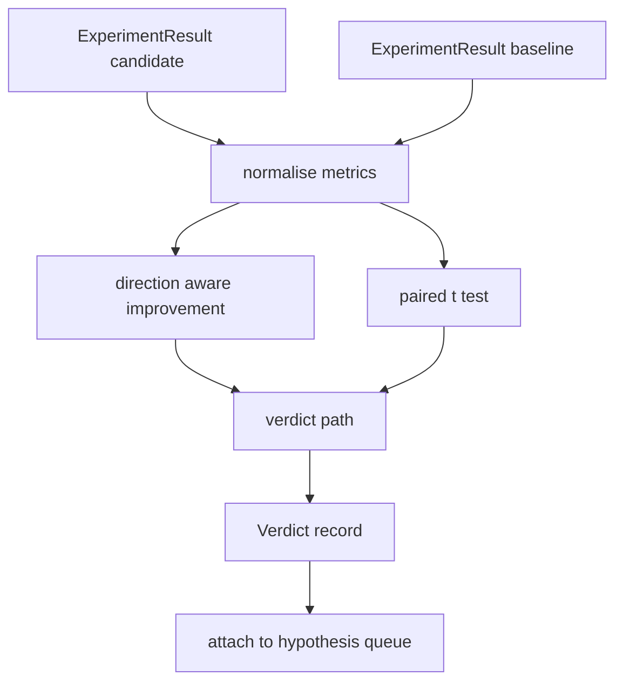

# Sonuç Değerlendirici

> Koşucu sayılar üretti. Değerlendirici bu sayıların bir iyileşme mi, bir gerileme mi yoksa gürültü mü olduğuna karar verir. Metrikleri tek satırlık bir sonuca dönüştürecek karar yolunu oluşturun.

**Tür:** Yapım
**Diller:** Python
**Önkoşullar:** Aşama 19 Bölüm A dersleri 20-29
**Süre:** ~90 dakika

## Öğrenme Hedefleri
- Yön farkındalığına sahip iyileştirme ve sabit bir eşik kullanarak bir adayı referans çizgisiyle karşılaştırın.
- Temel ölçümlere göre sıfırdan eşleştirilmiş bir t testi çalıştırın ve elde edilen p değerini okuyun.
- Günlük ölçekli ölçümleri normalleştirin, böylece bir alt rapor bunları doğrusal ölçümlerle harmanlayabilir.
- Orkestratörün ellili dersten itibaren kuyruğa ekleyebileceği hipotez başına bir karar yayınlayın.
- Aynı girdilerin her zaman aynı sonucu vermesi için her adımı saf tutun.

## Neden eşleştirilmiş test

Koşucudan gelen tek bir sayı, değişikliğin gerçek olup olmadığını söylemiyor. Farklı bir tohumla aynı konfigürasyon, farklı bir şaşkınlık verir. Değişiklik gürültü olabilir. Doğru karşılaştırma eşleştirilir: aynı verilere sahip aynı tohumlar, bir kez adayla ve bir kez de referans değerle çalıştırılır. Her tohum bir farka katkıda bulunur. Bu farklılıkların ortalaması etkidir. Bu farkların standart hatası gürültü tabanıdır.

Ders testi sıfırdan uygular. `scipy.stats` yok. Matematik tek ekranda okunabilecek kadar küçüktür.

```text
diffs    = [a_i - b_i for i in seeds]
mean     = sum(diffs) / n
variance = sum((d - mean) ** 2 for d in diffs) / (n - 1)
t_stat   = mean / sqrt(variance / n)
df       = n - 1
p_value  = two_sided_p(t_stat, df)
```

İki taraflı p değeri, düzenli hale getirilmiş tamamlanmamış bir beta işlevi kullanır. Derste Lentz sürekli kesirini kullanan küçük bir uygulama sunulmaktadır. Her şey altmış satırlık stdlib matematiğinden oluşuyor.

## Yön farkındalığına sahip iyileştirme

Bazı metrikler yükseldikçe iyileşir (doğruluk, verim). Diğerleri düştüklerinde iyileşir (kayıp, şaşkınlık, duvar süresi). Değerlendirici her metrikte bir `direction` alanı taşır.

```text
if direction == "higher_is_better":
    improvement = (candidate - baseline) / abs(baseline)
elif direction == "lower_is_better":
    improvement = (baseline - candidate) / abs(baseline)
```

İyileştirme imzalandı. Daha yüksek olan daha iyidir metriğindeki olumsuz bir gelişme, adayın daha kötü olduğu anlamına gelir. Karar yolu işareti ve büyüklüğü birlikte okur.

Düz bir eşik (`improvement_threshold=0.02`, yüzde iki), değişikliğin çağrılacak kadar büyük olup olmadığına karar verir. Bunun altında p değeri ne olursa olsun karar “gürültü”dür; döngü, kullanıcının ölçemediği değişikliklerle ilgilenmez.

## Mimarlık



Değerlendirici üç bağımsız hesaplama yapar ve bunları karar yolunda birleştirir. Her hesaplama, paylaşılan durumu olmayan saf bir işlevdir.

## Günlük normalleştirme

Kayıpta şaşkınlık üsteldir. Kayıptaki 0,1'lik bir düşüş, şaşkınlıkta çok daha büyük bir düşüştür. Karışıklığı doğrudan iki yapılandırma arasında karşılaştırmak iyidir, ancak bunu tek bir raporda doğrusal metriklerle harmanlamak normalleştirme gerektirir.

Ders, `scale` alanı `"log"` olan herhangi bir metriği, iyileştirmeyi hesaplamadan önce doğal logu alarak normalleştirir. Eşik daha sonra günlük alanına uygulanır. Şaşkınlık oranının 32'den 28'e düşmesi `log(28) - log(32) = -0.133`'nin daha düşük, daha iyi bir metrik olduğunu gösteriyor ve bu da yüzde iki eşiğinin oldukça üzerinde.

```text
if scale == "log":
    a = log(candidate)
    b = log(baseline)
else:
    a = candidate
    b = baseline
```

`scale="linear"` (varsayılan) içeren metrikler dönüşümü atlar. Aynı kod yolu her ikisini de yönetir.

## Tohum eşleştirilmiş testi başına

Elli ikinci dersteki koşucu, çalıştırma başına bir son ölçüm blobu yayar. Eşleştirilmiş test için değerlendiricinin aday için tohum başına bir blob'a ve temel için tohum başına bir blob'a ihtiyacı vardır. Orkestratör, aynı denemeyi her iki konfigürasyon altında bir çekirdek listesinde çalıştırır ve değerlendiriciye `ExperimentResult` kayıtlarının iki listesini verir.

Değerlendirici bunları tohuma göre eşleştirir (çekirdek `result.metrics["seed"]`'de yaşar) ve istenen metriğe göre hareket eder. Tohumlar iki listede eşleşmiyorsa değerlendirici `PairingError` değerini yükseltir. Orkestratörün yeniden çalıştırılması gerekir.

## Karar şekli

```text
Verdict
  hypothesis_id          : int
  metric                 : str
  direction              : "higher_is_better" | "lower_is_better"
  scale                  : "linear" | "log"
  candidate_mean         : float
  baseline_mean          : float
  improvement            : float       (signed, fraction; see direction rules)
  p_value                : float | None  (None if n < 2)
  significance_threshold : float
  improvement_threshold  : float
  verdict                : "improved" | "regressed" | "noise" | "failed"
  rationale              : str
```

Karar yolu küçük bir karar tablosudur:

```text
1. If any candidate result has terminal != "ok": verdict = "failed"
2. else if |improvement| < improvement_threshold:  verdict = "noise"
3. else if p_value is None or p_value > significance: verdict = "noise"
4. else if improvement > 0:                          verdict = "improved"
5. else:                                             verdict = "regressed"
```

Gerekçe, orkestratörün hipotez kimliğine göre günlüğe kaydedebileceği tek satırlık, insanlar tarafından okunabilen bir cümledir.

## Kod nasıl okunur

`code/main.py`, `MetricSpec`, `Verdict`, `Evaluator`'yi, t istatistiğini ve eksik beta yardımcılarını ve deterministik bir demoyu tanımlar. T testi saf stdlib matematiğinde uygulanır; numpy yalnızca metrik listesini okumak ve ortalamaları ve varyansları hesaplamak için kullanılır.

`code/tests/test_evaluator.py` iyileştirilmiş yolu, gerileyen yolu, gürültü yolunu (küçük iyileştirme), gürültü yolunu (düşük n), arızalı terminal yolunu, log normalize yolunu, bilinen bir referans değerine karşı t testini ve eşleştirme hatasını kapsar.

## Bunun yeri neresi

Elli ders hipotez sırasını oluşturdu. Elli birinci ders, literatürde kararlaştırılan her şeyi filtreledi. Elli ikinci ders, deneyi tohumlar arasında aday ve temel konfigürasyonlar altında yürüttü. Elli üçüncü ders bu koşuları okur ve hükmü yazar. Orkestracı dördünü bir araya getirir:

```text
for hypothesis in queue:
    literature = retrieval.search(hypothesis.text)
    if literature_settles(hypothesis, literature):
        attach(hypothesis, verdict="settled")
        continue
    candidates = runner.run_all(specs_for(hypothesis))
    baselines  = runner.run_all(baseline_specs_for(hypothesis))
    metric_spec = MetricSpec("perplexity", direction=LOWER, scale=LOG)
    verdict = evaluator.evaluate(hypothesis.id, metric_spec, candidates, baselines)
    attach(hypothesis, verdict)
```

O orkestratör bu derste yok; dört ders, her birinin tanımladığı veri sınıflarının ötesinde herhangi bir yapıştırıcı olmadan bu dersten oluşur.
