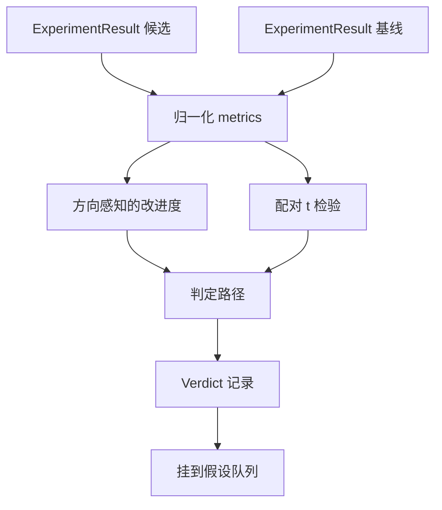

# 结果评估器（Result Evaluator）

> 译注：本文译自同目录 [`en.md`](./en.md)。术语遵循仓根 [TRANSLATION_GUIDE.md](../../../../TRANSLATION_GUIDE.md)。

> runner 跑出来一堆数字。评估器（evaluator）来决定这些数字到底是改进、回退，还是只是噪声。本课要搭的就是这条 verdict（裁决）路径——把指标转成一句话结论。

**Type:** Build
**Languages:** Python
**Prerequisites:** Phase 19 Track A lessons 20-29
**Time:** ~90 minutes

## 学习目标（Learning Objectives）
- 用「方向感知（direction aware）的改进幅度 + 固定阈值」把候选 run 和 baseline（基准）做对比。
- 从零实现一个 paired t test（配对 t 检验），跑在每个 seed 的指标上，并读懂得到的 p value。
- 把 log 尺度的指标做归一化，让下游报表能把它和线性指标混在一起看。
- 给每个 hypothesis（假设）输出一份 verdict，让 orchestrator（编排器）能把它挂回 lesson 50 的队列里。
- 让每一步都保持纯函数：同样的输入永远给同样的 verdict。

## 为什么要做配对检验（Why a paired test）

runner 给的单一数字本身说明不了变化是不是真的。同样的配置换一个 seed，perplexity 就不一样。这种变化可能就是噪声。正确的对比方式是配对的：相同的 seed、相同的数据，先用 candidate 跑一遍、再用 baseline 跑一遍。每个 seed 贡献一个差值。这些差值的均值就是效应（effect），它们的标准误就是噪声地板。

本课从零实现这个检验。不用 `scipy.stats`。数学小到一屏就能看完。

```text
diffs    = [a_i - b_i for i in seeds]
mean     = sum(diffs) / n
variance = sum((d - mean) ** 2 for d in diffs) / (n - 1)
t_stat   = mean / sqrt(variance / n)
df       = n - 1
p_value  = two_sided_p(t_stat, df)
```

双侧 p value 用的是正则化不完全 beta 函数。本课附了一个用 Lentz 连分式实现的小版本，整个东西用 stdlib 数学库写出来才六十行。

## 方向感知的改进幅度（Direction aware improvement）

有些指标越高越好（accuracy、throughput）。有些越低越好（loss、perplexity、wall time）。评估器在每个指标上挂一个 `direction` 字段。

```text
if direction == "higher_is_better":
    improvement = (candidate - baseline) / abs(baseline)
elif direction == "lower_is_better":
    improvement = (baseline - candidate) / abs(baseline)
```

improvement 是带符号的。在「越高越好」的指标上拿到负的 improvement，意味着 candidate 更差。verdict 路径同时看符号和幅度。

一个固定阈值（`improvement_threshold=0.02`，也就是 2%）来决定这次变化够不够大、能不能下结论。低于这个阈值，无论 p value 多漂亮，verdict 都是 "noise"——loop 对用户根本感知不到的变化没兴趣。

## 架构（Architecture）



评估器跑三组独立的计算，然后在 verdict 路径里汇合。每组计算都是纯函数，没有共享状态。

## 对数归一化（Log normalisation）

perplexity 是 loss 的指数。loss 掉 0.1，perplexity 会掉一大截。直接拿两套配置的 perplexity 对比是没问题的，但要把它和线性指标在同一张报表里混着看，就得做归一化。

本课的处理是：凡是 `scale` 字段为 `"log"` 的指标，先取自然对数再去算 improvement。阈值就跟着在对数空间里判定。perplexity 从 32 掉到 28，在「越低越好」指标上对应 `log(28) - log(32) = -0.133`，远超 2% 阈值。

```text
if scale == "log":
    a = log(candidate)
    b = log(baseline)
else:
    a = candidate
    b = baseline
```

`scale="linear"`（默认）的指标跳过这个变换。两种情况共用同一条代码路径。

## 每 seed 的配对检验（Per seed paired test）

lesson 52 的 runner 每跑一次只给一份最终指标 blob。要跑配对检验，评估器需要的是：每个 seed 一份 candidate blob，每个 seed 一份 baseline blob。orchestrator 在一组 seed 上分别用两套配置跑同一个实验，然后把两份 `ExperimentResult` 列表交给评估器。

评估器按 seed 配对（seed 存在 `result.metrics["seed"]` 里），然后扫过指定的指标。如果两个列表里的 seed 对不上，评估器会抛 `PairingError`。这时 orchestrator 应该重跑。

## Verdict 的形状（The Verdict shape）

```text
Verdict
  hypothesis_id          : int
  metric                 : str
  direction              : "higher_is_better" | "lower_is_better"
  scale                  : "linear" | "log"
  candidate_mean         : float
  baseline_mean          : float
  improvement            : float       (signed, fraction; see direction rules)
  p_value                : float | None  (None if n < 2)
  significance_threshold : float
  improvement_threshold  : float
  verdict                : "improved" | "regressed" | "noise" | "failed"
  rationale              : str
```

verdict 路径是一张小决策表：

```text
1. If any candidate result has terminal != "ok": verdict = "failed"
2. else if |improvement| < improvement_threshold:  verdict = "noise"
3. else if p_value is None or p_value > significance: verdict = "noise"
4. else if improvement > 0:                          verdict = "improved"
5. else:                                             verdict = "regressed"
```

rationale 是一句给人看的话，orchestrator 可以把它按 hypothesis id 写进日志。

## 怎么读这份代码（How to read the code）

`code/main.py` 定义了 `MetricSpec`、`Verdict`、`Evaluator`、t 统计量和不完全 beta 的辅助函数，以及一个确定性的 demo。t test 用纯 stdlib 数学库实现；numpy 只用来读指标列表、算均值和方差。

`code/tests/test_evaluator.py` 覆盖了：improved 路径、regressed 路径、noise 路径（改进太小）、noise 路径（n 太少）、terminal 失败路径、log 归一化路径、t test 对一个已知参考值的核对，以及配对错误。

## 这一课嵌在哪里（Where this slots in）

lesson 50 产出 hypothesis 队列。lesson 51 把文献里已经有定论的过滤掉。lesson 52 在一组 seed 上分别用 candidate 和 baseline 配置跑实验。lesson 53 读这些 run，写出 verdict。orchestrator 把这四节缝起来：

```text
for hypothesis in queue:
    literature = retrieval.search(hypothesis.text)
    if literature_settles(hypothesis, literature):
        attach(hypothesis, verdict="settled")
        continue
    candidates = runner.run_all(specs_for(hypothesis))
    baselines  = runner.run_all(baseline_specs_for(hypothesis))
    metric_spec = MetricSpec("perplexity", direction=LOWER, scale=LOG)
    verdict = evaluator.evaluate(hypothesis.id, metric_spec, candidates, baselines)
    attach(hypothesis, verdict)
```

orchestrator 本身不在这一课里；这四课能直接拼起来，除了每课各自定义的 dataclass，没有别的胶水代码。
