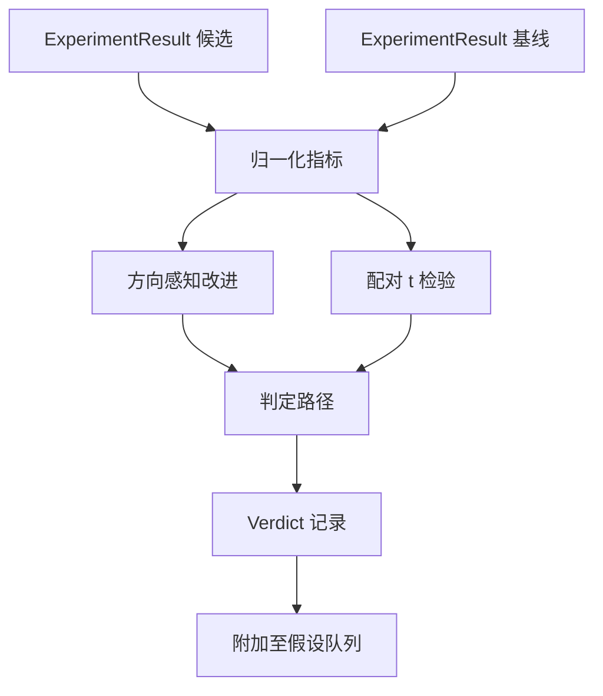

# 53 · 结果评估器

> 运行器产生了数字。评估器（Evaluator）判断这些数字代表改进、退步还是噪声。构建将指标转化为单行结论的判定路径（verdict path）。

**类型：** 构建
**语言：** Python
**前置：** 第 19 阶段 A 轨道第 20-29 课
**时长：** 约 90 分钟

## 学习目标
- 使用方向感知改进和固定阈值，将候选运行与基线进行比较。
- 基于逐种子（per-seed）指标从头实现配对 t 检验（paired t-test），并解读得到的 p 值。
- 对对数尺度（log-scale）指标进行归一化，使下游报告能将其与线性指标混合使用。
- 为每个假设（hypothesis）输出一份判定（verdict），编排器（orchestrator）可将其附加到第 50 课的假设队列中。
- 保持每一步都是纯函数，使相同的输入始终产生相同的判定。

## 为什么要用配对检验

运行器给出的单个数字并不能说明变化是否真实。相同配置下使用不同种子（seed），得到的困惑度（perplexity）会不一样。这个变化可能只是噪声。正确的比较方式是配对的：用相同的种子、相同的数据，分别以候选配置和基线配置各跑一次。每个种子贡献一个差值。这些差值的均值就是效应大小。这些差值的标准误差就是噪声基底。

本课从头实现这个检验，不使用 `scipy.stats`。涉及的数学量刚好够在一屏内读完。

```text
diffs    = [a_i - b_i for i in seeds]
mean     = sum(diffs) / n
variance = sum((d - mean) ** 2 for d in diffs) / (n - 1)
t_stat   = mean / sqrt(variance / n)
df       = n - 1
p_value  = two_sided_p(t_stat, df)
```

双侧 p 值使用正则化不完全贝塔函数（regularised incomplete beta function）计算。本课附带一个小型实现，使用 Lentz 连分数（Lentz continued fraction）方法，总共约六十行标准库数学代码。

## 方向感知改进

有些指标上升代表变好（准确率、吞吐量），有些指标下降代表变好（损失、困惑度、挂钟时间）。评估器为每个指标携带一个 `direction` 字段。

```text
if direction == "higher_is_better":
    improvement = (candidate - baseline) / abs(baseline)
elif direction == "lower_is_better":
    improvement = (baseline - candidate) / abs(baseline)
```

改进量带符号。在 `higher_is_better` 的指标上出现负的改进量意味着候选比基线更差。判定路径同时读取符号和幅度。

一个固定阈值（`improvement_threshold=0.02`，即 2%）用于判断变化是否大到值得关注。低于该阈值时，无论 p 值如何，判定都是「noise」—— 对于用户无法察觉的变化，循环没有必要处理。

## 架构



评估器执行三项独立计算，并在判定路径中汇合。每项计算都是纯函数，不共享任何状态。

## 对数归一化

困惑度与损失呈指数关系。损失下降 0.1，困惑度的下降要大得多。直接比较两种配置下的困惑度没有问题，但要在单份报告中将它与线性指标混合，就需要先做归一化。

本课对 `scale` 字段为 `"log"` 的指标，在计算改进量之前先取自然对数。然后在对数空间内应用阈值。例如困惑度从 32 降到 28，对于 `lower_is_better` 指标，`log(28) - log(32) = -0.133`，远超 2% 阈值。

```text
if scale == "log":
    a = log(candidate)
    b = log(baseline)
else:
    a = candidate
    b = baseline
```

`scale="linear"`（默认）的指标跳过变换。同一段代码路径同时处理两种情况。

## 逐种子配对检验

第 52 课的运行器（runner）每次运行只输出一个最终指标数据块。对于配对检验，评估器需要候选配置和基线配置各一份逐种子指标数据块。编排器在相同的种子列表下，以两种配置分别运行同一实验，然后将两份 `ExperimentResult` 记录列表交给评估器。

评估器按种子配对（种子存储在 `result.metrics["seed"]` 中），然后遍历所请求的指标。如果两份列表的种子不匹配，评估器抛出 `PairingError`，编排器应重新运行。

## Verdict 数据结构

```text
Verdict
  hypothesis_id          : int
  metric                 : str
  direction              : "higher_is_better" | "lower_is_better"
  scale                  : "linear" | "log"
  candidate_mean         : float
  baseline_mean          : float
  improvement            : float       (带符号，分数；参见方向规则)
  p_value                : float | None  (n < 2 时为 None)
  significance_threshold : float
  improvement_threshold  : float
  verdict                : "improved" | "regressed" | "noise" | "failed"
  rationale              : str
```

判定路径是一个简洁的决策表：

```text
1. 若任一候选结果的 terminal != "ok":           verdict = "failed"
2. 否则若 |improvement| < improvement_threshold:  verdict = "noise"
3. 否则若 p_value 为 None 或 p_value > significance: verdict = "noise"
4. 否则若 improvement > 0:                          verdict = "improved"
5. 否则:                                             verdict = "regressed"
```

`rationale` 是一行人类可读的句子，编排器可以根据假设 ID 将其记录到日志中。

## 如何阅读代码

`code/main.py` 定义了 `MetricSpec`、`Verdict`、`Evaluator`、t 统计量和不完全贝塔函数的辅助函数，以及一个确定性演示。t 检验完全使用标准库数学实现；numpy 仅用于读取指标列表以及计算均值和方差。

`code/tests/test_evaluator.py` 覆盖了以下路径：改进路径、退步路径、噪声路径（改进幅度过小）、噪声路径（n 过小）、失败终止路径、对数归一化路径、与已知参考值的 t 检验对比，以及配对错误。

## 本课在整体中的位置

第 50 课产出了假设队列。第 51 课过滤掉了已有文献定论的内容。第 52 课在候选配置和基线配置下跨种子运行实验。第 53 课读取这些运行结果并输出判定。编排器将这四个环节串联起来：

```text
for hypothesis in queue:
    literature = retrieval.search(hypothesis.text)
    if literature_settles(hypothesis, literature):
        attach(hypothesis, verdict="settled")
        continue
    candidates = runner.run_all(specs_for(hypothesis))
    baselines  = runner.run_all(baseline_specs_for(hypothesis))
    metric_spec = MetricSpec("perplexity", direction=LOWER, scale=LOG)
    verdict = evaluator.evaluate(hypothesis.id, metric_spec, candidates, baselines)
    attach(hypothesis, verdict)
```

该编排器不在本课范围内；这四课通过各自定义的数据类（dataclass）即可无缝组合，无需额外胶水代码。
