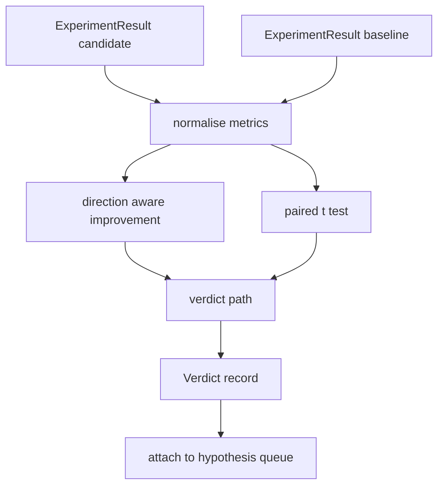

# 结果评估器（Result Evaluator）

> 运行器产生了数字。评估器决定这些数字是改进、回退还是噪声。构建裁决路径，将指标转化为一行结论。

**类型：** 构建
**语言：** Python
**前置条件：** 第 19 阶段 Track A 第 20–29 课
**用时：** 约 90 分钟

## 学习目标

- 使用方向感知的改进量和固定阈值，将候选运行与基线进行比较。
- 基于各种子（per seed）指标从头实现配对的 t 检验，并读取得到的 p 值。
- 对对数尺度的指标进行归一化，以便下游报告能够将其与线性指标混合使用。
- 对每个假设输出裁决结果，供第 50 课的编排器附加到队列中。
- 保持每一步均为纯函数，确保相同的输入始终产生相同的裁决。

## 为什么使用配对检验

运行器输出的单一数字并不能说明变化是否真实存在。同一配置使用不同种子会产生不同的困惑度（perplexity）。这种变化可能只是噪声。正确的比较方式是配对比较：使用相同的种子和相同的数据，分别用候选配置和基线配置各运行一次。每个种子贡献一个差值。这些差值的均值就是效应量，差值的标准误就是噪声基底。

本课从头实现检验，不依赖 `scipy.stats`。涉及的数学运算足够简单，可以在一个屏幕内读完。

```text
diffs    = [a_i - b_i for i in seeds]
mean     = sum(diffs) / n
variance = sum((d - mean) ** 2 for d in diffs) / (n - 1)
t_stat   = mean / sqrt(variance / n)
df       = n - 1
p_value  = two_sided_p(t_stat, df)
```

双侧 p 值使用正则化不完全 Beta 函数计算。本课附带了一个小型实现，使用 Lentz 连分式。整个代码只有六十行标准库数学。

## 方向感知的改进量

某些指标在数值上升时表示改进（如准确率、吞吐量），而另一些则在数值下降时表示改进（如损失、困惑度、运行时间）。评估器为每个指标携带一个 `direction` 字段。

```text
if direction == "higher_is_better":
    improvement = (candidate - baseline) / abs(baseline)
elif direction == "lower_is_better":
    improvement = (baseline - candidate) / abs(baseline)
```

改进量是有符号的。对于"越高越好"的指标，负的改进量意味着候选配置更差。裁决路径同时读取符号和大小。

一个平坦阈值（`improvement_threshold=0.02`，即 2%）决定变化是否足够大而值得关注。低于此阈值的裁决结果为"噪声"，无论 p 值如何；循环对用户无法测量的变化不感兴趣。

## 架构


```mermaid
flowchart TD
    A[ExperimentResult candidate] --> N[normalise metrics]
    B[ExperimentResult baseline] --> N
    N --> I[direction aware improvement]
    N --> T[paired t test]
    I --> V[verdict path]
    T --> V
    V --> O[Verdict record]
    O --> Q[attach to hypothesis queue]
```

评估器运行三个独立的计算，并在裁决路径中汇合。每个计算都是纯函数，无共享状态。

## 对数归一化

困惑度相对于损失是指数级的。损失下降 0.1 对应困惑度的大幅下降。直接比较两种配置下的困惑度是可行的，但如果要在同一份报告中将其与线性指标混合使用，就需要进行归一化。

本课对任何 `scale` 字段为 `"log"` 的指标进行归一化：在计算改进量之前先取自然对数。阈值随后在对数空间中应用。困惑度从 32 降至 28，对于"越低越好"的指标，其改进量为 `log(28) - log(32) = -0.133`，远高于 2% 的阈值。

```text
if scale == "log":
    a = log(candidate)
    b = log(baseline)
else:
    a = candidate
    b = baseline
```

`scale="linear"`（默认值）的指标跳过变换。同一代码路径同时处理两种尺度。

## 逐种子配对检验

第 52 课的运行器每次运行输出一个最终指标数据块。对于配对检验，评估器需要每个种子在候选配置下的一个数据块和在基线配置下的一个数据块。编排器在两种配置下对同一组种子列表运行相同的实验，然后将两个 `ExperimentResult` 记录列表交给评估器。

评估器按种子（种子值位于 `result.metrics["seed"]` 中）进行配对，并遍历所请求的指标。如果两个列表中的种子不匹配，评估器会抛出 `PairingError`。编排器应重新运行。

## 裁决结构

```text
Verdict
  hypothesis_id          : int
  metric                 : str
  direction              : "higher_is_better" | "lower_is_better"
  scale                  : "linear" | "log"
  candidate_mean         : float
  baseline_mean          : float
  improvement            : float       (有符号，分数；参见方向规则)
  p_value                : float | None  (当 n < 2 时为 None)
  significance_threshold : float
  improvement_threshold  : float
  verdict                : "improved" | "regressed" | "noise" | "failed"
  rationale              : str
```

裁决路径是一个小型决策表：

```text
1. 如果任何候选结果的 terminal != "ok"：              verdict = "failed"
2. 否则如果 |improvement| < improvement_threshold：   verdict = "noise"
3. 否则如果 p_value 为 None 或 p_value > significance：verdict = "noise"
4. 否则如果 improvement > 0：                          verdict = "improved"
5. 否则：                                              verdict = "regressed"
```

Rationale（理由）是一行人类可读的句子，编排器可以将其记录到假设 ID 下。

## 如何阅读代码

`code/main.py` 定义了 `MetricSpec`、`Verdict`、`Evaluator`、t 统计量和不完全 Beta 辅助函数，以及一个确定性演示。t 检验使用纯标准库数学实现；numpy 仅用于读取指标列表以及计算均值和方差。

`code/tests/test_evaluator.py` 覆盖了改进路径、回退路径、噪声路径（小改进）、噪声路径（样本量小）、失败终止路径、对数归一化路径、针对已知参考值的 t 检验以及配对错误。

## 在整个课程中的位置

第 50 课生成了假设队列。第 51 课过滤掉了已有文献已解决的问题。第 52 课在候选配置和基线配置下跨种子运行实验。第 53 课读取这些运行结果并输出裁决。编排器将四者串联起来：

```text
for hypothesis in queue:
    literature = retrieval.search(hypothesis.text)
    if literature_settles(hypothesis, literature):
        attach(hypothesis, verdict="settled")
        continue
    candidates = runner.run_all(specs_for(hypothesis))
    baselines  = runner.run_all(baseline_specs_for(hypothesis))
    metric_spec = MetricSpec("perplexity", direction=LOWER, scale=LOG)
    verdict = evaluator.evaluate(hypothesis.id, metric_spec, candidates, baselines)
    attach(hypothesis, verdict)
```

该编排器不在本课中；四节课通过各自定义的数据类即可组合成编排器，无需额外的胶水代码。
