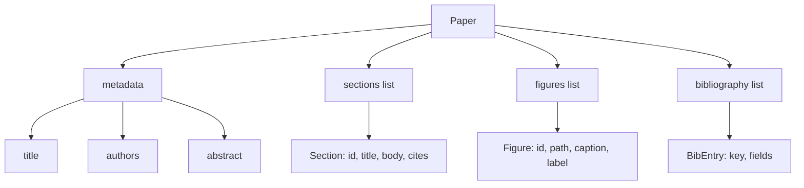
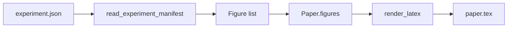
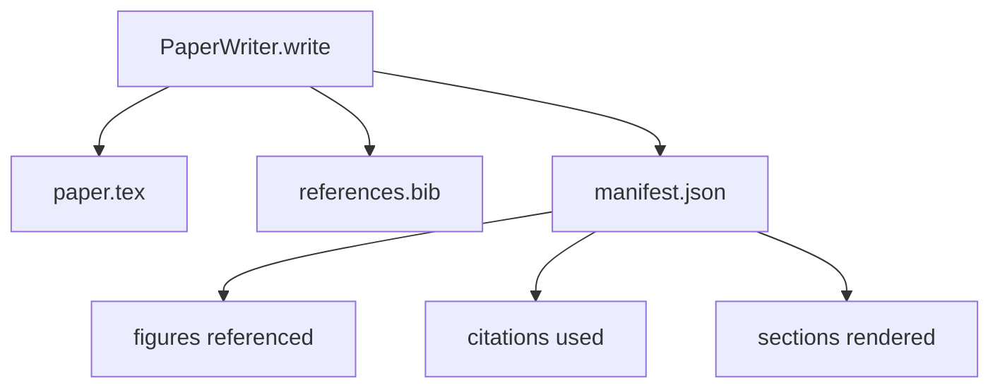

# 論文ライター

> LaTeX skeleton は研究者と typesetter の contract です。contract が壊れていれば document は compile されず、失敗は大きく見えます。まず skeleton を作り、それから埋めます。

**種別:** Build
**言語:** Python
**前提:** Phase 19 lessons 50-53
**時間:** 約90分

## 学習目標
- 論文を freeform document ではなく、既知の section graph を持つ structured artifact として扱う。
- prose を書く前に abstract、sections、figure slots、bibliography keys を宣言する LaTeX skeleton を生成する。
- experiment output の paths と captions から、決定的な slot mechanism で figures を skeleton に注入する。
- structured outline から各 section を埋める mocked prose generator をつなぎ、model なしで harness を test できるようにする。
- `paper.tex`、`references.bib`、参照 figure と citation を列挙する manifest を出力する。

## なぜ skeleton first か

prose から始まる draft は structural debt を蓄積します。introduction に related work の paragraph が入り、figure が定義前に参照され、同じ paper に三つの bibliography key ができます。気づく頃には、書くコストより直すコストが高くなります。

skeleton はこれを反転します。構造を data として先に宣言します。section は name と order を持つ slot、figure は id と caption を持つ slot、bibliography key は対応する entry とともに宣言されます。prose は slot に一つずつ生成されます。harness は prose 生成前に、figure slot、citation entry、table of contents の section を検証できます。

## Paper の形

すべての field は plain Python data です。renderer は `Paper` から LaTeX string への pure function です。harness は render 前に section 数、missing figure files、すべての `\cite{key}` に対応する `BibEntry` があるかを検査できます。

## Render contract

renderer は三つを保証します。第一に、すべての figure slot は `fig:<id>` 形式の stable label を持つ `\begin{figure}` block を出力します。第二に、すべての section は `sec:<id>` 形式の stable label を持つ `\section{}` を出力します。第三に、bibliography は `references.bib` に paper で宣言された entry だけを含めます。

違反は warning ではなく render error です。skeleton は contract なので、figure を黙って落とす render は contract break です。

## Experiment からの figure injection

この track の前半 lesson は experiment output を JSON manifest として出します。各 manifest は path と short caption を持つ artifacts list を含みます。paper writer はそれを読み `Figure` record を作ります。

figure id は experiment name と monotonic counter から導出します。caption は manifest から来ます。path は paper output directory からの相対 path に正規化されます。

## Mocked prose generator

この lesson は model を呼びません。`MockProseGenerator` は outline shape を読み、決定的に prose を出します。outline は section ごとに一つの短い string です。generator は section title を織り込みつつ二つの短い paragraph へ展開し、outline が宣言したときだけ figure と citation に言及します。

実装を本番化する場合は generator を model call に差し替えます。周囲の harness は変わりません。

## Manifest output

writer は output directory に三つの file を出します。

次の critic loop は LaTeX ではなく manifest を読みます。そのため manifest は contract の一部です。

## Validation gates

writer は file を書く前に四つの gate を走らせます。

1. paper 内のすべての figure id が unique。
2. 各 section の `cites` が paper 上で宣言された bibliography key を参照している。
3. abstract が空ではない。
4. title が空ではない。

失敗した gate は precise reason 付きで `PaperValidationError` を raise します。partial write はありません。三つの file がすべて出るか、一つも出ません。

## コードの読み方

`code/main.py` は `Paper`, `Section`, `Figure`, `BibEntry`, `PaperValidationError`, `MockProseGenerator`, `PaperWriter`, `render_latex` を定義します。`write` method は output directory を受け取り、`paper.tex`, `references.bib`, `manifest.json` を出します。`read_experiment_manifest` は experiment manifest list を `Figure` record に変換します。

`code/tests/test_paper_writer.py` は section なし skeleton、二つの section と二つの figure を持つ full render、missing citation gate、duplicate figure id gate、manifest content、LaTeX string contract を確認します。

## 発展

実装を広げるなら二つの方向があります。第一に multi-format render です。同じ `Paper` shape から blog 用 Markdown や preview 用 HTML を生成できます。第二に citation enrichment です。local DOI cache から BibTeX entry を補完できます。どちらも skeleton contract を変えずに足せます。
