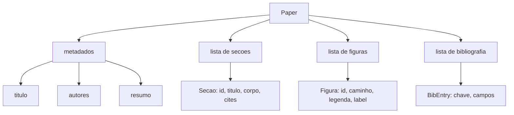
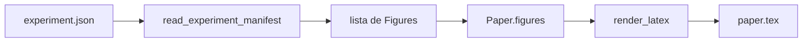
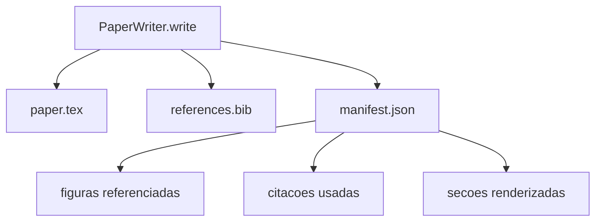

# Aula 54: Escritor de Paper

> Um esqueleto LaTeX e um contrato entre o pesquisador e o tipador. Se o contrato quebrar o documento nao compila, e a falha e ruidosa. Constroe o esqueleto primeiro, depois preencha.

**Tipo:** Build
**Linguagens:** Python
**Prerequisitos:** Aulas 50-53 da Fase 19
**Tempo:** ~90 minutos

## Objetivos de Aprendizado
- Tratar um paper de pesquisa como um artefato estruturado com um grafo de secoes conhecido, nao um documento de forma livre.
- Gerar um esqueleto LaTeX que declara seu resumo, secoes, slots de figuras, e chaves de bibliografia antes que qualquer prosa seja escrita.
- Injetar figuras a partir de outputs de experimentos (caminhos e legendas) no esqueleto atraves de um mecanismo de slot deterministico.
- Conectar um gerador de prosa mock que preenche cada secao a partir de um outline estruturado para que o harness seja testavel sem um modelo.
- Emitir um unico `paper.tex` mais um `references.bib` mais um manifesto que lista toda figura referenciada e toda citacao usada.

## Por que um esqueleto primeiro

Um rascunho que comeca como prosa acumula divida estrutural. A introducao cresce tres paragrafos que deveriam estar em trabalho relacionado. Uma figura e referenciada antes de ser definida. A bibliografia termina com tres chaves para o mesmo paper. Quando o autor percebe, o custo de reescrever e maior que o custo de escrever.

Um esqueleto inverte isso. A estrutura e declarada de antemao como dados. Secoes sao slots com nomes e ordem. Figuras sao slots com ids e legendas. Chaves de bibliografia sao declaradas no topo com as entradas que apontam. Prosa e gerada nesses slots um de cada vez. O harness pode validar, antes que qualquer prosa seja escrita, que toda figura tem um slot, toda citacao tem uma entrada, e toda secao aparece no sumario.

E a mesma disciplina que aulas anteriores aplicaram a planos, chamadas de ferramenta, e traces. A estrutura e o contrato.

## A forma do Paper

Todo campo e dado Python puro. O renderizador e uma funcao pura de `Paper` para uma string LaTeX. O harness pode introespecificaçãotar o paper antes de renderizar: contar secoes, listar arquivos de figura faltantes, checar que todo `\cite{key}` tem um `BibEntry` correspondente.

## O contrato do render

O renderizador garante tres propriedades. Primeiro, todo slot de figura no esqueleto emite um bloco `\begin{figure}` com um label estavel da forma `fig:<id>`. Segundo, toda secao emite um `\section{}` com um label estavel da forma `sec:<id>` para que referencias cruzadas funcionem. Terceiro, a bibliografia emite um bloco `\bibliography` cujo `references.bib` contem exatamente as entradas declaradas no paper, nem mais nem menos.

Violar qualquer uma dessas e um erro de render, nao um aviso. O esqueleto e o contrato; um render que silenciosamente descarta uma figura e uma quebra de contrato.

## Injecao de figuras a partir de experimentos

As aulas anteriores nesta track produziram outputs de experimentos como manifests JSON. Cada manifesto carrega uma lista de artefatos com caminhos e legendas curtas. O escritor de paper le esse manifesto e produz registros `Figure`.

A injecao e deterministica. Os ids de figura sao derivados do nome do experimento mais um contador monotono. Legendas vem do manifesto. Caminhos sao normalizados em relacao ao diretorio de saida do paper para que o LaTeX compile mesmo quando os outputs do experimento ficam em outro lugar no disco.

## O gerador de prosa mock

A aula nao chama um modelo. Um `MockProseGenerator` le uma forma de outline e emite prosa deterministicamente. A forma do outline e uma string curta por secao. O gerador expande essa string em dois paragrafos curtos com o titulo da secao entrelacado. A prosa gerada menciona figuras e citacoes exatamente quando o outline as declara.

Isso e suficiente para testar cada comportamento do escritor. Uma implementacao real trocaria o gerador por uma chamada de modelo. O harness ao redor nao muda. Essa e a valor de declarar o gerador de prosa como chamavel: o teste substitui um deterministico, producao substitui um de modelo, o resto do pipeline e identico.

## O output do manifesto

O escritor emite tres arquivos no diretorio de saida.

O manifesto e o que um avaliador ou loop de critica downstream le. Ele nao parseia LaTeX; ele le o manifesto. A proxima aula, o loop de critica, pega esse manifesto como input e produz uma lista de feedback. E por isso que o manifesto faz parte do contrato e o LaTeX nao.

## Portas de validacao

O escritor roda quatro portas antes de escrever qualquer arquivo.

1. Todo id de figura e unico dentro do paper.
2. O campo `cites` de cada secao referencia uma chave de bibliografia que esta declarada no paper.
3. O resumo nao esta vazio.
4. O titulo nao esta vazio.

Uma porta que falha levanta `PaperValidationError` com uma razao precisa. O harness mostra a razao como o modo de falha. Nao ha escrita parcial: ou os tres arquivos sao emitidos, ou nenhum.

## Como ler o codigo

`code/main.py` define `Paper`, `Section`, `Figure`, `BibEntry`, `PaperValidationError`, `MockProseGenerator`, `PaperWriter`, e uma funcao `render_latex`. O metodo `write` pega um diretorio de saida e emite `paper.tex`, `references.bib`, e `manifest.json`. O auxiliar `read_experiment_manifest` converte uma lista de manifests de experimentos em registros `Figure`.

`code/tests/test_paper_writer.py` cobre: render de esqueleto sem secoes, render completo com duas secoes e duas figuras, porta de citacao faltante, porta de id de figura duplicada, conteudo do manifesto, e o contrato de string LaTeX (toda secao emite um `\section{}`, toda figura emite um `\begin{figure}`).

## Indo adiante

Duas extensoes que uma implementacao real vai querer. Primeiro, render multi-formato: a mesma forma `Paper` compila para Markdown para blog posts e HTML para previews. O renderizador vira uma estrategia em `Paper`. Segundo, enriquecimento de citacao: o escritor busca entradas BibTeX a partir de uma chave de citacao, dado um cache local de DOIs. Ambos adicionam valor, ambos podem ser adicionados sem tocar no contrato do esqueleto.

O esqueleto e a aposta. Secoes, figuras, e citacoes declarados como dados, prosa gerada em slots, manifesto emitido ao lado do LaTeX. Toda outra melhoria compoe por cima.
