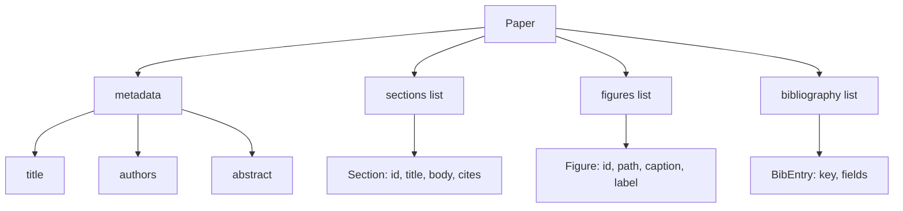
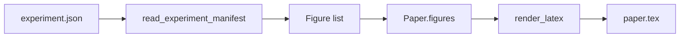
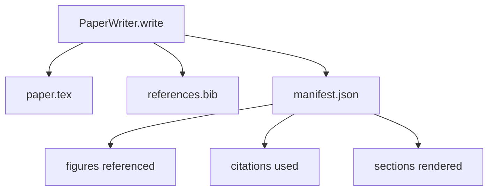

# Makale Yazarı

> LaTeX iskeleti, araştırmacı ile dizici arasındaki bir sözleşmedir. Sözleşme bozulursa belge derlenmez ve başarısızlık yüksek olur. Önce iskeleti inşa edin, sonra içini doldurun.

**Tür:** Yapım
**Diller:** Python
**Önkoşullar:** 19. Aşama dersleri 50-53
**Süre:** ~90 dakika

## Öğrenme Hedefleri

- Bir araştırma makalesini serbest biçimli bir belge olarak değil, bilinen kesit grafiğine sahip yapılandırılmış bir artifact olarak ele alın.
- Herhangi bir metin yazılmadan önce özetini, bölümlerini, şekil yuvalarını ve kaynakça anahtarlarını bildiren bir LaTeX iskeleti oluşturun.
- Deney çıktılarındaki rakamları (yollar ve başlıklar) deterministik bir slot mekanizması aracılığıyla iskelete enjekte edin.
- Kablo demetinin model olmadan test edilebilmesi için her bölümü yapısal bir taslaktan dolduran sahte bir düzyazı oluşturucuyu bağlayın.
- Tek bir `paper.tex` artı bir `references.bib` artı referans verilen her şekli ve kullanılan her alıntıyı listeleyen bir manifest yayınlayın.

## Neden önce bir iskelet

Düzyazı olarak başlayan bir taslak, yapısal borcu biriktirir. Giriş, ilgili çalışmada olması gereken üç paragraftan oluşuyor. Bir şekil tanımlanmadan önce referans alınır. Kaynakça aynı makale için üç anahtarla sona eriyor. Yazar fark ettiğinde yeniden yazma maliyeti yazma maliyetinden daha yüksektir.

Bir iskelet bunu tersine çevirir. Yapı önceden veri olarak bildirilir. Bölümler adları ve sıraları olan yuvalardır. Şekiller, kimlikleri ve altyazıları olan yuvalardır. Kaynakça anahtarları, işaret ettikleri girişlerle birlikte üstte bildirilir. Düzyazı bu yuvalarda birer birer oluşturulur. Emniyet kemeri, herhangi bir metin yazılmadan önce, her şeklin bir yuvası olduğunu, her alıntının bir girişi olduğunu ve her bölümün içindekiler bölümünde göründüğünü doğrulayabilir.

Bu, daha önceki derslerde planlara, araç çağrılarına ve izlere uygulanan disiplinin aynısıdır. Yapı sözleşmedir.

## Kağıt şekli

Her alan düz Python verileridir. Oluşturucu, `Paper` 'dan LaTeX dizesine kadar saf bir işlevdir. Kablo demeti, oluşturmadan önce kağıdın iç gözlemini yapabilir: bölümleri sayın, eksik şekil dosyalarını listeleyin, her `\cite{key}` 'nin eşleşen bir `BibEntry`'ye sahip olup olmadığını kontrol edin.

## İşleme sözleşmesi

Oluşturucu üç özelliği garanti eder. İlk olarak, iskeletteki her şekil yuvası, `fig:<id>` biçiminde sabit bir etikete sahip bir `\begin{figure}` bloğu yayar. İkincisi, her bölüm `sec:<id>` biçiminde sabit bir etikete sahip bir `\section{}` yayar, böylece çapraz referanslar çalışır. Üçüncüsü, kaynakça, `references.bib` tam olarak kağıt üzerinde beyan edilen girişleri içeren bir `\bibliography` bloğu yayar; ne fazla ne az.

Bunlardan herhangi birinin ihlal edilmesi bir uyarı değil, oluşturma hatasıdır. İskelet sözleşmedir; Bir rakamı sessizce düşüren bir render, sözleşmenin feshidir.

## Deneylerden şekil enjeksiyonu

Bu parçadaki önceki derslerde, JSON'un gösterdiği gibi deney çıktıları üretildi. Her manifest, yollar ve kısa başlıklar içeren bir artifact listesi taşır. Makaleyi yazan kişi bu bildirimi okur ve `Figure` kayıt üretir.

Enjeksiyon deterministiktir. Şekil kimlikleri deney adından ve monotonik bir sayaçtan türetilir. Altyazılar manifestodan gelir. Yollar, kağıdın çıktı dizinine göre normalleştirilir, böylece LaTeX, deneme çıktıları diskin başka bir yerinde olsa bile derlenir.

## Alaylı düzyazı oluşturucu

Ders bir model çağırmaz. Bir `MockProseGenerator` bir taslak şeklini okur ve deterministik bir şekilde düzyazı yayar. Anahat şekli bölüm başına bir kısa dizedir. Oluşturucu, bu dizeyi, bölüm başlığının da dahil edildiği iki kısa paragrafa genişletir. Oluşturulan düzyazı adı, şekilleri ve alıntıları tam olarak taslakta belirtildiği anda bırakır.

Bu, yazarın her davranışını test etmek için yeterlidir. Gerçek bir uygulama, jeneratörü bir model çağrısıyla değiştirir. Etrafındaki koşum takımı değişmez. Düzyazı oluşturucuyu çağrılabilir olarak bildirmenin değeri budur: test deterministik bir testin yerini alır, üretim bir modelin yerini alır, boru hattının geri kalanı aynıdır.

## Bildirim çıktısı

Yazıcı çıktı dizinine üç dosya gönderir.

Manifest, aşağı yönlü bir değerlendiricinin veya eleştirmen döngüsünün okuduğu şeydir. LaTeX'i ayrıştırmaz; manifestoyu okuyor. Bir sonraki ders olan eleştirmen döngüsü bu bildirimi girdi olarak alır ve bir geri bildirim listesi oluşturur. Bu nedenle manifesto sözleşmenin bir parçası olup LaTeX değildir.

## Doğrulama kapıları

Yazar herhangi bir dosyayı yazmadan önce dört kapıyı çalıştırır.

1. Makaledeki her şekil kimliği benzersizdir.
2. Her bölümün `cites` alanı, makalede belirtilen bir kaynakça anahtarına atıfta bulunur.
3. Özet boş değildir.
4. Başlık boş değil.

Başarısız bir kapı kesin bir nedenden dolayı `PaperValidationError` değerini yükseltir. Kablo demeti, arıza modu olarak nedeni ortaya çıkarır. Kısmi yazma yoktur: ya üç dosyanın tümü gönderilir ya da hiçbiri gönderilmez.

## Kod nasıl okunur

`code/main.py` , `Paper`, `Section`, `Figure`, `BibEntry`, `PaperValidationError`, `MockProseGenerator`, `PaperWriter` ve bir `render_latex` fonksiyonunu tanımlar. `write` yöntemi bir çıktı dizini alır ve `paper.tex`, `references.bib` ve `manifest.json`'yi yayar. `read_experiment_manifest` yardımcısı, deneme bildirimlerinin listesini `Figure` kayıtlarına dönüştürür.

`code/tests/test_paper_writer.py` şunları kapsar: bölümleri olmayan iskelet oluşturma, iki bölüm ve iki şekil içeren tam oluşturma, eksik alıntı kapısı, yinelenen şekil kimliği geçidi, bildirim içeriği ve LaTeX dizisi sözleşmesi (her bölüm bir `\section{}` yayar, her şekil bir `\begin{figure}` yayar).

## Daha ileri gidiyoruz

Gerçek bir uygulamanın isteyeceği iki uzantı. İlk olarak, çok formatlı oluşturma: aynı `Paper` şekli blog gönderileri için Markdown'a ve önizlemeler için HTML'ye derlenir. Oluşturucu, `Paper` üzerinde bir strateji haline gelir. İkincisi, alıntı zenginleştirme: yazar, yerel DOI önbelleği verilen bir alıntı anahtarından BibTeX girişlerini alır. Her ikisi de değer katar, her ikisi de iskelet sözleşmeye dokunmadan eklenebilir.

Bahis iskelettir. Veri olarak bildirilen bölümler, şekiller ve alıntılar, bölümler halinde oluşturulan metinler, LaTeX ile birlikte yayınlanan manifesto. Diğer her gelişme en üstte yer alıyor.
