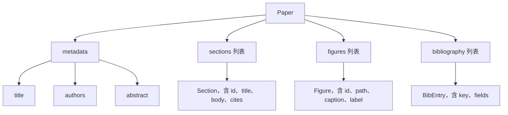
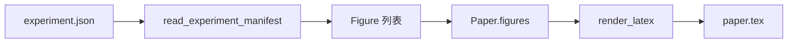
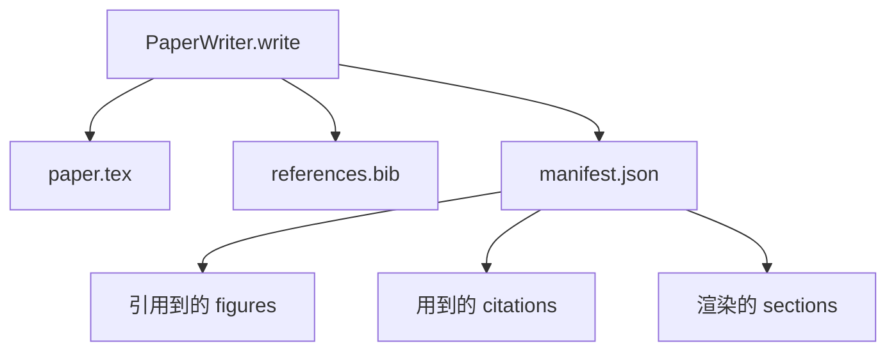

# 论文写作器（Paper Writer）

> 译注：本文译自同目录 [`en.md`](./en.md)。术语遵循仓根 [TRANSLATION_GUIDE.md](../../../../TRANSLATION_GUIDE.md)。

> LaTeX 骨架是研究者与排版者之间的契约。契约一旦破裂，文档无法编译，失败会大声暴露。先把骨架立起来，再往里填内容。

**Type:** Build
**Languages:** Python
**Prerequisites:** Phase 19 lessons 50-53
**Time:** ~90 minutes

## 学习目标（Learning Objectives）

- 把研究论文当作一件结构化的产物来对待——它有一张已知的章节图，而不是自由散漫的文档。
- 在动笔写任何散文之前，先生成一份 LaTeX 骨架，里面声明好摘要、各章节、图位（figure slots）以及参考文献的 key。
- 通过一套确定性的 slot 机制，把实验输出（路径与图说）注入骨架里的图位。
- 接上一个 mock 出来的散文生成器（prose generator），让它从结构化大纲里把每个章节填出来——这样整个 harness 在没有模型的情况下也能测。
- 输出一份 `paper.tex`、一份 `references.bib`，外加一份 manifest，列出每一张被引用的图和每一个用到的引用。

## 为什么要先做骨架（Why a skeleton first）

从散文起手的草稿会不断积累结构性债务。引言里多写了三段，其实应该挪到 related work；某张图先被引用、后被定义；参考文献里同一篇论文出现了三个 key。等作者察觉到这些问题，重写的成本已经高过最初写作的成本。

骨架则把这层关系反过来。结构以数据形式提前声明：章节是带名字和顺序的 slot，图是带 id 和图说的 slot，参考文献的 key 在最上面就声明好，并指向具体条目。散文逐个 slot 生成进去。在任何一段散文写下来之前，harness 就可以校验：每张图都有 slot，每条引用都有对应条目，每个章节都在目录里出现过。

这是前面几节课对 plan、tool call 和 trace 用过的同一套纪律——结构本身就是契约。

## Paper 的形状（The Paper shape）

每个字段都是普通的 Python 数据。渲染器（renderer）是从 `Paper` 到一段 LaTeX 字符串的纯函数。harness 可以在渲染之前对 paper 做内省：数一数有多少章节，列出缺失的图文件，检查每个 `\cite{key}` 是否都有匹配的 `BibEntry`。

## 渲染契约（The render contract）

渲染器保证三件事。第一，骨架里每个图位都会输出一个 `\begin{figure}` 块，并带一个形如 `fig:<id>` 的稳定 label。第二，每个章节都会输出一个 `\section{}`，并带一个形如 `sec:<id>` 的稳定 label，让交叉引用能正常工作。第三，参考文献会输出一个 `\bibliography` 块，对应的 `references.bib` 里的条目恰好等于 paper 上声明的那些——不多也不少。

任何一条被违反，都是渲染错误（render error），不是警告。骨架就是契约；一次渲染如果悄无声息地把一张图丢掉，那就是契约被破坏了。

## 从实验注入图（Figure injection from experiments）

本系列前面的课程把实验输出做成了 JSON manifest。每份 manifest 带一个 artifact 列表，包含路径和简短的图说。论文写作器读这份 manifest，生成一组 `Figure` 记录。

注入过程是确定性的。图的 id 由实验名加上一个单调递增计数器派生而来；图说来自 manifest；路径相对于 paper 的输出目录做了归一化处理，这样即便实验输出落在磁盘上别的位置，LaTeX 也能编译通过。

## Mock 出来的散文生成器（The mocked prose generator）

本节课不调用模型。`MockProseGenerator` 读一份大纲形状（outline shape），确定性地输出散文。大纲形状就是每个章节一个短字符串。生成器把这串字符串展开成两段简短的段落，并把章节标题揉进去。当大纲声明要带图或引用时，生成出来的散文会精确地把图和引用名字「点」出来。

这就足以测出写作器的所有行为。真实实现会把这个生成器换成模型调用，外面的 harness 一行都不用改。这就是把散文生成器声明为一个可调用对象（callable）的价值：测试时换上确定性的那一只，生产时换上模型那一只，流水线的其余部分完全一致。

## manifest 输出（The manifest output）

写作器会向输出目录里写出三份文件。

下游的评估器（evaluator）或 critic loop 读的就是这份 manifest——它们不解析 LaTeX，而是读 manifest。下一节课的 critic loop 把这份 manifest 当作输入，输出一份反馈列表。这也是为什么 manifest 是契约的一部分，而 LaTeX 不是。

## 校验关卡（Validation gates）

写作器在落盘任何文件之前，会跑四道关卡。

1. paper 内每个图的 id 唯一。
2. 每个章节的 `cites` 字段引用的参考文献 key，必须是在 paper 上声明过的。
3. 摘要非空。
4. 标题非空。

任何一道关卡失败都会抛出 `PaperValidationError`，并附带精确原因。harness 把这个原因当作失败模式（failure mode）暴露出来。不存在写一半的情况：要么三份文件全部输出，要么一份都不写。

## 怎么读这份代码（How to read the code）

`code/main.py` 定义了 `Paper`、`Section`、`Figure`、`BibEntry`、`PaperValidationError`、`MockProseGenerator`、`PaperWriter`，以及一个 `render_latex` 函数。`write` 方法接收一个输出目录，落出 `paper.tex`、`references.bib` 和 `manifest.json`。辅助函数 `read_experiment_manifest` 把一组实验 manifest 转成 `Figure` 记录。

`code/tests/test_paper_writer.py` 覆盖了：无章节情况下的骨架渲染、带两个章节和两张图的完整渲染、缺失引用的关卡、重复图 id 的关卡、manifest 内容，以及 LaTeX 字符串契约（每个章节输出一个 `\section{}`，每张图输出一个 `\begin{figure}`）。

## 再往前走（Going further）

真实实现会想要两个扩展。第一，多格式渲染：同一份 `Paper` 形状既能编译成 Markdown 用于博客文章，也能编译成 HTML 用于预览，渲染器变成 `Paper` 上的一种策略。第二，引用富化：写作器根据本地缓存的 DOI，从 citation key 拉取 BibTeX 条目。两者都有价值，并且都能在不动骨架契约的前提下加上去。

骨架就是这一注的赌注。章节、图、引用以数据形式声明，散文生成进 slot，manifest 与 LaTeX 一并输出。其它任何改进都在它之上叠加。
