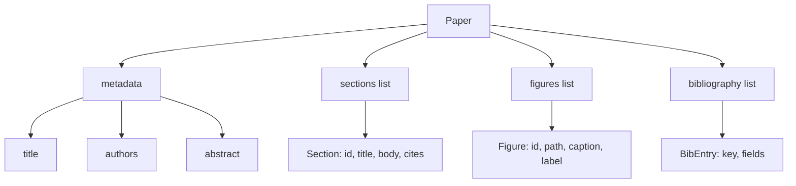
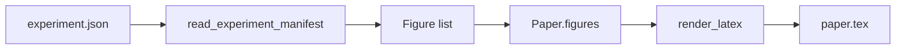
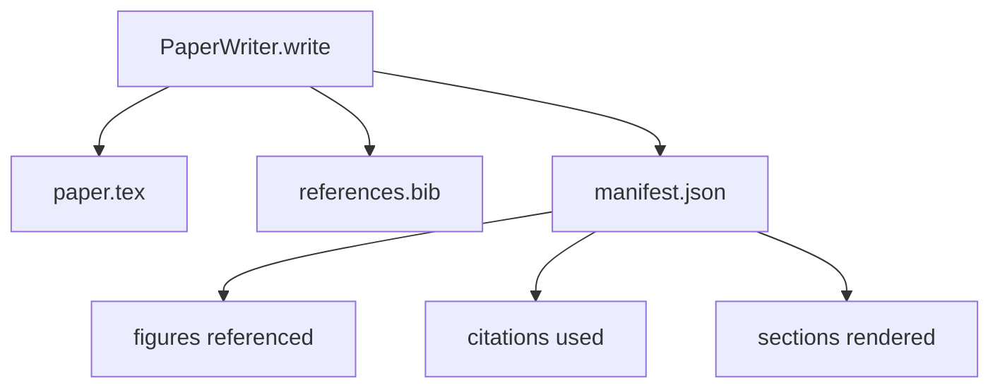

# 54 · 论文撰写器

> LaTeX 骨架是研究者与排版器之间的契约。契约被打破时文档就无法编译，而且失败会直接报错。先构建骨架，再填入内容。

**类型：** 构建
**语言：** Python
**前置：** 第 19 阶段第 50–53 课
**时长：** 约 90 分钟

## 学习目标

- 将研究论文视为具有已知章节图的结构化工件（structured artifact），而非自由格式文档。
- 生成一份 LaTeX 骨架，在撰写任何正文之前声明其摘要、章节、图表槽位和参考文献键。
- 通过确定性的槽位机制，将实验输出中的图表（路径与图注）注入到骨架中。
- 串联一个模拟散文生成器，按结构化大纲填充每个章节，使整个组件在无需模型的情况下可测试。
- 输出单个 `paper.tex` 文件、一个 `references.bib` 文件，以及一份列出所有被引用图表和引文的清单文件。

## 为什么先建骨架

以正文开头的草稿会累积结构负债。引言多写了三段本该属于相关工作。图表在被定义之前就被引用。参考文献里同一个论文会出现三个不同的键。等作者发现问题时，重写的成本已经超过了写作的成本。

骨架反其道而行之。结构作为数据在最初就被声明。章节是按名称和顺序排列的槽位。图表是按 ID 和图注定义的槽位。参考文献键在顶部与其指向的条目一起声明。正文逐一生成到这些槽位中。组件可以在任何正文生成之前就做校验：每个图表都有槽位、每条引文都有条目、每个章节都出现在目录中。

这与前面各课应用到计划、工具调用和追踪中的纪律是同一回事。结构就是契约。

## 论文（Paper）的结构

每个字段都是纯 Python 数据。渲染器是一个从 `Paper` 到 LaTeX 字符串的纯函数。组件可以在渲染之前内省论文：统计章节数、列出缺失的图表文件、检查每条 `\cite{key}` 都有对应的 `BibEntry`。

## 渲染契约

渲染器保证三个属性。第一，骨架中的每个图表槽位都生成一个带有固定标签（格式为 `fig:<id>`）的 `\begin{figure}` 块。第二，每个章节都生成一个带有固定标签（格式为 `sec:<id>`）的 `\section{}`，使交叉引用能够正常工作。第三，参考文献生成一个 `\bibliography` 块，其 `references.bib` 恰好包含论文上声明的条目，不多不少。

违反以上任何一条都是渲染错误，而非警告。骨架即契约；渲染时悄悄丢弃图表就是违约。

## 从实验注入图表

本阶段前面的课程以 JSON 清单文件的形式输出了实验产物。每份清单包含一组带有路径和简短图注的产物列表。论文撰写器读取该清单并生成 `Figure` 记录。

注入是确定性的。图表 ID 由实验名称加上单调递增计数器派生而来。图注来自清单。路径相对于论文输出目录做规范化处理，这样即使实验输出位于磁盘上的其他位置，LaTeX 也能正确编译。

## 模拟散文生成器

本课不调用模型。`MockProseGenerator` 读取大纲结构并确定性地生成正文。大纲结构是每个章节一个短字符串。生成器将该字符串扩展为两段短文，并嵌入章节标题。当大纲声明了图表和引文时，生成的正文会精确地点出其名称。

这足以测试撰写器的每一项行为。真正的实现会将生成器替换为模型调用。外围组件不变。这就是将散文生成器声明为可调用对象的价值所在：测试用确定性生成器替代，生产用模型生成器替代，管线的其余部分完全一致。

## 清单文件输出

撰写器在输出目录中生成三个文件。

清单文件供下游的评估器或评审循环读取。它不解析 LaTeX，而是读取清单。下一课——评审循环，以这份清单作为输入并生成反馈列表。正因如此，清单是契约的一部分，而 LaTeX 不是。

## 校验关卡

撰写器在写入任何文件之前运行四道关卡。

1. 论文内每个图表 ID 唯一。
2. 每个章节的 `cites` 字段引用的参考文献键均在论文中声明。
3. 摘要非空。
4. 标题非空。

关卡失败时抛出 `PaperValidationError` 并附带精确原因。组件将原因呈现为失败模式。不存在部分写入：要么三个文件全部输出，要么一个都不输出。

## 如何阅读代码

`code/main.py` 定义了 `Paper`、`Section`、`Figure`、`BibEntry`、`PaperValidationError`、`MockProseGenerator`、`PaperWriter` 和一个 `render_latex` 函数。`write` 方法接受一个输出目录并生成 `paper.tex`、`references.bib` 和 `manifest.json`。`read_experiment_manifest` 辅助函数将实验清单列表转换为 `Figure` 记录。

`code/tests/test_paper_writer.py` 覆盖了：无章节的骨架渲染、含两个章节和两个图表的完整渲染、缺失引文关卡、重复图表 ID 关卡、清单内容以及 LaTeX 字符串契约（每个章节都生成 `\section{}`，每个图表都生成 `\begin{figure}`）。

## 进一步探索

真实实现会需要两个扩展。第一，多格式渲染：同一个 `Paper` 结构可以编译为用于博客文章的 Markdown 和用于预览的 HTML。渲染器变为 `Paper` 上的策略模式。第二，引文补全：给定一个本地 DOI 缓存，撰写器根据引文键拉取 BibTeX 条目。两者都能增加价值，且都无需改动骨架契约即可添加。

骨架就是赌注。章节、图表和引文以数据形式声明，正文生成到槽位中，清单与 LaTeX 一并输出。其他所有改进都构建于此基础之上。
