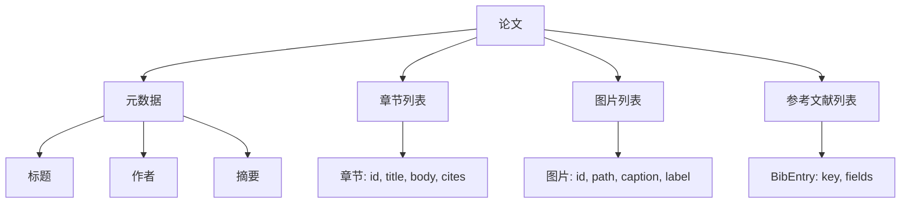
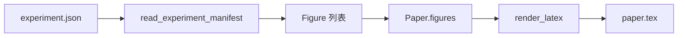
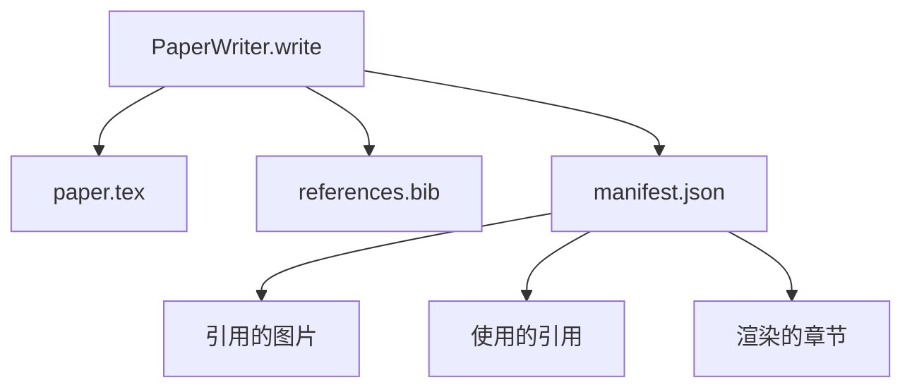

# 论文编写器

> LaTeX 骨架是研究者与排版器之间的契约。若契约被破坏，文档将无法编译，且失败会以显式错误呈现。先构建骨架，再填充内容。

**类型：** 构建
**语言：** Python
**前置条件：** 第 19 阶段第 50–53 课
**时长：** ~90 分钟

## 学习目标

- 将研究论文视为具有已知章节图的结构化产物，而非自由格式的文档。
- 生成一个 LaTeX 骨架，在编写任何正文之前即声明其摘要、章节、图片槽位和参考文献键。
- 通过确定性的槽位机制，将实验输出的图片（路径和标题）注入骨架。
- 接入一个模拟正文生成器，根据结构化大纲填充各章节，使测试框架无需模型即可测试。
- 输出单个 `paper.tex`、一个 `references.bib` 以及一个清单，列出所引用的每张图片和每条引用。

## 为什么先构建骨架

从正文开始的草稿会累积结构债务。引言中写出了本应属于相关工作段落的三个段落。图片在被定义之前就被引用。参考文献最终为同一篇论文出现三个键。等到作者发现时，重写的代价已经超过了写作的代价。

骨架则将这一过程颠倒过来。结构被预先作为数据声明。章节是带有名称和顺序的槽位。图片是带有 ID 和标题的槽位。参考文献键在顶部与它们指向的条目一起声明。正文一次一个地被生成到这些槽位中。测试框架可以在任何正文生成之前验证：每张图片都有其槽位，每条引用都有其条目，每个章节都出现在目录中。

这与之前课程应用于计划、工具调用和追踪的准则是一致的。**结构即契约。**

## 论文的形状

```mermaid
flowchart TB
    Paper[论文] --> Meta[元数据]
    Paper --> Sections[章节列表]
    Paper --> Figures[图片列表]
    Paper --> Bib[参考文献列表]
    Meta --> Title[标题]
    Meta --> Authors[作者]
    Meta --> Abstract[摘要]
    Sections --> Sec1[章节: id, title, body, cites]
    Figures --> Fig1[图片: id, path, caption, label]
    Bib --> Entry1[BibEntry: key, fields]
```

每个字段都是普通的 Python 数据。渲染器是一个从 `Paper` 到 LaTeX 字符串的纯函数。测试框架可以在渲染之前内省论文：统计章节数量、列出缺失的图片文件、检查每个 `\cite{key}` 都有对应的 `BibEntry`。

## 渲染契约

渲染器保证三个属性。第一，骨架中的每个图片槽位都会生成一个 `\begin{figure}` 块，并带有 `fig:<id>` 形式的稳定标签。第二，每个章节都会生成一个 `\section{}`，并带有 `sec:<id>` 形式的稳定标签，以确保交叉引用正常工作。第三，参考文献会生成一个 `\bibliography` 块，其 `references.bib` 恰好包含论文声明的条目，不多也不少。

违反其中任何一条都是渲染错误，而非警告。骨架就是契约；一个静默丢弃图片的渲染就是契约破坏。

## 从实验注入图片

本系列的前几课将实验输出生成为 JSON 清单。每个清单携带一个带有路径和简短标题的产物列表。论文编写器读取该清单并生成 `Figure` 记录。

```mermaid
flowchart LR
    Exp[experiment.json] --> Reader[read_experiment_manifest]
    Reader --> Figs[Figure 列表]
    Figs --> Paper[Paper.figures]
    Paper --> Render[render_latex]
    Render --> Out[paper.tex]
```

注入是确定性的。图片 ID 由实验名称加上单调递增计数器派生而来。标题来自清单。路径相对于论文的输出目录进行规范化，以便即使实验输出位于磁盘上的其他位置，LaTeX 也能编译。

## 模拟正文生成器

本课不调用模型。`MockProseGenerator` 读取一个大纲形状并确定性地生成正文。大纲形状是每个章节一个短字符串。生成器将该字符串扩展为两个短段落，并融入章节标题。生成的正文恰好在大纲声明它们的位置提及图片和引用。

这足以测试编写器的每一种行为。真实实现会将生成器替换为模型调用。其周围的测试框架保持不变。这就是将正文生成器声明为可调用对象的价值所在：测试使用确定性的替代，生产使用模型替代，而管道的其余部分完全相同。

## 清单输出

编写器向输出目录写入三个文件。

```mermaid
flowchart TB
    Writer[PaperWriter.write] --> Tex[paper.tex]
    Writer --> Bib[references.bib]
    Writer --> Man[manifest.json]
    Man --> F[引用的图片]
    Man --> C[使用的引用]
    Man --> S[渲染的章节]
```

清单是下游评估器或评审循环读取的内容。它不解析 LaTeX；它读取清单。下一课——评审循环——将该清单作为输入并生成反馈列表。这就是为什么清单是契约的一部分，而 LaTeX 不是。

## 验证关卡

编写器在写入任何文件之前运行四个关卡。

1. 每张图片 ID 在论文内是唯一的。
2. 每个章节的 `cites` 字段引用的参考文献键已在论文中声明。
3. 摘要非空。
4. 标题非空。

关卡失败会引发带有精确原因的 `PaperValidationError`。测试框架将该原因作为失败模式呈现。不存在部分写入：要么三个文件全部输出，要么一个都不输出。

## 如何阅读代码

`code/main.py` 定义了 `Paper`、`Section`、`Figure`、`BibEntry`、`PaperValidationError`、`MockProseGenerator`、`PaperWriter` 以及 `render_latex` 函数。`write` 方法接收一个输出目录并输出 `paper.tex`、`references.bib` 和 `manifest.json`。`read_experiment_manifest` 助手将实验清单列表转换为 `Figure` 记录。

`code/tests/test_paper_writer.py` 涵盖：无章节的骨架渲染、两个章节加两张图片的完整渲染、缺失引用关卡、重复图片 ID 关卡、清单内容以及 LaTeX 字符串契约（每个章节生成 `\section{}`，每张图片生成 `\begin{figure}`）。

## 进一步探索

真实实现会需要的两个扩展。第一，多格式渲染：相同的 `Paper` 形状编译为用于博客文章的 Markdown 和用于预览的 HTML。渲染器成为 `Paper` 上的一个策略。第二，引用增强：编写器根据引用键从本地 DOI 缓存中获取 BibTeX 条目。两者都增加了价值，且都可以在不触及骨架契约的情况下添加。

骨架就是赌注。章节、图片和引用作为数据声明，正文被生成到槽位中，清单与 LaTeX 一同输出。所有其他改进都在此之上组合。
