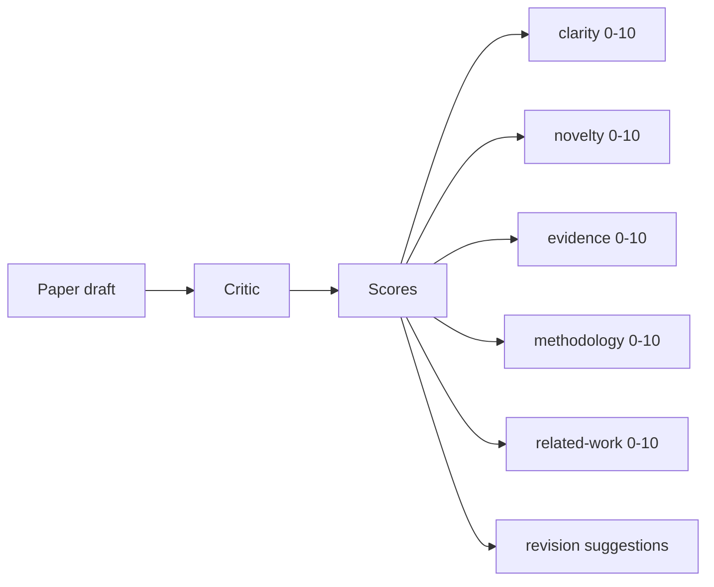
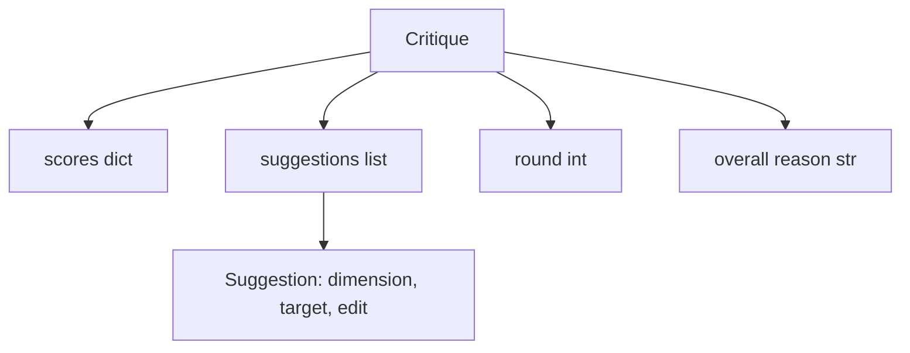
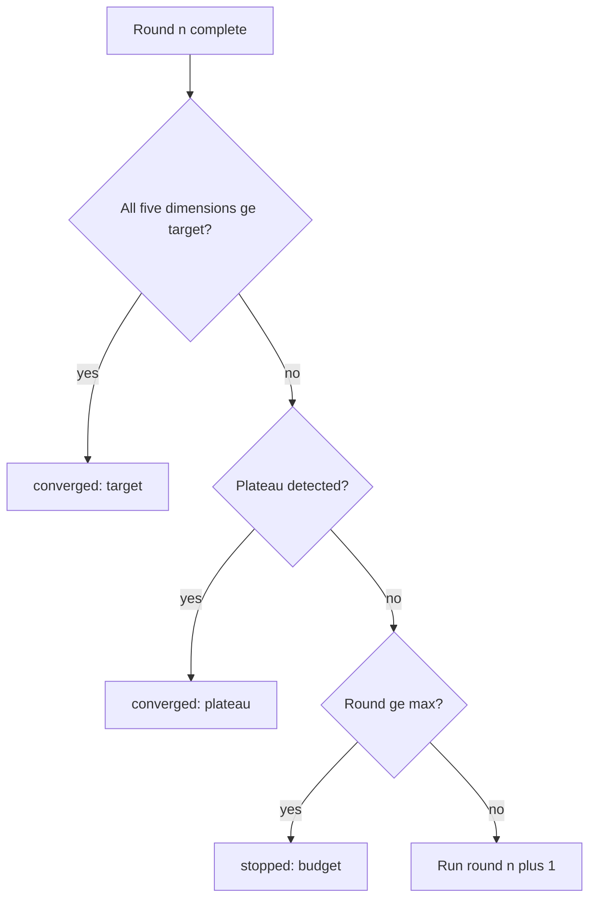
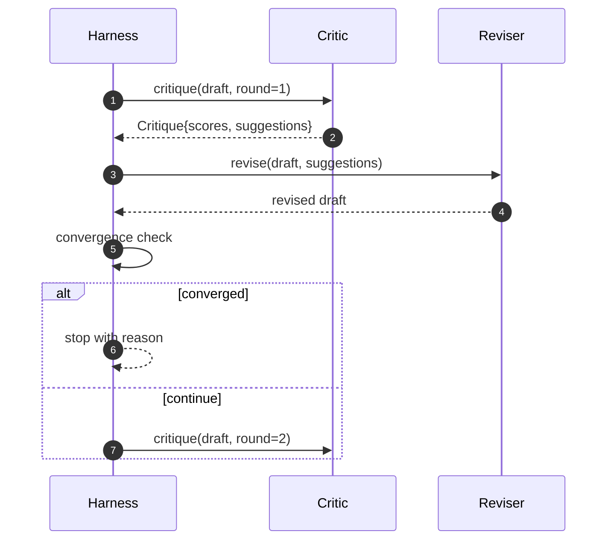

# 批評ループ

> 最初から "looks good" と返す critic は壊れています。いつも "needs work" と返す critic も壊れています。面白い critic は収束する critic であり、その収束は設計しなければなりません。

**種別:** Build
**言語:** Python
**前提:** Phase 19 lessons 50-53
**時間:** 約90分

## 学習目標
- paper draft を clarity、novelty、evidence、methodology、related-work の五つの固定 dimension で score する。
- 各 round の critique を freeform rewrite ではなく structured revision diff として適用する。
- score の round 間比較で convergence を検出し、target met、plateau、budget exhausted で停止する。
- max-iteration budget で round を制限し、収束しない critic が永遠に走らないようにする。
- dashboard や次 stage が score trajectory を描ける per-round trace を出力する。

## なぜ五つの固定 dimension か

freeform critic は suggestion paragraph を返します。次 round の revision はその paragraph を ambient context として扱います。批判が構造化されていないため、rewrite が批判に対応したか検証できません。

五つの dimension は harness に contract を与えます。



score は vector です。harness は各 dimension を round 間で監視します。clarity は上がったが evidence が下がる revision は evidence 上の regression として見えます。

## Critique の形



各 suggestion は改善する dimension、対象 section、reviser が適用できる `edit` instruction を持ちます。reviser も callable です。この lesson の deterministic reviser は edit を append-to-section operation として解釈します。model-driven reviser なら同じ field を prompt として解釈できます。

## Convergence rules

critic loop は三つの条件のいずれかで終了します。



target は最も厳しい条件です。五つすべての dimension が `>= target_score`、デフォルト `8.0` に達する必要があります。mean が高くても一つ弱い dimension があれば十分ではありません。plateau は現在 round の mean と前 round の mean を比較し、改善が `plateau_epsilon` 未満の round が二回連続したら発火します。budget は round 数の hard cap です。

順序は target、plateau、budget です。同じ iteration で複数が成立しても結果は決定的です。

## なぜ plateau は二 round 見るのか

一回だけの flat round は signal として弱すぎます。deterministic scoring でも、どの suggestion がどの順序で適用されたかにより score は少し変わります。二回連続を要求することで、その揺れを除きます。

## Deterministic critic

この lesson は model を呼びません。critic は section body の平均 length、figure count と citation count、paper metadata の `originality_tag` から score を決めます。reviser は各 score を上げる方法を知っています。

```text
clarity      grows when the average section body length increases
novelty      grows when originality_tag is set to "high"
evidence     grows when a section's figure_refs is non-empty
methodology  grows when a section titled "Method" exists with body
related-work grows when a section titled "Related Work" exists with body
```

round 1 のあと score が上がるため、tests は loop が gap を縮めることを assert できます。

## Full loop contract



harness は round counter、trace、convergence check を所有します。critic は score、reviser は diff を所有します。三者は互いの state に触れません。

## Trace output

各 round は round number、score vector、suggestion count、convergence verdict を持つ trace event を出します。full trace は final draft と一緒に返ります。dashboard は score-per-round chart を描けます。次の iteration scheduler は trace を読み、その branch を残す価値があるかを判断します。

## Bad critic への budget

score を改善しない suggestion を出し続ける critic は max-iteration ceiling に達します。trace には、五 round、flat score、verdict `budget` と見えます。final draft だけを見せるより、trace-first design の方が診断しやすくなります。

## コードの読み方

`code/main.py` は `Critique`, `Suggestion`, `Critic` protocol, `Reviser` protocol, `CriticLoop`, deterministic critic と reviser を返す `make_deterministic_critic_pair` を定義します。lesson 単体で動くよう、最小の `Paper` shape も含みます。

`code/tests/test_critic_loop.py` は round 1 後の monotone improvement、tuned draft の target convergence、二つの flat round 後の plateau、改善しない suggestion の budget exhaustion、reviser の suggestion application、trace shape を確認します。

## 発展

実装を広げるなら、dimension weights と paired critics が有用です。workshop paper は novelty を重く、journal paper は methodology を重くできます。paired critics では一つが score し、もう一つが suggestion を adjudicate してから reviser に渡します。どちらも同じ `Critique` shape の上に合成できます。
