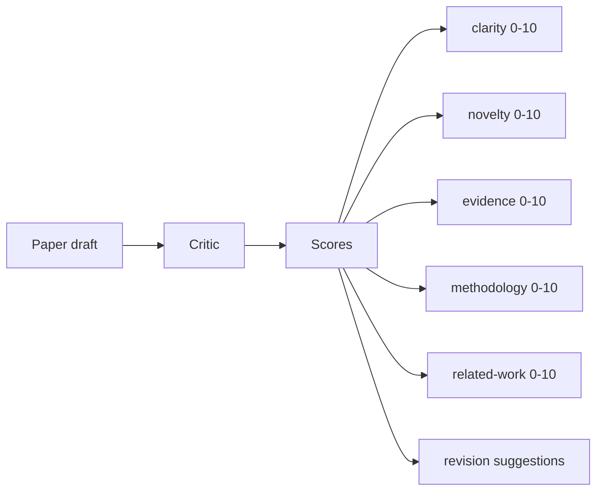
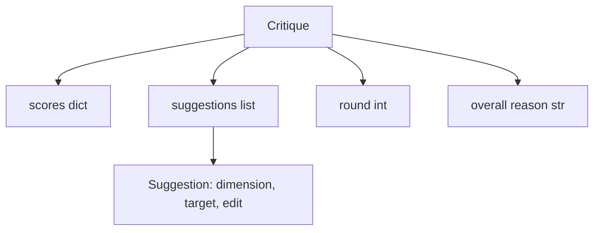
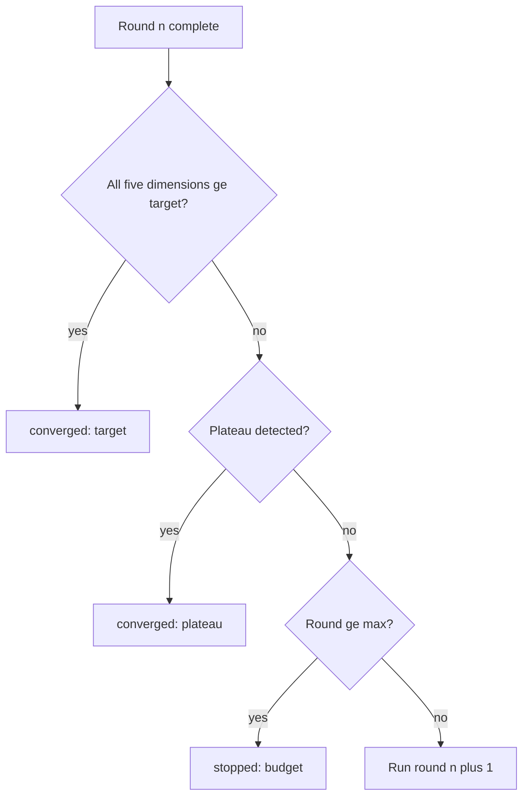
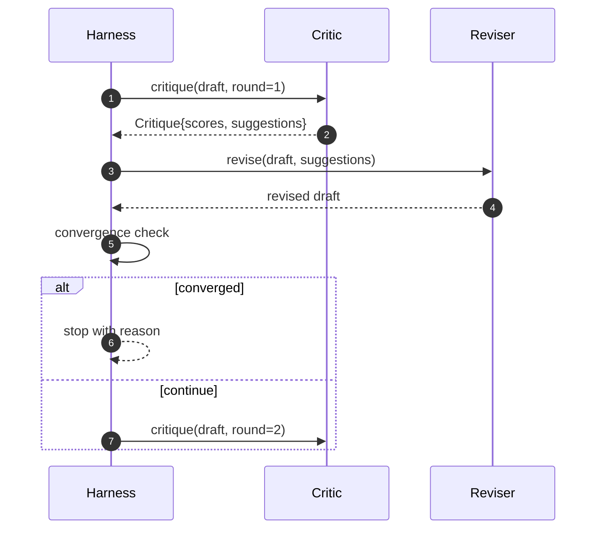

# Eleştirmen Döngüsü

> İlk seferde "iyi görünüyor" diyen bir eleştirmen bozuktur. Her zaman "çalışmaya ihtiyacı var" diye geri dönen bir eleştirmen bozuktur. İlginç olan, yakınsayandır ve yakınsamayı tasarlamanız gerekir.

**Tür:** Yapım
**Diller:** Python
**Önkoşullar:** 19. Aşama dersleri 50-53
**Süre:** ~90 dakika

## Öğrenme Hedefleri

- Bir makale taslağını beş sabit boyuta göre puanlayın: açıklık, yenilik, kanıt, metodoloji, ilgili çalışma.
- Her turun eleştirisini serbest biçimli bir yeniden yazma yerine yapılandırılmış bir revizyon farkı olarak uygulayın.
- Turlardaki puanları karşılaştırarak yakınsamayı tespit edin; platoda durur, hedefe ulaşılır veya bütçe tükenir.
- Yakınsamayan bir eleştirmenin sonsuza kadar çalışmaması için turları maksimum yineleme bütçesiyle sınırlayın.
- Her tur için bir iz yayınlayın, böylece kontrol paneli veya bir sonraki aşama skorun gidişatını işleyebilir.

## Neden beş sabit boyut

Serbest biçimli bir eleştirmen, bir paragraf öneri döndüren bir modeldir. Bir sonraki turun revizyonu paragrafı ortam bağlamı olarak ele alıyor. Yeniden yazmanın eleştiriyi ele alıp almadığı doğrulanamaz çünkü eleştiri hiçbir zaman bir yapıya sahip değildi.

Beş boyut, emniyet kemerine bir sözleşme kazandırır.



Skor bir vektördür. Emniyet kemeri turlar boyunca her boyutu izler. Açıklığı artıran ancak kanıtları gölgeleyen bir revizyon, kanıtlar üzerinde bir gerilemedir ve yakınsama kontrolü bunu görür. Yalnızca modeli eleştiren bir eleştirmen bu garantiyi sunamaz.

## Eleştiri şekli



Her öneri, iyileştirdiği boyutu, hedeflediği bölümü ve düzenleyicinin uygulayabileceği bir `edit` talimatını taşır. Revizör aynı zamanda aranabilir bir kişidir. Ders, düzenleme talimatını bölüme ekleme işlemi olarak yorumlayan deterministik bir düzenleyici sunar. Model odaklı bir gözden geçirici, aynı alanı prompt ile yorumlayacaktır. Sözleşme değişmiyor.

## Sırasıyla yakınsama kuralları

Kritik döngü, üç koşuldan herhangi biri tetiklendiğinde sona erer.



Hedef en katı durumdur: Döngü başarıya dönmeden önce beş boyutun her birinin (açıklık, yenilik, kanıt, metodoloji, ilgili_çalışma) `>= target_score`'ye (varsayılan `8.0`) ulaşması gerekir. Zayıf bir boyuta sahip yüksek bir ortalama yeterli değildir. Plato tespiti, mevcut turun ortalamasını önceki turun ortalamasıyla karşılaştırır. Artış iki ardışık tur için `plateau_epsilon`'nin (varsayılan `0.1`) altındaysa döngü `plateau` ile çıkar. Bütçe, turlarda sabit bir üst sınırdır (varsayılan `5`) ve `budget` ile çıkar.

Sıra önemlidir. Hedef, bütçeyi aşan plato galibiyetlerine karşı kazanır. Üçüncü tur aynı yinelemede hedefe ulaşırsa, bu da bir plato tetikler, sonuç `plateau` değil `target` olur.

## Plato tespiti neden iki turda yapılıyor?

Tek yönlü bir plato gürültüdür. Gerçek bir eleştirmen, sabit bir taslakta bile her yinelemede biraz farklı bir puan verir, çünkü deterministik puanlama hala hangi önerilerin hangi sırayla uygulandığına bağlıdır. Art arda iki plato turu gerektiren filtreler gürültüyü giderir. Eğer koşum takımı bir duraklama bildiriyorsa, draft gerçekten gelişmeyi bırakmıştır.

## Bu dersteki deterministik eleştiri

Ders bir model çağırmaz. Gönderilen eleştirmen, bir taslağı üç sinyale dayalı olarak puanlayan çağrılabilir bir kişidir: ortalama bölüm gövdesi uzunluğu (netlik), rakam sayısı ve alıntı sayısı (kanıt) ve kağıt meta verileri üzerindeki bir `originality_tag` alanı (yenilik). Gözden geçiren kişi her puanı nasıl yukarıya doğru iteceğini bilir.

```text
clarity      grows when the average section body length increases
novelty      grows when originality_tag is set to "high"
evidence     grows when a section's figure_refs is non-empty
methodology  grows when a section titled "Method" exists with body
related-work grows when a section titled "Related Work" exists with body
```

Gözden geçiren kişi her öneriyi hedeflenen bir eklenti olarak yorumlar. Birinci turdan sonra koşum takımı puanın arttığını gözlemleyebilir. Testler, döngünün boşluğu azalttığını iddia etmek için bu özelliği kullanır.

## Tam döngü sözleşmesi



Kablo demeti yuvarlak sayacın, izlemenin ve yakınsama kontrolünün sahibidir. Eleştirmen notun sahibidir. Revizör farkın sahibidir. Üçünden hiçbiri diğerinin durumuna dokunmuyor.

## İzleme çıktısı

Her tur, tur numarası, puan vektörü, öneri sayısı ve yakınsama kararıyla birlikte bir izleme olayı yayar. Tam izleme, son taslağın yanında döndürülür. Aşağı akışlı bir kontrol paneli, tur başına puan grafiğini oluşturabilir. Bir sonraki ders olan yineleme zamanlayıcısı, dalın tutulmaya değer olup olmadığına karar vermek için izi okur.

## Kötü eleştirilere karşı koruma sağlayan bütçeler

Puanı hiçbir zaman iyileştirmeyen öneriler üreten bir eleştirmen, döngüyü maksimum yineleme tavanına kilitleyecektir. İz bunu görünür kılıyor: beş tur, puanlar sabit, karar `budget`. Kullanıcı bunu taslak bir hata olarak değil, kritik bir hata olarak okur. Yalnızca son taslağı ortaya çıkaran alternatif, tanıyı gizler. Trace-first tasarımı bunu ortaya çıkarır.

## Kod nasıl okunur

`code/main.py`, `Critique`, `Suggestion`, `Critic` protokolünü, `Reviser` protokolünü, `CriticLoop`'yi ve deterministik kritik ve eşleşen bir düzenleyiciyi döndüren bir `make_deterministic_critic_pair` fabrikasını tanımlar. Minimal bir `Paper` şekli dahil edilmiştir, böylece ders tek başına kalır.

`code/tests/test_critic_loop.py` şunları kapsar: birinci turdan sonra monoton iyileştirme, ayarlanmış bir taslakta hedef yakınsaması, iki sabit turdan sonra plato tespiti, hiçbir öneri gelişmediğinde bütçe tükenmesi, düzeltmeyi yapan kişi tarafından öneri uygulaması ve izleme şekli.

## Daha ileri gidiyoruz

Gerçek bir uygulamanın isteyeceği iki uzantı. Birincisi, boyut ağırlıkları: bir atölye çalışması için hazırlanan bir makale, yeniliğe metodolojiden daha fazla ağırlık verir; bir dergi bunun tersini ağırlıklandırır. Yakınsama kontrolü ağırlıklı bir ortalama haline gelir. İkincisi, eşleştirilmiş eleştirmenler: Bir eleştirmen puan verir, ikinci bir eleştirmen, gözden geçirenin önerilerini görmeden önce karara bağlar. Her ikisi de değer katıyor ve her ikisi de aynı `Critique` şeklinde oluşuyor.

Bahis skor vektörüdür. Eleştiri yapılandırıldıktan sonra diğer tüm iyileştirmeler, yakınsama kuralı, kontrol paneli, eşleştirilmiş eleştirmen döngüyü değiştirmeden devreye girer.
