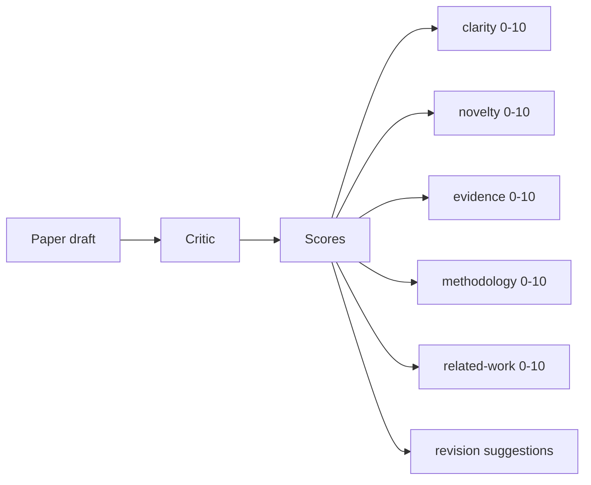
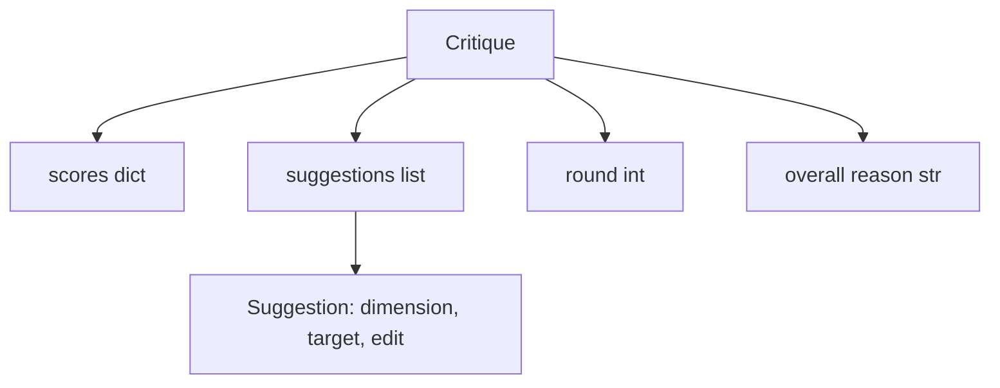
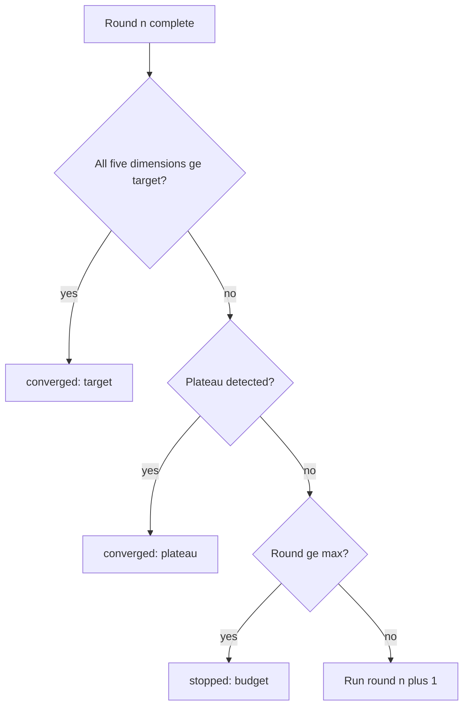
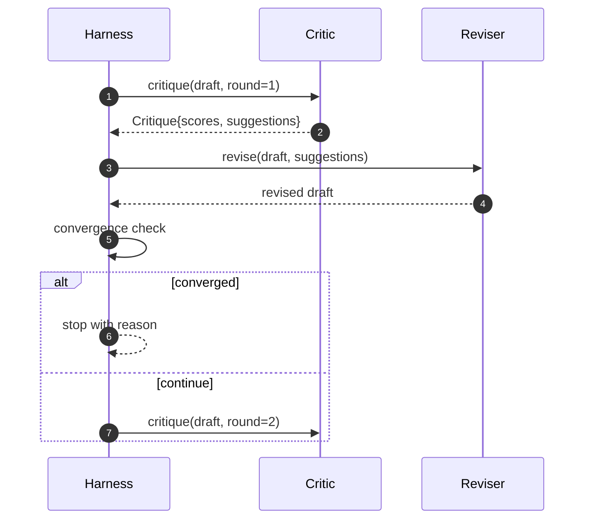

# 55 · 评审循环

> 第一轮就返回"看起来不错"的评审器是不合格的。永远返回"需要改进"的评审器也是不合格的。真正有意思的评审器是那种会收敛的，而你必须通过工程手段来实现这种收敛。

**类型：** 构建
**语言：** Python
**前置：** 第19阶段第50-53课
**时长：** 约90分钟

## 学习目标

- 在五个固定维度上为论文草稿打分：清晰度（clarity）、新颖性（novelty）、证据（evidence）、方法论（methodology）、相关工作（related-work）。
- 将每轮评审结果作为结构化的修改差异（revision diff）来应用，而非自由形式的改写。
- 通过跨轮次比较分数来检测收敛（convergence）；在平台（plateau）、目标达成或轮次预算（budget）耗尽时停止。
- 通过最大迭代轮次预算来设置上限，防止不收敛的评审器无限运行。
- 每轮输出追踪记录（trace），使仪表盘或下一阶段能够渲染分数变化轨迹。

## 为什么是五个固定维度

自由形式的评审器就是一个返回一段建议文本的模型。下一轮的修改将这段文本视为环境上下文。改写是否回应了批评意见无法验证，因为批评本身从未有过结构。

五个维度为调度框架提供了一份契约。



分数是一个向量。调度框架跨轮次观察每个维度的变化。一次修改如果提高了清晰度却拉低了证据分，这在证据维度上就是一次退步，收敛检查会捕捉到它。纯模型的评审器无法提供这种保证。

## 评审结果的数据结构



每一条修改建议都携带它所改进的维度、它所针对的章节，以及一条修改器可以执行的 `edit` 指令。修改器也是一个可调用对象。本课附带一个确定性修改器（deterministic reviser），它将编辑指令解释为向章节追加内容的操作。模型驱动的修改器则会将同一字段解释为提示词。契约不变。

## 收敛规则（按优先级排列）

评审循环在三个条件中任意一个触发时终止。



目标是最高优先级：五个维度（clarity、novelty、evidence、methodology、related_work）中每一个都必须达到 `>= target_score`（默认 `8.0`），循环才能返回成功。平均值高但有一个维度薄弱是不够的。平台检测将当前轮次的均值与上一轮均值进行比较。如果连续两轮改进幅度低于 `plateau_epsilon`（默认 `0.1`），循环以 `plateau` 状态退出。轮次预算是对轮次数的硬性上限（默认 `5`），触及则返回 `budget`。

顺序很重要。目标优先于平台，平台优先于预算。如果第三轮同时达成了目标和触发平台的条件，结果是 `target`，而非 `plateau`。

## 为什么平台检测需要连续两轮

单轮平台是噪声。真实的评审器即使在固定草稿上，每一轮也会返回略有不同的分数，因为确定性评分仍然取决于应用了哪些建议以及应用顺序。要求连续两轮平台可以过滤掉这种噪声。如果调度框架报告平台，说明草稿确实已经停止改进。

## 本课的确定性评审器

本课不调用模型。附带的评审器是一个可调用对象，它基于三个信号为草稿打分：平均章节正文长度（清晰度）、图表数量和引用数量（证据），以及论文元数据中的 `originality_tag` 字段（新颖性）。修改器知道如何推动每个分数上升。

```text
clarity      当平均章节正文长度增加时增长
novelty      当 originality_tag 设为 "high" 时增长
evidence     当某章节的 figure_refs 非空时增长
methodology  当存在标题为 "Method" 的章节且其正文非空时增长
related-work 当存在标题为 "Related Work" 的章节且其正文非空时增长
```

修改器将每条修改建议解释为一次定向追加。第一轮之后，调度框架可以观察到分数上升。测试利用这一特性来断言循环缩小了差距。

## 完整循环契约



调度框架拥有轮次计数器、追踪记录和收敛检查。评审器拥有评分。修改器拥有差异。三者互不触碰对方的状态。

## 追踪输出

每一轮会发出一个追踪事件（trace event），包含轮次编号、分数向量、建议数量和收敛判定。完整的追踪记录与最终草稿一起返回。下游仪表盘可以据此渲染每轮分数图表。下一课——迭代调度器——会读取追踪记录来判断该分支是否值得保留。

## 用预算防范劣质评审器

一个永远不能通过建议来提升分数的评审器，会将循环锁定在最大迭代次数上限。追踪记录让这一点一目了然：五轮，分数平坦，判定为 `budget`。用户会将其解读为评审器的 bug，而非草稿的 bug。另一种做法——只输出最终草稿——会掩盖诊断信息。以追踪为先的设计则将问题暴露出来。

## 代码导读

`code/main.py` 定义了 `Critique`、`Suggestion`、`Critic` 协议、`Reviser` 协议、`CriticLoop`，以及一个 `make_deterministic_critic_pair` 工厂函数，它返回确定性评审器和与之匹配的修改器。还包含一个最小化的 `Paper` 数据结构，使本课可以独立运行。

`code/tests/test_critic_loop.py` 涵盖：首轮之后的单调改进、在调优后的草稿上达成目标收敛、连续两轮平台后的平台检测、建议无法提升分数时的预算耗尽、修改器对建议的应用，以及追踪记录的数据结构。

## 进一步扩展

真实实现会需要两个扩展。第一，维度权重：投工作坊的论文对新颖性的权重高于方法论；投期刊的则相反。收敛检查变为加权均值。第二，配对评审器：一个评审器打分，第二个评审器在修改建议到达修改器之前对其进行裁决。两者都能增加价值，也都在相同的 `Critique` 数据结构上组合。

关键决策在于评分向量。一旦评审结果结构化，其他所有改进——收敛规则、仪表盘、配对评审器——都可以在不改变循环的前提下直接接入。
