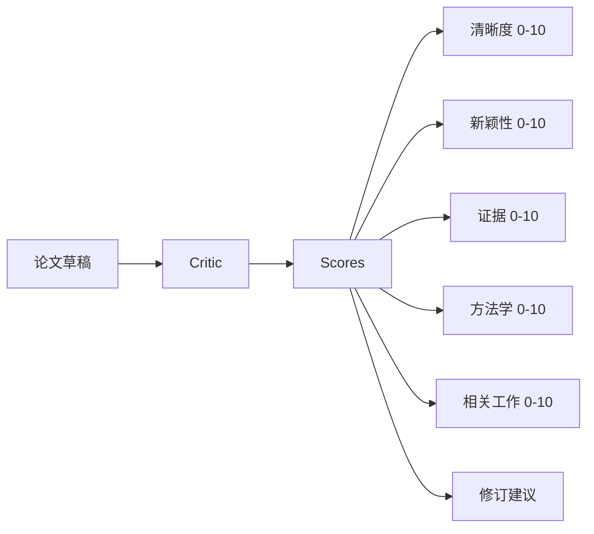
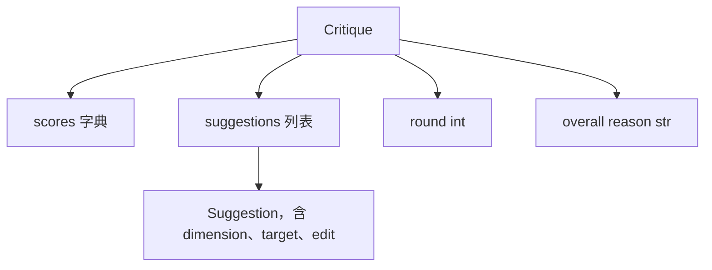
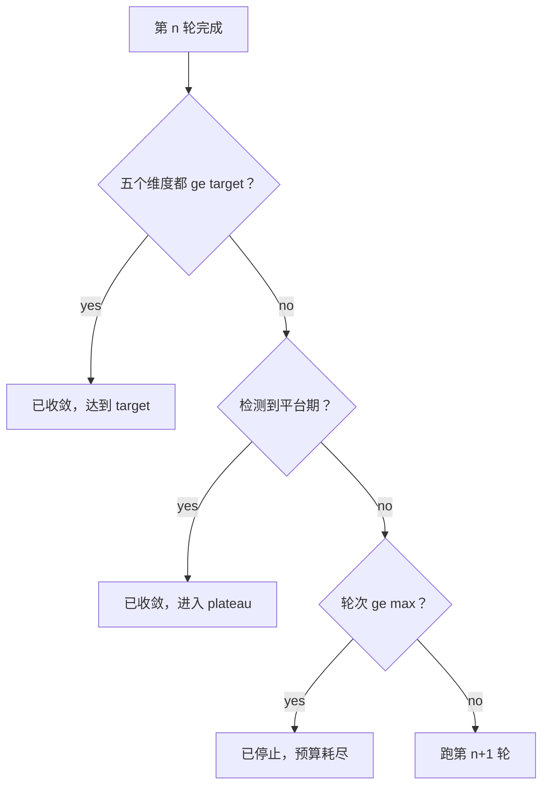
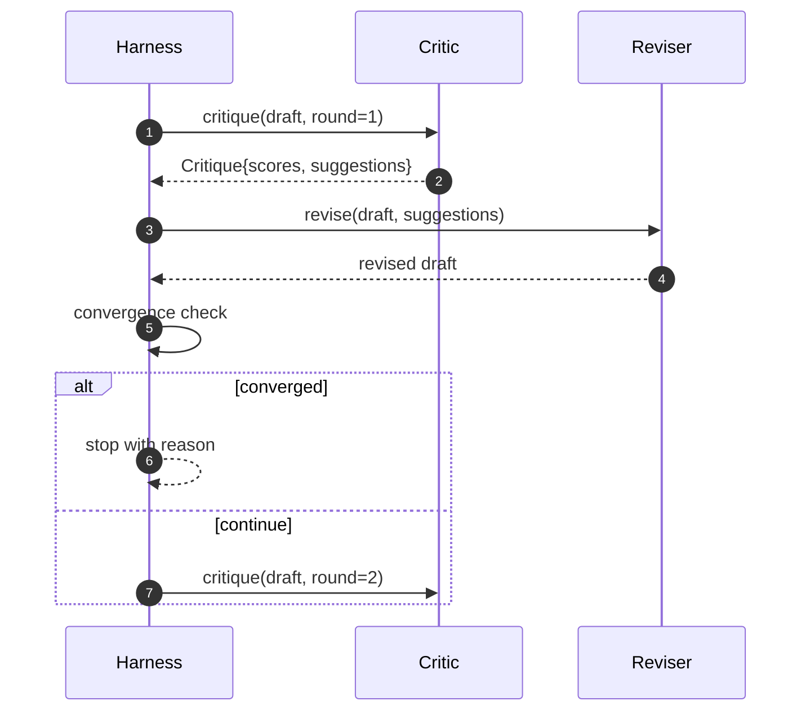

# 评审循环（Critic Loop）

> 译注：本文译自同目录 [`en.md`](./en.md)。术语遵循仓根 [TRANSLATION_GUIDE.md](../../../../TRANSLATION_GUIDE.md)。

> 第一次就回「看着不错」的 critic（评审器）是坏的。永远回「还得改」的 critic 也是坏的。真正有意思的 critic 是会收敛的那种——而收敛是要工程化设计出来的。

**Type:** Build
**Languages:** Python
**Prerequisites:** Phase 19 lessons 50-53
**Time:** ~90 minutes

## 学习目标（Learning Objectives）

- 沿五个固定维度给论文初稿打分：清晰度（clarity）、新颖度（novelty）、证据（evidence）、方法论（methodology）、相关工作（related-work）。
- 把每一轮的批评作为结构化的修订 diff 来落地，而不是自由发挥的整篇重写。
- 通过比较跨轮次的分数来检测收敛；命中平台期、达到目标、或预算耗尽时即停。
- 用最大迭代预算给轮次封顶，让一个不收敛的 critic 不至于无限跑下去。
- 每轮发出一条 trace，方便仪表盘或下一阶段渲染分数轨迹。

## 为什么是五个固定维度（Why five fixed dimensions）

自由发挥的 critic 是一个返回一段建议文字的模型。下一轮的修订把这段文字当作环境上下文。重写到底有没有回应批评——无法验证，因为批评本身就没有结构。

五个维度给 harness（壳层）一份契约。



分数是一个向量。harness 跨轮次盯着每一个维度。一次修订把 clarity 拉上去却把 evidence 砸下去——这就是 evidence 上的回退，收敛检查能看见。一个纯模型的 critic 给不了这种保证。

## Critique 的形状（The Critique shape）



每条建议都带着它要改进的维度、目标的小节、以及修订器（reviser）可执行的 `edit` 指令。修订器同样是一个 callable。本课交付的是一个确定性修订器，它把 edit 指令解释为「向某小节追加内容」的操作。一个由模型驱动的修订器会把同一个字段当作 prompt 来解释。契约不变。

## 收敛规则，按序判断（Convergence rules, in order）

评审循环在三种条件中任意一个触发时终止。



target 是最严格的一档：五个维度（clarity、novelty、evidence、methodology、related_work）每一个都必须打到 `>= target_score`（默认 `8.0`），循环才会返回成功。均值很高但有一项偏弱——不算。平台期（plateau）检测拿当前轮的均值跟上一轮的均值比。如果连续两轮的提升都低于 `plateau_epsilon`（默认 `0.1`），循环就以 `plateau` 退出。预算（budget）是轮次的硬上限（默认 `5`），到点以 `budget` 退出。

顺序很重要。target 优先于 plateau，plateau 优先于 budget。如果第三轮命中目标的同一次迭代同时也满足平台期条件，结果是 `target`，不是 `plateau`。

## 为什么平台期检测要跨两轮（Why plateau detection runs over two rounds）

只看一轮的平台期是噪声。即便给定固定初稿，真实 critic 每次返回的分数都会略有差别，因为确定性打分仍然取决于哪些建议被采纳、以及采纳的顺序。要求连续两轮平台期才算，把噪声过滤掉。harness 一旦报出平台期，初稿就是真的不再改善了。

## 本课中的确定性 critic（The deterministic critic in this lesson）

本课不调模型。交付的 critic 是一个 callable，根据三类信号给初稿打分：小节正文的平均长度（clarity）、图数与引用数（evidence）、以及论文元数据上的 `originality_tag` 字段（novelty）。修订器知道怎么把每一项分数往上推。

```text
clarity      grows when the average section body length increases
novelty      grows when originality_tag is set to "high"
evidence     grows when a section's figure_refs is non-empty
methodology  grows when a section titled "Method" exists with body
related-work grows when a section titled "Related Work" exists with body
```

修订器把每条建议解释为一次定向追加。第一轮之后，harness 就能观察到分数在涨。测试就用这个性质来断言：循环确实在缩小差距。

## 完整循环契约（The full loop contract）



harness 持有轮次计数、trace 和收敛检查。critic 持有分数。修订器持有 diff。三者各管各的状态，互不染指。

## Trace 输出（The Trace output）

每一轮发出一条 trace 事件，里面有轮次号、分数向量、建议数量、收敛裁决（verdict / 裁决）。最终初稿连同完整 trace 一起返回。下游仪表盘可以画出「每轮分数」图。下一课——迭代调度器——会读这份 trace，判断这条分支值不值得保留。

## 用 budget 抵御坏 critic（Budgets that protect against bad critics）

如果一个 critic 给出的建议从来没让分数往上走，循环就会被锁死在最大迭代上限。trace 把这件事暴露出来：五轮，分数平的，裁决 `budget`。用户一眼看出这是 critic 的 bug，不是初稿的 bug。如果只把最终初稿端出来，这个诊断就藏起来了。Trace-first 的设计会让它浮现。

## 怎么读这份代码（How to read the code）

`code/main.py` 定义了 `Critique`、`Suggestion`、`Critic` protocol、`Reviser` protocol、`CriticLoop`，以及一个 `make_deterministic_critic_pair` 工厂——它返回一对配套的确定性 critic 和修订器。文件里还自带一个最小化的 `Paper` 形状，让本课能独立成章。

`code/tests/test_critic_loop.py` 覆盖：第一轮之后的单调改进、调好的初稿上的目标收敛、连续两轮持平后的平台期检测、所有建议都不改善时的预算耗尽、修订器对建议的应用，以及 trace 的形状。

## 再往前一步（Going further）

真实实现会想要的两类扩展。第一是维度权重：投 workshop 的论文把 novelty 的权重打得比 methodology 高；投期刊则反过来。收敛检查变成加权均值。第二是成对 critic：一个 critic 打分，第二个 critic 在修订器看到建议之前对建议做一次裁决。两者都有价值，并且都能在同一个 `Critique` 形状上组合。

赌注押在分数向量上。一旦批评是结构化的，剩下所有改进——收敛规则、仪表盘、成对 critic——都能直接接进来，循环本身一个字都不用改。
